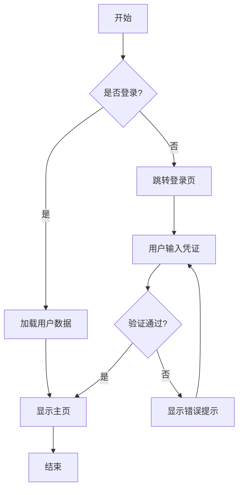
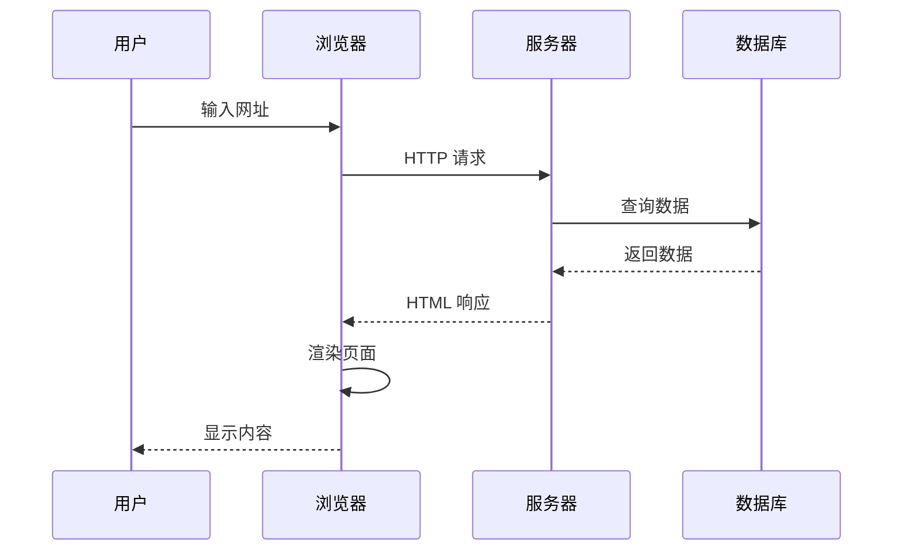
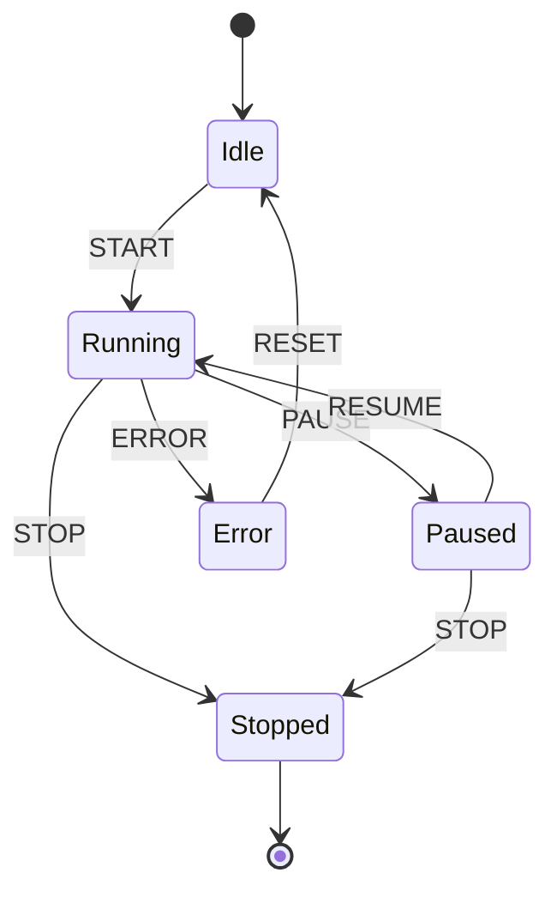
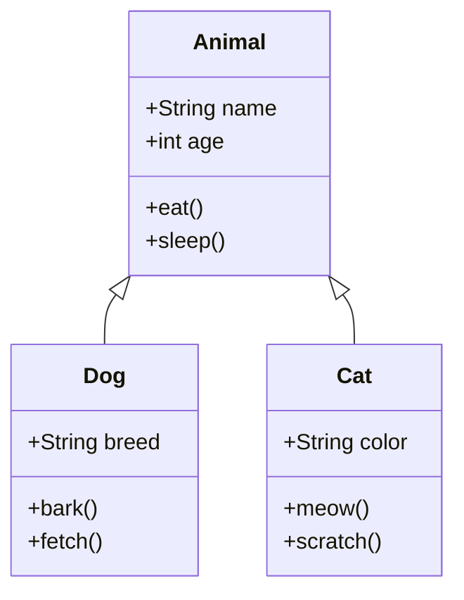
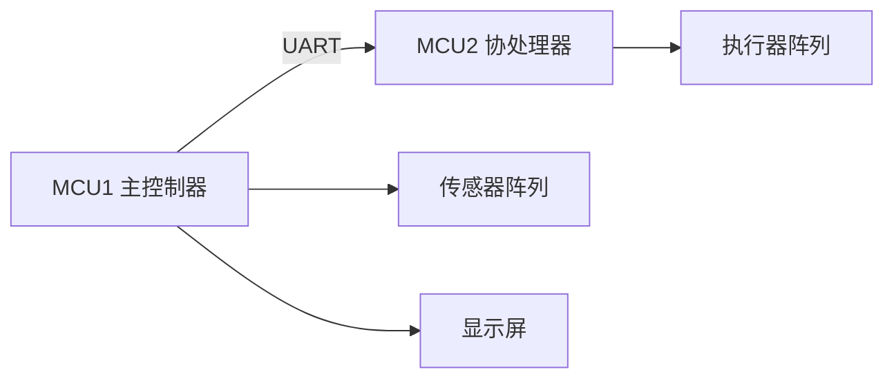

<!-- Post: Markdown 写作完全指南（Demo 演示） | ID: 2026-001 | Created: 2026-08-30 | Tags: tech,works | Format: markdown -->

# Markdown 写作完全指南（Demo 演示）

> 本文演示 Jankin's Timeline 博客支持的所有 Markdown 语法，可作为新建文章的参考模板。
>
> 核心特性：**标准 Markdown** + **GFM 扩展** + **KaTeX 数学公式** + **Mermaid 流程图** + **自动目录生成** + **图片防盗链**

---

## 一、文本格式

### 1.1 强调

- **粗体文字**：用 `**文字**` 或 `__文字__`
- *斜体文字*：用 `*文字*` 或 `_文字_`
- ***粗斜体文字***：用 `***文字***`
- ~~删除线~~：用 `~~文字~~`（GFM 扩展）
- `行内代码`：用反引号 `` `代码` ``

### 1.2 上标与下标

- 上标：H<sub>2</sub>O（用 HTML 标签 `<sub>`）
- 下标：X<sup>2</sup>（用 HTML 标签 `<sup>`）

---

## 二、标题层级

> 目录自动扫描 h1-h4，建议使用 `##`（h2）作为主要章节，`###`（h3）作为子章节。

# 一级标题 h1（用于文章大标题，一般不使用）

## 二级标题 h2（主要章节，推荐使用）

### 三级标题 h3（子章节，推荐使用）

#### 四级标题 h4（细分内容，可选）

---

## 三、列表

### 3.1 无序列表

- 列表项 1
- 列表项 2
  - 嵌套列表项 2.1
  - 嵌套列表项 2.2
- 列表项 3

### 3.2 有序列表

1. 第一步
2. 第二步
   1. 第二步第一小步
   2. 第二步第二小步
3. 第三步

### 3.3 任务列表（GFM 扩展）

- [x] 已完成的任务
- [x] 已完成的任务
- [ ] 未完成的任务
- [ ] 未完成的任务

---

## 四、表格（GFM 扩展）

### 4.1 基础表格

| 列 1 | 列 2 | 列 3 |
|------|------|------|
| 单元格 1 | 单元格 2 | 单元格 3 |
| 单元格 4 | 单元格 5 | 单元格 6 |

### 4.2 对齐方式

| 左对齐 | 居中对齐 | 右对齐 |
|:-------|:--------:|-------:|
| 内容 1 | 内容 2 | 内容 3 |
| 较长的内容 | 居中 | 123.45 |

### 4.3 实际示例：设计系统字号

| 层级 | 字号 | 字重 | 行高 | 用途 |
|------|------|------|------|------|
| H1 | 36px | 700 | 1.2 | 页面主标题 |
| H2 | 28px | 600 | 1.3 | 章节标题 |
| H3 | 22px | 600 | 1.4 | 子章节标题 |
| H4 | 18px | 500 | 1.5 | 细分标题 |
| Body | 16px | 400 | 1.6 | 正文 |
| Caption | 14px | 400 | 1.5 | 辅助文字 |

---

## 五、代码块

### 5.1 行内代码

使用 `const x = 42;` 定义变量，调用 `functionName()` 执行函数。

### 5.2 JavaScript 代码块

```javascript
// 神经网络示例：简单的线性回归
function linearRegression(x, y) {
  const n = x.length;
  const sumX = x.reduce((a, b) => a + b, 0);
  const sumY = y.reduce((a, b) => a + b, 0);
  const sumXY = x.reduce((acc, xi, i) => acc + xi * y[i], 0);
  const sumX2 = x.reduce((acc, xi) => acc + xi * xi, 0);

  const slope = (n * sumXY - sumX * sumY) / (n * sumX2 - sumX * sumX);
  const intercept = (sumY - slope * sumX) / n;

  return { slope, intercept };
}

// 使用示例
const x = [1, 2, 3, 4, 5];
const y = [2, 4, 5, 4, 5];
const result = linearRegression(x, y);
console.log(`斜率: ${result.slope}, 截距: ${result.intercept}`);
```

### 5.3 Python 代码块

```python
# TensorFlow 简单神经网络示例
import tensorflow as tf
import numpy as np

# 创建数据
x_data = np.random.rand(100).astype(np.float32)
y_data = x_data * 0.1 + 0.3

# 构建模型
Weights = tf.Variable(tf.random_uniform([1], -1.0, 1.0))
biases = tf.Variable(tf.zeros([1]))
y = Weights * x_data + biases

# 定义损失函数和优化器
loss = tf.reduce_mean(tf.square(y - y_data))
optimizer = tf.train.GradientDescentOptimizer(0.5)
train = optimizer.minimize(loss)

# 训练
init = tf.global_variables_initializer()
with tf.Session() as sess:
    sess.run(init)
    for step in range(201):
        sess.run(train)
        if step % 20 == 0:
            print(step, sess.run(Weights), sess.run(biases))
```

### 5.4 C 语言代码块

```c
// 嵌入式状态机示例
typedef enum {
    STATE_IDLE,
    STATE_RUNNING,
    STATE_PAUSED,
    STATE_ERROR
} State_t;

static State_t currentState = STATE_IDLE;

void StateMachine_Update(Event_t event) {
    switch (currentState) {
        case STATE_IDLE:
            if (event == EVENT_START) {
                currentState = STATE_RUNNING;
                System_Start();
            }
            break;

        case STATE_RUNNING:
            if (event == EVENT_PAUSE) {
                currentState = STATE_PAUSED;
                System_Pause();
            } else if (event == EVENT_ERROR) {
                currentState = STATE_ERROR;
                System_ErrorHandler();
            }
            break;

        default:
            break;
    }
}
```

### 5.5 Bash 代码块

```bash
# 部署新文章到服务器
#!/bin/bash

POST_ID="2026-001"
SERVER="user@example.com"
REMOTE_PATH="/var/www/jankinbai.top/posts/"

# 上传文章文件夹
scp -r "posts/${POST_ID}" "${SERVER}:${REMOTE_PATH}"

# 验证上传
ssh "${SERVER}" "ls -la ${REMOTE_PATH}${POST_ID}/"

echo "✅ 文章 ${POST_ID} 部署完成"
```

---

## 六、引用块

### 6.1 基础引用

> 这是一段引用文字。引用块可以用来强调重要观点、引用他人言论或展示关键结论。

### 6.2 嵌套引用

> 第一层引用
>
> > 第二层嵌套引用
> >
> > > 第三层嵌套引用

### 6.3 引用中包含其他格式

> **设计原则**：好的设计应该是不言而喻的。
>
> — Don Norman, 《设计心理学》
>
> 1. 可供性（Affordance）
> 2. 意符（Signifier）
> 3. 映射（Mapping）
> 4. 反馈（Feedback）

---

## 七、链接与图片

### 7.1 链接

- 普通链接：[Markdown 官方教程](https://www.markdownguide.org/)
- 带标题的链接：[KaTeX](https://katex.org/ "KaTeX 数学公式渲染库")
- 引用式链接：[Google][1] 和 [GitHub][2]

[1]: https://www.google.com/
[2]: https://github.com/

### 7.2 图片

> 所有图片自动添加 `referrerpolicy="no-referrer"`，绕过 CSDN 等防盗链。


### 7.3 带链接的图片

[](https://picsum.photos/)

---

## 八、KaTeX 数学公式

> 仅当文章包含 `$` 时才加载 KaTeX（按需加载，不影响性能）。

### 8.1 行内公式

- 质能方程：$E = mc^2$
- 勾股定理：$a^2 + b^2 = c^2$
- 二次方程求根公式：$x = \frac{-b \pm \sqrt{b^2 - 4ac}}{2a}$
- 欧拉公式：$e^{i\pi} + 1 = 0$

### 8.2 块级公式

高斯积分：

$$
\int_{-\infty}^{\infty} e^{-x^2} dx = \sqrt{\pi}
$$

矩阵乘法：

$$
\begin{bmatrix}
a & b \\
c & d
\end{bmatrix}
\begin{bmatrix}
x \\
y
\end{bmatrix}
=
\begin{bmatrix}
ax + by \\
cx + dy
\end{bmatrix}
$$

泰勒展开：

$$
f(x) = f(a) + f'(a)(x-a) + \frac{f''(a)}{2!}(x-a)^2 + \cdots + \frac{f^{(n)}(a)}{n!}(x-a)^n + R_n
$$

卡尔曼滤波预测步：

$$
\begin{aligned}
\hat{x}_{k|k-1} &= F_k \hat{x}_{k-1|k-1} + B_k u_k \\
P_{k|k-1} &= F_k P_{k-1|k-1} F_k^T + Q_k
\end{aligned}
$$

---

## 九、Mermaid 流程图

> 仅当文章包含 ` ```mermaid ` 代码块时才加载 Mermaid（按需加载）。

### 9.1 流程图（Flowchart）



### 9.2 时序图（Sequence Diagram）



### 9.3 状态图（State Diagram）



### 9.4 类图（Class Diagram）



---

## 十、其他元素

### 10.1 分隔线

上面是分隔线 `---`

---

### 10.2 定义列表（HTML）

<dl>
  <dt>可供性（Affordance）</dt>
  <dd>对象与用户能力的关系，决定可能的操作。</dd>
  <dt>意符（Signifier）</dt>
  <dd>传达操作位置和方式的可感知信号。</dd>
  <dt>反馈（Feedback）</dt>
  <dd>操作结果的即时告知。</dd>
</dl>

### 10.3 键盘按键

使用 <kbd>Ctrl</kbd> + <kbd>C</kbd> 复制，<kbd>Ctrl</kbd> + <kbd>V</kbd> 粘贴。

---

## 十一、综合示例：技术文章模板

### 问题描述

在嵌入式系统中，多状态机协同是常见的架构模式。本文以 QPC 框架为例，演示如何设计双 MCU 通信系统。

### 系统架构



### 核心算法

状态转移概率矩阵：

$$
P = \begin{bmatrix}
0.7 & 0.2 & 0.1 \\
0.1 & 0.8 & 0.1 \\
0.05 & 0.15 & 0.8
\end{bmatrix}
$$

### 代码实现

```c
// 状态机初始化
void App_Init(void) {
    QActive_ctor(&AO_App, (QStateHandler)&App_initial);
    QActive_start(&AO_App, 1, queueSto, Q_DIM(queueSto), 0, 0);
}
```

### 性能对比

| 指标 | 单 MCU | 双 MCU | 提升 |
|------|--------|---------|------|
| 响应时间 | 50ms | 15ms | 70% |
| 吞吐量 | 100/s | 350/s | 250% |
| 功耗 | 120mW | 85mW | 29% |
| 复杂度 | 低 | 中 | - |

### 结论

> 双 MCU 架构在响应时间和吞吐量上有显著提升，但增加了系统复杂度。适用于对实时性要求较高的场景。

---

## 结语

本文演示了 Jankin's Timeline 博客支持的所有 Markdown 语法。新建文章时，只需：

1. 在 `posts/` 下创建 `YYYY-NNN/` 文件夹
2. 写入 `meta.json`（设置 `"format": "markdown"`）
3. 写入 `content.md`（使用本文演示的语法）
4. 上传到服务器，刷新页面即可自动识别

**无需更新任何索引文件，无需重新构建，纯静态自动发现。**
