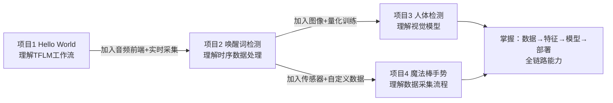
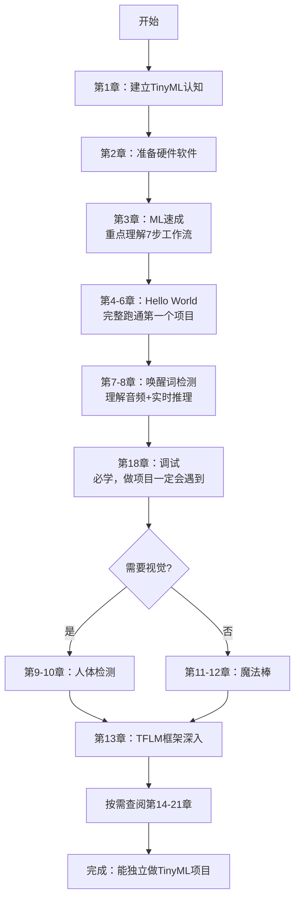
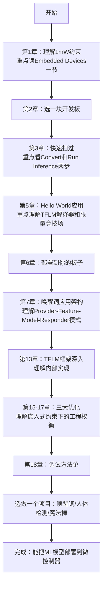

<!-- Post: 一图读懂 TinyML 全书：4个项目、8大主题、475页的学习路径 | ID: 2026-003 | Created: 2026-09-01 | Tags: books, tech | Format: markdown -->

## 开篇：拿到一本475页的技术书，先别急着从第一页读起

上一篇我们聊了 TinyML 是什么、为什么重要。现在你手里有了这本475页的书，翻开目录一看——21章、4个完整项目、从机器学习基础到框架源码移植，内容多到让人头大。

**从第一页逐字读到最后一页？** 那是最糟糕的读法。

技术书不是小说，不需要线性阅读。就像你拿到一张新城市的地图，不会从地图的左上角开始逐格看——你会先找市中心、主干道、景点分布，然后决定去哪、怎么去。

这篇文章就是你的 **TinyML 全书地图**。我们用一张图、几张表，帮你搞清楚：
- 这本书的**三大板块**是什么
- 四个项目的**难度递进**关系
- 21章每章**一句话讲什么**
- 你应该**按什么顺序读**，哪些必须精读、哪些可以跳过

作者在第2章也明确说了，这本书的目标不是让你记住所有细节，而是：

> "We want you to be able to build and modify some practical examples using time-series data like audio or input from accelerometers, and for low-power vision."
>
> ——第2章 Getting Started，第8页

翻译：我们希望你能用时序数据（音频、加速度计）和低功耗视觉，构建和修改实际项目。

所以，你的目标不是"读完这本书"，而是"能用这本书做出东西"。带着这个目标，我们来看地图。

---

## 一、全书结构总览：三大板块

整本书可以清晰地切成三大块，就像一顿饭的**前菜、主菜、甜点**：

```mermaid
graph TD
    subgraph 第一板块：基础铺垫[第一板块：基础铺垫<br/>第1-3章 · 约28页]
        A1[第1章 Introduction<br/>什么是TinyML]
        A2[第2章 Getting Started<br/>硬件软件准备]
        A3[第3章 ML速成<br/>深度学习工作流]
    end

    subgraph 第二板块：四个实战项目[第二板块：四个实战项目<br/>第4-12章 · 约325页<br/>全书核心]
        B1[项目1：Hello World<br/>第4-6章 · 正弦波预测]
        B2[项目2：唤醒词检测<br/>第7-8章 · 音频分类]
        B3[项目3：人体检测<br/>第9-10章 · 视觉分类]
        B4[项目4：魔法棒手势<br/>第11-12章 · 传感器分类]
    end

    subgraph 第三板块：高级主题[第三板块：高级主题<br/>第13-21章 · 约120页]
        C1[第13章 TFLM框架深入]
        C2[第14章 应用设计流程]
        C3[第15-17章 三大优化<br/>延迟/能耗/体积]
        C4[第18章 调试方法论]
        C5[第19章 模型移植]
        C6[第20章 隐私安全部署]
        C7[第21章 学习资源]
    end

    第一板块 --> 第二板块
    第二板块 --> 第三板块

    B1 -.->|难度递增| B2
    B2 -.->|难度递增| B3
    B2 -.->|难度递增| B4
```

### 第一板块：基础铺垫（第1-3章，约28页）

这是**前菜**，帮你建立认知。如果你已经有机器学习基础，第3章可以快速扫过；如果你是嵌入式工程师但不懂ML，第3章必须精读。

| 章节 | 核心内容 | 一句话总结 |
|------|---------|-----------|
| 第1章 | TinyML 概念、1mW阈值、嵌入式设备约束 | 为什么需要在微控制器上跑ML |
| 第2章 | 目标读者、硬件需求（3种开发板）、软件需求 | 你需要准备什么才能开始 |
| 第3章 | ML是什么、深度学习7步工作流 | 从零理解训练→转换→推理的全流程 |

### 第二板块：四个实战项目（第4-12章，约325页）

这是**主菜**，也是全书的核心。四个项目不是孤立的，它们遵循**完全相同的架构模式**，难度逐步递增。理解了第一个项目的结构，后面三个就是"换传感器、换模型"。

每个项目都遵循同样的三部曲：
1. **训练模型**（在电脑/云端用 TensorFlow）
2. **构建应用**（在桌面端跑通推理，理解代码结构）
3. **部署到开发板**（移植到 Arduino / SparkFun Edge / STM32）

### 第三板块：高级主题（第13-21章，约120页）

这是**甜点**，按需取用。你不需要全读，遇到具体问题时再来查。比如你做项目时遇到延迟问题，就去读第15章；遇到精度对不上，就去读第18章。

---

## 二、四个项目的难度递进：从"Hello World"到"真实产品"

四个项目看起来是四个不同的应用，但它们是**精心设计的学习阶梯**。每一个项目都在前一个的基础上增加新的复杂度。

### 项目对比表

| 维度 | 项目1：Hello World | 项目2：唤醒词检测 | 项目3：人体检测 | 项目4：魔法棒手势 |
|------|-------------------|-------------------|----------------|------------------|
| **章节** | 第4-6章 | 第7-8章 | 第9-10章 | 第11-12章 |
| **输入** | 手动输入一个数字 | 麦克风音频（16kHz） | 摄像头图像（96×96） | 加速度计（3轴） |
| **输出** | 预测正弦波值 | yes/no/unknown/silence | 有人/没人 | 画圈/挥/斜划 |
| **模型类型** | 全连接网络（2层） | CNN（卷积神经网络） | MobileNet-like | 3D-CNN（时序卷积） |
| **模型大小** | ~2KB | ~400KB | ~250KB | ~20KB |
| **新知识点** | TFLM基本工作流 | 音频前端、MFCC特征 | 图像预处理、量化感知训练 | 时序数据窗口、自定义数据采集 |
| **硬件支持** | 3种开发板 | 3种开发板 | Arduino + SparkFun | Arduino + SparkFun |
| **难度** | ★☆☆☆☆ | ★★★☆☆ | ★★★★☆ | ★★★☆☆ |

### 难度递进的逻辑



**关键洞察**：四个项目共享同一套代码架构。作者在第7章介绍唤醒词项目时，明确展示了这个分层架构：

> "Application Architecture... Introducing Our Model... All the Moving Parts"
>
> ——第7章 Wake-Word Detection: Building an Application，第129页

这个架构就是我们在后续主题文章中会深入拆解的 **Provider → Feature → Model → Responder** 四层模式。理解了这个模式，四个项目就不是四个孤立的例子，而是**同一套架构在不同传感器上的实例化**。

---

## 三、21章一句话速查表

不想读完全书？这张表帮你30秒了解每章讲什么，以及你需不需要读。

| 章 | 标题 | 一句话内容 | 建议 |
|----|------|-----------|------|
| 1 | Introduction | TinyML定义、1mW阈值、嵌入式约束 | **精读**（上一篇已拆解） |
| 2 | Getting Started | 硬件软件准备、学习目标 | 略读（知道需要什么板子） |
| 3 | Getting Up to Speed on ML | ML基础、深度学习7步工作流 | **ML新手精读**，老手略读 |
| 4 | Hello World: 训练模型 | 生成正弦波数据、训练2层全连接网络、导出C数组 | **精读**（第一个项目，理解流程） |
| 5 | Hello World: 构建应用 | 桌面端测试、TFLM解释器、张量竞技场、项目结构 | **精读**（理解TFLM核心概念） |
| 6 | Hello World: 部署 | Arduino/SparkFun/STM32三平台部署步骤 | 按你的板子选读 |
| 7 | 唤醒词: 构建应用 | 音频采集、MFCC特征、命令识别、分层架构 | **精读**（最完整的项目） |
| 8 | 唤醒词: 训练模型 | Speech Commands数据集、模型架构、自定义数据训练 | 精读（理解音频ML） |
| 9 | 人体检测: 构建应用 | 摄像头采集、图像预处理、检测响应器 | 选读（需要视觉时读） |
| 10 | 人体检测: 训练模型 | GCP云端训练、量化感知训练、模型导出 | 选读（理解量化训练） |
| 11 | 魔法棒: 构建应用 | 加速度计采集、手势窗口、3D张量输入 | 选读（需要传感器时读） |
| 12 | 魔法棒: 训练模型 | 自定义数据采集、数据增强、模型训练 | 选读（理解数据采集） |
| 13 | TFLM框架深入 | 解释器架构、构建系统、新平台移植、Op移植 | **进阶精读**（想深入框架时读） |
| 14 | 设计自己的应用 | 设计流程、可行性评估、Wizard of Oz方法 | 略读（做自己的项目时读） |
| 15 | 优化延迟 | 模型优化、量化、代码优化、硬件加速 | 遇到延迟问题时读 |
| 16 | 优化能耗 | 功耗估算、占空比、级联设计 | 遇到功耗问题时读 |
| 17 | 优化模型/二进制体积 | Flash/RAM估算、OpResolver、代码大小优化 | 遇到内存不足时读 |
| 18 | 调试 | 训练-部署精度损失、预处理差异、数值差异、内存损坏 | **必读**（做项目一定会遇到） |
| 19 | 模型移植 TF→TFL | Op覆盖检查、预处理迁移、自定义Op实现 | 需要移植现有模型时读 |
| 20 | 隐私安全部署 | 隐私设计文档、模型保护、产品化 | 做产品时读 |
| 21 | 学习资源 | TinyML社区、其他框架、延伸学习 | 略读（需要资源时查） |

> **附录A**：Arduino库Zip包的使用和生成（用Arduino时查）
> **附录B**：Arduino上的音频采集（做唤醒词项目时查）

---

## 四、两条学习路径：按你的背景选路

不是所有人都需要按同样的顺序读。根据你的背景，有两条最优路径。

### 路径A：新手路径（嵌入式工程师，不懂ML）

如果你是嵌入式工程师，会写C/C++，玩过Arduino/STM32，但对机器学习一窍不通——这条路适合你。



**时间估算**：约3-4周（每天1-2小时）

### 路径B：有经验者路径（已有ML基础，想落地到嵌入式）

如果你已经懂机器学习，训练过模型，用过TensorFlow/Keras，但没怎么接触过嵌入式——这条路适合你。



**时间估算**：约1-2周（每天1-2小时）

### 两条路径的核心差异

| 维度 | 新手路径（嵌入式背景） | 有经验者路径（ML背景） |
|------|----------------------|----------------------|
| **重点** | 学ML概念 + 跑通项目 | 学嵌入式约束 + TFLM框架 |
| **第3章** | 精读（ML基础） | 略读（已有基础） |
| **第4-6章** | 完整精读（理解流程） | 重点读第5章（理解TFLM） |
| **第13章** | 后期再读 | 早期就读（理解框架） |
| **项目选择** | 从Hello World开始，循序渐进 | 可以直接做唤醒词或魔法棒 |
| **最大挑战** | 理解ML概念和训练流程 | 理解嵌入式约束（内存/功耗/无OS） |

---

## 五、精读/略读/跳过指南

不是每一章都需要同等对待。按重要性分三档：

### 必须精读（6章）

这些章节构成了 TinyML 的核心知识骨架，不读这些等于没读这本书。

| 章节 | 为什么必须精读 |
|------|--------------|
| 第1章 | 理解 TinyML 的本质和约束（上一篇已拆解） |
| 第3章 | 理解深度学习7步工作流，这是所有项目的基础 |
| 第5章 | Hello World应用，首次接触 TFLM 解释器、张量竞技场、AllOpsResolver |
| 第7章 | 唤醒词应用，展示最完整的四层架构（Provider→Feature→Model→Responder） |
| 第13章 | TFLM框架深入，理解解释器模式、FlatBuffers、Op移植 |
| 第18章 | 调试方法论，90%的人做项目时会遇到训练-部署精度不一致 |

### 按需选读（9章）

这些章节解决特定问题，遇到时再读，不用提前看。

| 章节 | 什么时候读 |
|------|-----------|
| 第4章 | 做Hello World项目时（训练部分） |
| 第6章 | 部署到开发板时（按你的板子选读） |
| 第8章 | 做唤醒词项目时（训练音频模型） |
| 第9-10章 | 做视觉相关项目时 |
| 第11-12章 | 做传感器/手势相关项目时 |
| 第15章 | 遇到推理延迟问题时 |
| 第16章 | 遇到功耗/电池续航问题时 |
| 第17章 | 遇到Flash/RAM不足问题时 |

### 快速略读（6章）

这些章节提供背景信息或参考资源，翻一遍知道有什么就行。

| 章节 | 怎么读 |
|------|--------|
| 第2章 | 看一眼需要什么硬件，选一块板子就行 |
| 第14章 | 做自己的项目前翻一遍设计流程 |
| 第19章 | 需要移植现有TF模型时查Op覆盖 |
| 第20章 | 做产品化时考虑隐私安全 |
| 第21章 | 需要更多学习资源时查链接 |
| 附录A/B | 用Arduino时查操作步骤 |

---

## 六、时间估算与学习节奏

### 按项目估算

| 阶段 | 内容 | 预计时间 | 产出 |
|------|------|---------|------|
| 基础 | 第1-3章 | 2-3天 | 理解TinyML概念和ML工作流 |
| 项目1 | 第4-6章 Hello World | 3-5天 | 跑通第一个TFLM推理，理解核心概念 |
| 项目2 | 第7-8章 唤醒词 | 5-7天 | 完成音频分类项目，理解分层架构 |
| 深入 | 第13章 + 第18章 | 3-5天 | 理解框架内部，掌握调试方法 |
| 选做 | 项目3或项目4 | 5-7天 | 掌握视觉或传感器应用 |
| **总计** | | **18-27天** | 能独立做TinyML项目 |

> 以上按每天1-2小时估算。如果你是全职学习，时间可以减半。

### 学习节奏建议

1. **不要跳项目**：即使你觉得Hello World太简单，也要完整跑一遍。它是理解TFLM工作流的最小示例，跳过它后面会看不懂。
2. **边读边动手**：每一章的代码都要实际跑起来，不要只看不动手。嵌入式学习的精髓在于"看到LED亮起来"那一刻。
3. **遇到问题先查第18章**：调试方法论是全书最有价值的章节之一，大多数问题都能在里面找到排查思路。
4. **不要纠结API细节**：这本书是2019年的，TFLM的API已经有变化。重点理解**原理和架构**，API变了但核心思想不变。

---

## 小结：你的下一步行动

现在你有了这张全书地图，你应该：

1. **确定你的路径**：你是新手路径还是有经验者路径？
2. **选一块开发板**：Arduino Nano 33 BLE Sense（最容易上手）或 SparkFun Edge（最低功耗）
3. **从Hello World开始**：不管你多有经验，都先把第4-6章跑通
4. **带着问题读高级主题**：做项目时遇到什么问题，再去查第13-21章

下一篇，我们将进入洋葱阅读法的**第三层：深度阅读导引**——锁定6个核心主题，告诉你为什么这些主题重要、学完能解决什么问题，以及它们之间的依赖关系。这6个主题是：

1. TinyML的技术本质
2. 模型部署流水线
3. 四大项目的共性模式
4. TFLM运行时架构
5. 三大优化维度
6. 调试方法论

准备好了吗？我们下一篇见。

---

**延伸阅读**：
- 上一篇：[TinyML 入门：为什么一毛钱的芯片也能跑人工智能？](./?id=2026-002)
- 本书配套代码：https://tinymlbook.com/supplemental
- TensorFlow Lite for Microcontrollers：https://www.tensorflow.org/lite/microcontrollers

*本文是《TinyML 洋葱阅读系列》第2篇，对应洋葱阅读法第二层：快速阅读。基于 Pete Warden & Daniel Situnayake《TinyML》（O'Reilly, 2019, ISBN 9781492052043）全书目录和第1-2章内容创作。*
