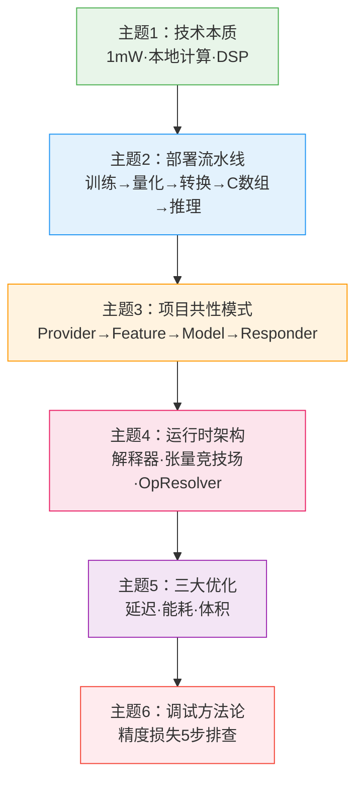
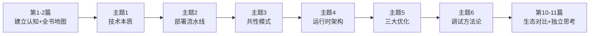

<!-- Post: TinyML 深度阅读指南：6个主题帮你从"跑通示例"到"理解原理" | ID: 2026-004 | Created: 2026-09-01 | Tags: books, tech | Format: markdown -->

## 开篇：跑通了示例，然后呢？

上一篇我们给了一张全书地图，你可能已经照着路径开始动手了——Arduino 插上电脑，代码烧进去，LED 开始按照正弦波闪烁，或者麦克风听到"yes"就亮灯。

**恭喜，你跑通了第一个示例。**

但这里有一个常见的陷阱：**跑通示例 ≠ 学会了 TinyML**。

就像你跟着菜谱做了一道菜，不代表你懂了烹饪。你知道放多少盐、炒几分钟，但你不知道为什么要放糖、为什么要大火收汁。下次换一道菜，你还是不会。

作者在第1章就提醒过，这本书的目标不是让你只会复制示例：

> "We also aim to focus on skills like debugging, model creation, and developing an understanding of how deep learning works, which will remain useful even as the infrastructure you're using changes."
>
> ——第1章 Introduction，第4页

翻译：我们专注于调试、模型创建、理解深度学习原理这些技能——即使你用的工具变了，这些技能仍然有用。

这就是**深度阅读**的意义：从"会用"到"懂原理"，从"跟着做"到"自己设计"。

这篇文章是深度阅读的**导引**——我们不展开技术细节，而是帮你锁定6个最核心的主题，告诉你每个主题"为什么重要""学完能解决什么问题""它们之间有什么依赖关系"。后续6篇文章，我们会逐个深入拆解。

---

## 一、从"会用"到"懂原理"：你需要跨过的鸿沟

先看一个真实场景。

你跟着书把唤醒词示例跑通了，开发板能识别"yes"和"no"。你觉得很有成就感。然后你想：**我能不能让它识别"开灯"和"关灯"？**

你开始改代码，然后遇到了一堆问题：

- 我录的音频格式不对，模型输入全是噪音
- 换了模型之后，板子内存不够，程序直接 HardFault
- 训练时准确率95%，部署到板上只有60%
- 推理一次要500ms，根本做不到实时响应
- 电池用了两天就没电了

这些问题，书里的示例都不会遇到——因为示例的代码、模型、数据都是作者精心调好的。但当你想做**自己的项目**时，这些问题全都会冒出来。

**这6个问题，正好对应6个核心主题：**

| 你遇到的问题 | 对应的核心主题 |
|-------------|--------------|
| 为什么必须在本地算？1mW到底意味着什么？ | 主题1：TinyML的技术本质 |
| 怎么把我训练的模型弄到板子上跑？ | 主题2：模型部署流水线 |
| 唤醒词、人体检测、魔法棒，代码结构怎么都一样？ | 主题3：四大项目的共性模式 |
| 张量竞技场是什么？为什么内存不够？ | 主题4：TFLM运行时架构 |
| 推理太慢/太耗电/太大了，怎么优化？ | 主题5：三大优化维度 |
| 训练好好的，部署就崩了，怎么排查？ | 主题6：调试方法论 |

看到了吗？这6个主题不是随便选的，它们是你从"跑通示例"到"做出自己的产品"路上**必须跨过的6道坎**。

---

## 二、6个核心主题概览

先看一张总表，建立整体认知：

| 编号 | 主题 | 一句话说明 | 对应书中章节 | 难度 |
|------|------|-----------|-------------|------|
| 1 | **TinyML的技术本质** | 1mW阈值的物理意义、本地计算vs传输、DSP vs MCU | 第1章、第16章 | ★★☆☆☆ |
| 2 | **模型部署流水线** | 训练→量化→TFLite转换→C数组→板端推理的7步流程 | 第3章、第4章、第19章 | ★★★☆☆ |
| 3 | **四大项目的共性模式** | Provider→Feature→Model→Responder四层架构 | 第5/7/9/11章 | ★★★☆☆ |
| 4 | **TFLM运行时架构** | 解释器、张量竞技场、AllOpsResolver、FlatBuffers | 第5章、第13章 | ★★★★☆ |
| 5 | **三大优化维度** | 延迟、能耗、体积的估算方法与优化手段 | 第15/16/17章 | ★★★★☆ |
| 6 | **调试方法论** | 训练-部署精度损失的5步排查框架 | 第18章 | ★★★★★ |

这6个主题有明确的**依赖关系**——前面的主题是后面的基础。你不能跳过运行时架构直接学优化，就像你不能不懂发动机原理就去改装赛车。

---

## 三、主题依赖关系图

**为什么是这个顺序？**

1. **主题1→主题2**：你先得理解"为什么要在微控制器上跑ML"（技术本质），才能理解"怎么把模型部署上去"（部署流水线）。如果你不理解1mW约束，你就不会明白为什么必须量化、为什么模型要小到KB级。

2. **主题2→主题3**：你先得理解单个模型怎么部署，才能看到四个项目背后的共性架构。部署流水线是"一条线"，共性模式是"一张网"——多个项目共享同一套架构。

3. **主题3→主题4**：你先得理解应用层的四层架构，才能深入到框架层理解TFLM内部。共性模式是"用户视角"，运行时架构是"引擎视角"。

4. **主题4→主题5**：你先得理解运行时内部怎么工作，才能知道优化的切入点在哪里。不懂张量竞技场，你就不知道怎么优化内存；不懂Op执行流程，你就不知道怎么优化延迟。

5. **主题5→主题6**：你先得理解正常情况下系统怎么工作、怎么优化，才能理解出问题时怎么排查。调试是综合运用所有前面知识的过程。

> **重要提示**：这个顺序是**推荐顺序**，不是强制顺序。如果你做项目时遇到了具体问题（比如精度对不上），可以直接跳到主题6先看排查方法，再回头补前面的基础。

---

## 四、每个主题详解：为什么重要、学什么、解决什么问题

### 主题1：TinyML的技术本质

**为什么重要？**

很多人学TinyML一上来就看代码、跑示例，但从来不思考一个根本问题：**为什么我们要在这么小的芯片上跑机器学习？** 用树莓派不行吗？传到云端不行吗？

不理解这个问题，你就不会明白为什么这本书里所有的设计都是"反直觉"的——为什么模型要量化到INT8？为什么不用malloc？为什么框架要解释执行而不是编译执行？

**你将学到什么？**

- 1mW这个数字是怎么来的，它意味着什么（纽扣电池用一年）
- 为什么无线传输数据比本地计算更耗电（BLE/WiFi的功耗量级）
- DSP、MCU、CPU的本质区别和各自适用场景
- "Peel-and-stick sensors"愿景背后的技术约束
- TinyML的边界：什么能做、什么不能做

**学完能解决什么问题？**

> "我的项目应该用TinyML还是用树莓派+云端？"
> "这个传感器数据是传到手机处理还是本地处理？"
> "为什么我的产品电池续航这么短？"

**对应书中章节**：第1章 Introduction、第16章 Optimizing Energy Usage

---

### 主题2：模型部署流水线

**为什么重要？**

这是你从"用别人的模型"到"用自己的模型"的关键一步。书里的示例都用了作者训练好的模型，但你做自己的项目时，必须自己训练模型并部署到板子上。

很多人卡在这一步：训练好了模型，不知道怎么转成TFLite格式，不知道怎么导出C数组，不知道板端怎么加载和推理。

**你将学到什么？**

- 完整的7步部署流水线：定义目标→采集数据→设计模型→训练→量化→TFLite转换→导出C数组→板端推理
- 每一步的输入、输出、关键工具、常见坑
- 量化详解：INT8量化的原理、量化误差从哪来、QAT（量化感知训练）vs PTQ（训练后量化）
- C数组导出：xxd工具的原理，模型在Flash中的存储格式
- 板端推理：输入张量怎么填、输出张量怎么读

**学完能解决什么问题？**

> "我训练了一个模型，怎么弄到板子上跑？"
> "量化后精度掉了很多，怎么办？"
> "模型文件怎么变成C代码？"
> "板端推理的输入输出怎么处理？"

**对应书中章节**：第3章 ML速成、第4章 Hello World训练、第19章 模型移植

---

### 主题3：四大项目的共性模式

**为什么重要？**

你可能已经注意到了，书里的四个项目（Hello World、唤醒词、人体检测、魔法棒）虽然输入输出完全不同，但代码结构**惊人地相似**。

这不是巧合。作者在第7章介绍唤醒词项目时，明确展示了一个分层架构。理解了这个架构，四个项目就不是四个孤立的例子，而是**同一套架构在不同传感器上的实例化**。

更重要的是，这个架构是你设计自己的TinyML应用的**蓝图**。

**你将学到什么？**

- 四层架构：Data Provider（数据提供者）→ Feature Provider（特征提供者）→ Model（模型推理）→ Responder（响应器）
- 每一层的职责边界和接口设计
- 四个项目如何映射到这套架构（每个项目的Provider/Feature/Model/Responder分别是什么）
- 为什么这种分层架构重要：可测试、可替换、可移植
- 如何用这套架构设计自己的TinyML应用（从需求到架构的思考过程）

**学完能解决什么问题？**

> "我想做一个自己的TinyML项目，代码结构怎么设计？"
> "为什么唤醒词和人体检测的代码看起来差不多？"
> "我想换一个传感器，需要改哪些代码？"
> "怎么让我的代码可测试、可移植？"

**对应书中章节**：第5/7/9/11章的 Application Architecture 小节

---

### 主题4：TFLM运行时架构

**为什么重要？**

前面三个主题都是"用户视角"——你怎么用TFLM。这个主题是"引擎视角"——TFLM内部是怎么工作的。

你可能会问：我只要会用就行了，为什么要懂内部？

答案是：**当你遇到问题时，不懂内部就只能瞎猜。** 程序HardFault了，你不知道是张量竞技场不够还是栈溢出；推理结果不对，你不知道是Op实现有差异还是内存踩踏。

作者在第13章专门用一整章讲TFLM的内部实现，就是因为理解框架内部是高级用户和初学者的分水岭。

**你将学到什么？**

- TFLM的设计哲学：解释执行 vs 编译执行，为什么选择解释器
- 核心组件拆解：
  - AllOpsResolver（操作符解析器）：按需注册Op，减小二进制体积
  - Tensor Arena（张量竞技场）：预分配一块静态内存，所有中间张量复用，零动态分配
  - Interpreter（解释器）：遍历模型图，逐Op执行
  - FlatBuffers：模型文件格式，为什么不用Protobuf（零拷贝、内存友好）
- 内存布局图：Flash中的模型 + RAM中的张量竞技场 + 输入输出张量
- 关键代码走读：从MicroInterpreter初始化到Invoke()的完整调用链
- 如何估算张量竞技场大小：经验公式 + 调试方法

**学完能解决什么问题？**

> "程序HardFault了，是内存不够吗？"
> "张量竞技场应该设多大？"
> "为什么我的程序编译出来这么大？"
> "TFLM和TensorFlow Lite Mobile有什么区别？"
> "怎么移植到一个新的硬件平台？"

**对应书中章节**：第5章源码解析、第13章 TensorFlow Lite for Microcontrollers

---

### 主题5：三大优化维度

**为什么重要？**

跑通示例只是第一步，做出产品才是目标。而产品化的核心就是**在约束下优化**——你的MCU只有这么多Flash、这么多RAM、这么点算力、这么点电量，你必须在这些约束下让模型跑得够快、够准、够省电。

作者用了整整三章（第15/16/17章）讲优化，因为这是TinyML工程实践中最有价值的部分。

**你将学到什么？**

- 优化的前提：先测量再优化，建立基线（Profiling方法论）
- **延迟优化（Latency）**：
  - 模型层面：减少层数/通道数、算子融合、架构选择
  - 代码层面：Op优化、SIMD/DSP指令、硬件加速器
  - 产品层面：占空比、级联设计（简单模型先筛，复杂模型后判）
- **能耗优化（Energy）**：
  - 各组件功耗典型值（MCU/传感器/无线/LED）
  - Duty Cycling（占空比）：唤醒-计算-休眠的周期设计
  - Cascading（级联）：低功耗传感器先触发，再启动高功耗计算
- **体积优化（Size）**：
  - Flash：模型大小、OpResolver按需注册、代码体积优化
  - RAM：张量竞技场大小、内存复用、模型量化
- 优化决策矩阵：什么情况下优先优化哪个维度

**学完能解决什么问题？**

> "推理一次要500ms，怎么加快？"
> "电池两天就没电了，怎么延长续航？"
> "Flash/RAM不够用了，怎么减小体积？"
> "应该先优化延迟还是先优化功耗？"
> "怎么测量我的模型实际用了多少内存/时间/电量？"

**对应书中章节**：第15章 Optimizing Latency、第16章 Optimizing Energy Usage、第17章 Optimizing Model and Binary Size

---

### 主题6：调试方法论

**为什么重要？**

这是全书最有价值的章节之一，也是最容易被忽略的章节。

作者在第18章开头就点出了最常见的痛点：训练时准确率99%，部署到板上只有60%。或者程序一跑就崩，不知道哪里出了问题。

> "Accuracy Loss Between Training and Deployment... Preprocessing Differences... Numerical Differences... Mysterious Crashes and Hangs"
>
> ——第18章 Debugging，第437页

这些问题，90%的TinyML开发者都会遇到。但大多数人只会瞎试——改改参数、换换模型、重启板子，运气好就解决了，运气不好就放弃了。

调试方法论教你的是**系统排查**，而不是瞎猜。

**你将学到什么？**

- 5步排查框架：
  - Step 1: 预处理差异——输入数据的归一化/缩放/通道顺序是否一致
  - Step 2: 数值差异——浮点 vs INT8的量化误差，是否在可接受范围
  - Step 3: 内存问题——张量竞技场不够、栈溢出、内存踩踏
  - Step 4: Op实现差异——TFLM的Op实现和桌面版是否有行为差异
  - Step 5: 时序/并发问题——数据采集和推理的同步、缓冲区溢出
- 调试工具箱：
  - 桌面端调试：先在x86上跑通，再移植
  - Log Tracing：DebugLog()输出中间张量
  - On-Device Evaluation：板端跑测试集，量化误差
  - 对比法：逐层对比桌面和板端的中间输出
- 真实案例：唤醒词项目中MFCC预处理的一个off-by-one错误导致精度下降20%

**学完能解决什么问题？**

> "训练好好的，部署就崩了，怎么排查？"
> "板端准确率比训练时低很多，为什么？"
> "程序随机崩溃，是内存问题吗？"
> "怎么对比桌面和板端的中间结果？"
> "量化误差有多大算正常？"

**对应书中章节**：第18章 Debugging + 各项目的 Testing 小节

---

## 五、学习顺序与时间估算

### 推荐学习顺序

### 时间估算

| 主题 | 预计时间 | 学习方式 |
|------|---------|---------|
| 主题1：技术本质 | 1-2天 | 阅读+思考，不需要动手 |
| 主题2：部署流水线 | 3-5天 | 必须动手：自己训练一个模型并部署 |
| 主题3：共性模式 | 2-3天 | 阅读四个项目的代码，对比架构 |
| 主题4：运行时架构 | 3-5天 | 阅读源码+调试，理解内存布局 |
| 主题5：三大优化 | 5-7天 | 必须动手：在你的板子上做测量和优化 |
| 主题6：调试方法论 | 2-3天 | 结合实际问题练习排查流程 |
| **总计** | **16-25天** | 每天1-2小时 |

> 如果你是全职学习，时间可以减半。如果你是边做项目边学，遇到什么问题就学什么主题，效率更高。

---

## 小结：从今天开始，带着问题去读

深度阅读不是"把书读得更慢"，而是"带着问题去读"。

现在你有了6个核心主题的地图，接下来的阅读方式应该是：

1. **每读一章，问自己**：这一章在讲哪个主题？它解决了什么问题？
2. **遇到不懂的概念**，标记下来，在对应的主题文章中找答案
3. **做项目时遇到问题**，先定位到哪个主题，再深入学习
4. **不要追求一次全懂**，6个主题可以反复读，每一遍都有新收获

下一篇，我们将正式进入**主题1：TinyML的技术本质**——从1mW这个魔法数字开始，理解为什么"在沙子做的芯片上跑人工智能"不是科幻，而是正在发生的现实。

准备好了吗？我们下一篇见。

---

**系列文章导航**：
- 第1篇：[TinyML 入门：为什么一毛钱的芯片也能跑人工智能？](./?id=2026-002)
- 第2篇：[一图读懂 TinyML 全书：4个项目、8大主题、475页的学习路径](./?id=2026-003)
- 第3篇：本文（深度阅读导引）
- 第4篇：主题1 — TinyML的技术本质（即将发布）
- 第5篇：主题2 — 模型部署流水线（即将发布）
- ...

*本文是《TinyML 洋葱阅读系列》第3篇，对应洋葱阅读法第三层：深度阅读导引。基于 Pete Warden & Daniel Situnayake《TinyML》（O'Reilly, 2019, ISBN 9781492052043）第1章、第13章、第18章内容创作。*
