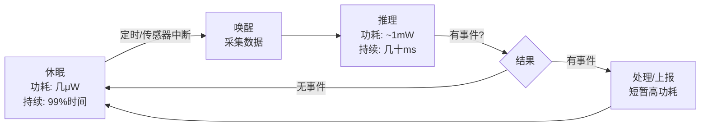
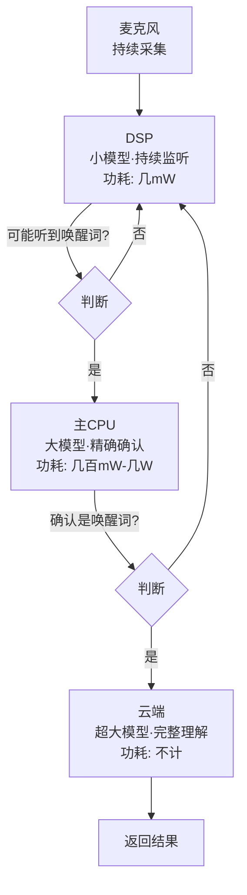

<!-- Post: TinyML的技术本质：为什么1mW是改变世界的魔法数字？ | ID: 2026-005 | Created: 2026-09-01 | Tags: books, tech | Format: markdown -->

## 开篇：一个看似简单的问题

先问你一个问题：**为什么我们要在只有几十KB内存的微控制器上跑机器学习？**

直接用树莓派不行吗？它能跑完整的 Linux，能跑 TensorFlow，性能比微控制器强几百倍。

答案只有一个词：**功耗**。

树莓派 Zero 看起来很小很便宜，但它的功耗是**数百毫瓦（mW）**。用一颗纽扣电池供电，它可能连一天都撑不到。而微控制器跑机器学习推理，功耗可以低于 **1mW**——差了**三个数量级**。

三个数量级是什么概念？就像自行车和飞机的速度差距。它们都能"移动"，但适用场景完全不同。

这一篇，我们深入拆解 TinyML 的技术本质。不看代码，不看 API，只看最根本的问题：**为什么1mW这个数字如此重要？为什么必须在本地计算？DSP、MCU、CPU到底有什么区别？TinyML的边界在哪里？**

---

## 一、1mW这个数字是怎么来的

作者 Pete Warden 在第1章给出了一个行业"粗略共识"（rough consensus）：

> "If you can run a neural network model at an energy cost of below 1 mW, it makes a lot of entirely new applications possible."
>
> ——第1章 Introduction，第2页

翻译：如果你能以低于1mW的能耗运行神经网络模型，一大批全新的应用就成为可能。

为什么是1mW？不是0.5mW，也不是2mW？

### 用纽扣电池算一笔账

我们来做一道简单的物理题。

一颗常见的 **CR2032 纽扣电池**（电脑主板、汽车钥匙里用的那种），参数是：
- 容量：220mAh（毫安时）
- 电压：3V

它总共能储存的能量是：

$$E = 220\text{mAh} \times 3\text{V} = 660\text{mWh（毫瓦时）}$$

如果你的设备推理时功耗是 **1mW**，并且**一直满负荷运行**，这颗电池能撑多久？

$$T = \frac{660\text{mWh}}{1\text{mW}} = 660\text{小时} \approx 27.5\text{天}$$

27.5天，不到一个月。这好像也不算"用一年"啊？

关键在于：**微控制器不会一直满负荷运行**。

### 占空比（Duty Cycling）：休眠才是常态

作者在第16章专门讲了这个技术：

> "Almost all embedded processors have the ability to put themselves into a sleep mode in which they don't perform any computation and use very little power, but are able to wake up either after an interval or when a signal comes in from outside... This is commonly known as duty cycling."
>
> ——第16章 Optimizing Energy Usage，第420页

翻译：几乎所有嵌入式处理器都能进入休眠模式——不执行计算，功耗极低，但能在定时或外部信号触发时唤醒。这就是**占空比（Duty Cycling）**。

实际工作流程是这样的：

芯片99%的时间在休眠，功耗只有几微瓦（μW）。每隔一段时间唤醒一次，花几十毫秒做一次推理，然后立刻继续睡。

这样算下来，**平均功耗**可能只有 **50μW（0.05mW）**。

我们再算一次：

$$T = \frac{660\text{mWh}}{0.05\text{mW}} = 13200\text{小时} \approx 550\text{天} \approx 1.5\text{年}$$

**一颗纽扣电池，用一年半。** 这就是作者说"below 1mW means a coin battery has a lifetime of a year"的真正含义——1mW是推理时的**瞬时功耗**，加上占空比后的**平均功耗**远低于1mW。

> "This might seem like a somewhat arbitrary number, but if you translate it into concrete terms, it means a device running on a coin battery has a lifetime of a year."
>
> ——第1章 Introduction，第2页

---

## 二、功耗的量级：从数据中心到纽扣电池

要真正理解1mW有多小，我们需要建立一个**功耗量级表**。

| 设备 | 典型功耗 | 电池续航（CR2032） | 能做什么 |
|------|---------|-------------------|---------|
| 服务器 CPU | 50-200W（50000-200000mW） | 几秒钟 | 数据中心计算、大模型训练 |
| 手机 CPU（满载） | 2-5W（2000-5000mW） | 几分钟 | 运行完整操作系统、APP |
| NVIDIA Jetson（满载） | 最高12W（12000mW） | 几秒钟 | 实时视频分析、机器人 |
| 树莓派 Zero | 数百mW | 不到一天 | 跑 Linux、轻量计算 |
| 手机 DSP（唤醒词） | 几mW | 几个月 | 持续监听唤醒词 |
| **微控制器（TinyML目标）** | **<1mW（推理时）** | **一年以上（占空比）** | **永远在线的传感器推理** |
| 微控制器（休眠） | 几μW（0.001mW级） | 十年以上 | 等待唤醒 |

作者在第16章开头给出了一个精辟的总结：

> "A server CPU might consume tens or hundreds of watts... Even a phone can consume several watts and require daily charging. Microcontrollers can run at less than a milliwatt, more than a thousand times less than a phone's CPU, and so run on a coin battery or energy harvesting for weeks, months, or years."
>
> ——第16章 Optimizing Energy Usage，第415页

翻译：服务器CPU消耗几十到几百瓦……手机也要几瓦，每天充电。微控制器可以低于1mW运行，比手机CPU低一千多倍，因此能用纽扣电池或能量收集运行几周、几个月甚至几年。

**一千倍的差距。** 这就是为什么有些事情只能用微控制器做，树莓派做不了——不是性能不够，而是电池撑不住。

---

## 三、为什么必须在本地计算：传输数据比计算更费电

你可能还会问：就算微控制器算力弱，我把传感器数据传到手机或云端去算不行吗？微控制器只负责采集和传输，不做推理。

**不行。因为无线传输数据比本地计算费电得多。**

这是 TinyML 最核心的洞察之一。作者在第1章明确指出：

> "Making these products real required ways to turn raw sensor data into actionable information locally, on the device itself, since the energy costs of transmitting streams anywhere have proved to be inherently too high to be practical."
>
> ——第1章 Introduction，第2页

翻译：要让这些产品成为现实，必须在设备本地把原始传感器数据变成有用的信息，因为把数据流传输到任何地方的能耗，都高到不切实际。

### 一个生活中的类比

想象你在一个没有手机信号的荒岛上，你想告诉对岸的朋友一个数字。你有两种方式：

1. **喊过去**（无线传输）：你需要用尽全力大喊，消耗大量体力，而且对岸可能听不清，你还得反复喊。
2. **自己算好再写在纸条上放漂流瓶**（本地计算+只传结果）：你花一点点力气算好，写几个字，扔个瓶子过去就行。

在荒岛上，喊比写费力气。在物联网设备上，**无线传输比本地计算费电**。

### 为什么传输这么费电？

无线通信的本质是**用电磁波把能量辐射到空间中**。不管你传的是1字节还是1KB，发射电路都需要先启动、建立连接、然后发射。这个启动和发射过程消耗的能量，往往比微控制器做几千次运算还多。

更关键的是：传感器数据是**连续的流**。比如麦克风每秒产生16000个采样点，加速度计每秒产生几百个数据点。如果你把这些原始数据全部传出去，无线模块几乎要一直工作，电池几天就耗尽了。

但如果你在本地做推理，**只在检测到事件时才传输结果**——比如唤醒词检测到"OK Google"才唤醒手机，人体检测到有人才上传截图——无线模块99.9%的时间都在休眠。

这就是 TinyML 的核心逻辑：

> **不是因为芯片变强了所以能跑AI，而是因为传输数据太费电，所以必须在本地算。**

---

## 四、DSP vs MCU vs CPU：三种芯片的本质区别

在 TinyML 的世界里，你会经常听到三种芯片：**CPU、DSP、MCU**。它们有什么区别？

### 对比表

| 维度 | CPU（应用处理器） | DSP（数字信号处理器） | MCU（微控制器） |
|------|-------------------|---------------------|----------------|
| **代表** | 手机主CPU、树莓派 | 手机音频DSP、专用音频芯片 | Arduino、STM32、ESP32 |
| **架构** | Cortex-A 系列，复杂 | 专用DSP架构，哈佛结构 | Cortex-M 系列，简单 |
| **主频** | 几百MHz-几GHz | 几十-几百MHz | 几十-几百MHz |
| **内存** | 几百MB-几GB | 几十KB-几MB | 几KB-几百KB |
| **操作系统** | Linux/Android/iOS | 无或轻量级RTOS | 无或轻量级RTOS |
| **典型功耗** | 几百mW-几W | 几mW-几十mW | <1mW（推理时） |
| **擅长** | 通用计算、复杂任务 | 信号处理、实时运算 | 控制、低功耗、传感器接口 |
| **TinyML角色** | 训练模型、复杂推理 | 持续监听、前端处理 | 端侧推理、永远在线 |

### 手机唤醒词的工作原理：级联设计（Cascading Design）

你手机里的"OK Google"唤醒功能，就是这三种芯片协同工作的完美案例。作者在第16章专门讲了这个**级联设计（Cascading Design）**：

> "This is how always-on voice interfaces work on phones. A DSP is constantly monitoring the microphone, with a model listening for 'Alexa,' 'Siri,' 'Hey Google,' or a similar wake word. The main CPU can be left in a sleep mode, but when the DSP thinks it might have heard the right phrase, it will signal to wake it up. The CPU can then run a much larger and more accurate model to confirm whether it really was the right phrase, and perhaps send the following speech to an even more powerful processor in the cloud if it was."
>
> ——第16章 Optimizing Energy Usage，第421页

翻译：这就是手机永远在线语音接口的工作方式。DSP持续监听麦克风，运行一个模型听唤醒词。主CPU保持休眠，当DSP认为可能听到了唤醒词，就发信号唤醒CPU。CPU然后运行一个更大更准确的模型来确认，如果确认了，再把后续语音送到云端更强大的处理器。

这就是**级联设计**：用最小最省电的模型做第一道筛选，只有在可能有事件时才唤醒更强大的芯片。越靠后的芯片越强大、越费电，但工作时间越短。

**TinyML 做的，就是这个级联的最前端——那个永远在线、最省电、最简单的第一道筛选。**

---

## 五、TinyML 的边界：什么能做、什么不能做

理解了功耗约束，你就能理解 TinyML 的能力边界。

### 能做的事情

| 应用类型 | 例子 | 为什么能做 |
|---------|------|-----------|
| **简单分类** | 唤醒词（yes/no）、手势识别（画圈/挥/斜划）、人体存在（有人/没人） | 模型小（几KB-几百KB），推理快（几ms-几百ms），输入简单 |
| **异常检测** | 设备故障预测（振动/声音异常）、环境监测 | 不需要精确识别，只需要判断"正常/异常" |
| **永远在线的触发** | 语音唤醒、运动触发、声音事件检测 | 占空比工作，平均功耗极低 |
| **传感器融合** | 加速度计+陀螺仪的活动识别 | 传感器数据率低，计算量小 |

### 不能做的事情

| 应用类型 | 为什么不能做 |
|---------|------------|
| **大语言模型（LLM）** | 模型大小几GB-几十GB，远超微控制器的Flash（通常<1MB） |
| **实时视频处理** | 图像数据量大，推理需要大量算力，功耗和内存都不够 |
| **复杂推理/规划** | 需要大模型和大量内存，微控制器算力不足 |
| **持续高速处理** | 比如每秒30帧的视频分析，功耗会飙升，电池撑不住 |
| **高精度识别** | 比如人脸识别（需要区分几百张脸），小模型精度不够 |

作者在第1章也强调了 TinyML 的定位：

> "There is no one 'killer app' for TinyML right now... but we know from experience that there are a lot of problems out there in the world that can be solved using the toolbox it offers."
>
> ——第2章 Getting Started，第8页（引用第1章观点）

翻译：TinyML目前没有一个"杀手级应用"……但我们从经验中知道，世界上有很多问题可以用它提供的工具箱来解决。

**TinyML 不是要取代云端AI或手机AI，而是要填补"永远在线、电池供电、成本极低"这个空白。**

---

## 六、全系统思维：不是只看芯片功耗

最后一个重要概念：**全系统思维（Whole-System Perspective）**。

很多人以为，只要芯片功耗低于1mW，产品就能用一年。但实际不是这样——芯片只是系统的一部分。

作者在第2章举了一个非常好的例子：

> "For example, if you have a microcontroller that consumes only 1 mW, but the only camera sensor it works with takes 10 mW to operate, any vision-based product you use it on won't be able to take advantage of the processor's low energy consumption."
>
> ——第2章 Getting Started，第8页

翻译：比如，如果你的微控制器只耗1mW，但它能用的唯一摄像头传感器工作时要耗10mW，那么任何基于视觉的产品都无法享受到处理器低功耗的好处。

### 典型系统的功耗分布

| 组件 | 典型功耗 | 占比（估算） |
|------|---------|------------|
| 微控制器（推理时） | ~1mW | 5-10% |
| 微控制器（休眠时） | ~5μW | <1% |
| 传感器（麦克风/加速度计） | 0.1-1mW | 10-30% |
| 摄像头（如果有） | 10-100mW | 80-90% |
| 无线模块（BLE/WiFi，传输时） | 10-100mW | 事件触发时短暂高功耗 |
| LED/指示灯 | 1-10mW | 视使用情况 |
| **系统总计（平均）** | **几十-几百μW** | **100%** |

看到了吗？如果你的产品用了摄像头，摄像头的功耗可能是微控制器的10-100倍。这时候优化微控制器的功耗毫无意义——你应该优化摄像头的占空比，或者换一个更低功耗的摄像头。

这就是**全系统思维**：不要只看一个组件的参数，要看整个产品的功耗预算。作者明确说：

> "Since we want to see complete products emerge, we approach everything we're discussing from a whole-system perspective. Often hardware vendors will focus on the energy consumption of the particular component they're selling, but not consider how other necessary parts increase the power required."
>
> ——第2章 Getting Started，第8页

翻译：因为我们希望看到完整的产品出现，所以我们从全系统视角讨论所有问题。硬件厂商通常只关注他们卖的那个组件的功耗，而不考虑其他必要部件如何增加功耗。

**做 TinyML 产品，你必须是一个系统工程师，而不是只盯着芯片参数。**

---

## 小结：TinyML 的技术本质

让我们用几句话总结这一篇的核心观点：

1. **1mW是推理时的瞬时功耗阈值**，不是平均功耗。通过占空比（Duty Cycling），平均功耗可以低到几十μW，一颗纽扣电池用一年以上。

2. **功耗差距是三个数量级**：微控制器（<1mW）vs 手机CPU（几W）vs 服务器（几十W）。这不是"更轻量"，而是完全不同的应用场景。

3. **本地计算比无线传输更省电**。TinyML 的核心逻辑不是"芯片变强了所以能跑AI"，而是"传输数据太费电，所以必须在本地算"。

4. **DSP/MCU/CPU 各有分工**。手机唤醒词的级联设计（Cascading Design）是最佳案例：DSP永远在线监听→CPU精确确认→云端完整理解。TinyML 做的是最前端。

5. **TinyML 有明确的边界**。能做简单分类、异常检测、永远在线触发；不能做大模型、实时视频、复杂推理。

6. **全系统思维最重要**。芯片功耗只是系统的一部分，传感器、无线、LED都可能成为功耗瓶颈。做产品要看整体功耗预算。

理解了这些技术本质，你再看后面的部署流水线、项目架构、运行时框架、优化方法，就会明白——**所有的设计决策，最终都是为了在1mW的约束下把事情做成。**

下一篇，我们进入**主题2：模型部署流水线**——从训练到板端推理的7步完整流程，包括量化原理、C数组导出、板端输入输出处理。你会学到：怎么把你自己训练的模型，弄到微控制器上跑起来。

---

**系列文章导航**：
- 第1篇：[TinyML 入门：为什么一毛钱的芯片也能跑人工智能？](./?id=2026-002)
- 第2篇：[一图读懂 TinyML 全书：4个项目、8大主题、475页的学习路径](./?id=2026-003)
- 第3篇：[TinyML 深度阅读指南：6个主题帮你从"跑通示例"到"理解原理"](./?id=2026-004)
- 第4篇：本文（主题1：TinyML的技术本质）
- 第5篇：主题2 — 模型部署流水线（即将发布）

*本文是《TinyML 洋葱阅读系列》第4篇，对应6个核心主题之1：TinyML的技术本质。基于 Pete Warden & Daniel Situnayake《TinyML》（O'Reilly, 2019, ISBN 9781492052043）第1章、第16章内容创作。所有计算基于CR2032纽扣电池（220mAh, 3V）标准参数。*
