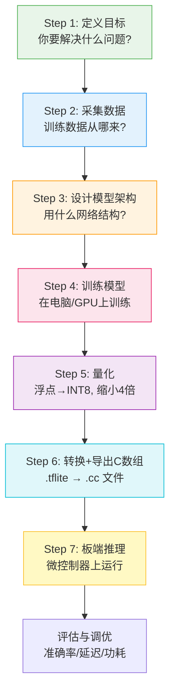

<!-- Post: 从训练到芯片：一张图看懂TinyML模型部署的7步流水线 | ID: 2026-006 | Created: 2026-09-01 | Tags: books, tech | Format: markdown -->

## 开篇：训练好了模型，然后呢？

假设你跟着教程，在电脑上用 TensorFlow 训练了一个模型——比如能识别"开灯""关灯"两个关键词的语音模型。训练准确率95%，你很满意。

然后呢？怎么把这个模型弄到你的 Arduino 上，让它听到"开灯"就真的把灯打开？

很多人卡在这一步。电脑上的模型是一个 `.h5` 或 `.pb` 文件，几百KB到几MB，依赖完整的 TensorFlow 运行时。而微控制器只有几百KB RAM、没有操作系统、没有文件系统、连 `malloc()` 都尽量不用。

**这两个世界之间，有一条完整的部署流水线。**

作者在第3章把深度学习的工作流总结为7步，第4章用 Hello World 项目完整走了一遍。这一篇，我们把这7步拆解清楚——每一步做什么、输入输出是什么、用什么工具、常见坑在哪里。

> "The Deep Learning Workflow... Decide on a Goal → Collect a Dataset → Design a Model Architecture → Train the Model → Convert the Model → Run Inference → Evaluate and Troubleshoot"
>
> ——第3章 Getting Up to Speed on Machine Learning，第13页

---

## 一、7步流水线总览

先看一张全景图，建立整体认知：



前4步在**电脑上**完成（训练阶段），后3步在**电脑和微控制器之间**完成（部署阶段）。前4步是通用的机器学习流程，后3步是 TinyML 特有的。

这一篇我们重点讲后3步（量化、转换、板端推理），前4步只做简要说明。

---

## 二、前4步：训练阶段（简要说明）

### Step 1: 定义目标

**做什么**：明确你要解决什么问题，输入输出是什么。

**例子**：
- 输入：1秒的音频片段
- 输出：4个类别（yes / no / unknown / silence）
- 约束：推理时间 < 100ms，模型大小 < 500KB

**常见坑**：目标太模糊（"我要做一个语音助手"），没有明确输入输出和约束。TinyML 的关键是**在约束下设计**，约束越明确，模型设计越有针对性。

### Step 2: 采集数据

**做什么**：收集训练用的数据集。

**关键原则**：垃圾进，垃圾出（Garbage In, Garbage Out）。训练数据的质量和多样性决定了模型的上限。

**书中例子**：
- Hello World：自动生成正弦波数据（第4章）
- 唤醒词：Google Speech Commands 数据集（第8章）
- 人体检测：Open Images 数据集（第10章）
- 魔法棒：自己用开发板采集加速度计数据（第12章）

**常见坑**：训练数据和实际部署环境不一致。比如你在安静的实验室录的语音，部署到嘈杂的工厂环境就完全不行。**采集数据时要尽可能模拟真实部署环境。**

### Step 3: 设计模型架构

**做什么**：选择神经网络结构（全连接、CNN、RNN等），确定层数、神经元数。

**TinyML 的设计原则**：模型越小越好，但不能小到精度不够。这是一个反复权衡的过程。

**书中例子**：
- Hello World：2层全连接，每层16个神经元，总共321个参数（第4章）
- 唤醒词：小型CNN，约400KB（第8章）
- 人体检测：MobileNet-like，约250KB（第10章）

> "Our original model had only 49 total parameters... With two layers of 16 neurons, our new model is a lot larger... for a total of 288 + 33 = 321 parameters."
>
> ——第4章 Hello World: Building and Training a Model，第54页

**常见坑**：直接用复杂的大模型（如ResNet、Transformer），不考虑微控制器的资源限制。TinyML 需要专门设计的小模型架构。

### Step 4: 训练模型

**做什么**：在电脑上用 TensorFlow/Keras 训练模型，调整超参数，评估精度。

**关键指标**：
- 训练损失（training loss）
- 验证损失（validation loss）
- 测试精度（test accuracy）
- 过拟合（overfitting）检测

**书中的训练流程**：
1. 分割数据：训练集 / 验证集 / 测试集（通常 60% / 20% / 20%）
2. 编译模型：选择优化器（optimizer）、损失函数（loss function）、评估指标（metrics）
3. 训练：`model.fit()`，指定 epochs、batch_size
4. 评估：`model.evaluate()` 在测试集上评估
5. 调优：根据结果调整模型架构或训练参数

**常见坑**：
- 过拟合：训练精度高，测试精度低。解决：增加数据、正则化、简化模型
- 训练集和测试集数据泄漏：测试数据混入训练，导致虚高精度
- 过早停止或过晚停止：需要观察验证损失曲线，找到最佳停止点

---

## 三、Step 5: 量化——把浮点数压缩成整数

这是 TinyML 部署中**最关键**的一步，也是最容易被忽略的一步。

### 为什么必须量化？

训练时，模型的权重和偏置用 **32位浮点数（float32）** 存储，因为训练需要高精度来计算梯度和反向传播。

但微控制器上：
1. **Flash 空间有限**：float32 模型可能太大装不下
2. **整数运算更快**：Cortex-M 系列的 DSP 扩展专门优化了8位整数运算
3. **功耗更低**：整数运算比浮点运算消耗更少能量

作者在第4章明确说明了量化的好处：

> "One of the most useful optimizations is quantization. By default, the weights and biases in a model are stored as 32-bit floating-point numbers... Quantization allows you to reduce the precision of these numbers so that they fit into 8-bit integers—a four times reduction in size. Even better, because it's easier for a CPU to perform math with integers than with floats, a quantized model will run faster."
>
> ——第4章 Hello World: Building and Training a Model，第60页

翻译：量化是最有用的优化之一。默认情况下，模型权重用32位浮点数存储……量化可以把精度降低到8位整数——体积缩小4倍。更棒的是，因为CPU做整数运算比浮点运算更容易，量化后的模型运行更快。

### 量化是怎么工作的？

用一个简单的类比：**就像把一张高清照片压缩成 JPEG**。

- 原始照片（float32）：每个像素用24位颜色，细节丰富，文件大
- JPEG压缩（INT8量化）：去掉人眼不太敏感的细节，文件小很多，看起来差不多

量化的数学原理是把浮点数范围映射到整数范围：

$$\text{int8值} = \frac{\text{float值} - \text{zero\_point}}{\text{scale}}$$

其中：
- `scale`（缩放因子）：浮点数范围 / 255
- `zero_point`（零点）：浮点数0对应的整数值

这个映射在模型转换时完成，推理时输入输出也需要相应的量化/反量化。

### 量化误差从哪来？

量化不是无损的。压缩必然带来误差，误差来源主要有三个：

1. **舍入误差**：浮点数映射到整数时四舍五入，丢失精度
2. **范围截断**：超出量化范围的值被截断（clamp）
3. **层间误差累积**：每一层的量化误差传递到下一层，深层网络误差更大

但作者强调，对于大多数 TinyML 应用，量化误差**小到可以忽略**：

> "The coolest thing about quantization is that it often results in minimal loss in accuracy. This means that when deploying to low-memory devices, it is nearly always worthwhile."
>
> ——第4章，第60页

翻译：量化最酷的地方是，它通常只会带来极小的精度损失。这意味着在低内存设备上部署时，量化几乎总是值得的。

### PTQ vs QAT：两种量化方式

| 方式 | 全称 | 怎么做 | 精度 | 适用场景 |
|------|------|--------|------|---------|
| **PTQ** | Post-Training Quantization（训练后量化） | 训练完成后，用一小批数据校准量化参数 | 略有损失 | 大多数场景，简单快速 |
| **QAT** | Quantization-Aware Training（量化感知训练） | 训练时就模拟量化误差，让模型适应量化 | 损失更小 | 对精度要求高的复杂模型 |

书中的 Hello World 项目用的是 **PTQ**，通过 `representative_dataset`（代表性数据集）来校准量化参数：

> "To create a quantized model that runs as efficiently as possible, we need to provide a representative dataset—a set of numbers that represent the full range of input values of the dataset on which the model was trained."
>
> ——第4章，第61页

翻译：要创建一个尽可能高效运行的量化模型，我们需要提供一个代表性数据集——一组代表模型训练时输入值完整范围的数字。

**常见坑**：
- 代表性数据集不能覆盖真实输入范围，导致量化后精度暴跌
- 量化后不做精度验证，直接部署，结果发现精度不够
- 对太简单的模型（如Hello World的321参数）量化效果不明显，因为计算图占的空间比权重大

书中的实际数据：
- 未量化模型：2736 bytes
- 量化后模型：2512 bytes
- 只小了224 bytes（因为模型太小，计算图占了大部分空间）

> "Basic model is 2736 bytes... Quantized model is 2512 bytes... Difference is 224 bytes... More complex models have many more weights, meaning the space saving from quantization will be much higher. It can be expected to approach four times for most sophisticated models."
>
> ——第4章，第64页

对于唤醒词、人体检测这种大模型，量化能缩小到原来的1/4左右，效果非常明显。

---

## 四、Step 6: 转换 + 导出C数组——模型怎么变成代码

量化完成后，你得到了一个 `.tflite` 文件。但微控制器**没有文件系统**，不能像电脑那样 `open("model.tflite")` 来加载模型。

怎么办？**把模型文件的内容直接变成 C 代码，编译进固件。**

### TFLite 转换：从 Keras 到 FlatBuffer

第一步是用 TensorFlow Lite Converter 把 Keras 模型转换成 `.tflite` 格式：

```python
# 转换为 TFLite 格式（带量化）
converter = tf.lite.TFLiteConverter.from_keras_model(model)
converter.optimizations = [tf.lite.Optimize.DEFAULT]
converter.representative_dataset = representative_dataset_generator
tflite_model = converter.convert()

# 保存为 .tflite 文件
open("sine_model_quantized.tflite", "wb").write(tflite_model)
```

`.tflite` 文件用的是 **FlatBuffer** 格式，这是一种专门为内存受限设备设计的序列化格式：

> "It takes our Keras model and writes it to disk in the form of a FlatBuffer, which is a special file format designed to be space-efficient."
>
> ——第4章，第60页

FlatBuffer 的特点是**零拷贝反序列化**——不需要解析整个文件，直接在内存中用指针访问数据，非常适合微控制器。

### 导出C数组：xxd 工具

第二步是用 `xxd` 工具把 `.tflite` 二进制文件转换成 C 源文件：

```bash
xxd -i sine_model_quantized.tflite > sine_model_data.cc
```

生成的 C 文件长这样：

```c
unsigned char sine_model_quantized_tflite[] = {
  0x1c, 0x00, 0x00, 0x00, 0x54, 0x46, 0x4c, 0x33,
  0x14, 0x00, 0x20, 0x00, 0x04, 0x00, 0x08, 0x00,
  // ... 更多字节
};
unsigned int sine_model_quantized_tflite_len = 2512;
```

就是一个巨大的 `unsigned char` 数组，每个元素是模型文件的一个字节。还有一个变量记录数组长度。

作者解释了为什么要这样做：

> "The final step in preparing our model for use with TensorFlow Lite for Microcontrollers is to convert it into a C source file that can be included in our application... most microcontrollers don't have a filesystem, and even if they did, the extra code required to load a model from disk would be wasteful given our limited memory."
>
> ——第4章，第64页

翻译：准备模型的最后一步是把它转换成可以包含在应用中的C源文件……大多数微控制器没有文件系统，即使有，从磁盘加载模型所需的额外代码在我们有限的内存下也是浪费。

### 模型在 Flash 中的存储

编译时，这个 `unsigned char` 数组被烧录到微控制器的 **Flash（闪存）** 中。运行时，TFLM 的解释器直接从 Flash 中读取模型数据，不需要复制到 RAM。

这就是为什么模型大小直接决定了 Flash 占用：
- 2KB 的模型 → 占用 2KB Flash
- 400KB 的模型 → 占用 400KB Flash（很多微控制器总共只有 512KB Flash）

**常见坑**：
- 模型大小超过 Flash 容量，编译报错或烧录失败
- 忘记把模型文件更新到最新版本，部署的还是旧模型
- `xxd` 生成的变量名和代码中引用的不一致（注意文件名中的点会变成下划线）

---

## 五、Step 7: 板端推理——微控制器上的5步调用

模型变成 C 代码后，最后一步就是在微控制器上运行推理。作者在第4章给出了 TFLite Interpreter 的5步调用流程：

> "With TensorFlow Lite, we need to do the following:
> 1. Instantiate an Interpreter object.
> 2. Call some methods that allocate memory for the model.
> 3. Write the input to the input tensor.
> 4. Invoke the model.
> 5. Read the output from the output tensor."
>
> ——第4章，第61页

### 5步详解

#### Step 7.1: 实例化 Interpreter

```cpp
// 定义模型（来自xxd生成的C数组）
extern const unsigned char g_model[];
extern const int g_model_len;

// 创建操作符解析器
static tflite::MicroMutableOpResolver<1> resolver;
resolver.AddFullyConnected();

// 创建解释器
static tflite::MicroInterpreter interpreter(
    model, resolver, tensor_arena, kTensorArenaSize);
```

关键组件：
- `model`：指向 Flash 中模型数据的指针
- `resolver`（操作符解析器）：告诉解释器模型用到了哪些操作（如全连接、卷积），只编译需要的操作，减小二进制体积
- `tensor_arena`（张量竞技场）：一块预分配的 RAM，用于存储中间张量（下一篇主题4会详细讲）

#### Step 7.2: 分配内存

```cpp
interpreter.AllocateTensors();
```

这一步在张量竞技场中为模型的输入、输出和中间张量分配内存。分配完成后，你可以检查输入输出张量的信息：

```cpp
TfLiteTensor* input = interpreter.input(0);
TfLiteTensor* output = interpreter.output(0);
```

#### Step 7.3: 写输入张量

```cpp
// 填充输入数据
input->data.f[0] = 0.5f;  // 浮点模型
// 或者量化模型：
input->data.int8[0] = quantized_value;
```

注意：如果是量化模型，输入需要先从浮点数转换成 INT8 整数（用 scale 和 zero_point）。

#### Step 7.4: 调用推理

```cpp
interpreter.Invoke();
```

这一步执行模型的所有层，从输入计算到输出。耗时取决于模型大小和芯片性能。

#### Step 7.5: 读输出张量

```cpp
float result = output->data.f[0];  // 浮点模型
// 或者量化模型，需要反量化：
float result = (output->data.int8[0] - output->params.zero_point) * output->params.scale;
```

### 完整的推理循环

在实际应用中，这5步不是只执行一次，而是放在循环里持续运行：

```cpp
void setup() {
  // 初始化：实例化、分配内存（只做一次）
  interpreter.AllocateTensors();
}

void loop() {
  // 每次循环：采集数据 → 写输入 → 推理 → 读输出 → 响应
  float sensor_value = read_sensor();
  input->data.f[0] = sensor_value;
  interpreter.Invoke();
  float result = output->data.f[0];
  handle_result(result);
}
```

**常见坑**：
- 忘记量化输入/反量化输出，导致结果完全错误
- 张量竞技场大小不够，`AllocateTensors()` 失败
- 推理时间太长，影响实时性（比如唤醒词需要在100ms内完成）
- 输入数据的预处理（归一化、缩放）和训练时不一致，导致精度暴跌（这是最常见的坑，主题6调试方法论会详细讲）

---

## 六、每一步的常见坑速查表

| 步骤 | 常见坑 | 怎么避免 |
|------|--------|---------|
| 定义目标 | 目标太模糊，没有约束 | 明确输入/输出/精度/延迟/体积约束 |
| 采集数据 | 训练环境和部署环境不一致 | 尽可能在真实部署环境采集数据 |
| 设计模型 | 直接用大模型，不考虑资源 | 从小模型开始，逐步增加复杂度 |
| 训练模型 | 过拟合、数据泄漏 | 严格分割训练/验证/测试集，监控验证损失 |
| 量化 | 代表性数据集范围不够 | 用真实输入数据做校准，量化后验证精度 |
| 转换导出 | 模型版本不一致、变量名错误 | 每次部署前确认模型是最新的，检查xxd生成的变量名 |
| 板端推理 | 输入预处理不一致、量化反量化错误 | 和训练代码对比预处理逻辑，逐步调试中间输出 |

---

## 七、小结：从训练到部署的完整闭环

让我们用一句话总结这7步流水线：

> **在电脑上定义问题、采集数据、设计模型、训练模型；然后量化压缩、转换成C数组、编译进微控制器固件；最后在板子上循环执行"采集→输入→推理→输出→响应"。**

这7步不是一次性的，而是一个**迭代循环**：
1. 部署后发现精度不够 → 回到 Step 2 采集更多数据，或 Step 3 调整模型
2. 发现推理太慢 → 回到 Step 3 简化模型，或 Step 5 优化量化
3. 发现电池续航太短 → 回到 Step 1 调整占空比，或 Step 3 减小模型

理解了这条流水线，你就不再是"只会跑示例"的初学者了。你可以自己设计、训练、部署一个完整的 TinyML 应用。

下一篇，我们进入**主题3：四大项目的共性模式**——唤醒词、人体检测、魔法棒，这三个看起来完全不同的项目，代码结构却惊人地相似。我们会拆解出一套通用的四层架构（Provider → Feature → Model → Responder），这是你设计自己的 TinyML 应用的蓝图。

---

**系列文章导航**：
- 第1篇：[TinyML 入门：为什么一毛钱的芯片也能跑人工智能？](./?id=2026-002)
- 第2篇：[一图读懂 TinyML 全书：4个项目、8大主题、475页的学习路径](./?id=2026-003)
- 第3篇：[TinyML 深度阅读指南：6个主题帮你从"跑通示例"到"理解原理"](./?id=2026-004)
- 第4篇：[TinyML的技术本质：为什么1mW是改变世界的魔法数字？](./?id=2026-005)
- 第5篇：本文（主题2：模型部署流水线）
- 第6篇：主题3 — 四大项目的共性模式（即将发布）

*本文是《TinyML 洋葱阅读系列》第5篇，对应6个核心主题之2：模型部署流水线。基于 Pete Warden & Daniel Situnayake《TinyML》（O'Reilly, 2019, ISBN 9781492052043）第3章、第4章内容创作。代码示例基于书中 Hello World 项目。*
