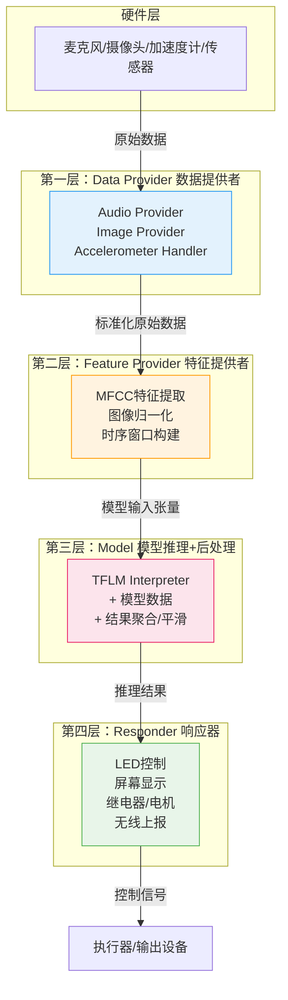

<!-- Post: 4个项目，1套架构：拆解TinyML应用的Provider-Feature-Model-Responder四层模式 | ID: 2026-007 | Created: 2026-09-01 | Tags: books, tech | Format: markdown -->

## 开篇：一个惊人的发现

你可能已经注意到了一个奇怪的现象：

书里的四个项目——Hello World（正弦波预测）、唤醒词检测（语音分类）、人体检测（视觉分类）、魔法棒手势（加速度计分类）——输入完全不同（数字/音频/图像/传感器），输出也完全不同（连续值/类别/存在性/手势），但它们的**代码结构却惊人地相似**。

不是"有点像"，而是"几乎一模一样"。

每个项目都有：
- 一个从硬件采集数据的模块
- 一个把原始数据转换成模型输入的模块
- 一个运行模型推理的模块
- 一个根据推理结果做出响应的模块

这不是巧合。作者在第7章介绍唤醒词项目时，明确给出了机器学习应用的**通用流程**：

> "Over the previous few chapters, you've learned that a machine learning application does the following sequence of things:
> 1. Obtains an input
> 2. Preprocesses the input to extract features suitable to feed into a model
> 3. Runs inference on the processed input
> 4. Postprocesses the model's output to make sense of it
> 5. Uses the resulting information to make things happen"
>
> ——第7章 Wake-Word Detection: Building an Application，第129页

翻译：机器学习应用遵循以下流程：1. 获取输入；2. 预处理输入，提取适合输入模型的特征；3. 对处理后的输入运行推理；4. 后处理模型输出，理解其含义；5. 用得到的信息让事情发生。

这5步可以归纳为**四层架构**：

```
Data Provider → Feature Provider → Model → Responder
（数据提供者）  （特征提供者）    （模型）  （响应器）
```

这一篇，我们深入拆解这套四层架构——每一层做什么、接口怎么设计、四个项目分别怎么映射、为什么这种架构如此重要，以及如何用它设计你自己的 TinyML 应用。

---

## 一、四层架构总览

先看一张全景图，建立整体认知：



**数据流方向**：硬件 → Data Provider → Feature Provider → Model → Responder → 执行器

每一层的职责单一，接口明确。这就是**分层架构**的核心思想：**每一层只关心自己的事情，通过标准化接口和上下层通信。**

---

## 二、每一层详解

### 第一层：Data Provider（数据提供者）

**职责**：从硬件传感器采集原始数据，转换成标准化的格式，交给下一层。

**为什么需要这一层？**

不同硬件的采集方式完全不同：
- Arduino 的麦克风用 PDM 接口，需要特殊的库
- SparkFun Edge 的麦克风用 I2S 接口
- STM32 的摄像头用 DCMI 接口
- 加速度计用 I2C/SPI 接口

如果把硬件相关的采集代码和业务逻辑混在一起，换一块板子就要重写整个应用。Data Provider 把硬件差异**封装**起来，对上提供统一的接口。

**唤醒词项目中的 Audio Provider**：

> "The audio provider captures raw audio data from the microphone. Because the methods for capturing audio vary from device to device, this component can be overridden and customized."
>
> ——第7章，第132页

翻译：音频提供者从麦克风捕获原始音频数据。因为不同设备的捕获方法不同，这个组件可以被重写和定制。

Audio Provider 的核心接口是 `GetAudioSamples()`——获取最新的音频采样数据。不同板子有不同的实现，但对上的接口是一样的。

**关键设计原则**：
- 只负责采集，不负责处理
- 硬件相关代码全部封装在这一层
- 对上提供统一的数据格式和时间戳
- 可以用 mock（模拟）实现替换，方便在桌面端测试

---

### 第二层：Feature Provider（特征提供者）

**职责**：把 Data Provider 给的原始数据，转换成模型可以直接输入的特征张量。

**为什么需要这一层？**

模型不能直接吃原始数据。比如：
- 原始音频是一维的采样点序列，模型需要的是二维的频谱图（spectrogram）
- 原始图像是 RGB 像素，模型需要的是归一化后的灰度图或 YUV 图
- 原始加速度计是离散的采样点，模型需要的是固定长度的时序窗口

这一层做的就是**特征工程**——把原始信号转换成模型能理解的形式。

**唤醒词项目中的 Feature Provider**：

> "The feature provider converts raw audio data into the spectrogram format that our model requires. It does so on a rolling basis as part of the main loop, providing the interpreter with a sequence of overlapping one-second windows."
>
> ——第7章，第132页

翻译：特征提供者把原始音频数据转换成模型需要的频谱图格式。它在主循环中滚动处理，为解释器提供一系列重叠的1秒窗口。

**关键设计原则**：
- 只负责特征提取，不负责推理
- 输入输出格式必须和训练时完全一致（这是最常见的bug来源）
- 可以用 mock 数据测试，不依赖真实硬件
- 滚动窗口（rolling window）机制：每次只更新一部分数据，重复利用，减少计算量

---

### 第三层：Model（模型推理 + 后处理）

**职责**：运行 TFLM 解释器，对特征张量执行推理，然后对输出做后处理（聚合、平滑、阈值判断），得到最终的决策结果。

**为什么需要这一层？**

模型的原始输出往往不能直接用。比如：
- 分类模型输出的是各类别的概率，需要取最大值或设置阈值
- 持续推理的结果有抖动，需要时间上的聚合和平滑
- 回归模型输出的是连续值，需要反量化和缩放

**唤醒词项目中的 Model 层**：

这一层包含三个组件：
1. **TF Lite Interpreter**：运行模型推理
2. **Model 数据**：编译进固件的模型数组
3. **Command Recognizer（命令识别器）**：聚合多次推理结果，判断是否真的听到了关键词

> "Because inference is run multiple times per second, the RecognizeCommands class aggregates the results and determines whether, on average, a known word was heard."
>
> ——第7章，第132页

翻译：因为每秒运行多次推理，RecognizeCommands 类聚合结果，判断平均来说是否听到了已知的词。

为什么需要聚合？因为模型每秒推理多次，单次结果可能有误判。如果连续几次都识别为"yes"，才认为真的听到了"yes"。这就是**时间维度的后处理**。

**关键设计原则**：
- 推理逻辑和后处理逻辑分离
- 后处理参数（阈值、窗口大小、平滑系数）可以独立调整
- 模型数据通过常量数组链接，不依赖文件系统
- 张量竞技场（Tensor Arena）大小需要根据模型计算（下一篇主题4会详细讲）

---

### 第四层：Responder（响应器）

**职责**：根据 Model 层的决策结果，控制硬件输出——亮LED、显示屏幕、驱动电机、发送无线信号等。

**为什么需要这一层？**

和 Data Provider 一样，不同板子的输出方式不同：
- Arduino 用 LED 或串口输出
- SparkFun Edge 用 LED 或屏幕
- STM32 用 LCD 屏幕

把输出逻辑封装在 Responder 层，换板子只需要改这一层。

**唤醒词项目中的 Command Responder**：

> "If a command was heard, the command responder uses the device's output capabilities to indicate the result."
>
> ——第7章，第132页

翻译：如果听到了命令，命令响应器用设备的输出能力来指示结果。

**关键设计原则**：
- 只负责输出，不负责决策
- 硬件相关代码封装在这一层
- 可以用 mock 实现替换，在桌面端测试时只打印日志
- 响应动作应该是**幂等**的——重复触发不会导致意外状态

---

## 三、四个项目的架构映射

现在我们来看四个项目如何映射到这套四层架构。这是本篇最核心的表格：

| 层级 | Hello World<br/>(第4-6章) | 唤醒词检测<br/>(第7-8章) | 人体检测<br/>(第9-10章) | 魔法棒手势<br/>(第11-12章) |
|------|--------------------------|--------------------------|--------------------------|--------------------------|
| **输入硬件** | 无（计数器生成数字） | 麦克风（PDM/I2S） | 摄像头（Arducam/Himax） | 加速度计（LSM9DS1） |
| **Data Provider** | 无（直接用计数器） | **Audio Provider**<br/>`GetAudioSamples()` | **Image Provider**<br/>采集摄像头帧 | **Accelerometer Handler**<br/>读取加速度数据 |
| **原始数据** | 单个浮点数 x | 16kHz 音频采样 | 96×96 RGB 图像 | 3轴加速度时序 |
| **Feature Provider** | 无（直接输入模型） | **Feature Provider**<br/>MFCC → 49×10 频谱图 | 图像预处理<br/>归一化 → 96×96×1 灰度 | 时序窗口构建<br/>固定长度 3D 张量 |
| **模型输入** | 1个 float | 49×10×1 int8 | 96×96×1 int8 | 时序窗口 int8 |
| **Model** | 2层全连接<br/>321参数 | 小型CNN<br/>~18KB | MobileNet-like<br/>~250KB | 3D-CNN<br/>~20KB |
| **后处理** | 无（直接输出连续值） | **Command Recognizer**<br/>聚合多次推理，阈值判断 | 检测响应器内<br/>置信度阈值 | **Gesture Predictor**<br/>滑动窗口+投票 |
| **模型输出** | 1个 float（正弦值） | 4类概率（yes/no/unknown/silence） | 2类概率（有人/没人） | 4类概率（画圈/挥/斜划/未知） |
| **Responder** | **Output Handler**<br/>LED 亮度随正弦值变化 | **Command Responder**<br/>LED 闪烁/屏幕显示 | **Detection Responder**<br/>LED/屏幕指示 | **Output Handler**<br/>LED/屏幕显示手势 |

看到了吗？**四个项目，同一套架构。** 只是每一层的具体实现不同。

### Hello World：最简单的实例

Hello World 是最简化的版本——它没有传感器，Data Provider 就是一个简单的计数器，Feature Provider 也不需要（直接把数字输入模型）。但它的 Model 层和 Responder 层和其他项目完全一样。

这就是为什么作者从 Hello World 开始教——**先理解最简单的架构，再逐步增加复杂度。**

### 唤醒词：最完整的实例

唤醒词项目是四层架构最完整的展示——每一层都有明确的组件和复杂的逻辑：
- Audio Provider 处理不同硬件的音频采集
- Feature Provider 做 MFCC 特征提取（这是音频ML的核心技术）
- Model 层包含 CNN 推理 + Command Recognizer 后处理
- Command Responder 控制输出

如果你只能深入理解一个项目，**选唤醒词**。理解了它，其他项目就是"换传感器、换模型"。

---

## 四、为什么这种分层架构如此重要？

你可能会问：不就是把代码分成几个文件吗？为什么要大张旗鼓地讲架构？

因为这种分层架构解决了嵌入式 ML 开发中**最头疼的三个问题**。

### 1. 可测试性（Testability）

作者在每个项目中都先讲测试（Walking Through the Tests），再讲应用代码。这不是巧合。

分层架构让每一层都可以**独立测试**：
- 测试 Data Provider：用 mock 数据验证采集逻辑
- 测试 Feature Provider：输入已知数据，验证输出特征是否正确
- 测试 Model：输入固定张量，验证输出是否和桌面端一致
- 测试 Responder：模拟决策结果，验证输出动作

如果所有逻辑混在一个 `loop()` 函数里，你根本无法单独测试某一部分。出了问题只能瞎猜。

> 作者在第7章明确说："The test micro_speech_test.cc follows the same basic flow we're familiar with from the hello world example."（第7章，第134页）——测试遵循和 Hello World 相同的基本流程，因为架构是一样的。

### 2. 可替换性（Replaceability）

想换一块开发板？只需要重写 Data Provider 和 Responder 层，Feature Provider 和 Model 层完全不用动。

想换一个模型？只需要替换 Model 层的模型数据和后处理参数，其他层完全不用动。

想换一个传感器？只需要重写 Data Provider 和 Feature Provider，Model 和 Responder 层完全不用动。

**这就是分层架构的威力：变化被隔离在某一层，不会扩散到整个系统。**

### 3. 可移植性（Portability）

TinyML 的硬件生态非常碎片化——Arduino、SparkFun、STM32、ESP32、RP2040……每块板子的外设接口都不同。

分层架构让应用代码可以**一次编写，多处移植**。作者在书中为每个项目都提供了三种板子的实现，但核心业务逻辑（Feature Provider、Model、后处理）是完全共享的，只有 Data Provider 和 Responder 层有硬件相关的代码。

---

## 五、如何用这套架构设计自己的 TinyML 应用？

理解了四层架构，你就可以用它来设计自己的应用了。以下是一个从需求到架构的思考流程：

### Step 1: 定义输入和输出

先回答两个问题：
- **输入是什么？**（音频/图像/加速度计/温度/其他传感器）
- **输出要做什么？**（亮LED/显示屏幕/驱动电机/发送无线信号/记录数据）

这决定了你的 Data Provider 和 Responder 层需要什么硬件接口。

### Step 2: 确定模型类型和特征

回答：
- **这是什么类型的问题？**（分类/回归/异常检测/序列预测）
- **模型需要什么输入格式？**（频谱图/归一化图像/时序窗口/原始数值）
- **需要什么特征工程？**（MFCC/归一化/窗口构建/无）

这决定了你的 Feature Provider 层和 Model 层的设计。

### Step 3: 设计后处理逻辑

回答：
- **模型输出能直接用吗？**（需要取最大值/设置阈值/时间聚合/平滑）
- **需要防误触吗？**（连续N次确认才触发/冷却时间/置信度阈值）

这决定了 Model 层的后处理部分。

### Step 4: 划分层次，定义接口

把上面的分析映射到四层：

```
Data Provider:  [你的传感器采集代码]
    ↓ 输出: [标准化的原始数据格式]
Feature Provider:  [你的特征提取代码]
    ↓ 输出: [模型输入张量]
Model:  [TFLM推理 + 后处理]
    ↓ 输出: [最终决策结果]
Responder:  [你的输出控制代码]
```

每一层之间的**接口**（数据格式）必须明确定义，并且和训练时保持一致。

### Step 5: 先在桌面端测试，再移植到硬件

利用分层架构的可测试性：
1. 先用 mock 的 Data Provider（读取本地文件）在桌面端跑通整个流程
2. 验证 Feature Provider 的输出和训练时一致
3. 验证 Model 的输出和桌面端 TensorFlow 一致
4. 最后才移植到真实硬件，替换 Data Provider 和 Responder

**这是避免"训练好好的，部署就崩了"的最有效方法。**（这个问题我们会在主题6调试方法论中详细讲）

---

## 六、小结：架构比代码更重要

让我们用几句话总结这一篇：

1. **四个项目共享同一套四层架构**：Data Provider → Feature Provider → Model → Responder。这不是巧合，而是机器学习应用的通用模式。

2. **每一层职责单一**：Data Provider 管硬件采集，Feature Provider 管特征工程，Model 管推理和后处理，Responder 管输出控制。

3. **分层架构的三大价值**：可测试（每层独立验证）、可替换（变化被隔离）、可移植（一次编写多处运行）。

4. **设计自己的应用时**：先定义输入输出，再确定模型和特征，然后设计后处理，最后划分层次定义接口。先桌面端测试，再移植硬件。

理解了这套架构，你再看任何 TinyML 项目（不管是书里的还是 GitHub 上的），都能快速定位到每一层在做什么。更重要的是，你可以**从零开始设计自己的 TinyML 应用**，而不是只会复制示例代码。

下一篇，我们进入**主题4：TFLM运行时架构**——深入框架内部，理解解释器、张量竞技场（Tensor Arena）、操作符解析器（AllOpsResolver）、FlatBuffers 模型格式。这些是你遇到内存不足、推理崩溃、性能瓶颈时必须理解的底层机制。

---

**系列文章导航**：
- 第1篇：[TinyML 入门：为什么一毛钱的芯片也能跑人工智能？](./?id=2026-002)
- 第2篇：[一图读懂 TinyML 全书：4个项目、8大主题、475页的学习路径](./?id=2026-003)
- 第3篇：[TinyML 深度阅读指南：6个主题帮你从"跑通示例"到"理解原理"](./?id=2026-004)
- 第4篇：[TinyML的技术本质：为什么1mW是改变世界的魔法数字？](./?id=2026-005)
- 第5篇：[从训练到芯片：一张图看懂TinyML模型部署的7步流水线](./?id=2026-006)
- 第6篇：本文（主题3：四大项目的共性模式）
- 第7篇：主题4 — TFLM运行时架构（即将发布）

*本文是《TinyML 洋葱阅读系列》第6篇，对应6个核心主题之3：四大项目的共性模式。基于 Pete Warden & Daniel Situnayake《TinyML》（O'Reilly, 2019, ISBN 9781492052043）第5章、第7章、第9章、第11章的 Application Architecture 部分创作。*
