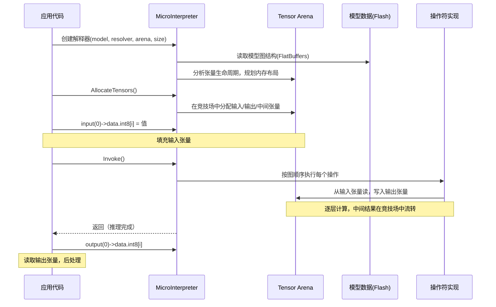
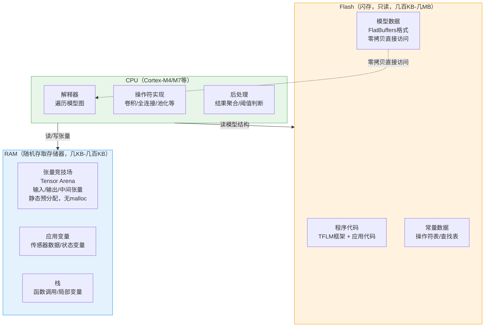

<!-- Post: 深入TFLM：张量竞技场、解释器模式与FlatBuffers——理解微控制器上的推理引擎 | ID: 2026-008 | Created: 2026-09-01 | Tags: books, tech | Format: markdown -->

## 开篇：程序崩溃了，你却不知道为什么

想象这个场景：你跟着教程把唤醒词示例烧录到 Arduino 上，一切正常。然后你想换一个自己训练的模型，模型稍微大了一点。烧录进去，程序一运行就 HardFault（硬件错误），重启、死机、再重启。

你检查了代码，逻辑没问题。你检查了模型，在电脑上跑得好好的。问题出在哪？

**很可能出在张量竞技场（Tensor Arena）大小不够。**

但如果你不知道 TFLM（TensorFlow Lite for Microcontrollers）内部是怎么工作的，你根本不会想到这个。你只会瞎试——改改代码、换换模型、重启板子，运气好就解决了，运气不好就放弃了。

这就是为什么我们要深入理解 TFLM 的运行时架构。前几篇我们讲了怎么用 TFLM，这一篇我们讲**它内部是怎么工作的**。

作者在第13章开头也说了：

> "If you're not interested in what's happening under the hood, feel free to skip this chapter; you can always return to it when you have questions."
>
> ——第13章 TensorFlow Lite for Microcontrollers，第355页

翻译：如果你对底层不感兴趣，可以跳过这一章；有问题时随时回来。

但相信我，理解了底层，你会少踩很多坑。

---

## 一、TFLM 是什么：三代演进

要理解 TFLM，先要知道它从哪来。它不是凭空设计的，而是从 TensorFlow 一步步"瘦身"来的。

### 第一代：TensorFlow（2015）

Google 的通用机器学习框架，面向服务器和桌面端。特点：
- 功能强大，支持训练和推理
- 体积大（几百MB），依赖完整操作系统
- 内存以 GB 计，存储以 TB 计

> "TensorFlow is Google's open source machine learning library... It's aimed at Linux, Windows, and macOS desktop and server platforms."
>
> ——第13章，第355页

### 第二代：TensorFlow Lite（2017）

为手机端设计的轻量版本。特点：
- 只支持推理，不支持训练
- 体积缩小到几百KB
- 支持 8-bit 量化
- 针对 ARM Cortex-A 系列优化

但即使是 TFLite，对微控制器来说还是太大了——它依赖 C 标准库、需要动态内存分配、体积仍然有几百KB。

### 第三代：TensorFlow Lite for Microcontrollers（2018）

为微控制器专门设计的版本。作者 Pete Warden 就是这个项目的发起人之一。特点：
- 体积可以小到 **20KB 以下**
- **不依赖操作系统**
- **不依赖标准 C/C++ 库**（链接时）
- **不使用动态内存分配**（不用 malloc/free）
- **不期望浮点硬件**（优先 INT8 运算）

> "For these environments even a few hundred kilobytes was too large; they needed something that would fit within 20 KB or less."
>
> ——第13章，第356页

这三代的关系，就像：
- TensorFlow = 集装箱货轮（什么都能运，但需要大港口）
- TensorFlow Lite = 货运卡车（能跑公路，但需要加油站）
- TFLM = 电动滑板车（能进小巷，充一次电能跑一天）

---

## 二、四个"不"：TFLM 的设计约束

TFLM 的所有设计决策，都源于四个硬性约束。理解了这四个"不"，你就理解了 TFLM 为什么是现在这个样子。

### 1. 不依赖操作系统（No OS dependencies）

机器学习本质上是数学运算——数字进，数字出。不需要访问文件、网络、设备。所以 TFLM 的核心代码不调用任何操作系统接口。

这意味着什么？你可以在**完全没有操作系统的裸机（bare metal）**上运行 TFLM。很多微控制器项目就是这样的——没有 Linux，没有 RTOS，就是一个 `main()` 函数加一个 `while(1)` 循环。

### 2. 不依赖标准 C/C++ 库（No standard library dependencies at linker time）

这一条更狠。连 `sprintf()`、`malloc()`、`strlen()` 这些标准库函数都尽量不用。

为什么？因为标准库函数可能很大。作者举了个例子：

> "Even apparently simple functions like sprintf() can easily take up 20 KB by themselves."
>
> ——第13章，第357页

一个 `sprintf()` 就占 20KB，而 TFLM 整个框架的目标是 20KB 以下。用不起。

唯一的例外是数学库（libm），因为三角函数等确实需要链接进来。

### 3. 不期望浮点硬件（No floating-point hardware expected）

很多微控制器没有浮点运算单元（FPU），浮点运算要用软件模拟，慢得要死。所以 TFLM 优先支持 **INT8（8位整数）** 量化模型，整数运算又快又省电。

当然，为了兼容性，TFLM 也支持浮点模型，但性能会差很多。

### 4. 不使用动态内存分配（No dynamic memory allocation）

这是**最重要**的一条约束，也是 TFLM 最独特的设计。

为什么不用 `malloc()`/`free()`？作者解释得很清楚：

> "A lot of applications using microcontrollers need to run continuously for months or years. If the main loop of a program is allocating and deallocating memory using malloc()/new and free()/delete, it's very difficult to guarantee that the heap won't eventually end up in a fragmented state, causing an allocation failure and a crash."
>
> ——第13章，第357页

翻译：很多微控制器应用需要连续运行几个月甚至几年。如果主循环不断地分配和释放内存，很难保证堆不会最终变成碎片状态，导致分配失败和崩溃。

内存碎片（heap fragmentation）是嵌入式系统的噩梦。你有 100KB 空闲内存，但因为被分成了很多小块，最大的连续块只有 5KB，这时候申请 10KB 就会失败。而这种问题往往在运行了几周之后才出现，极难调试。

**TFLM 的解决方案：张量竞技场（Tensor Arena）。**

---

## 三、核心组件 1：Tensor Arena（张量竞技场）

这是 TFLM 最核心、最巧妙的设计。

### 什么是张量竞技场？

张量竞技场是一块**预分配的、固定大小的静态内存**。你在初始化 TFLM 时，传入一块内存（通常是一个全局数组），TFLM 把所有中间张量（输入、输出、各层激活值）都放在这块内存里。

```cpp
// 定义张量竞技场（全局数组，放在RAM中）
constexpr int kTensorArenaSize = 10 * 1024;  // 10KB
uint8_t tensor_arena[kTensorArenaSize];

// 创建解释器时传入竞技场
tflite::MicroInterpreter interpreter(
    model, resolver, tensor_arena, kTensorArenaSize);
```

### 为什么叫"竞技场"？

因为所有中间张量都在这块内存里**抢位置**。TFLM 会分析模型的计算图，找出哪些张量的生命周期不重叠，然后让它们**共享同一块内存**。

比如：
- 第1层的输出张量，在第2层计算完成后就不需要了
- 第3层的输入张量，可以复用第1层输出的内存位置

这样，一块 10KB 的竞技场，可能可以容纳总大小 50KB 的张量（因为它们不同时存在）。

这就像一个竞技场（Arena），不同的选手（张量）在不同的时间上场，比完就下台，下一个选手用同一个场地。

### 为什么不用 malloc？

| 对比维度 | malloc/free | Tensor Arena |
|---------|------------|-------------|
| 内存碎片 | 有，长期运行可能崩溃 | 无，固定大小，永不释放 |
| 确定性 | 分配时间不确定 | 完全确定，初始化后无分配 |
| 内存复用 | 差（每个对象独立） | 好（生命周期分析后共享） |
| 调试难度 | 高（碎片问题难复现） | 低（大小不够直接报错） |
| 适用场景 | 有OS的系统 | 长期运行的嵌入式系统 |

### 竞技场大小怎么确定？

这是最常见的问题。竞技场太小，`AllocateTensors()` 会失败；太大，浪费宝贵的 RAM。

**经验方法**：
1. 先给一个较大的值（比如模型大小的 2-3 倍）
2. 运行一次推理后，调用 `interpreter.arena_used_bytes()` 查看实际用了多少
3. 把大小调整为实际使用值 + 10-20% 余量

```cpp
interpreter.AllocateTensors();
// 运行一次推理后...
int used = interpreter.arena_used_bytes();
Serial.print("Arena used: ");
Serial.println(used);
```

**常见坑**：
- 竞技场太小 → `AllocateTensors()` 返回错误，或运行时 HardFault
- 竞技场放在栈上 → 栈溢出，应该放在全局或静态存储区
- 多个模型共享一个竞技场 → 需要仔细管理生命周期，或分别用不同的竞技场

---

## 四、核心组件 2：Interpreter（解释器）

### 解释执行 vs 代码生成

TFLM 用的是**解释执行（interpretation）**模式，而不是**代码生成（code generation）**模式。

这两种方式有什么区别？

| 对比维度 | 代码生成（Code Gen） | 解释执行（Interpretation） |
|---------|---------------------|--------------------------|
| 原理 | 把模型直接转成 C/C++ 代码，编译进固件 | 运行时读取模型数据结构，通用代码解释执行 |
| 类比 | 编译型语言（C） | 解释型语言（Python） |
| 体积 | 小（只包含用到的操作） | 稍大（包含解释器框架） |
| 换模型 | 需要重新生成代码、重新编译 | 只换模型数据数组即可 |
| 多模型 | 困难（代码重复） | 容易（同一解释器跑不同模型） |
| 升级框架 | 困难（需要重新生成并合并） | 容易（只换框架代码） |

作者在第13章详细对比了这两种方式，最终选择了解释执行，但用了一个折中方案——**项目生成（Project Generation）**。

### 项目生成：两全其美

TFLM 的做法是：
- 核心是解释器（运行时读取模型数据）
- 但提供项目生成工具，只把你需要的源文件复制出来
- 配合 **AllOpsResolver** 只注册你用到的操作

这样既保留了解释执行的灵活性（换模型不用重新生成代码），又获得了代码生成的体积优势（只包含需要的文件和操作）。

### 从初始化到推理的调用链

理解了解释器模式，我们来看一次推理的完整调用链：



**关键步骤**：
1. **创建解释器**：传入模型指针、操作符解析器、竞技场内存和大小
2. **AllocateTensors()**：分析模型图，在竞技场中分配所有张量。这一步只做一次。
3. **填充输入**：直接写输入张量的内存
4. **Invoke()**：按模型图的顺序，逐层执行操作。这一步可以重复调用。
5. **读取输出**：直接读输出张量的内存，做后处理

---

## 五、核心组件 3：AllOpsResolver（操作符解析器）

### 为什么需要手动注册操作符？

在桌面版 TensorFlow 中，所有操作符（卷积、全连接、池化等）都编译在库里，你不用管。但在微控制器上，这不行——所有操作符都编译进来，体积会爆炸。

TFLM 的做法是：**你手动注册你模型用到的操作符**，没注册的不编译，不占空间。

```cpp
// 创建操作符解析器，模板参数是最大操作符数量
static tflite::MicroMutableOpResolver<5> resolver;

// 只注册模型用到的操作
resolver.AddConv2D();
resolver.AddDepthwiseConv2D();
resolver.AddFullyConnected();
resolver.AddSoftmax();
resolver.AddReshape();
```

### 怎么知道模型用了哪些操作？

方法1：看模型结构（Netron 可视化工具可以显示）
方法2：先注册所有常用操作，跑通后再逐步精简
方法3：TFLM 提供 `AllOpsResolver`（注册所有支持的操作），先用来调试，最终产品再精简

> "This is addressed separately in TensorFlow Lite by manually using the OpResolver mechanism to register only the kernel implementations that you expect to use in your application."
>
> ——第13章，第361页

### 常见坑

- 忘记注册某个操作 → `Invoke()` 返回错误，提示"op not found"
- 模板参数数量不够 → 编译错误，需要增大 `<N>` 中的 N
- 注册了不需要的操作 → 浪费 Flash 空间，产品发布前应精简

---

## 六、核心组件 4：FlatBuffers（模型文件格式）

### 为什么不用 Protobuf？

TensorFlow 桌面版用 Protobuf 序列化模型。但 Protobuf 有个问题：**反序列化需要解析、复制、内存分配**。在微控制器上，这太贵了。

TFLM 用的是 **FlatBuffers**，Google 开发的另一种序列化格式。它的核心特性是：

> "Its runtime in-memory representation is exactly the same as its serialized form, so models can be embedded directly into flash memory and accessed with no unpacking or parsing required."
>
> ——第13章，第381页

翻译：它的运行时内存表示和序列化形式完全相同，所以模型可以直接嵌入 Flash，不需要解包或解析就能访问。

### 零拷贝反序列化

这是什么意思？

普通的序列化（如 Protobuf、JSON）：
1. 从 Flash 读取序列化数据
2. 解析数据结构
3. 在 RAM 中分配内存
4. 把数据复制到 RAM 中的新结构
5. 访问 RAM 中的结构

FlatBuffers：
1. 从 Flash 读取数据（数据本身就是内存中的结构）
2. 直接用指针访问，**不需要解析、不需要复制、不需要分配**

这就是**零拷贝（zero-copy）**。模型数据直接放在 Flash 里，解释器用指针直接读，连一个字节都不用复制到 RAM。

这对微控制器来说太重要了——一个 250KB 的模型，如果用 Protobuf，反序列化可能需要 250KB RAM（很多 MCU 总共只有 256KB RAM）。用 FlatBuffers，模型完全放在 Flash，RAM 只需要放张量竞技场。

### FlatBuffers 的代价

当然，没有免费的午餐。FlatBuffers 的缺点是：
- 数据访问需要通过生成的访问器函数（getter），不能直接用结构体指针
- 模型文件的可读性差（二进制格式）
- 调试时查看模型内容不如 Protobuf 方便

但对于微控制器来说，零拷贝的优势远远超过了这些缺点。

---

## 七、内存布局全景图

现在我们把所有组件放在一起，看 TFLM 在微控制器上的完整内存布局：



**关键洞察**：
- **模型在 Flash，不在 RAM**：FlatBuffers 零拷贝，模型数据不占 RAM
- **张量在竞技场，不在堆**：所有中间张量在预分配的竞技场中，无 malloc
- **程序代码在 Flash**：TFLM 框架和应用代码编译后放在 Flash
- **RAM 只放运行时数据**：张量竞技场 + 应用变量 + 栈

这就是为什么 TFLM 能在只有 32KB RAM 的微控制器上跑 250KB 的模型——模型在 Flash，RAM 只放计算过程中的中间结果。

---

## 八、常见问题与调试

理解了架构，很多常见问题就迎刃而解了：

| 问题 | 可能原因 | 排查方法 |
|------|---------|---------|
| `AllocateTensors()` 失败 | 竞技场太小 | 增大 `kTensorArenaSize`，或用 `arena_used_bytes()` 查看实际需求 |
| 运行时 HardFault | 竞技场溢出 / 栈溢出 / 模型损坏 | 检查竞技场大小、栈大小、模型数据完整性 |
| `Invoke()` 返回 op not found | 忘记注册操作符 | 用 Netron 查看模型用了哪些 Op，在 Resolver 中注册 |
| 推理结果全是0或乱码 | 输入量化错误 / 输出反量化错误 | 检查输入的 scale/zero_point，和训练时的预处理对比 |
| 推理速度慢 | 用了浮点模型 / 没开优化 | 用 INT8 量化模型，检查编译优化选项 |
| 换模型后崩溃 | 新模型需要更大的竞技场 / 新操作符 | 重新计算竞技场大小，检查新模型的 Op 列表 |
| 程序体积太大 | 注册了不需要的 Op / 用了 AllOpsResolver | 精简 Resolver，只注册用到的操作 |

---

## 九、小结：理解底层，才能做好工程

让我们用几句话总结这一篇：

1. **TFLM 是三代演进的结果**：TensorFlow（服务器）→ TensorFlow Lite（手机）→ TFLM（微控制器）。每一代都在为更受限的环境瘦身。

2. **四个"不"是设计基石**：不依赖 OS、不依赖标准库、不期望浮点硬件、不使用动态内存分配。这些约束决定了 TFLM 的所有设计决策。

3. **张量竞技场是最核心的创新**：预分配固定大小的静态内存，通过生命周期分析让张量共享内存，彻底避免内存碎片。这是 TFLM 能长期稳定运行的关键。

4. **解释器模式提供灵活性**：运行时读取 FlatBuffers 模型数据，通用代码解释执行。换模型不用重新生成代码，多模型共享同一解释器。

5. **AllOpsResolver 控制体积**：只注册模型用到的操作符，没用到的不编译，把 Flash 占用降到最低。

6. **FlatBuffers 实现零拷贝**：模型数据直接放在 Flash，用指针直接访问，不需要解析、复制、分配。这是大模型能在小 RAM 上运行的秘诀。

理解了这些底层机制，你再遇到 HardFault、内存不足、推理错误等问题时，就不会瞎试了——你会知道该检查哪里、怎么排查。

下一篇，我们进入**主题5：三大优化维度**——延迟（Latency）、能耗（Energy）、体积（Size）。你会学到怎么测量、怎么估算、怎么优化，以及在三者之间如何权衡。这是把 Demo 变成产品的关键一步。

---

**系列文章导航**：
- 第1篇：[TinyML 入门：为什么一毛钱的芯片也能跑人工智能？](./?id=2026-002)
- 第2篇：[一图读懂 TinyML 全书：4个项目、8大主题、475页的学习路径](./?id=2026-003)
- 第3篇：[TinyML 深度阅读指南：6个主题帮你从"跑通示例"到"理解原理"](./?id=2026-004)
- 第4篇：[TinyML的技术本质：为什么1mW是改变世界的魔法数字？](./?id=2026-005)
- 第5篇：[从训练到芯片：一张图看懂TinyML模型部署的7步流水线](./?id=2026-006)
- 第6篇：[4个项目，1套架构：拆解TinyML应用的Provider-Feature-Model-Responder四层模式](./?id=2026-007)
- 第7篇：本文（主题4：TFLM运行时架构）
- 第8篇：主题5 — 三大优化维度（即将发布）

*本文是《TinyML 洋葱阅读系列》第7篇，对应6个核心主题之4：TFLM运行时架构。基于 Pete Warden & Daniel Situnayake《TinyML》（O'Reilly, 2019, ISBN 9781492052043）第5章、第13章内容创作。*
