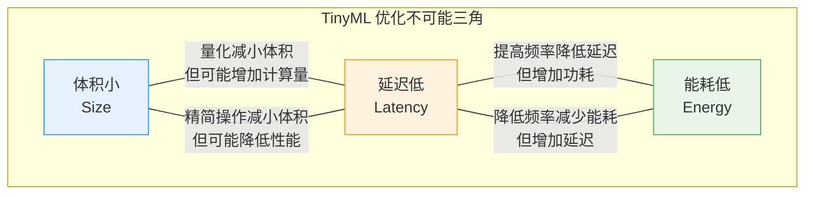
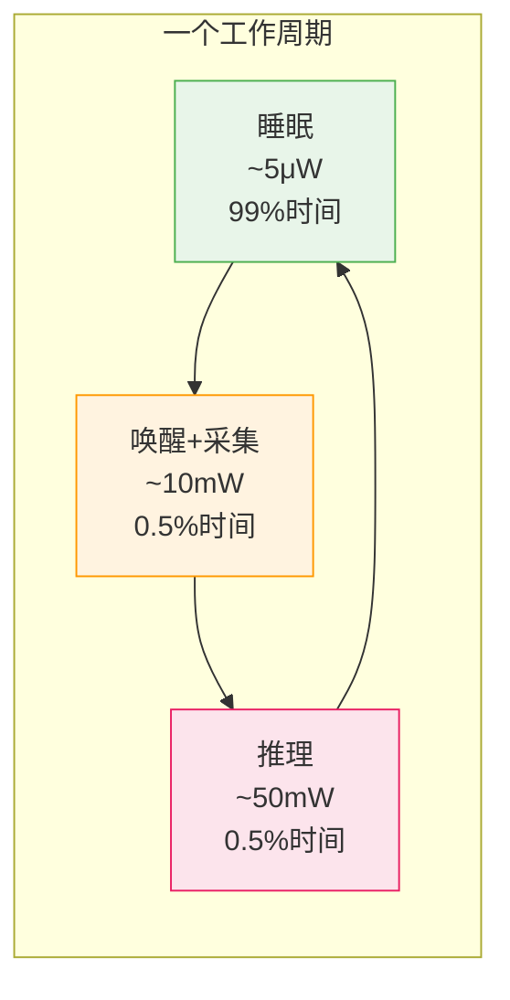

<!-- Post: 快、省、小：TinyML三大优化维度的权衡艺术——延迟、能耗与体积 | ID: 2026-009 | Created: 2026-09-01 | Tags: books, tech | Format: markdown -->

## 开篇：Demo 能跑，不代表产品能卖

你跟着教程把唤醒词示例烧录到 Arduino 上，对着板子说"yes"，LED 亮了。成功了！

然后你想把它做成产品——一个装在纽扣电池上、能听一年、响应时间不超过 100ms、整个固件不超过 256KB 的语音遥控器。

这时候你会发现：**Demo 能跑，和产品能卖，之间隔着三座大山。**

这三座大山就是 TinyML 的三大优化维度：

| 维度 | 英文 | 核心问题 | 直观感受 |
|------|------|---------|---------|
| **体积** | Size | 装得下吗？ | Flash/RAM 够不够 |
| **延迟** | Latency | 反应快吗？ | 说完话到亮灯要多久 |
| **能耗** | Energy | 撑得住吗？ | 电池能用多久 |

作者在第17章结尾说了一句很精辟的话：

> "When you have an application that's small enough, fast enough, and doesn't use too much energy, you've got a clear path to shipping your product."
>
> ——第17章 Optimizing Model and Binary Size，第435页

翻译：当你的应用足够小、足够快、能耗足够低时，你就有了一条清晰的产品发布之路。

这一篇，我们逐一拆解这三个维度——每个维度怎么测量、瓶颈在哪、怎么优化，以及最重要的：**三者之间怎么权衡**。

---

## 一、不可能三角：为什么不能全都要

在深入每个维度之前，先建立一个重要认知：**这三个维度往往互相冲突，不可能同时达到最优。**



**典型冲突**：
- 量化（减小体积）→ 可能需要额外的反量化计算 → 增加延迟
- 提高 CPU 频率（降低延迟）→ 功耗线性增加 → 能耗增加
- 减少推理次数（降低能耗）→ 响应变慢 → 延迟增加
- 使用更复杂的模型（提高精度）→ 体积更大、延迟更高、能耗更多

**所以优化不是"把每个维度都做到最好"，而是"根据产品场景，找到最合适的平衡点"。**

我们先逐个维度讲怎么优化，最后再讲怎么权衡。

---

## 二、维度一：体积（Size）——装得下吗？

体积是 TinyML 最直观的约束。微控制器的 Flash 可能只有 256KB，RAM 可能只有 32KB。你的程序、模型、数据都要塞进去。

体积分为两部分：**Flash（只读存储器，存程序和模型）**和 **RAM（随机存取存储器，存运行时数据）**。

### 2.1 Flash 优化：模型和代码

Flash 里主要放两样东西：**模型数据**和**程序代码**。

#### 模型大小优化

模型是 Flash 最大的消费者。一个未量化的浮点模型可能有几百KB，量化后可以缩小到原来的 1/4。

**方法1：量化（Quantization）**

这是我们在第5篇详细讲过的内容。INT8 量化把 32 位浮点数变成 8 位整数，模型体积直接缩小 75%。

> "Because a model might have millions of parameters, the 75% size reduction from 32-bit floats to 8-bit integers alone makes it worthwhile."
>
> ——第13章 TensorFlow Lite for Microcontrollers，第356页

**方法2：选择合适的模型架构**

不是所有模型都适合微控制器。作者建议从已有的、经过验证的小模型开始：

> "We highly recommend starting with an existing model architecture that's known to work well on the kinds of devices you're targeting."
>
> ——第17章，第427页

书中的四个项目就是很好的起点：
- Hello World：2层全连接，321个参数，不到 1KB
- 唤醒词：小型 CNN，约 18KB，40万次运算
- 人体检测：MobileNet-like，约 250KB，6000万次运算
- 魔法棒：3D-CNN，约 20KB

**方法3：剪枝（Pruning）和知识蒸馏（Distillation）**

更高级的技巧，在训练阶段移除不重要的连接或用小模型学习大模型的输出。书中没有详细展开，但提到这是未来的方向。

#### 程序代码大小优化

模型之外，程序代码也占 Flash。TFLM 框架本身可以小到 20KB，但如果你用了 `AllOpsResolver`（注册所有操作），体积会大很多。

**方法1：精简 OpResolver（只注册用到的操作）**

这是最重要的代码体积优化手段。

> "TensorFlow Lite supports over a hundred operations, but it's unlikely that you'll need all of them within a single model. The individual implementations of each operation might take up only a few kilobytes, but the total quickly adds up."
>
> ——第17章，第429页

做法：把 `AllOpsResolver` 换成 `MicroMutableOpResolver`，只 `AddBuiltin()` 你模型用到的操作。链接器会自动移除没被引用的代码（死代码消除）。

```cpp
// 不好：注册所有操作，体积大
static tflite::AllOpsResolver resolver;

// 好：只注册用到的3个操作，体积小
static tflite::MicroMutableOpResolver<3> resolver;
resolver.AddDepthwiseConv2D();
resolver.AddFullyConnected();
resolver.AddSoftmax();
```

**方法2：测量代码大小**

优化之前先要知道多大。作者强调要看 `.bin` 文件（实际烧录到 Flash 的二进制），而不是 `.elf` 文件（包含调试信息）：

> "The better file to look at is what's often known as the bin: the binary snapshot of the code that's actually uploaded to the flash storage of an embedded device."
>
> ——第17章，第428页

**方法3：调整框架常量**

TFLM 有一些硬编码的数组大小，可以根据你的应用调整：

> "One of these arrays is TFLITE_REGISTRATIONS_MAX, which controls how many different operations can be registered. The default is 128... requiring 4 KB of RAM."
>
> ——第17章，第434页

如果你的模型只用了 3 个操作，把 `TFLITE_REGISTRATIONS_MAX` 从 128 改成 8，可以省出几 KB RAM。

### 2.2 RAM 优化：运行时内存

RAM 比 Flash 更宝贵。很多微控制器只有 32KB 或 64KB RAM。

RAM 主要被三样东西占用：
1. **张量竞技场（Tensor Arena）**：输入、输出、中间张量
2. **应用变量**：传感器数据缓冲区、状态变量
3. **栈（Stack）**：函数调用、局部变量

**优化方法**：
- 精确计算张量竞技场大小（用 `arena_used_bytes()`），不要给太多余量
- 把大数组放在全局存储区，不要放在栈上（避免栈溢出）
- 减少传感器数据缓冲区大小（够用就行）
- 调整框架常量（如 `TFLITE_REGISTRATIONS_MAX`）

---

## 三、维度二：延迟（Latency）——反应快吗？

延迟是从**输入采集完成**到**输出结果可用**的时间。对于唤醒词，就是你说完"yes"到 LED 亮起的时间。

### 3.1 怎么测量延迟

**方法1：GPIO 翻转 + 逻辑分析仪**

最准确的方法。在推理开始时把一个 GPIO 引脚拉高，推理结束时拉低，用逻辑分析仪测量高电平持续时间。

**方法2：时间戳**

在推理前后读取系统定时器（如 Cortex-M 的 SysTick 或 DWT 周期计数器），计算差值。

```cpp
uint32_t start = DWT->CYCCNT;
interpreter.Invoke();
uint32_t end = DWT->CYCCNT;
uint32_t cycles = end - start;
float ms = cycles / (SystemCoreClock / 1000.0f);
```

**方法3：串口打印**

最简单但最不准确（串口本身有延迟）。适合粗略估算，不适合精确测量。

### 3.2 瓶颈在哪？

推理延迟主要由三个因素决定：

| 因素 | 说明 | 典型占比 |
|------|------|---------|
| **操作数量** | 模型有多少层、每层多少计算 | 60-80% |
| **内存访问** | 从 Flash 读权重、从 RAM 读写张量 | 10-30% |
| **操作实现效率** | 卷积等操作是否有优化的内核 | 10-20% |

书中给出了两个对比数据：

> "The small (18 KB) model using 400,000 arithmetic operations... a larger model... around 60 million arithmetic operations."
>
> ——第17章，第426页

- 唤醒词模型：18KB，40万次运算 → 在 Cortex-M4 上约 20-50ms
- 人体检测模型：250KB，6000万次运算 → 在 Cortex-M4 上可能需要几秒

**运算量差了 150 倍，延迟也差了 150 倍。** 模型架构是决定延迟的最主要因素。

### 3.3 怎么优化延迟

**操作符级优化**：
- 使用针对特定平台优化的操作符实现（如 CMSIS-NN for ARM Cortex-M）
- TFLM 的平台特化机制：同一操作在不同平台有不同实现，自动选择最优的

> "We've broken the library into small modules... if you want to write a specialized version of a module, you save your new version out as a C++ implementation file with the same name as the original but in a subfolder... named after the platform."
>
> ——第13章，第362页

**内存级优化**：
- 确保张量在内存中连续布局，利于缓存
- 减少 Flash 读取（权重如果能放 RAM 更好，但 RAM 有限）
- 使用 DMA 传输数据，减少 CPU 等待

**算法级优化**：
- 选择更轻量的模型架构（MobileNet 比 ResNet 快）
- 减少输入分辨率（96×96 比 224×224 快很多）
- 降低帧率（不需要每秒推理 30 次，10 次可能就够了）
- 级联设计：先用超轻量模型做粗筛，只有疑似目标才用大模型（我们在第4篇讲过）

---

## 四、维度三：能耗（Energy）——撑得住吗？

能耗是 TinyML 最关键的维度，因为很多应用是电池供电的。一个用 CR2032 纽扣电池的设备，目标可能是运行一年以上。

### 4.1 能耗的基本公式

```
能耗（焦耳）= 功耗（瓦特）× 时间（秒）
```

或者用电池容量的视角：

```
电池寿命（小时）= 电池容量（mAh）/ 平均电流（mA）
```

**关键洞察**：能耗不仅和功耗有关，还和时间有关。一个 100mW 的推理如果只跑 10ms，能耗是 1mJ。一个 10mW 的推理如果跑 1 秒，能耗是 10mJ。**后者功耗低 10 倍，但能耗高 10 倍。**

所以降低延迟（减少推理时间）本身也是在降低能耗。

### 4.2 占空比设计：唤醒-推理-睡眠

这是 TinyML 节能的核心策略。微控制器大部分时间处于深度睡眠模式（几 μW），只在需要推理时短暂唤醒（几十 mW），推理完立刻回去睡觉。



**平均功耗计算**：

假设每秒推理一次：
- 睡眠：990ms × 5μW = 4.95 μJ
- 唤醒+采集：5ms × 10mW = 50 μJ
- 推理：5ms × 50mW = 250 μJ
- **总能耗/周期**：约 305 μJ
- **平均功耗**：305 μJ / 1s = 305 μW ≈ 0.3mW

如果每 10 秒推理一次：
- 平均功耗降到约 35 μW ≈ 0.035mW

**这就是占空比的威力**：通过降低推理频率，平均功耗可以降低一个数量级以上。

### 4.3 CR2032 电池寿命实例

我们在第4篇算过这个账，这里再回顾一下：

| 参数 | 值 |
|------|-----|
| CR2032 容量 | 220mAh = 660mWh |
| 持续 1mW 功耗 | 660小时 ≈ 27.5天 |
| 占空比 50μW 平均功耗 | 13200小时 ≈ 1.5年 |
| 占空比 10μW 平均功耗 | 66000小时 ≈ 7.5年 |

**结论**：要让纽扣电池设备运行一年以上，平均功耗必须控制在 100μW 以下，最好在 50μW 以下。这只能通过占空比设计实现——持续运行的设备（即使只有 1mW）也撑不过一个月。

### 4.4 怎么优化能耗

**方法1：降低推理频率（占空比）**

最有效的方法。问问自己：真的需要每秒推理 20 次吗？每秒 1 次够不够？每 5 秒 1 次呢？

**方法2：降低推理时间（延迟优化）**

推理时间越短，高功耗状态持续越短。延迟优化本身就是能耗优化。

**方法3：使用低功耗模式**

- 深度睡眠（Deep Sleep）：只保留 RTC 唤醒，几 μW
- 睡眠（Sleep）：保留 RAM，几十 μW
- 停机（Stop）：更高延迟唤醒，更低功耗

不同 MCU 有不同的低功耗模式，需要查阅数据手册。

**方法4：降低时钟频率**

如果推理不紧急，可以降低 CPU 频率。功耗和频率大致成正比（在一定范围内）。但注意：降低频率会增加推理时间，总能耗可能不变甚至增加（因为静态功耗持续时间更长）。需要实际测量。

**方法5：关闭不用的外设**

ADC、SPI、I2C、UART 等外设不用时关闭，每个都可能消耗几十 μW。

---

## 五、三维权衡：不同场景的优先级

现在回到最重要的问题：**三个维度冲突时，优先保哪个？**

答案是：**看产品场景。**

| 应用场景 | 第一优先级 | 第二优先级 | 第三优先级 | 理由 |
|---------|-----------|-----------|-----------|------|
| **实时控制系统**<br/>(电机控制、无人机) | 延迟 | 能耗 | 体积 | 响应慢会失控，通常有线供电 |
| **电池供电传感器**<br/>(环境监测、智能家居) | 能耗 | 体积 | 延迟 | 电池寿命是核心卖点，数据不紧急 |
| **可穿戴设备**<br/>(手环、耳机) | 能耗 | 延迟 | 体积 | 电池小但需要实时响应 |
| **成本敏感产品**<br/>(玩具、一次性设备) | 体积 | 能耗 | 延迟 | 用最便宜的 MCU，Flash/RAM 极小 |
| **安防摄像头**<br/>(人体检测、异常识别) | 延迟 | 体积 | 能耗 | 通常有线供电，需要实时报警 |
| **语音唤醒词**<br/>(智能音箱遥控器) | 能耗 | 延迟 | 体积 | 始终监听，电池供电，响应要快 |

**以唤醒词为例**（书中的核心项目）：
- 能耗第一：始终监听，电池必须撑几个月
- 延迟第二：说完话 200ms 内要有响应，太慢体验差
- 体积第三：可以用稍大的 MCU（如 SparkFun Edge 有 1MB Flash）

所以唤醒词的优化策略是：
1. 用占空比设计把平均功耗压到 100μW 以下
2. 用 18KB 小模型把推理时间压到 50ms 以内
3. 用 INT8 量化把模型压到 18KB（已经够小了，不需要更激进）

---

## 六、书中实例数据对比

最后，用书中四个项目的实际数据，直观感受三个维度的差异：

| 项目 | 模型大小 | 运算量 | 推理延迟(估) | 平均功耗(估) | 适用场景 |
|------|---------|--------|-------------|-------------|---------|
| Hello World | <1KB | ~1000次 | <1ms | <1mW(持续) | 教学演示 |
| 唤醒词 | 18KB | 40万次 | 20-50ms | ~100μW(占空比) | 语音遥控器 |
| 魔法棒 | 20KB | ~50万次 | 30-60ms | ~200μW(占空比) | 手势控制 |
| 人体检测 | 250KB | 6000万次 | 1-3秒 | ~5mW(占空比低) | 安防摄像头 |

> 数据来源：第17章第426页给出的运算量数据；延迟和功耗为基于 Cortex-M4 @ 48MHz 的估算值，实际值取决于硬件和优化程度。

注意人体检测项目：模型大 14 倍，运算量大 150 倍，所以延迟高 30-60 倍。这就是为什么人体检测通常用在不需要实时响应的场景（如每秒检测一次是否有人），而唤醒词需要实时响应。

---

## 七、小结：优化是一门权衡的艺术

让我们用几句话总结这一篇：

1. **三大维度互相冲突**：体积、延迟、能耗构成"不可能三角"，不能同时最优。优化的核心是根据产品场景找到平衡点。

2. **体积优化**：模型用 INT8 量化（减 75%），代码用 MicroMutableOpResolver 只注册需要的操作，RAM 精确计算张量竞技场大小。先测量（.bin 文件），再优化。

3. **延迟优化**：瓶颈主要在模型运算量（40万次 vs 6000万次差 150 倍）。优化手段：选轻量模型架构、用平台优化的操作符实现、降低输入分辨率、降低推理频率。

4. **能耗优化**：核心是占空比设计——大部分时间深度睡眠（几 μW），短暂唤醒推理（几十 mW）。平均功耗 = 推理功耗 × 推理时间 × 推理频率。要让 CR2032 撑一年，平均功耗必须 < 100μW。

5. **延迟优化本身就是能耗优化**：推理时间越短，高功耗状态持续越短。所以降低延迟和降低能耗在这个维度上是一致的。

6. **不同场景优先级不同**：实时控制保延迟，电池传感器保能耗，成本敏感保体积。没有通用最优解，只有最适合你产品的解。

理解了这三个维度和它们的权衡，你就不会再盲目优化了——你会先问"我的产品场景是什么？哪个维度最关键？"，然后有针对性地优化。

下一篇，我们进入**主题6：调试方法论**——当模型在电脑上跑得好好的，烧录到板子上就出问题时，该怎么排查。作者把调试形容为"一场谋杀悬疑案，你既是侦探，又是受害者，还是凶手"。我们会学到一套系统化的调试方法，从精度损失到内存损坏，逐一击破。

---

**系列文章导航**：
- 第1篇：[TinyML 入门：为什么一毛钱的芯片也能跑人工智能？](./?id=2026-002)
- 第2篇：[一图读懂 TinyML 全书：4个项目、8大主题、475页的学习路径](./?id=2026-003)
- 第3篇：[TinyML 深度阅读指南：6个主题帮你从"跑通示例"到"理解原理"](./?id=2026-004)
- 第4篇：[TinyML的技术本质：为什么1mW是改变世界的魔法数字？](./?id=2026-005)
- 第5篇：[从训练到芯片：一张图看懂TinyML模型部署的7步流水线](./?id=2026-006)
- 第6篇：[4个项目，1套架构：拆解TinyML应用的Provider-Feature-Model-Responder四层模式](./?id=2026-007)
- 第7篇：[深入TFLM：张量竞技场、解释器模式与FlatBuffers——理解微控制器上的推理引擎](./?id=2026-008)
- 第8篇：本文（主题5：三大优化维度）
- 第9篇：主题6 — 调试方法论（即将发布）

*本文是《TinyML 洋葱阅读系列》第8篇，对应6个核心主题之5：三大优化维度。基于 Pete Warden & Daniel Situnayake《TinyML》（O'Reilly, 2019, ISBN 9781492052043）第13章、第17章内容创作，能耗部分参考第4篇的计算结果。*
