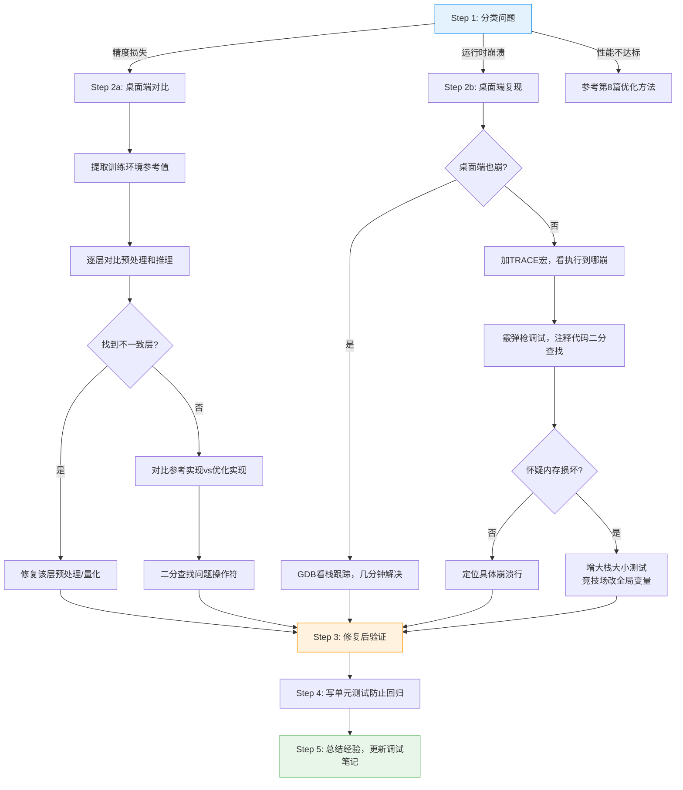

<!-- Post: 模型在电脑上好好的，烧到板子上就崩了？TinyML调试方法论全攻略 | ID: 2026-010 | Created: 2026-09-01 | Tags: books, tech | Format: markdown -->

## 开篇：一场谋杀悬疑案

作者在第18章开头用了一个绝妙的比喻来形容嵌入式调试：

> "Debugging can be a frustrating process (we've heard it described as a murder mystery where you're the detective, the victim, and the murderer)."
>
> ——第17章 Optimizing Model and Binary Size 结尾，第435页

翻译：调试是一个令人沮丧的过程（有人形容它是一场谋杀悬疑案，你既是侦探，又是受害者，还是凶手）。

太形象了。你写的代码出了问题（你是凶手），程序崩溃了（你是受害者），你还要自己找出原因（你是侦探）。

而 TinyML 的调试比普通嵌入式开发更难，因为你多了一个"黑箱"——神经网络。模型在电脑上跑得好好的，烧录到板子上就出问题，你根本不知道是预处理错了、量化错了、内存不够了、还是操作符实现有 bug。

这一篇，我们把作者在第18章分享的调试方法论系统化，帮你从"瞎试"变成"有章法地排查"。

---

## 一、先分类：三大类问题

调试的第一步不是动手，而是**判断问题属于哪一类**。不同类别的问题，排查方法完全不同。

| 问题类型 | 表现 | 典型原因 | 排查难度 |
|---------|------|---------|---------|
| **精度损失** | 程序能跑，但结果不对/不准 | 预处理差异、量化误差、后处理不一致 | ★★★☆☆ |
| **运行时崩溃** | 程序死机、重启、HardFault | 栈溢出、竞技场不足、内存损坏、空指针 | ★★★★☆ |
| **性能不达标** | 能跑、结果对，但太慢/太耗电 | 模型太大、操作符未优化、频率不对 | ★★☆☆☆ |

**关键原则：先判断类别，再选方法。** 不要一上来就乱改代码。

这一篇我们重点讲前两类（精度损失和运行时崩溃），性能问题在第8篇已经讲过了。

---

## 二、精度损失：程序能跑，但结果不对

这是最常见也最隐蔽的问题。程序不报错，能正常运行，但输出的结果就是不对——或者"差不多对但差那么一点"。

作者说：

> "Even worse, you can end up getting mostly correct results even if you get the resizing or value scaling a bit wrong, but you'll degrade the accuracy. This means that your application can appear to work upon a casual inspection, but end up with an overall experience that's less impressive than it should be."
>
> ——第18章 Debugging，第438页

翻译：更糟糕的是，即使缩放或值范围有点错，你也可能得到基本正确的结果，但精度会下降。这意味着你的应用在粗略检查时看起来能工作，但最终体验不如预期。

这种"差不多对"的问题最坑——你可能根本没意识到有问题，直到用户投诉"有时候识别不准"。

### 2.1 最常见原因：预处理差异

精度损失的**头号原因**是预处理不一致——训练时的预处理和部署时的预处理不一样。

**图像预处理的坑**：
- 缩放方法不同：训练用双线性插值（bilinear），部署用面积采样（area sampling）。作者举了一个真实案例：Inception 模型训练时用双线性缩小图像，开发者部署时觉得双线性会降低图像质量，改用了"更正确"的面积采样，结果 top-one 错误率反而上升了几个百分点——因为模型已经学会了识别双线性缩放产生的伪影！
- 值范围不同：训练时像素值缩放到 [-1, 1]，部署时用了 [0, 1]，或者忘了缩放直接用 [0, 255]
- 通道顺序不同：训练用 RGB，部署用 BGR

> "For a range of –1.0 to 1.0, you'd use --mean_values=128 --std_values=128."
>
> ——第18章，第438页

**音频预处理的坑**（比图像更复杂）：
- FFT 窗口大小、步长不同
- 梅尔滤波器组参数不同
- 归一化方式不同
- 预加重系数不同

唤醒词项目的预处理有十几个信号处理阶段，任何一个和训练时不一致都会导致精度下降。

### 2.2 第二原因：数值差异（量化误差）

训练用 32 位浮点数，部署用 8 位整数，数值肯定有差异。关键是判断**差异是否在可接受范围内**。

作者的建议：
1. **先判断是不是问题**：如果差异只有几个百分点，而且 top-one 分类结果不变，那可能根本不是问题。不要为了"完美数值一致"而浪费时间。
2. **建立有意义的指标**：不要用"输出向量的百分比差异"这种没意义的指标，要用 top-one 准确率（模型选对标签的频率）这种反映用户体验的指标。
3. **对比参考实现**：TFLM 每个操作都有参考实现（reference implementation），先用参考实现跑一遍，如果结果对，再换优化实现，用二分法找出哪个优化实现有问题。

> "TensorFlow Lite for Microcontrollers was designed to have reference implementations for all of its functionality, and one of the reasons we did this was so that it's possible to compare their results against optimized code to debug potential differences."
>
> ——第18章，第441页

### 2.3 调试预处理的系统方法

作者给出了一套非常实用的预处理调试方法：

**Step 1：在桌面端运行你的代码**

> "It's always best to have some version of your code that you can run on a desktop machine if at all possible, even if the peripherals are stubbed out."
>
> ——第18章，第439页

把硬件相关的部分用 dummy 实现替换，让整个应用能在 Linux/Mac/Windows 上编译运行。这样你就有了强大的调试工具（GDB、Valgrind、断点），而且迭代速度快（不用每次烧录）。

**Step 2：从训练环境提取参考值**

在训练代码中，用 `tf.print` 在预处理的每个阶段后打印张量内容。把这些值保存下来，转换成 C 数组，编译进你的程序。

**Step 3：逐层对比**

用参考值作为输入，跑你的预处理模块和推理模块，对比输出是否和训练环境一致。从第一层开始，哪一层对不上，问题就在哪一层。

**Step 4：变成单元测试**

不要用一次性的测试代码，把这些对比变成正式的单元测试。这样以后修改代码时，测试会自动验证预处理和推理的正确性。

---

## 三、运行时崩溃：程序死机、重启、HardFault

程序不运行了，也没有错误信息（嵌入式系统经常连 printf 都来不及输出就崩了）。这是最让人抓狂的情况。

### 3.1 方法一：桌面端复现

第一选择永远是在桌面端复现问题。

> "If at all possible try to keep your program portable to one of those platforms, even if you have to stub out some of the hardware-specific functionality with dummy implementations."
>
> ——第18章，第443页

如果桌面端也崩了，用 GDB 一看栈跟踪就知道在哪崩的，几分钟解决。如果桌面端不崩只有板子崩，那问题大概率和硬件相关（内存布局、外设、时序），需要用下面的方法。

### 3.2 方法二：日志追踪（Log Tracing）

在代码中插入日志，看程序执行到哪一步崩的。

作者推荐了一个极简的 TRACE 宏：

```cpp
#define TRACE DebugLog(__FILE__ ":" __LINE__)
```

用法：

```cpp
int main() {
  TRACE;           // 能看到这行，说明main开始执行了
  InitSomething();
  TRACE;           // 能看到这行，说明InitSomething没崩
  while (true) {
    TRACE;         // 能看到这行，说明循环开始了
    DoSomething();
    TRACE;         // 看不到这行，说明DoSomething崩了
  }
}
```

**排查策略**：先在最高层加 TRACE，确定大概在哪个函数崩的，然后在那个函数内部加更多 TRACE，逐步缩小范围，直到定位到具体哪一行。

> "It's usually best to start with the highest level of your code and then see where the logging stops. That will give you an idea of the rough area where the crash or hang is happening."
>
> ——第18章，第443页

### 3.3 方法三：霰弹枪调试（Shotgun Debugging）

如果日志追踪不够用（比如生产环境没有日志），或者问题是间歇性的，可以用"霰弹枪调试"——注释掉一部分代码，看问题是否消失。

```cpp
int main() {
  InitSomething();
  while (true) {
    // DoSomething();  // 先注释掉，看还崩不崩
  }
}
```

如果注释掉 `DoSomething()` 就不崩了，说明问题在这个函数里。然后在这个函数内部继续注释，用**二分法**逐步缩小范围。

这听起来很原始，但在嵌入式调试中非常有效——尤其是当你没有调试器、没有日志、什么都没有的时候。

---

## 四、内存损坏：最痛苦的错误

有一种错误比普通崩溃更痛苦：**内存损坏（Memory Corruption）**。

表现为：程序在 A 处写了某个值，在 B 处读出来却变了。崩溃的位置和真正的原因可能相隔很远，而且问题可能是间歇性的（取决于传感器输入或硬件时序），极难复现。

> "Even tracing or commenting out code can produce confusing results, because the overwriting can occur long before the code that uses the corrupted values runs, so crashes can be a long way from their cause."
>
> ——第18章，第444页

### 4.1 头号原因：栈溢出

作者明确说，根据他们的经验，内存损坏的**头号原因**是栈溢出（stack overrun）。

> "The number one cause of this in our experience is overrunning the program stack."
>
> ——第18章，第444页

为什么 TFLM 应用特别容易栈溢出？因为示例代码中张量竞技场（Tensor Arena）经常被定义为**局部数组**：

```cpp
// 危险：10KB的数组放在栈上！
void main() {
  const int tensor_arena_size = 10 * 1024;
  uint8_t tensor_arena[tensor_arena_size];  // 栈上分配10KB
  // ...
}
```

很多微控制器的默认栈大小只有 1-4KB。你在栈上放一个 10KB 的数组，直接就溢出了。溢出的栈会覆盖相邻的内存，导致各种诡异的行为。

**解决方案**：把张量竞技场定义为**全局变量**或**静态变量**，不要放在栈上。

```cpp
// 安全：全局数组，不占栈
constexpr int kTensorArenaSize = 10 * 1024;
uint8_t tensor_arena[kTensorArenaSize];

void main() {
  // 直接用全局的 tensor_arena
}
```

作者也建议：

> "If your arena is held elsewhere (maybe as a global variable), you should need only a few kilobytes of stack."
>
> ——第18章，第444页

如果竞技场放在全局，栈只需要几 KB 就够了。

### 4.2 如何定位内存损坏

如果你怀疑有内存损坏，作者建议：

1. **先增大栈大小**：如果神秘崩溃消失了，说明就是栈溢出。
2. **定位被覆盖的变量**：用日志或代码排除法，找出哪个变量的值被意外修改了。
3. **监控内存位置**：写一个特殊的 TRACE 宏，打印被怀疑的内存地址的值，看它什么时候被修改。
4. **用内存填充模式**：在初始化时把内存填充为已知模式（如 0xDEADBEEF），崩溃后检查哪里被覆盖了。

---

## 五、调试工具链总结

把上面的方法整理成一个工具清单：

| 工具/方法 | 适用问题 | 难度 | 效果 |
|----------|---------|------|------|
| **桌面端复现** | 所有问题 | ★★☆☆☆ | ★★★★★ |
| **TRACE 日志追踪** | 崩溃/挂起 | ★☆☆☆☆ | ★★★★☆ |
| **霰弹枪调试（注释代码）** | 崩溃/挂起/内存损坏 | ★☆☆☆☆ | ★★★☆☆ |
| **GDB + 调试器** | 崩溃/内存损坏 | ★★★☆☆ | ★★★★★ |
| **预处理参考值对比** | 精度损失 | ★★★☆☆ | ★★★★★ |
| **参考实现 vs 优化实现** | 精度损失（数值差异） | ★★★★☆ | ★★★★☆ |
| **top-one 准确率指标** | 精度损失评估 | ★★☆☆☆ | ★★★★☆ |
| **增大栈大小测试** | 内存损坏 | ★☆☆☆☆ | ★★★★☆ |
| **GPIO 翻转 + 逻辑分析仪** | 性能/时序 | ★★★☆☆ | ★★★★★ |
| **单元测试** | 所有问题（预防） | ★★★☆☆ | ★★★★★ |

---

## 六、系统化调试流程：5 步法

最后，把所有方法整合成一套系统化的调试流程。下次遇到问题时，按这个流程走：



**5 步法总结**：

1. **分类问题**：精度损失？崩溃？性能？先判断类别。
2. **针对性排查**：
   - 精度损失 → 桌面端对比参考值，逐层找不一致
   - 崩溃 → 桌面端复现，TRACE 追踪，霰弹枪调试，怀疑内存损坏就先试增大栈
3. **修复后验证**：确认问题解决，没有引入新问题。
4. **写单元测试**：把这次的问题变成自动化测试，防止以后回归。
5. **总结经验**：记录这次的问题和解决方法，建立自己的调试知识库。

---

## 七、小结：调试没有捷径，但有方法

让我们用几句话总结这一篇：

1. **调试是谋杀悬疑案**：你既是侦探，又是受害者，还是凶手。但有了系统的方法，你就能破案。

2. **先分类再动手**：精度损失、运行时崩溃、性能不达标——三类问题的排查方法完全不同。不要一上来就乱改代码。

3. **精度损失的头号原因是预处理差异**：训练时和部署时的预处理（缩放、值范围、FFT参数等）不一致。解决方法是在桌面端提取参考值，逐层对比。

4. **运行时崩溃的排查顺序**：桌面端复现 → TRACE 日志追踪 → 霰弹枪调试（注释代码二分查找）。

5. **内存损坏的头号原因是栈溢出**：不要把张量竞技场放在栈上（局部数组），要放在全局或静态存储区。遇到神秘崩溃先试试增大栈大小。

6. **量化数值差异不一定是问题**：用 top-one 准确率等有意义的指标判断，不要追求数值完全一致。

7. **调试没有捷径，但有方法**：按 5 步法系统化排查，比瞎试效率高 10 倍。

作者在第18章结尾说：

> "Unfortunately there aren't many shortcuts in debugging, but by methodically working through the problem using these approaches, we do have confidence that you can track down any embedded machine learning problems."
>
> ——第18章，第445页

翻译：不幸的是，调试没有太多捷径，但通过用这些方法有条不紊地排查问题，我们有信心你能找到任何嵌入式机器学习问题的原因。

至此，6 个核心主题全部讲完了。从技术本质到部署流水线，从项目架构到运行时内部，从优化到调试——你已经拥有了从"跑通示例"到"理解原理"的完整知识体系。

下一篇，我们进入**主题阅读（第四层）**：跳出这本书，把 TinyML 放到更广阔的边缘 AI 生态中去看——和其他框架（CMSIS-NN、microTVM、NNoM）对比，和云边协同架构对比，看看 TinyML 的优势、局限和未来方向。

---

**系列文章导航**：
- 第1篇：[TinyML 入门：为什么一毛钱的芯片也能跑人工智能？](./?id=2026-002)
- 第2篇：[一图读懂 TinyML 全书：4个项目、8大主题、475页的学习路径](./?id=2026-003)
- 第3篇：[TinyML 深度阅读指南：6个主题帮你从"跑通示例"到"理解原理"](./?id=2026-004)
- 第4篇：[TinyML的技术本质：为什么1mW是改变世界的魔法数字？](./?id=2026-005)
- 第5篇：[从训练到芯片：一张图看懂TinyML模型部署的7步流水线](./?id=2026-006)
- 第6篇：[4个项目，1套架构：拆解TinyML应用的Provider-Feature-Model-Responder四层模式](./?id=2026-007)
- 第7篇：[深入TFLM：张量竞技场、解释器模式与FlatBuffers——理解微控制器上的推理引擎](./?id=2026-008)
- 第8篇：[快、省、小：TinyML三大优化维度的权衡艺术——延迟、能耗与体积](./?id=2026-009)
- 第9篇：本文（主题6：调试方法论）
- 第10篇：主题阅读 — 边缘AI生态对比（即将发布）

*本文是《TinyML 洋葱阅读系列》第9篇，对应6个核心主题之6：调试方法论。基于 Pete Warden & Daniel Situnayake《TinyML》（O'Reilly, 2019, ISBN 9781492052043）第18章 Debugging 内容创作。*
