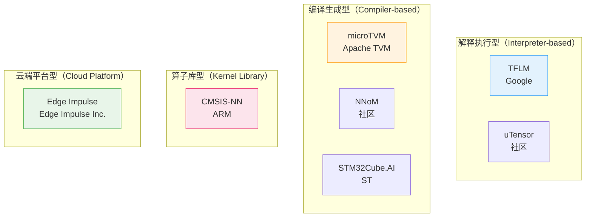

<!-- Post: TinyML在边缘AI生态中的位置：与CMSIS-NN、microTVM、NNoM、云边协同的横向对比 | ID: 2026-011 | Created: 2026-09-01 | Tags: books, tech | Format: markdown -->

## 开篇：只看一本书，你会以为全世界都这样

前九篇我们一直在《TinyML》这本书内部打转——从入门到全书地图，从6个核心主题到调试方法论。你可能已经形成了一个印象：**微控制器上跑机器学习，就是用 TensorFlow Lite for Microcontrollers（TFLM），对吧？**

但如果跳出这本书，看看整个边缘 AI 生态，你会发现：TFLM 只是众多选择中的一个。还有 CMSIS-NN、microTVM、NNoM、uTensor、Edge Impulse、STM32Cube.AI……每个框架都有自己的设计哲学、优势和局限。

这就是洋葱阅读法的**第四层：主题阅读**——把这本书和其他同类书、同类技术放在一起比较，看不同作者/不同团队怎么解决同一个问题，从而形成自己的判断。

> 洋葱阅读法第四层："把这本书和其他同类书放在一起比较，看不同作者怎么说同一个话题。"
>
> ——《洋葱阅读法》第四层：主题阅读

这一篇，我们把 TFLM 放到整个边缘 AI 生态中，横向对比 6 个主流框架，分析两种设计哲学，讨论端侧 vs 云端的架构选择，最后给出一个"怎么选框架"的决策指南。

---

## 一、边缘 AI 推理框架全景图

先建立整体认知。微控制器上的 AI 推理框架，可以按**设计哲学**分为两大类：



**四种类型的核心区别**：

| 类型 | 运行方式 | 换模型需要 | 典型代表 |
|------|---------|-----------|---------|
| **解释执行型** | 运行时读取模型数据，通用代码解释执行 | 只换模型数据数组，不用重编译框架 | TFLM、uTensor |
| **编译生成型** | 编译时把模型转成 C 代码，和固件一起编译 | 重新生成代码、重新编译 | microTVM、NNoM、STM32Cube.AI |
| **算子库型** | 只提供优化的算子函数，不负责图调度 | 自己写调用逻辑 | CMSIS-NN |
| **云端平台型** | 云端训练+转换，下载生成的代码 | 在云端重新生成 | Edge Impulse |

理解了这四种类型，你就理解了整个生态的基本格局。

---

## 二、六大框架深度对比

现在逐个看每个框架的特点、优势和局限。

### 2.1 TFLM（TensorFlow Lite for Microcontrollers）

**开发者**：Google（本书作者 Pete Warden 就是核心开发者）
**类型**：解释执行型
**模型格式**：FlatBuffers（.tflite）
**最小体积**：约 16KB（框架本身）
**支持硬件**：ARM Cortex-M、ESP32、RISC-V、SparkFun Edge 等

**优势**：
- 生态最成熟，社区最大，文档最完善
- 和 TensorFlow 训练端无缝衔接，转换工具链完整
- 解释执行模式，换模型不需要重新编译框架代码
- 不依赖 OS，不依赖标准库，可移植性极强
- 可以和 CMSIS-NN 结合使用（TFLM 负责图调度，CMSIS-NN 提供优化算子）

**局限**：
- 解释执行有一定开销，极致性能不如编译生成型
- 算子支持有限（不支持 LSTM、GRU 等循环神经网络）
- 调试工具相对原始

**适合场景**：大多数通用 TinyML 应用，尤其是需要快速原型验证、跨硬件平台移植的项目。

> 本书就是基于 TFLM 写的。前九篇讲的所有内容（张量竞技场、解释器、AllOpsResolver、FlatBuffers）都是 TFLM 的设计。

### 2.2 CMSIS-NN

**开发者**：ARM
**类型**：算子库型（不是完整推理引擎）
**模型格式**：无（自己写调用逻辑）
**最小体积**：取决于用到的算子
**支持硬件**：仅 ARM Cortex-M 系列

**优势**：
- ARM 官方手优化的算子内核，性能极致
- 使用 SIMD 指令（DSP 扩展）加速卷积、全连接等操作
- 循环展开、流水线优化、查表法替代昂贵数学运算
- 实测数据：4.6 倍吞吐量提升，4.9 倍能耗降低 ["https://scispace.com/pdf/tiny-machine-learning-for-resource-constrained-3w27tr0f.pdf"]

**局限**：
- **不是完整的推理引擎**，只提供算子函数，你需要自己写模型的调用逻辑
- 仅支持 ARM Cortex-M，不能移植到其他架构
- 没有模型转换工具，需要手动把权重转成 C 数组
- 学习曲线陡，需要理解模型的每一层怎么调用

**适合场景**：
- 对性能有极致要求的 ARM Cortex-M 项目
- 和 TFLM 结合使用（TFLM 负责图调度，CMSIS-NN 提供底层算子）
- 超小体积、超高性能的量产产品

> 关键认知：CMSIS-NN 和 TFLM 不是竞争关系，而是互补关系。很多项目同时用两者——TFLM 做上层调度，CMSIS-NN 做底层计算。

### 2.3 microTVM

**开发者**：Apache TVM 项目
**类型**：编译生成型
**模型格式**：编译为 C 代码
**支持硬件**：STM32、ESP32、RISC-V 等

**优势**：
- 编译器方法，自动进行操作符融合、内存规划、循环优化
- 支持自动调优（autotuning），针对特定硬件搜索最优实现
- 支持多种训练框架（TensorFlow、PyTorch、ONNX）
- 理论性能上限高，因为编译时可以做全局优化

**局限**：
- 学习曲线非常陡，TVM 本身就很复杂
- 编译时间长，调优过程可能需要几小时甚至几天
- 社区和文档不如 TFLM 成熟
- 调试困难，生成的代码可读性差

**适合场景**：
- 对性能有极致要求、有足够工程能力的团队
- 需要支持多种训练框架（不只是 TensorFlow）的项目
- 量产产品，值得花时间做编译优化

### 2.4 NNoM

**开发者**：社区开源
**类型**：编译生成型（轻量级）
**模型格式**：C 代码生成
**支持硬件**：多种 MCU（STM32、ESP32 等）

**优势**：
- 极其轻量，Flash 占用小
- 推理速度快（有测试显示在某些模型上比 TFLM 快 3-7 倍） ["https://blog.csdn.net/gitblog_00321/article/details/160272701"]
- API 简洁，类似 Keras 的层式接口
- 中文文档和社区活跃（作者是中国人）

**局限**：
- 社区规模不如 TFLM
- 算子支持相对有限
- 模型转换工具链不如 TFLM 成熟

**适合场景**：
- 资源极度受限的 MCU（小 Flash、小 RAM）
- 对推理速度要求高的项目
- 个人开发者和小型团队

### 2.5 uTensor

**开发者**：社区开源（最初由 ARM 赞助）
**类型**：解释执行型（极小核心）
**模型格式**：代码生成 + 极小运行时
**最小体积**：核心运行时约 2KB ["https://www.dfrobot.com/blog-13921.html"]
**支持硬件**：ARM Cortex-M（Mbed 平台为主）

**优势**：
- 核心运行时极小（约 2KB），适合超小 Flash 的 MCU
- 解耦架构，模块化扩展
- 避免共享堆，强调系统安全
- Python SDK，代码生成方法

**局限**：
- 社区活跃度不如 TFLM
- 主要面向 Mbed 平台，跨平台支持有限
- 文档和示例相对少

**适合场景**：
- Flash 极其有限（< 32KB）的 MCU
- 对系统安全性要求高的项目
- Mbed 生态用户

### 2.6 Edge Impulse

**开发者**：Edge Impulse Inc.（商业公司）
**类型**：云端平台型
**模型格式**：云端生成，下载 C++ 库
**支持硬件**：Nordic nRF、STM32、ESP32、Arduino 等广泛支持

**优势**：
- 无代码/低代码，Web 界面操作，上手极快
- 完整工具链：数据采集→标注→训练→转换→部署，一站式
- 内置数据采集工具（手机、开发板直接上传数据）
- AutoML 自动模型选择和优化
- 免费层适合个人开发者和原型验证

**局限**：
- 云端依赖，数据需要上传到 Edge Impulse 服务器（隐私问题）
- 供应商锁定，迁移成本高
- 免费层有项目数量和计算时间限制
- 底层可控性差，出问题难以深入调试

**适合场景**：
- 快速原型验证（几天内出 Demo）
- 非算法工程师（嵌入式工程师想快速加 AI 功能）
- 教育和学习场景
- 对数据隐私不敏感的项目

---

## 三、六大框架横向对比总表

把上面的分析整理成一张总表，方便对比：

| 维度 | TFLM | CMSIS-NN | microTVM | NNoM | uTensor | Edge Impulse |
|------|------|----------|----------|------|---------|--------------|
| **开发者** | Google | ARM | Apache | 社区 | 社区 | 商业公司 |
| **类型** | 解释执行 | 算子库 | 编译生成 | 编译生成 | 解释执行 | 云端平台 |
| **最小体积** | ~16KB | 取决于算子 | 取决于模型 | 极小 | ~2KB核心 | 取决于模型 |
| **硬件支持** | 广泛 | 仅ARM Cortex-M | 较广泛 | 较广泛 | Mbed为主 | 最广泛 |
| **性能** | 中等 | 极高 | 高（调优后） | 高 | 中等 | 中等 |
| **易用性** | 高 | 低 | 低 | 中高 | 中 | 极高 |
| **生态成熟度** | 最高 | 高（ARM生态） | 中 | 中 | 低 | 高（商业支持） |
| **换模型成本** | 低（只换数据） | 高（重写调用） | 中（重新编译） | 中（重新生成） | 中 | 低（云端重生成） |
| **隐私可控性** | 高（全本地） | 高（全本地） | 高（全本地） | 高（全本地） | 高（全本地） | 低（数据上传云端） |
| **适合人群** | 大多数开发者 | 性能极客 | 高级团队 | 个人/小团队 | Mbed用户 | 非算法工程师 |

---

## 四、两种设计哲学的深层对比：解释执行 vs 编译生成

框架选型的核心，其实是两种设计哲学的选择。我们在第7篇讲 TFLM 时提到过，这里展开对比。

| 维度 | 解释执行型（TFLM） | 编译生成型（microTVM/NNoM） |
|------|-------------------|---------------------------|
| **原理** | 运行时读取模型数据结构，通用代码逐层执行 | 编译时把模型转成特定 C 代码，和固件一起编译 |
| **类比** | Python 解释器 | C 编译器 |
| **换模型** | 只换模型数据数组，框架代码不变 | 重新生成代码、重新编译整个固件 |
| **多模型** | 容易，同一解释器跑不同模型 | 困难，每个模型生成一套代码 |
| **性能** | 有解释开销，中等 | 编译时可做全局优化，性能上限高 |
| **体积** | 框架代码固定（~16KB），模型数据单独 | 每个模型的代码+数据，小模型可能更小 |
| **调试** | 相对容易，模型数据可检查 | 困难，生成代码可读性差 |
| **升级框架** | 容易，只换框架代码 | 困难，需要重新生成所有模型代码 |

**怎么选？**
- 如果你需要**灵活换模型、支持多模型、快速迭代** → 解释执行型（TFLM）
- 如果你需要**极致性能、固定模型、量产优化** → 编译生成型（microTVM/NNoM）
- 如果你用 **ARM Cortex-M 且性能要求极高** → CMSIS-NN（可以和 TFLM 结合）

---

## 五、端侧 vs 云端 vs 云边协同：架构选择

框架选型之外，还有一个更宏观的问题：**AI 推理应该放在哪里？**

### 5.1 三种架构

| 架构 | 推理位置 | 优势 | 局限 | 典型场景 |
|------|---------|------|------|---------|
| **纯云端** | 服务器 | 模型大、精度高、更新容易 | 延迟高、需网络、隐私差、功耗高（通信） | 复杂图像识别、大语言模型 |
| **纯端侧（TinyML）** | 微控制器 | 延迟极低、隐私好、功耗低、离线可用 | 模型小、精度有限、更新难 | 唤醒词、异常检测、简单分类 |
| **云边协同（级联）** | 端侧粗筛+云端精判 | 兼顾隐私/功耗/精度 | 架构复杂 | 智能摄像头、语音助手 |

### 5.2 云边协同：TinyML 最有价值的架构

我们在第4篇讲过级联设计（cascading），这里从架构角度再看一次。

**典型流程**：
1. 端侧 TinyML 模型持续运行（低功耗、小模型），做粗筛
2. 检测到疑似目标时，唤醒系统、采集更多数据
3. 把疑似数据发送到云端（或更大的边缘处理器）
4. 云端用大模型做精确判断
5. 返回结果，端侧执行响应

**例子**：智能门铃
- 端侧：人体检测模型（250KB，每秒1帧），检测到有人时才启动摄像头
- 云端：人脸识别模型（几百MB），识别这个人是谁
- 结果：99%的时间端侧低功耗运行，只有 1%的时间需要云端处理

> 这就是 TinyML 最有价值的定位：**不是替代云端 AI，而是作为云端 AI 的"前哨"**——在端侧做低功耗的粗筛，只把有价值的数据送到云端，从而降低整体功耗、保护隐私、减少网络带宽。

---

## 六、TinyML 的优势、局限和未来趋势

### 6.1 TinyML 的核心优势

1. **极低功耗**：mW 甚至 μW 级，可以用纽扣电池运行数月到数年
2. **极低延迟**：本地推理，毫秒级响应，不需要网络往返
3. **隐私保护**：数据不出设备，不需要上传到云端
4. **离线可用**：没有网络也能工作，适合偏远地区和工业场景
5. **成本极低**：微控制器几毛钱到几块钱，可以大规模部署

### 6.2 TinyML 的局限

1. **模型能力有限**：只能跑小模型（KB 级），复杂任务做不了
2. **精度不如大模型**：受限于模型大小和量化，精度通常低于云端大模型
3. **更新困难**：模型编译进固件，更新需要重新烧录
4. **调试工具原始**：嵌入式环境调试比桌面端困难得多
5. **人才稀缺**：既懂机器学习又懂嵌入式的工程师很少

### 6.3 未来趋势

| 趋势 | 说明 |
|------|------|
| **NPU 普及** | 微控制器集成神经网络加速器（如 ARM Ethos-U），推理性能提升 10-100 倍 |
| **模型压缩新方法** | 结构化剪枝、知识蒸馏、神经网络架构搜索（NAS），让更小的模型有更高精度 |
| **AutoML for TinyML** | 自动搜索适合微控制器的模型架构和超参数，降低使用门槛 |
| **联邦学习** | 在端侧微调模型，不需要上传原始数据，兼顾隐私和个性化 |
| **标准化** | TinyML 基金会推动标准制定，框架间互操作性增强 |
| **工具链成熟** | 从训练到部署的全流程工具链越来越完善，降低开发门槛 |

---

## 七、怎么选框架：决策指南

最后，给一个实用的框架选择决策树：

```mermaid
graph TD
    A[开始：你的项目需要什么？] --> B{需要快速原型/Demo?}
    B -->|是| C[Edge Impulse<br/>几天内出Demo]
    B -->|否| D{用ARM Cortex-M?}

    D -->|是| E{性能要求极致?}
    D -->|否（ESP32/RISC-V等）| F[TFLM<br/>跨平台支持最好]

    E -->|是| G{团队有编译器经验?}
    E -->|否| H[TFLM + CMSIS-NN<br/>图调度+优化算子]

    G -->|是| I[microTVM<br/>编译优化极致性能]
    G -->|否| H

    H --> J{Flash极度受限(<32KB)?}
    J -->|是| K[NNoM 或 uTensor<br/>超轻量框架]
    J -->|否| L[TFLM<br/>生态最成熟]

    style C fill:#e8f5e9,stroke:#4caf50
    style F fill:#e3f2fd,stroke:#2196f3
    style H fill:#fff3e0,stroke:#ff9800
    style I fill:#fce4ec,stroke:#e91e63
    style K fill:#f3e5f5,stroke:#9c27b0
    style L fill:#e3f2fd,stroke:#2196f3
```

**简化版决策口诀**：

1. **快速出 Demo** → Edge Impulse
2. **跨硬件平台** → TFLM
3. **ARM + 要性能** → TFLM + CMSIS-NN
4. **ARM + 极致性能 + 有经验** → microTVM
5. **Flash 极小** → NNoM 或 uTensor
6. **大多数通用场景** → TFLM（生态最成熟，踩坑最少）

---

## 八、小结：TinyML 是生态的一员，不是全部

让我们用几句话总结这一篇：

1. **TFLM 不是唯一选择**：边缘 AI 生态有六大主流框架——TFLM、CMSIS-NN、microTVM、NNoM、uTensor、Edge Impulse，各有优势和局限。

2. **四种设计哲学**：解释执行型（灵活）、编译生成型（高性能）、算子库型（极致性能）、云端平台型（易用）。选择框架本质是选择设计哲学。

3. **CMSIS-NN 和 TFLM 是互补不是竞争**：很多项目同时用两者——TFLM 做上层图调度，CMSIS-NN 做底层算子优化。

4. **TinyML 最有价值的定位是云边协同的"前哨"**：不是替代云端 AI，而是在端侧做低功耗粗筛，只把有价值的数据送到云端，兼顾隐私、功耗和精度。

5. **大多数通用场景选 TFLM**：生态最成熟、文档最完善、社区最大、踩坑最少。除非有特殊需求（极致性能、超小 Flash、快速原型），否则 TFLM 是最稳妥的选择。

6. **未来趋势**：NPU 普及、模型压缩、AutoML、联邦学习——TinyML 的能力边界在不断扩大。

完成了主题阅读，你对 TinyML 的理解就从"一本书的内容"升级到了"整个生态的位置"。你知道了 TFLM 的优势和局限，知道了什么时候该用其他框架，知道了 TinyML 在更大的 AI 架构中扮演什么角色。

下一篇，也是本系列的最后一篇，我们进入洋葱阅读法的**第五层：研究式阅读**——像科学家一样，自己提出问题，从书里找答案，甚至自己做实验验证。我们会讨论：这本书有哪些观点值得质疑？有哪些内容已经过时？怎么把书中的知识转化为自己的项目和行动？

---

**系列文章导航**：
- 第1篇：[TinyML 入门：为什么一毛钱的芯片也能跑人工智能？](./?id=2026-002)
- 第2篇：[一图读懂 TinyML 全书：4个项目、8大主题、475页的学习路径](./?id=2026-003)
- 第3篇：[TinyML 深度阅读指南：6个主题帮你从"跑通示例"到"理解原理"](./?id=2026-004)
- 第4篇：[TinyML的技术本质：为什么1mW是改变世界的魔法数字？](./?id=2026-005)
- 第5篇：[从训练到芯片：一张图看懂TinyML模型部署的7步流水线](./?id=2026-006)
- 第6篇：[4个项目，1套架构：拆解TinyML应用的Provider-Feature-Model-Responder四层模式](./?id=2026-007)
- 第7篇：[深入TFLM：张量竞技场、解释器模式与FlatBuffers——理解微控制器上的推理引擎](./?id=2026-008)
- 第8篇：[快、省、小：TinyML三大优化维度的权衡艺术——延迟、能耗与体积](./?id=2026-009)
- 第9篇：[模型在电脑上好好的，烧到板子上就崩了？TinyML调试方法论全攻略](./?id=2026-010)
- 第10篇：本文（主题阅读：边缘AI生态对比）
- 第11篇：研究式阅读 — 独立思考与行动指南（即将发布）

*本文是《TinyML 洋葱阅读系列》第10篇，对应洋葱阅读法第四层：主题阅读。基于 Pete Warden & Daniel Situnayake《TinyML》（O'Reilly, 2019, ISBN 9781492052043）的整体视角，结合边缘AI生态的公开资料进行横向对比。框架信息参考自各框架官方文档及行业综述文章。*
