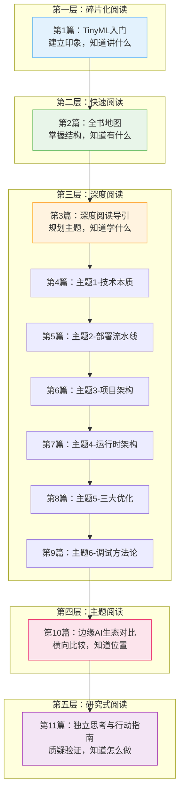

<!-- Post: 读完这本书之后：TinyML的独立思考、质疑与行动指南 | ID: 2026-012 | Created: 2026-09-01 | Tags: books, tech | Format: markdown -->

## 开篇：读书的最高境界，是和作者辩论

前九篇我们在学习这本书的内容，第十篇我们把这本书放到生态中对比。这最后一篇，我们要做一件更难的事：**质疑这本书。**

这就是洋葱阅读法的**第五层：研究式阅读**——

> "像科学家做研究一样，自己提出问题，然后从书里找答案，甚至自己做实验验证。"
>
> ——《洋葱阅读法》第五层：研究式阅读

研究式阅读的核心不是"作者说了什么"，而是：
- 作者说的对吗？
- 有没有反例？
- 这本书出版后，世界发生了什么变化？
- 哪些观点已经过时？
- 我自己的判断是什么？

这本书出版于 2019 年 12 月。到现在已经过去快 6 年了。6 年在科技领域是什么概念？iPhone 从 11 代到了 16 代，AI 从"深度学习"到了"大模型"，TinyML 从一个新兴概念变成了一个有基金会、有行业基准、有商业收购的成熟领域。

这一篇，我们用研究式阅读的方法，重新审视这本书——哪些观点依然成立，哪些已经过时，哪些值得质疑，以及最重要的：**读完这本书之后，你该怎么做。**

---

## 一、这本书的时代局限：6 年发生了什么？

2019 年这本书出版时，TinyML 还是一个非常新的领域。作者在书中描述的很多"现状"，在今天已经发生了巨大变化。

### 1.1 硬件：从"只有 CPU"到"NPU 普及"

2019 年，微控制器上跑机器学习基本靠 CPU 软件计算。书里讲的所有优化（量化、CMSIS-NN）都是在 CPU 上做文章。

但 2020 年 2 月，ARM 发布了 **Cortex-M55**——第一个集成 **Helium 向量处理技术**的 Cortex-M 处理器，相当于给 MCU 加了 DSP 指令集。紧接着，ARM 发布了 **Ethos-U 系列 NPU**（神经网络处理器），可以和 Cortex-M 配合，提供硬件级的神经网络加速。

今天，专用 NPU 已经不罕见了：
- **Syntiant NDP120**：专用神经决策处理器，推理功耗极低
- **AlifSemi E3**：集成 NPU 的融合 MCU
- **GreenWaves GAP9**：多核 RISC-V + 硬件加速器
- 研究中的异构架构：多核 CPU + ITA（智能张量加速器），吞吐量可达 154 GOp/s，能效 2960 GOp/J ["https://arxiv.org/html/2408.02473v1"]

**这意味着什么？** 书里讲的"CPU 上优化卷积"在 NPU 时代可能不再是瓶颈。NPU 可以在一个周期内完成大量乘加运算，推理速度提升 10-100 倍，功耗反而更低。书里的很多优化技巧（如张量竞技场的内存规划）在有 NPU 的系统中需要重新考虑——NPU 有自己的内存系统和数据通路。

### 1.2 基准：从"各说各话"到"MLPerf Tiny 行业标准"

2019 年，没有统一的 TinyML 性能基准。每个论文、每个厂商都用自己的测试方法，结果无法对比。

2021 年 6 月，**MLPerf Tiny** 发布了第一版基准测试（v0.5），建立了四个标准任务：
- 视觉唤醒词（Visual Wake Words）
- 关键词识别（Keyword Spotting）
- 异常检测（Anomaly Detection）
- 图像分类（Image Classification）

到 2023 年 v1.1 版本时，MLCommons 宣布：**软硬件性能提升相比初始参考基准达到了 1000 倍** ["https://mlcommons.org/2023/06/mlperf-results-show-rapid-ai-performance-gains/"]。商业推理引擎（如 Plumerai）多次在基准测试中领先 ["https://www.edge-ai-vision.com/2023/06/plumerai-wins-mlperf-tiny-1-1-ai-benchmark-for-microcontrollers-again/"]。

**这意味着什么？** 书里给出的性能数据（如"唤醒词模型 40 万次运算"）在今天看来只是起点。有了统一基准，你可以准确地知道不同框架、不同硬件的真实性能，而不是靠厂商的宣传。

### 1.3 学术：从"13 篇论文"到"爆发式增长"

2019 年，全球只有 **13 篇** TinyML 相关学术论文发表。2020 年暴增到 **88 篇**（7 倍增长），之后持续增长 ["https://dl.acm.org/doi/pdf/10.1145/3661820"]。

MIT HAN Lab 等顶级研究组持续投入，在模型压缩（剪枝、蒸馏、NAS）和系统设计方面不断创新 ["https://hanlab.mit.edu/topics/tinyml"]。ICCAD 从 2022 年开始举办 TinyML 设计竞赛 ["https://www.researchgate.net/publication/385451701_Tiny_Machine_Learning_Progress_and_Futures_Feature"]。

新的研究方向不断涌现：
- **联邦学习**：TinyMetaFed 在 Arduino 上实现，训练时间减少 60%，通信成本减少 70%，能耗减少 50% ["https://arxiv.org/pdf/2307.06822v1.pdf"]
- **在线学习**：SeLoC-ML 自动生成代码，代码量减少 91.5% ["https://portal.acm.org/doi/10.1145/3665278"]
- **注意力机制的 TinyML**：Transformer 模型轻量化部署到 MCU
- **RISC-V 向量扩展**：muRISCV-NN 比 TFLM 参考内核快 1.8-2.8 倍 ["https://dl.acm.org/doi/pdf/10.1145/3637543.3652878"]

### 1.4 产业：从"概念"到"商业收购"

2019 年，TinyML 还是一个学术和爱好者社区的概念。今天：
- **TinyML 基金会**成立，每年举办 TinyML Summit 和 Research Symposium
- 2025 年 3 月，**高通宣布收购 Edge Impulse**——TinyML 领域最大的商业平台之一 ["https://www.eeworld.com.cn/qrs/eic698311.html"]
- 更多商业推理引擎出现（Plumerai、Syntiant 等）
- 主流 MCU 厂商（ST、NXP、Infineon、Renesas）都推出了 AI 加速硬件和工具链

---

## 二、值得质疑的观点

了解了时代变化，我们来具体质疑书中的几个核心观点。注意：**质疑不是否定，而是思考"在什么条件下成立，在什么条件下不成立"。**

### 2.1 质疑一："1mW 是 TinyML 的魔法阈值"

我们在第4篇详细讲了 1mW 阈值——低于 1mW 可以用纽扣电池运行，高于 1mW 就需要更大的电池或有线供电。

**这个观点对吗？** 基本对，但有几个需要补充的地方：

1. **1mW 是平均功耗，不是峰值功耗**。推理时峰值功耗可能是 50mW，但如果 99% 的时间在睡眠（5μW），平均功耗可以低于 1mW。书里讲了占空比，但没有强调"平均 vs 峰值"的区别。

2. **NPU 改变了能耗方程**。专用 NPU 的能效（GOp/J）比 CPU 高 10-100 倍。同样的推理任务，用 NPU 可能只需要 CPU 1/10 的能耗。这意味着以前"太大不能跑"的模型，现在用 NPU 也能在 1mW 以下运行。

3. **1mW 不是绝对红线**。有些应用（如智能门锁，每天只触发几次）可以容忍更高的平均功耗。关键是根据电池容量和目标寿命计算实际需求，而不是盲目追求 1mW。

**结论**：1mW 阈值是一个有用的经验法则，但不是物理定律。在 NPU 时代，能效提升可能让这个阈值变得不那么重要。

### 2.2 质疑二："INT8 量化是必选项"

书里反复强调 INT8 量化的重要性——体积减 75%，速度更快，功耗更低。

**这个观点对吗？** 在 2019 年的 CPU 时代，基本对。但今天需要补充：

1. **有些硬件原生支持 FP16**。Cortex-M55 + Helium、某些 NPU 原生支持 FP16 运算，性能和 INT8 差不多，但精度损失更小。如果你的硬件支持 FP16，不一定非要量化到 INT8。

2. **量化有精度成本**。书里承认量化会损失精度，但没有强调"有些模型量化后精度下降严重"。对于小数据集或精细分类任务，INT8 量化可能导致不可接受的精度损失。这时候需要 QAT（量化感知训练）或更高位宽（INT16/FP16）。

3. **NPU 可能只支持特定量化格式**。有些 NPU 只支持 INT8，有些支持 INT8+INT16，有些支持 FP16。选择量化格式时需要考虑目标硬件的支持情况，而不是一律 INT8。

**结论**：INT8 量化是默认选项，但不是唯一选项。根据硬件支持和精度需求选择合适的量化格式。

### 2.3 质疑三："解释执行是最优选择"

书里用 TFLM 的解释执行模式，我们在第7篇详细讲了张量竞技场、解释器等设计。

**这个观点对吗？** 解释执行有很多优势（换模型灵活、多模型支持），但不是所有场景都最优：

1. **极致性能场景，编译生成更快**。MLPerf Tiny 基准显示，经过编译优化的推理引擎（如 Plumerai、microTVM）在相同硬件上可以比 TFLM 快 2-5 倍。如果你的产品对延迟有极致要求，解释执行可能不是最优选择。

2. **NPU 通常需要编译生成**。大多数 NPU 不支持"运行时解释模型"——它们需要在编译时把模型转换成特定的指令流或权重布局。这意味着用 NPU 时，你大概率需要编译生成型的工具链，而不是解释执行。

3. **量产产品，模型固定**。如果你的产品模型在出厂后不会改变（大多数量产产品都是这样），解释执行的"换模型灵活"优势就不存在了。这时候编译生成的性能优势更有价值。

**结论**：解释执行适合原型开发和需要灵活换模型的场景。量产产品、极致性能需求、NPU 硬件，可能更适合编译生成型框架。

### 2.4 质疑四："从训练到部署的 7 步流水线"

我们在第5篇讲了 7 步流水线：定义目标→采集数据→设计模型→训练→量化→转换→部署。

**这个流程对吗？** 对，但它描述的是"一次性部署"。真实产品往往需要：

1. **数据飞轮**。产品部署后，用户产生新数据，这些数据可以用来改进模型。书里没有讲"部署后的数据收集和模型迭代"。

2. **OTA 更新**。产品出货后，如何远程更新模型？书里假设模型编译进固件，更新需要重新烧录。但真实产品可能需要 OTA（空中下载）更新模型。

3. **A/B 测试**。多个模型版本同时运行，对比效果，选择最优。书里没有讲。

4. **联邦学习**。不收集原始数据，只上传模型梯度，在保护隐私的同时改进模型。这是 2019 年后的重要研究方向。

**结论**：7 步流水线适合"第一次部署"。真实产品需要考虑部署后的迭代、更新和持续改进。

---

## 三、书中没有讲的东西

除了需要质疑的观点，还有一些重要话题书里完全没有涉及。这些不是作者的疏忽——2019 年这些话题要么还不存在，要么还不成熟。但今天它们已经很重要了。

### 3.1 安全与隐私

- **模型窃取**：攻击者可以通过侧信道分析或查询接口窃取你的模型权重
- **对抗样本**：精心构造的输入可以让模型误分类（如在停止标志上贴几个贴纸就让模型认不出）
- **数据隐私**：即使数据不离开设备，模型推理本身也可能泄露信息
- **安全启动**：防止恶意固件替换你的模型

书里讲了"本地计算保护隐私"，但没有讲"本地计算本身也有安全风险"。

### 3.2 可解释性

TinyML 模型通常是黑箱——你知道输入和输出，但不知道"为什么"。在某些场景（医疗、工业控制），可解释性是必须的。书里完全没有涉及这个话题。

### 3.3 多模型协同

真实产品可能需要多个模型协同工作——比如一个模型做语音唤醒，另一个做命令识别，第三个做说话人验证。书里只讲了单模型部署。

### 3.4 异构计算

CPU + NPU + DSP 协同工作，不同层放在不同的计算单元上。书里假设所有计算都在 CPU 上完成。

### 3.5 端侧学习 / 联邦学习

模型部署后能不能在端侧继续学习？能不能不上传原始数据就改进模型？这是 2019 年后的热门研究方向，书里完全没有涉及。

---

## 四、如何设计自己的 TinyML 项目：从想法到产品

质疑完了，我们回到行动。读完这本书，如果你想做一个自己的 TinyML 项目，该怎么开始？

这里给一个从想法到产品的完整路线图：

### Step 1：问题定义（1-2 周）

- 这个问题真的需要 AI 吗？能不能用简单的规则/阈值解决？
- 输入是什么？输出是什么？
- 延迟要求？功耗要求？成本要求？
- 有没有现成的数据集？还是需要自己采集？

**关键原则**：如果简单规则能解决，就不要用 AI。AI 是最后的手段，不是第一选择。

### Step 2：硬件选型（1 周）

根据 Step 1 的需求选择硬件：
- 算力需求 → CPU 还是 NPU？
- 内存需求 → Flash/RAM 多大？
- 功耗需求 → 需不需要低功耗模式？
- 接口需求 → 需要哪些传感器和执行器？
- 成本预算 → 单价多少？

**建议**：原型阶段用开发板（Arduino、SparkFun Edge、STM32 Discovery），量产阶段再定制硬件。

### Step 3：数据采集与标注（2-4 周）

- 采集真实场景的数据（不要只用公开数据集，真实环境分布不同）
- 标注工具：Label Studio、CVAT（图像）、Audacity（音频）
- 数据增强：旋转、翻转、加噪声、时间偏移
- 划分训练集/验证集/测试集（70/15/15）

**关键原则**：垃圾进，垃圾出。数据质量比模型架构更重要。

### Step 4：模型训练与验证（2-4 周）

- 从简单模型开始（全连接、小 CNN），不要一上来就用复杂架构
- 用训练框架（TensorFlow/Keras、PyTorch）在桌面端训练
- 验证集调参，测试集最终评估
- 考虑量化感知训练（QAT），减少部署时的精度损失

### Step 5：部署与优化（2-4 周）

- 转换模型（TFLite Converter → INT8 量化）
- 部署到硬件（TFLM 或其他框架）
- 测量真实性能（延迟、功耗、内存）
- 优化（如果不达标：换模型架构、换硬件、用 NPU、编译优化）
- 端到端测试（真实场景下的准确率，不只是测试集准确率）

### Step 6：量产准备（4-8 周）

- 硬件定型（PCB 设计、BOM 成本优化）
- 固件优化（体积、启动时间、低功耗模式）
- 产测方案（如何在工厂测试每个设备的 AI 功能）
- OTA 方案（如果需要远程更新）
- 认证（FCC/CE 等）

### Step 7：持续运营（长期）

- 数据收集（用户反馈、误分类样本）
- 模型迭代（定期用新数据重新训练）
- 性能监控（设备端推理延迟、准确率漂移）
- 用户体验优化

---

## 五、进一步学习资源

读完这本书只是开始。如果你想深入 TinyML，这里是推荐的学习资源：

### 书籍

| 书名 | 作者 | 适合阶段 |
|------|------|---------|
| 《TinyML》（本书） | Pete Warden, Daniel Situnayake | 入门 |
| 《Learning TensorFlow Lite》 | 多作者 | 进阶 |
| 《AI on the Edge》 | 社区 | 实践 |
| 《Embedded Deep Learning》 | 多作者 | 学术/高级 |

### 在线课程

- **TinyML 基金会**：tinyml.org，免费教育资源和会议录像
- **Coursera: TinyML Specialization**：Harvard 大学开设，3 门课程
- **Edge Impulse 文档和教程**：edgeimpulse.com，实操导向
- **Google Codelabs: TensorFlow Lite**：开发者.google.com，手把手教程

### 社区

- **TinyML 基金会论坛**：discuss.tinyml.org
- **Reddit r/TinyML**：reddit.com/r/TinyML
- **Hugging Face: TinyML**：huggingface.co，模型和数据集共享
- **GitHub: tensorflow/tflite-micro**：TFLM 官方仓库，看 issue 和 PR 学习

### 基准与工具

- **MLPerf Tiny**：mlcommons.org，行业标准基准
- **Netron**：netron.app，模型可视化工具（必装！）
- **Edge Impulse**：云端开发平台，快速原型
- **Lobe / Google Teachable Machine**：无代码训练工具

### 论文方向（如果想深入研究）

- 模型压缩：剪枝、蒸馏、量化、NAS
- 高效架构：MobileNet、EfficientNet、MobileViT
- 系统优化：编译器、内存管理、调度
- 联邦学习与端侧学习
- 安全与隐私：对抗样本、模型窃取、差分隐私
- 可解释性：注意力可视化、概念激活向量

---

## 六、11 篇系列总结：从碎片化到研究式的完整闭环

最后，让我们回顾整个 11 篇系列，看看洋葱阅读法的五层是如何逐层深入的：

**五层阅读的收获**：

| 层级 | 对应文章 | 核心问题 | 你获得了什么 |
|------|---------|---------|------------|
| 碎片化 | 第1篇 | 这本书讲什么？ | 对 TinyML 的整体印象 |
| 快速 | 第2篇 | 这本书有什么？ | 全书结构和学习路径 |
| 深度 | 第3-9篇 | 每个主题怎么理解？ | 6个核心主题的深入理解 |
| 主题 | 第10篇 | 在生态中处于什么位置？ | 横向对比能力和框架选型判断 |
| 研究式 | 第11篇 | 哪些对、哪些过时、我该怎么做？ | 独立思考能力和行动路线图 |

走完这五层，你就完成了从"知道这本书"到"掌握这个领域"的完整学习闭环。

但这不是终点。洋葱阅读法的核心是**螺旋上升**——每过一段时间，带着新的问题和经验重新读这本书，你会有新的发现。

> "螺旋式学习法就像爬螺旋楼梯，一圈一圈往上走，每一圈都比上一圈看得更远、理解更深。"
>
> ——《螺旋式学习法》

---

## 结语：这本书是起点，不是终点

最后，用一句话总结这 11 篇系列和这本书本身：

**《TinyML》是一本优秀的入门书，但它是 2019 年的入门书。**

它教给你的思维方式（分层架构、资源约束、功耗优化、调试方法论）是永恒的。
它给出的具体技术细节（TFLM API、模型大小、性能数据）可能已经过时。
它没有涉及的新领域（NPU、联邦学习、安全、可解释性）需要你自己去探索。

所以，读完这本书之后：
- **记住思维方式**，忘掉具体 API
- **保持质疑**，不要把作者的话当真理
- **动手实践**，在真实项目中验证和修正你学到的东西
- **持续学习**，跟踪 TinyML 基金会、MLPerf、arXiv 上的最新进展

TinyML 是一个正在快速发展的领域。今天的"最佳实践"，明年可能就被更好的方法取代。保持好奇心，保持动手能力，保持独立思考——这比记住任何具体的技术细节都重要。

祝你在 TinyML 的世界里，做出真正有价值的东西。

---

**系列文章完整导航**：
- 第1篇：[TinyML 入门：为什么一毛钱的芯片也能跑人工智能？](./?id=2026-002)
- 第2篇：[一图读懂 TinyML 全书：4个项目、8大主题、475页的学习路径](./?id=2026-003)
- 第3篇：[TinyML 深度阅读指南：6个主题帮你从"跑通示例"到"理解原理"](./?id=2026-004)
- 第4篇：[TinyML的技术本质：为什么1mW是改变世界的魔法数字？](./?id=2026-005)
- 第5篇：[从训练到芯片：一张图看懂TinyML模型部署的7步流水线](./?id=2026-006)
- 第6篇：[4个项目，1套架构：拆解TinyML应用的Provider-Feature-Model-Responder四层模式](./?id=2026-007)
- 第7篇：[深入TFLM：张量竞技场、解释器模式与FlatBuffers——理解微控制器上的推理引擎](./?id=2026-008)
- 第8篇：[快、省、小：TinyML三大优化维度的权衡艺术——延迟、能耗与体积](./?id=2026-009)
- 第9篇：[模型在电脑上好好的，烧到板子上就崩了？TinyML调试方法论全攻略](./?id=2026-010)
- 第10篇：[TinyML在边缘AI生态中的位置：与CMSIS-NN、microTVM、NNoM、云边协同的横向对比](./?id=2026-011)
- 第11篇：本文（研究式阅读：独立思考与行动指南）

*本文是《TinyML 洋葱阅读系列》第11篇（收官之作），对应洋葱阅读法第五层：研究式阅读。基于 Pete Warden & Daniel Situnayake《TinyML》（O'Reilly, 2019, ISBN 9781492052043）的整体反思，结合 2019-2025 年 TinyML 领域的最新发展（MLPerf Tiny 基准、NPU 硬件、联邦学习研究、产业动态）进行独立思考和行动指南。外部信息参考自 MLCommons、ACM Digital Library、arXiv 等公开来源。*
