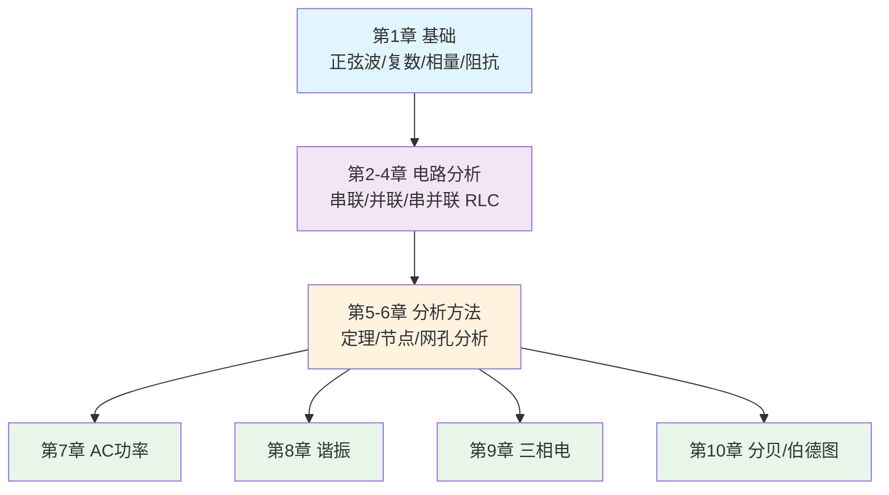

<!-- Post: 【AC电路分析系列】一图读懂AC电路分析：10章学习路径图 | ID: 2026-014 | Created: 2026-09-01 | Tags: tech, books | Format: markdown -->

## 开篇：拿到一本422页的教材，从哪读起？

想象一下：你下载了一本422页的电子教材，标题是《AC Electrical Circuit Analysis》，翻开一看，满篇的复数、相量、阻抗、戴维南定理……你深吸一口气，决定从第1页开始读。

但读了30页，你开始怀疑人生：这些公式到底有什么用？我做嵌入式开发的，需要懂三相电吗？我做无线电的，需要学网孔分析吗？

这篇文章就是来解决这个问题的。我们不深入任何一个公式，而是站在高处俯瞰全书：**用一张图看懂10章的结构关系，用一张表知道每章讲什么、对谁有用、重要程度如何，再给你两条不同的学习路径，让你根据自己的目标选择读什么、跳过什么。**

> 作者在前言里说，每章都以学习目标开头，以练习结尾："Each chapter begins with a set of learning objectives and concludes with practice exercises that are generally divided into four major types: analysis, design, challenge and simulation."（第4页，Introduction）
>
> 这个结构本身就是一张学习地图——学习目标告诉你"学完能做什么"，练习题告诉你"怎么检验学会了没有"。

---

## 全书结构总览

这本书的10章不是平铺的，而是有明显的递进关系，可以分成4个模块：



**四个模块的关系**：

| 模块 | 章节 | 定位 | 比喻 |
|---|---|---|---|
| **基础** | 第1章 | AC分析的数学语言和基本概念 | 学做菜前先认识锅碗瓢盆和调料 |
| **电路分析** | 第2-4章 | 三种基本电路结构的分析方法 | 学会炒青菜、煮鸡蛋、做汤这三道基础菜 |
| **分析方法** | 第5-6章 | 复杂电路的系统化解法 | 学会菜谱组合、火候控制、食材搭配，能做一桌菜 |
| **高级主题** | 第7-10章 | 功率/谐振/三相/频率响应，四个独立应用方向 | 烘焙、烧烤、煲汤、甜品——选你需要的方向深入 |

**关键认知**：第1-6章是**必学的基础**，前后依赖、不能跳过；第7-10章是**四个相对独立的应用方向**，可以根据你的目标选择性深入。

---

## 10章速查表

| 章 | 标题 | 页码 | 核心内容 | 实践应用场景 | 重要程度 |
|---|---|---|---|---|---|
| **1** | Fundamentals（基础） | p10-43 | 正弦波形、傅里叶分析、复数、电抗阻抗、相量图 | 所有AC电路分析的基础，ADC采样、信号发生器、滤波器设计都要用 | ⭐⭐⭐⭐⭐ 必读 |
| **2** | Series RLC Circuits（串联RLC） | p44-79 | 串联阻抗、串联电路分析、实际电感器的非理想性 | 串联谐振选频电路、电源滤波、阻抗匹配 | ⭐⭐⭐⭐⭐ 必读 |
| **3** | Parallel RLC Circuits（并联RLC） | p80-109 | 并联阻抗、并联电路分析、导纳/电纳、电流分流 | 并联谐振回路（LC振荡）、电流分配、负载设计 | ⭐⭐⭐⭐⭐ 必读 |
| **4** | Series-Parallel RLC（串并联RLC） | p110-143 | 串并联混合电路化简、等效阻抗、KVL/KCL综合应用 | 实际电路几乎都是串并联混合，如滤波器、匹配网络 | ⭐⭐⭐⭐⭐ 必读 |
| **5** | Analysis Theorems（分析定理） | p144-203 | 电源转换、叠加定理、戴维南/诺顿等效、最大功率传输、Δ-Y转换 | 信号源输出阻抗测量、天线匹配、复杂电路化简 | ⭐⭐⭐⭐ 重要 |
| **6** | Nodal and Mesh Analysis（节点/网孔分析） | p204-259 | 节点电压法、网孔电流法、受控源分析 | 多电源复杂电路的系统解法，SPICE仿真的底层原理 | ⭐⭐⭐⭐ 重要 |
| **7** | AC Power（交流功率） | p260-293 | 功率波形、功率三角形、有功/无功/视在功率、功率因数、电力系统 | 电源设计、功耗分析、功率因数校正(PFC)、电力应用 | ⭐⭐⭐ 选学 |
| **8** | Resonance（谐振） | p294-337 | 串联谐振、并联谐振、谐振频率、品质因数Q、带宽 | 无线电选频、滤波器设计、振荡器、阻抗匹配 | ⭐⭐⭐⭐⭐ 无线电必读 |
| **9** | Polyphase Power（多相功率） | p338-371 | 三相系统、Δ/Y连接、线电压/相电压、功率因数校正 | 工业供电、大功率电机、三相整流 | ⭐⭐ 了解即可 |
| **10** | Decibels and Bode Plots（分贝/伯德图） | p372-398 | 分贝(dB)、伯德图、超前/滞后网络、多级系统频率响应 | 滤波器设计、放大器带宽分析、系统稳定性、音频/通信 | ⭐⭐⭐⭐ 硬件/音频必读 |

> **重要程度说明**：
> - ⭐⭐⭐⭐⭐ 必读：所有AC电路应用的基础，不学后面全是空中楼阁
> - ⭐⭐⭐⭐ 重要：工程实践中高频使用，建议掌握
> - ⭐⭐⭐ 选学：特定领域需要，其他领域了解概念即可
> - ⭐⭐ 了解即可：知道有这个东西，需要时再深入

---

## 两条学习路径

### 路径一：精读路径（适合学生/备考/系统学习）

**目标**：完整掌握AC电路分析的全部知识体系，能应对考试和复杂电路设计。

**顺序**：第1章 → 第2章 → 第3章 → 第4章 → 第5章 → 第6章 → 第7章 → 第8章 → 第9章 → 第10章

**每章学习方法**：
1. 先读学习目标，知道学完能做什么
2. 逐节阅读，每个例题自己先算一遍再看答案
3. 用SPICE仿真验证每个例题的结果
4. 做练习题：分析题必做，设计题选做，挑战题量力而行
5. 画相量图和频率响应曲线，建立直观理解

**预计时间**：每章8-12小时，全书约100小时（约3-4个月，每天1小时）

**适合人群**：电子/电气专业学生、准备电路分析考试、想系统建立电路理论基础

---

### 路径二：实践导向路径（适合硬件/嵌入式/无线电开发者）

**目标**：快速掌握工作中真正用到的AC电路知识，能解决实际工程问题，不追求理论完备。

**顺序**：

```
第一阶段（必学，约30小时）：
  第1章（基础）→ 第2章（串联RLC）→ 第3章（并联RLC）→ 第4章（串并联RLC）

第二阶段（重要，约20小时）：
  第5章（分析定理，重点学戴维南和最大功率传输）
  第6章（节点/网孔分析，了解原理，实际用SPICE代替手算）

第三阶段（按方向选学，每章约8-10小时）：
  无线电/SDR方向 → 第8章（谐振）→ 第10章（伯德图）
  电源/硬件方向 → 第7章（AC功率）→ 第10章（伯德图）
  音频方向 → 第10章（伯德图）→ 第8章（谐振）
  工业/电力方向 → 第7章（AC功率）→ 第9章（三相电）
```

**每章学习方法**：
1. 读学习目标，只关注和你工作相关的目标
2. 跳过纯数学推导，直接看结论和例题
3. 每个例题用SPICE仿真验证，理解"输入什么、输出什么、为什么"
4. 只做和你方向相关的练习题
5. 把学到的方法立刻用到你正在做的项目里

**预计时间**：第一阶段30小时 + 第二阶段20小时 + 第三阶段16-20小时 = 约66-70小时（约2个月，每天1小时）

**适合人群**：硬件工程师、嵌入式开发者、无线电/SDR爱好者、音频工程师

---

## 哪些章节必读，哪些可以跳过

### 绝对不能跳过（第1-4章）

这4章是AC电路分析的"字母表"——不学就看不懂后面的任何内容。

- **第1章**：复数和相量是AC分析的"语言"，就像学编程先学变量和循环
- **第2-4章**：串联、并联、串并联是所有实际电路的基本结构，就像学做饭先学炒煮蒸

> 作者在第4章引言里说："Having completed our examination of strictly series and strictly parallel AC circuits, we are now ready to examine circuits that combine these two configurations."（第110页，4.1 Introduction）
>
> 这句话本身就是学习路径的提示——先纯串联、再纯并联、最后串并联混合，顺序不能乱。

### 建议掌握（第5-6章）

这两章是"工具集"——让你能分析更复杂的电路。

- **第5章**：戴维南等效和最大功率传输是工程中最常用的两个定理，特别是做阻抗匹配的时候
- **第6章**：节点/网孔分析是系统化的解题方法，实际工作中通常用SPICE代替手算，但理解原理能帮你判断仿真结果对不对

### 按方向选学（第7-10章）

这四章是四个独立的应用方向，**不需要全学**，按你的工作方向选择：

| 你的方向 | 必读 | 选读 | 可以跳过 |
|---|---|---|---|
| **无线电/SDR** | 第8章（谐振）、第10章（伯德图） | 第5章（匹配） | 第7章、第9章 |
| **电源/硬件** | 第7章（AC功率）、第10章（伯德图） | 第8章（谐振） | 第9章 |
| **音频/信号处理** | 第10章（伯德图） | 第8章（谐振） | 第7章、第9章 |
| **嵌入式/MCU** | 第1章（基础）、第10章（伯德图，了解ADC/DAC频率特性） | 第2-4章（了解） | 第7章、第8章、第9章 |
| **工业/电力** | 第7章（AC功率）、第9章（三相电） | 第5章 | 第8章、第10章 |

---

## 配套资源

这本书不是孤立的，作者提供了一整套学习资源：

| 资源 | 说明 | 怎么用 |
|---|---|---|
| **YouTube频道** | Electronics with Professor Fiore | 作者亲自讲解的视频课程，和教材章节对应，适合视觉学习者 |
| **SPICE仿真** | 书中大量例题配有SPICE仿真 | 下载免费的LTspice，打开书中的仿真文件，边看边改参数 |
| **实验手册** | 作者有7本配套实验手册 | 学完理论后做实验，手脑结合，理解更深刻 |
| **DC电路教材** | 《DC Electrical Circuit Analysis》（同作者，免费） | AC基础不牢时回头补DC，两本书结构一致 |
| **其他教材** | 半导体器件、运算放大器、嵌入式C(Arduino) | 学完AC电路后继续深入电子学的其他方向 |
| **附录** | 标准元件值、线性方程组解法、公式证明、奇数题答案 | 做设计题时查标准电阻值，卡住时看答案反推思路 |

> 作者在前言里说："Many SPICE-based circuit simulators are available, both free and commercial, that can be used with this text."（第4页，Introduction）
>
> 推荐用免费的 **LTspice**（ADI出品），功能强大、社区活跃、大量教程。书中的仿真例子都可以用LTspice复现。

---

## 小结

这篇文章我们做了三件事：

1. **画了一张全书结构图**：10章分成4个模块——基础（第1章）→ 电路分析（第2-4章）→ 分析方法（第5-6章）→ 高级主题（第7-10章），前后依赖、层层递进。
2. **做了一张10章速查表**：每章的页码、核心内容、实践应用场景、重要程度一目了然，帮你快速判断"这章对我有没有用"。
3. **给了两条学习路径**：
   - **精读路径**：按顺序读完全书，适合学生/备考，约100小时
   - **实践导向路径**：先学第1-6章基础，再按方向选学第7-10章，适合硬件/嵌入式/无线电开发者，约66-70小时

最重要的一句话：**第1-4章是基础，绝对不能跳过；第5-6章是工具，建议掌握；第7-10章是应用，按方向选学。**

下一篇（第3篇），我们会深入到6个核心主题的学习路线图，告诉你每个主题学什么、为什么重要、对应哪些实践项目，以及主题之间的依赖关系。

---

## 系列导航

**【AC电路分析系列】共11篇，基于 James M. Fiore《AC Electrical Circuit Analysis: A Practical Approach》(Version 1.1.13, 2025)**

| 序号 | 文章 | 状态 |
|---|---|---|
| 第1篇 | 交流电到底是什么？——从DC到AC的思维跃迁 | ✅ 已发布 |
| 第2篇 | 一图读懂AC电路分析：10章学习路径图 | ✅ 本篇 |
| 第3篇 | AC电路分析的6大核心主题：从数学到实践的学习路线 | ⏳ 即将发布 |
| 第4篇 | 交流电的数学语言：正弦波、复数和相量到底怎么用？ | ⏳ 即将发布 |
| 第5篇 | RLC电路三板斧：串联、并联、串并联怎么分析？ | ⏳ 即将发布 |
| 第6篇 | 复杂电路怎么解？叠加定理、戴维南、节点分析的实战用法 | ⏳ 即将发布 |
| 第7篇 | AC功率不只是P=UI：功率三角形、三相电和功率因数校正 | ⏳ 即将发布 |
| 第8篇 | 谐振：无线电选频、滤波器和振荡器背后的核心原理 | ⏳ 即将发布 |
| 第9篇 | 电路的频率性格：分贝、伯德图和滤波器设计入门 | ⏳ 即将发布 |
| 第10篇 | AC电路分析在硬件/嵌入式/无线电生态中的位置：横向对比 | ⏳ 即将发布 |
| 第11篇 | 读完AC电路分析之后：独立思考、实践路线图和进一步学习 | ⏳ 即将发布 |

> 本书为开源教育资源（Creative Commons BY-NC-SA），可免费下载：[www.mvcc.edu/jfiore](https://www.mvcc.edu/jfiore) 或 [www.dissidents.com](https://www.dissidents.com)
> 作者YouTube频道：Electronics with Professor Fiore
