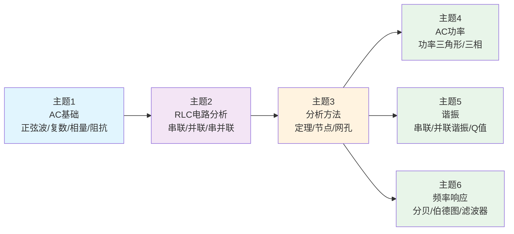

<!-- Post: 【AC电路分析系列】AC电路分析的6大核心主题：从数学到实践的学习路线 | ID: 2026-015 | Created: 2026-09-01 | Tags: tech, books | Format: markdown -->

## 开篇：为什么有些人学了AC电路还是不会用？

你可能有过这样的经历：花了一个月学完了AC电路分析，公式背了一堆，相量图画了几十张，考试也考了不错的分数。但真到做项目的时候——比如设计一个LC选频电路、算一个电源的功率因数、或者分析一个放大器的频率响应——你突然发现：**书上的公式和实际的电路之间，好像隔着一层看不见的墙。**

问题出在哪？不是你不够努力，而是你学的是"章节"，不是"主题"。教材按章节组织，是为了教学方便；但实际工程问题是按"主题"组织的——一个实际的电路问题，往往同时涉及好几个章节的知识。

这篇文章就是来拆掉这层墙的。我们把全书10章的内容重新提炼成**6个核心主题**，每个主题告诉你：为什么重要、学什么、解决什么实际问题、对应哪些章节、可以做什么实践项目。学完这6个主题，你就能把书上的知识和实际的电路对应起来。

---

## 6个核心主题总览



**依赖关系说明**：
- **主题1→主题2→主题3**：严格的前后依赖，必须按顺序学，不能跳
- **主题3→主题4/5/6**：主题3是基础，主题4/5/6是三个相对独立的应用方向，可以并行或按需要选择

---

## 主题1：AC基础——正弦波、复数、相量、阻抗

**对应章节**：第1章（p10-43）

### 为什么重要

这是整个AC电路分析的"字母表"。就像学英语先学ABC，学AC电路先学正弦波、复数、相量、阻抗。不学懂这个，后面所有的公式都是空中楼阁。

> 作者在第1章引言里说："As such, this chapter is filled with foundational material that will be used in the remainder of this text. It is critical that the concepts presented here be fully understood in order to achieve success in later chapters."（第10页，1.1 Introduction）
>
> 翻译：这一章全是基础材料，后面整本书都要用。必须完全理解这里的概念，后面的章节才能学好。

### 学什么

| 概念 | 一句话解释 | 生活类比 |
|---|---|---|
| 正弦波 | AC信号的基本形态，电压/电流随时间按正弦函数变化 | 荡秋千，来回摆动 |
| 复数 | 用实部+虚部表示一个有大小有相位的量 | 地图上的坐标，x轴+y轴确定一个点 |
| 相量 | 用一个带箭头的线段表示正弦量的大小和相位 | 时钟的指针，长度表示大小，角度表示时间 |
| 电抗 | 电容和电感对交流电的阻碍作用，随频率变化 | 推秋千，推得越快越容易（电容）或越难（电感） |
| 阻抗 | 电阻+电抗的"合力"，AC电路的"总阻碍" | 推一个又重又有弹性的箱子，摩擦力+弹力的合力 |

### 解决什么实践问题

- 用单片机ADC采样一个正弦信号，怎么算它的频率、幅值、相位？
- 电容在直流和交流下为什么表现不一样？
- 为什么音频信号要分"低频"和"高频"？
- 阻抗匹配到底是什么意思？

### 实践项目建议

1. **用C语言实现复数运算库**：写一个complex_t结构体，实现加减乘除、模、幅角，对应主题1的复数运算
2. **用DAC生成正弦波**：用单片机DAC或PWM生成不同频率的正弦波，用示波器观察，理解正弦波的参数（幅值、频率、相位）
3. **测量电容的容抗随频率变化**：用信号发生器+示波器，测量不同频率下电容的阻抗，画出频率-阻抗曲线

---

## 主题2：RLC电路分析——串联、并联、串并联

**对应章节**：第2-4章（p44-143）

### 为什么重要

实际电路几乎都是电阻(R)、电感(L)、电容(C)的组合。串联、并联、串并联是三种最基本的结构，学会分析这三种结构，就能分析绝大多数实际电路。

> 作者在第2章引言里说："There is much here that will be familiar from your prior studies with DC series circuits, however, there will be a few notable changes and perhaps a surprise or two lurking. The key to most of this is to remember that all computations involve vector quantities."（第44页，2.1 Introduction）
>
> 翻译：很多内容和你学过的DC串联电路很像，但有一些明显的变化，甚至可能有一两个惊喜。关键是记住：所有计算都涉及矢量（不是标量）。

### 学什么

| 结构 | 核心方法 | 关键公式/概念 |
|---|---|---|
| 串联RLC | 阻抗相加，电流相同，电压分压 | Z_total = Z_R + Z_L + Z_C，KVL，相量图 |
| 并联RLC | 导纳相加，电压相同，电流分流 | Y_total = Y_R + Y_L + Y_C，KCL，电流相量图 |
| 串并联RLC | 先化简并联部分，再和串联部分合并 | 等效阻抗，逐步化简，KVL+KCL综合 |

### 解决什么实践问题

- 设计一个RC低通滤波器，截止频率怎么算？
- 一个LC串联电路，在某个频率下为什么相当于短路？
- 一个实际的电感器，为什么不能只当理想电感看？（第2章2.5节专门讲实际电感器的非理想性）
- 电源滤波电容怎么选？

### 实践项目建议

1. **搭建串联RLC电路并测量**：用电阻+电感+电容搭建串联电路，用信号发生器+示波器测量不同频率下的电流和各元件电压，画相量图验证
2. **设计并测试RC低通滤波器**：计算截止频率，搭建电路，用扫频法测量实际频率响应，和理论值对比
3. **测量实际电感器的等效电路**：用阻抗分析仪或RLC表，测量一个实际电感在不同频率下的阻抗，建立"理想电感+串联电阻+并联电容"的等效模型

---

## 主题3：分析方法——定理、节点分析、网孔分析

**对应章节**：第5-6章（p144-259）

### 为什么重要

前面学的串联、并联、串并联分析，只能处理结构比较规则的电路。实际电路往往有多个电源、多个回路、复杂的连接方式，这时候就需要系统化的分析方法。这两章教的就是"通用解题工具"。

### 学什么

| 方法 | 核心思想 | 最适用场景 |
|---|---|---|
| 电源转换 | 电压源+串联电阻 ↔ 电流源+并联电阻 | 简化含多个电源的电路 |
| 叠加定理 | 多个电源时，分别算每个电源的贡献再相加 | 多电源电路，理解每个电源的影响 |
| 戴维南等效 | 任何线性电路都能等效成"电压源+串联电阻" | 负载分析、最大功率传输、阻抗匹配 |
| 诺顿等效 | 任何线性电路都能等效成"电流源+并联电阻" | 戴维南的对偶形式 |
| 最大功率传输 | 负载电阻=电源内阻时，负载获得最大功率 | 音频功放、天线匹配、电源设计 |
| Δ-Y转换 | 三角形连接和星形连接互相转换 | 三相电路、电桥电路 |
| 节点分析 | 选参考节点，列KCL方程解节点电压 | 多节点复杂电路，最通用的方法 |
| 网孔分析 | 选网孔，列KVL方程解网孔电流 | 多回路电路，电压源多时方便 |

### 解决什么实践问题

- 一个复杂的信号调理电路，输出阻抗是多少？（戴维南等效）
- 音频功放接8Ω扬声器，怎么实现最大功率传输？
- 一个有5个节点、3个电源的电路，手算太麻烦，怎么系统化求解？（节点分析）
- SPICE仿真器到底是怎么算电路的？（底层就是节点分析）

### 实践项目建议

1. **用C语言实现节点分析求解器**：用高斯消元法解线性方程组，输入电路的节点连接和元件值，输出各节点电压。这能帮你彻底理解节点分析的原理
2. **测量信号源的输出阻抗**：用戴维南等效的方法，测量一个信号发生器或电源模块的输出阻抗（开路电压+短路电流，或接不同负载测电压）
3. **验证最大功率传输定理**：用一个可变电阻作为负载，接在一个有内阻的电源上，测量不同负载下的功率，画出功率-负载曲线，验证最大功率点

---

## 主题4：AC功率与电力系统

**对应章节**：第7章（p260-293）+ 第9章（p338-371）

### 为什么重要

DC电路里功率就是P=VI，简单直接。但AC电路里，电压和电流都在随时间变化，而且可能不同相位，这就引出了有功功率、无功功率、视在功率、功率因数等一系列新概念。做电源设计、电力应用、功耗分析都必须懂。

### 学什么

| 概念 | 一句话解释 | 生活类比 |
|---|---|---|
| 有功功率(P) | 真正消耗掉的功率，单位W | 你真正吃进去的食物，长身体了 |
| 无功功率(Q) | 在电源和负载之间来回交换的功率，单位var | 你嚼了半天又吐出来的食物，没消化但占了嘴 |
| 视在功率(S) | 电压有效值×电流有效值，单位VA | 你嘴里总共塞进去的食物量 |
| 功率因数(PF) | 有功/视在，衡量功率利用效率 | 消化率，吃进去多少真正长身体了 |
| 功率三角形 | P、Q、S构成直角三角形，S是斜边 | 食物消化关系图 |
| 三相电 | 三个相位差120度的交流电源，供电更平稳 | 三个人轮流推磨，比一个人推平稳多了 |

### 解决什么实践问题

- 为什么家里的电费单上有"有功功率"和"无功功率"？
- 开关电源的功率因数校正(PFC)是干什么的？
- 工业上为什么用三相电而不是单相电？
- 一个电源能输出多大的有功功率？怎么提高功率因数？

### 实践项目建议

1. **测量功率因数**：用示波器同时测电压和电流波形，计算相位差，算出功率因数。可以测一个纯电阻负载、一个电容负载、一个开关电源负载，对比功率因数
2. **设计简单的功率因数校正电路**：在一个电容输入型整流电路前加一个功率因数校正电感，测量校正前后的功率因数变化
3. **搭建简单的三相整流电路**：用三个变压器或三相电源，搭建三相桥式整流电路，测量输出电压纹波，和单相整流对比

---

## 主题5：谐振——无线电选频、滤波器和振荡器的核心

**对应章节**：第8章（p294-337）

### 为什么重要

谐振是AC电路里最"神奇"的现象——在某个特定频率下，串联RLC相当于短路（阻抗最小），并联RLC相当于开路（阻抗最大）。这个特性是无线电选频、滤波器设计、振荡器、阻抗匹配的核心原理。做无线电/SDR/射频的人，谐振是每天都要打交道的概念。

> 作者在第8章引言里说："Resonance can be thought of as a preferred frequency of vibration. In other words, it is a frequency at which a system operates with reduced limitation."（第294页，8.1 Introduction）
>
> 翻译：谐振可以理解为一个"偏好的振动频率"。换句话说，在这个频率下，系统运行时受到的阻碍最小。

### 学什么

| 概念 | 一句话解释 | 生活类比 |
|---|---|---|
| 串联谐振 | 串联RLC在谐振频率下阻抗最小（等于R），电流最大 | 荡秋千，推的频率和秋千固有频率一样时，越荡越高 |
| 并联谐振 | 并联RLC在谐振频率下阻抗最大，电流最小 | 两个人推同一个秋千，频率不对就互相抵消，频率对了就一起使劲 |
| 谐振频率(f₀) | 发生谐振的频率，f₀ = 1/(2π√(LC)) | 秋千的固有频率，由绳长和重力决定 |
| 品质因数(Q) | 衡量谐振的"尖锐程度"，Q越高选频越准 | 荡秋千的人越轻、摩擦力越小，荡得越久、频率越准 |
| 带宽(BW) | 谐振峰的宽度，BW = f₀/Q | 秋千能接受的推频范围，太偏了就荡不起来 |

### 解决什么实践问题

- 收音机怎么从几百个电台里选出你想听的那个？（LC谐振选频）
- 设计一个带通滤波器，中心频率和带宽怎么定？
- 一个LC振荡器，振荡频率怎么算？怎么起振？
- 天线匹配网络怎么设计？（利用谐振实现阻抗变换）

### 实践项目建议

1. **搭建串联谐振选频电路**：用LC串联电路+信号发生器，扫频测量电流随频率的变化，画出谐振曲线，测量谐振频率和Q值，和理论计算对比
2. **做一个简单的AM收音机**：用LC谐振回路做选频，二极管检波，耳机输出。这是谐振最经典的应用，能让你直观理解"选频"是什么意思
3. **测量实际电感的Q值随频率变化**：用Q表或阻抗分析仪，测量一个实际电感在不同频率下的Q值，理解为什么高频电路要选高Q电感

---

## 主题6：频率响应与伯德图——电路的"频率性格"

**对应章节**：第10章（p372-398）

### 为什么重要

同一个电路，对不同频率的信号表现完全不一样——比如一个RC低通滤波器，低频信号能过去，高频信号被挡住。描述电路对不同频率的响应，就是频率响应。伯德图是频率响应的可视化工具，能让你一眼看出一个电路的"频率性格"。做滤波器设计、放大器带宽分析、系统稳定性分析、音频/通信都必须懂。

### 学什么

| 概念 | 一句话解释 | 生活类比 |
|---|---|---|
| 分贝(dB) | 用对数表示增益/衰减的单位，dB = 20log(Vout/Vin) | 地震的里氏震级，差10倍差20dB |
| 伯德图 | 用两张图（幅频+相频）表示电路的频率响应 | 给一个人做"性格测试"，不同场景下的反应画成图 |
| 超前网络 | 输出相位超前输入，高通特性 | 反应快的人，提前行动 |
| 滞后网络 | 输出相位滞后输入，低通特性 | 反应慢的人，慢半拍 |
| 多级级联 | 多个网络级联时，幅频相加、相频相加 | 多个人接力，总反应是各段反应的叠加 |

### 解决什么实践问题

- 一个运算放大器电路，带宽是多少？相位裕度够不够？
- 设计一个低通/高通/带通滤波器，截止频率怎么算？伯德图怎么画？
- 一个多级放大器，总的频率响应怎么算？
- 为什么音频设备要标"频率响应 20Hz-20kHz"？

### 实践项目建议

1. **手绘并测量RC低通滤波器的伯德图**：先理论计算截止频率和伯德图，然后搭建电路，用信号发生器+示波器扫频测量实际幅频和相频响应，和理论对比
2. **用Python/SciPy画伯德图**：写一个Python脚本，输入传递函数，用scipy.signal.bode()画出伯德图。这能帮你理解伯德图的数学本质，也能用于实际电路设计
3. **测量运算放大器的开环频率响应**：用一个实际运放（如LM358），测量不同频率下的开环增益，画出幅频曲线，找到单位增益带宽，和datasheet对比

---

## 学习顺序建议

### 按依赖关系（推荐）

```
第一阶段（基础，必学，约30小时）：
  主题1（AC基础）→ 主题2（RLC电路分析）

第二阶段（方法，必学，约20小时）：
  主题3（分析方法）

第三阶段（应用，按方向选学，每个主题约8-10小时）：
  无线电/SDR方向 → 主题5（谐振）→ 主题6（频率响应）
  电源/硬件方向 → 主题4（AC功率）→ 主题6（频率响应）
  音频方向 → 主题6（频率响应）→ 主题5（谐振）
  工业/电力方向 → 主题4（AC功率）
  嵌入式/MCU方向 → 主题6（频率响应，了解ADC/DAC特性）
```

### 按项目驱动（适合有经验的开发者）

如果你已经有一定的电路基础，可以直接从你想做的项目倒推：

| 你想做的项目 | 需要的主题 | 学习顺序 |
|---|---|---|
| 做一个SDR接收机 | 主题1→2→5→6 | 先补基础，再学谐振和频率响应 |
| 设计一个开关电源 | 主题1→2→4→6 | 先补基础，再学功率和频率响应 |
| 做一个音频放大器 | 主题1→2→3→6 | 先补基础，再学分析方法和频率响应 |
| 做一个LC振荡器 | 主题1→2→5 | 先补基础，重点学谐振 |

---

## 小结

这篇文章我们做了三件事：

1. **把10章提炼成6个核心主题**：AC基础、RLC电路分析、分析方法、AC功率、谐振、频率响应。每个主题都有明确的"为什么重要、学什么、解决什么问题、实践项目"。
2. **画了主题依赖关系图**：主题1→2→3是严格的前后依赖，必须按顺序学；主题3→4/5/6是三个独立应用方向，可以按需要选择。
3. **给了两条学习路线**：按依赖关系的系统学习路线（适合初学者），和按项目驱动的倒推学习路线（适合有经验的开发者）。

最重要的一句话：**不要按章节学，要按主题学。** 每个主题学完，立刻做一个对应的实践项目，把书上的公式变成手里的电路。这样学完6个主题，你就真正掌握了AC电路分析。

从下一篇（第4篇）开始，我们进入核心主题的深度拆解。第4篇讲主题1：交流电的数学语言——正弦波、复数和相量到底怎么用？我们会深入每个概念的原理，配大量实例和原文引用，还有C语言实现复数运算的代码。

---

## 系列导航

**【AC电路分析系列】共11篇，基于 James M. Fiore《AC Electrical Circuit Analysis: A Practical Approach》(Version 1.1.13, 2025)**

| 序号 | 文章 | 状态 |
|---|---|---|
| 第1篇 | 交流电到底是什么？——从DC到AC的思维跃迁 | ✅ 已发布 |
| 第2篇 | 一图读懂AC电路分析：10章学习路径图 | ✅ 已发布 |
| 第3篇 | AC电路分析的6大核心主题：从数学到实践的学习路线 | ✅ 本篇 |
| 第4篇 | 交流电的数学语言：正弦波、复数和相量到底怎么用？ | ⏳ 即将发布 |
| 第5篇 | RLC电路三板斧：串联、并联、串并联怎么分析？ | ⏳ 即将发布 |
| 第6篇 | 复杂电路怎么解？叠加定理、戴维南、节点分析的实战用法 | ⏳ 即将发布 |
| 第7篇 | AC功率不只是P=UI：功率三角形、三相电和功率因数校正 | ⏳ 即将发布 |
| 第8篇 | 谐振：无线电选频、滤波器和振荡器背后的核心原理 | ⏳ 即将发布 |
| 第9篇 | 电路的频率性格：分贝、伯德图和滤波器设计入门 | ⏳ 即将发布 |
| 第10篇 | AC电路分析在硬件/嵌入式/无线电生态中的位置：横向对比 | ⏳ 即将发布 |
| 第11篇 | 读完AC电路分析之后：独立思考、实践路线图和进一步学习 | ⏳ 即将发布 |

> 本书为开源教育资源（Creative Commons BY-NC-SA），可免费下载：[www.mvcc.edu/jfiore](https://www.mvcc.edu/jfiore) 或 [www.dissidents.com](https://www.dissidents.com)
> 作者YouTube频道：Electronics with Professor Fiore
