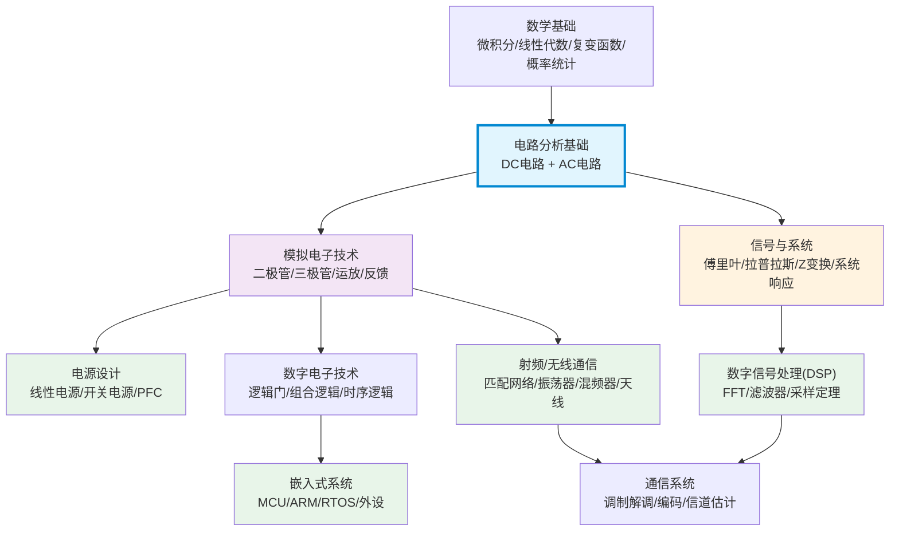

<!-- Post: 【AC电路分析系列】AC电路分析在硬件/嵌入式/无线电生态中的位置：横向对比 | ID: 2026-022 | Created: 2026-09-01 | Tags: tech, books | Format: markdown -->

## 开篇：学完AC电路分析，然后呢？

你花了几个月学完了AC电路分析——正弦波、复数、相量、阻抗、RLC电路、戴维南、谐振、伯德图……公式背了一堆，题做了不少。但你可能会问：**这些知识在整个电子学知识体系里到底处于什么位置？学完之后该往哪个方向继续？**

这篇文章我们就跳出这本书，站在更高的视角，把AC电路分析放到整个硬件/嵌入式/无线电的知识生态中做横向对比。我们会回答三个问题：
1. AC电路分析和其他相关学科（信号与系统、模电、DSP、射频）是什么关系？
2. 不同方向（硬件/嵌入式/无线电）的知识扩展路线是什么？
3. 学完AC电路分析之后，推荐的进阶学习资源有哪些？

---

## 一、AC电路分析在电子学知识体系中的位置



**关键定位**：
- AC电路分析是**电路分析基础**的第二部分（第一部分是DC电路），是整个电子学的"地基"
- 它向上连接**模拟电子技术**（三极管、运放都是建立在AC小信号模型上的）
- 它和**信号与系统**有大量重叠（傅里叶分析、频率响应、系统函数），但侧重点不同
- 它是**射频/无线通信**、**电源设计**、**滤波器设计**的直接基础
- 对**嵌入式**和**数字电路**来说，AC电路分析不是直接基础，但理解信号的频率特性对ADC/DAC、信号完整性、EMI很重要

---

## 二、和相关学科的横向对比

### 2.1 AC电路分析 vs 信号与系统

| 维度 | AC电路分析 | 信号与系统 |
|---|---|---|
| 研究对象 | 具体的电路（R/L/C/电源） | 抽象的系统（输入-输出关系） |
| 数学工具 | 复数、相量、KVL/KCL | 傅里叶变换、拉普拉斯变换、Z变换、卷积 |
| 核心概念 | 阻抗、谐振、功率、戴维南 | 系统函数、冲激响应、频率响应、稳定性 |
| 侧重点 | 怎么分析和设计具体电路 | 怎么描述和分析任意线性系统 |
| 重叠部分 | 频率响应、伯德图、滤波器 | 频率响应、伯德图、滤波器 |
| 关系 | 信号与系统是AC电路分析的"数学抽象版" | AC电路分析是信号与系统在电路领域的"具体应用版" |

**理解**：信号与系统教你"任意系统怎么分析"，AC电路分析教你"电路这个特定系统怎么分析"。两者的频率响应、伯德图、滤波器概念是相通的，但信号与系统更抽象、更通用，AC电路分析更具体、更工程化。

### 2.2 AC电路分析 vs 模拟电子技术

| 维度 | AC电路分析 | 模拟电子技术 |
|---|---|---|
| 元件 | 理想R/L/C、理想电源 | 二极管、三极管(BJT/MOSFET)、运放 |
| 模型 | 元件是线性的 | 器件是非线性的，用小信号模型线性化 |
| 核心概念 | 阻抗、谐振、功率 | 放大、反馈、偏置、频率响应、稳定性 |
| 侧重点 | 无源电路分析 | 有源电路设计 |
| 关系 | AC电路分析是模电的基础（小信号模型就是AC电路模型） | 模电是AC电路分析的延伸（加入有源器件和反馈） |

**理解**：模电里的三极管小信号模型，就是把三极管等效成一个受控电流源+输入/输出电阻，然后用AC电路分析的方法来分析。运放的频率响应、相位裕度、稳定性分析，本质上也是AC电路分析+反馈理论。所以AC电路分析学不好，模电肯定学不好。

### 2.3 AC电路分析 vs 数字信号处理(DSP)

| 维度 | AC电路分析 | 数字信号处理 |
|---|---|---|
| 域 | 连续时间（模拟） | 离散时间（数字） |
| 元件 | R/L/C（模拟元件） | 加法器、乘法器、延迟单元（数字运算） |
| 数学工具 | 复数、微分方程 | 差分方程、Z变换、FFT |
| 核心概念 | 模拟滤波器、谐振、阻抗 | 数字滤波器、FFT、采样定理、量化噪声 |
| 侧重点 | 硬件实现（用元件搭电路） | 软件实现（用算法处理数据） |
| 关系 | 模拟滤波器是数字滤波器的"前辈"和"对照" | 数字滤波器是模拟滤波器的"数字化实现" |

**理解**：DSP里的IIR滤波器，其设计方法就是从模拟滤波器（巴特沃斯、切比雪夫等）通过双线性变换或冲激响应不变法转换过来的。理解了模拟滤波器的频率响应、伯德图、截止频率，再学数字滤波器就容易多了。而且实际系统中，ADC前面的抗混叠滤波器和DAC后面的重建滤波器都是模拟滤波器，必须用AC电路分析来设计。

### 2.4 AC电路分析 vs 射频/无线通信

| 维度 | AC电路分析 | 射频/无线通信 |
|---|---|---|
| 频率范围 | 直流到几百MHz（集总参数） | 几百MHz到几十GHz（分布参数） |
| 元件模型 | 集总参数（R/L/C是点元件） | 分布参数（传输线、微带线、S参数） |
| 核心概念 | 阻抗、谐振、功率 | 阻抗匹配、S参数、噪声、调制解调 |
| 侧重点 | 低频/集总参数电路 | 高频/分布参数电路 |
| 关系 | AC电路分析是射频的基础（低频近似） | 射频是AC电路分析在高频的延伸（加入分布参数和电磁场） |

**理解**：射频电路里的阻抗匹配、LC谐振回路、滤波器，基础都是AC电路分析。但当频率高到波长和电路尺寸可比时（通常>300MHz），集总参数模型不再适用，需要用传输线理论和S参数。这时候AC电路分析的概念（阻抗、谐振、功率）仍然有用，但分析工具从KVL/KCL变成了麦克斯韦方程和传输线理论。

---

## 三、不同方向的知识扩展路线

### 3.1 硬件工程师方向

```
AC电路分析 → 模拟电子技术（三极管/运放） → 电源设计（线性/开关电源）
                                          → 信号链设计（放大器/滤波器/ADC驱动）
                                          → 硬件可靠性（EMI/EMC/信号完整性）
```

**核心课程**：
1. 模拟电子技术（二极管、BJT、MOSFET、运放、反馈）
2. 电源设计（线性稳压器、Buck/Boost/反激、PFC、环路稳定性）
3. 信号链设计（仪表放大器、有源滤波器、ADC/DAC驱动、基准源）
4. EMI/EMC（传导发射、辐射发射、ESD、滤波设计）
5. 信号完整性（传输线、阻抗匹配、反射、串扰、眼图）

**推荐教材**：
- 《电子电路分析与设计》（Neamen）——模电经典
- 《开关电源设计》（Pressman）——电源设计圣经
- 《运算放大器应用技术手册》（ADI）——运放应用百科
- 《EMC电磁兼容设计与测试案例分析》——EMC实战

### 3.2 嵌入式开发者方向

```
AC电路分析 → 数字电子技术 → 单片机/ARM → 嵌入式系统（RTOS/驱动/外设）
         → 信号与系统 → 数字信号处理(DSP) → 音频/通信算法
         → 模拟电子技术（了解） → 硬件接口设计（ADC/DAC/传感器/通信接口）
```

**核心课程**：
1. 数字电子技术（逻辑门、组合逻辑、时序逻辑、状态机）
2. 单片机/ARM（GPIO/UART/SPI/I2C/ADC/DAC/定时器/中断）
3. 嵌入式系统（RTOS、驱动开发、内存管理、低功耗设计）
4. 数字信号处理（采样定理、FFT、数字滤波器、音频处理）
5. 通信接口（UART/SPI/I2C/CAN/USB/Ethernet/WiFi/BLE）

**为什么嵌入式也要懂AC电路分析**：
- ADC采样：理解采样定理、抗混叠滤波器、量化噪声
- DAC输出：理解重建滤波器、建立时间、毛刺
- 传感器接口：理解信号调理、滤波、阻抗匹配
- 通信接口：理解信号完整性、阻抗匹配、反射、EMI
- 电机控制：理解PWM、电感电流、反电动势、功率驱动
- 音频处理：理解采样率、频率响应、数字滤波器

**推荐教材**：
- 《嵌入式系统设计与实践》（Yiu）——ARM Cortex-M经典
- 《数字信号处理：原理、算法与应用》（Proakis）——DSP圣经
- 《STM32库开发实战指南》——国产STM32入门经典

### 3.3 无线电/SDR爱好者方向

```
AC电路分析 → 信号与系统 → 通信原理（调制解调/编码）
         → 模拟电子技术（高频） → 射频电路设计（匹配/振荡器/混频器/功放）
         → 电磁场与电磁波 → 天线设计 → 微波工程（传输线/S参数）
         → 数字信号处理 → SDR（软件无线电）
```

**核心课程**：
1. 通信原理（AM/FM/数字调制、编码、信道、信噪比）
2. 射频电路设计（阻抗匹配、LNA、混频器、振荡器、PLL、功放）
3. 电磁场与电磁波（麦克斯韦方程、平面波、传输线、波导）
4. 天线设计（偶极子、环形、八木、微带天线、天线参数）
5. 微波工程（S参数、史密斯圆图、微波网络、微波器件）
6. SDR（软件无线电架构、GNU Radio、信号处理算法）

**AC电路分析在射频中的直接应用**：
- LC谐振回路：收音机选频、振荡器谐振腔
- 阻抗匹配：L匹配、π匹配、T匹配网络（本质是RLC电路设计）
- 滤波器：LC低通/高通/带通滤波器
- 功率分配/合成：威尔金森功分器（本质是传输线+电阻）
- 偏置网络：射频扼流圈+隔直电容（利用电感通直隔交、电容通交隔直）

**推荐教材**：
- 《通信原理》（樊昌信）——国内通信经典
- 《射频电路设计：理论与应用》（Ludwig）——射频入门经典
- 《天线理论与设计》（Stutzman）——天线经典
- 《软件无线电：原理与实践》（Jondral）——SDR入门

---

## 四、推荐的进阶学习资源

### 4.1 书籍

| 方向 | 书名 | 作者 | 特点 |
|---|---|---|---|
| 电路分析 | 《电路分析基础》 | 李瀚荪 | 国内经典，适合打基础 |
| 电路分析 | 《Electric Circuits》 | Nilsson | 国外经典，实例丰富 |
| 模电 | 《电子电路分析与设计》 | Neamen | 模电圣经，深入浅出 |
| 模电 | 《模拟电子技术基础》 | 童诗白 | 国内经典，考研必备 |
| 信号与系统 | 《信号与系统》 | Oppenheim | 信号系统圣经，数学严谨 |
| DSP | 《数字信号处理》 | Proakis | DSP圣经，算法全面 |
| 射频 | 《射频电路设计》 | Ludwig | 射频入门，实例丰富 |
| 电源 | 《开关电源设计》 | Pressman | 电源设计圣经 |
| 运放 | 《运算放大器应用技术手册》 | ADI | 运放应用百科 |

### 4.2 在线课程

| 平台 | 课程 | 特点 |
|---|---|---|
| MIT OCW | 6.002 Circuits and Electronics | MIT经典电路课，有实验 |
| MIT OCW | 6.003 Signals and Systems | MIT信号系统课 |
| Coursera | 加州大学伯克利分校 EECS系列 | 模电/数电/信号系统 |
| B站 | 清华/华科/电子科大 电路分析/模电 | 国内名校公开课 |
| YouTube | Electronics with Professor Fiore | 本书作者的配套视频 |
| YouTube | Dave's Lab (EEVblog) | 电子工程实战，设备评测 |

### 4.3 仿真和实验工具

| 工具 | 用途 | 价格 |
|---|---|---|
| LTspice | 电路仿真（SPICE） | 免费（ADI） |
| Qucs-S | 电路仿真（开源SPICE） | 免费开源 |
| KiCad | PCB设计 | 免费开源 |
| LibrePCB | PCB设计（更易用） | 免费开源 |
| GNU Radio | SDR信号处理 | 免费开源 |
| Octave/MATLAB | 数值计算/信号处理 | Octave免费 |
| SciPy (Python) | 信号处理/滤波器设计 | 免费开源 |
| 示波器+信号发生器 | 实际测量 | 硬件投入 |

### 4.4 实践项目推荐

| 难度 | 项目 | 用到的AC电路知识 |
|---|---|---|
| 入门 | RC低通/高通滤波器 | 截止频率、伯德图 |
| 入门 | 文氏桥正弦波振荡器 | 谐振、选频网络 |
| 中级 | LC选频收音机 | 谐振、阻抗匹配、检波 |
| 中级 | 有源滤波器（二阶/四阶） | 运放、滤波器设计、伯德图 |
| 中级 | 简单开关电源（Buck） | 电感电流、纹波、反馈环路 |
| 高级 | SDR接收机前端 | 阻抗匹配、滤波器、LNA、混频 |
| 高级 | 射频功率放大器 | 阻抗匹配、功率、效率、稳定性 |

---

## 五、小结

这篇文章我们把AC电路分析放到整个电子学知识体系中做了横向对比：

1. **知识体系定位**：AC电路分析是电路分析基础的第二部分，是模电、信号与系统、射频、电源设计的直接基础，对嵌入式和数字电路也有间接但重要的影响。

2. **和相关学科的关系**：
   - vs 信号与系统：一个具体（电路），一个抽象（系统），频率响应和滤波器概念相通
   - vs 模电：AC电路分析是模电的基础，模电是AC电路分析加入有源器件和反馈
   - vs DSP：一个模拟（连续时间），一个数字（离散时间），滤波器设计方法相通
   - vs 射频：一个低频（集总参数），一个高频（分布参数），阻抗和谐振概念相通

3. **三个方向的扩展路线**：
   - 硬件工程师：模电→电源设计→信号链→EMI/信号完整性
   - 嵌入式开发者：数电→MCU/ARM→RTOS→DSP→通信接口
   - 无线电/SDR：通信原理→射频电路→电磁场/天线→微波→SDR

4. **进阶资源**：推荐了经典教材、在线课程、仿真工具、实践项目，按方向和难度分类。

最重要的一句话：**AC电路分析不是终点，而是起点。** 它是整个电子学的"字母表"——学懂了它，你才能读懂模电、信号系统、射频、电源这些"文章"。但光懂字母表不够，你还要根据自己的方向，继续学习更专业的知识，做更多的实践项目，把理论变成手里的电路和代码。

下一篇（第11篇，系列收官），我们做一个研究式阅读的总结：读完AC电路分析之后，怎么进行独立思考？有哪些值得深入探索的开放问题？实践路线图怎么制定？还有哪些进一步学习的方向？

---

## 系列导航

**【AC电路分析系列】共11篇，基于 James M. Fiore《AC Electrical Circuit Analysis: A Practical Approach》(Version 1.1.13, 2025)**

| 序号 | 文章 | 状态 |
|---|---|---|
| 第1篇 | 交流电到底是什么？——从DC到AC的思维跃迁 | ✅ 已发布 |
| 第2篇 | 一图读懂AC电路分析：10章学习路径图 | ✅ 已发布 |
| 第3篇 | AC电路分析的6大核心主题：从数学到实践的学习路线 | ✅ 已发布 |
| 第4篇 | 交流电的数学语言：正弦波、复数和相量到底怎么用？ | ✅ 已发布 |
| 第5篇 | RLC电路三板斧：串联、并联、串并联怎么分析？ | ✅ 已发布 |
| 第6篇 | 复杂电路怎么解？叠加定理、戴维南、节点分析的实战用法 | ✅ 已发布 |
| 第7篇 | AC功率不只是P=UI：功率三角形、三相电和功率因数校正 | ✅ 已发布 |
| 第8篇 | 谐振：无线电选频、滤波器和振荡器背后的核心原理 | ✅ 已发布 |
| 第9篇 | 电路的频率性格：分贝、伯德图和滤波器设计入门 | ✅ 已发布 |
| 第10篇 | AC电路分析在硬件/嵌入式/无线电生态中的位置：横向对比 | ✅ 本篇 |
| 第11篇 | 读完AC电路分析之后：独立思考、实践路线图和进一步学习 | ⏳ 即将发布 |

> 本书为开源教育资源（Creative Commons BY-NC-SA），可免费下载：[www.mvcc.edu/jfiore](https://www.mvcc.edu/jfiore) 或 [www.dissidents.com](https://www.dissidents.com)
> 作者YouTube频道：Electronics with Professor Fiore
