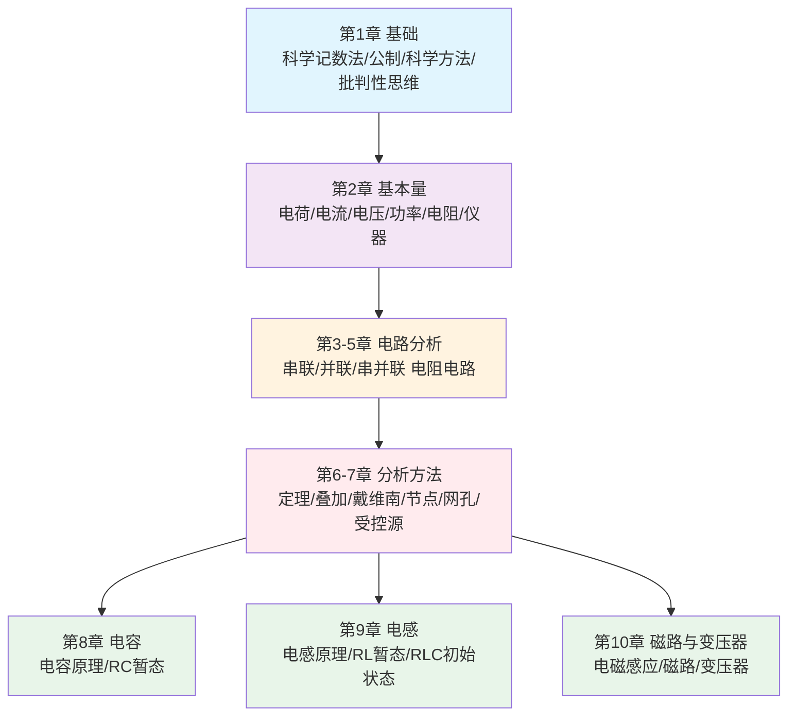

<!-- Post: 【DC电路分析系列】一图读懂DC电路分析：10章知识结构与学习路径 | ID: 2026-025 | Created: 2026-09-02 | Tags: tech, books | Format: markdown -->

## 开篇：拿到一本374页的教材，从哪开始读？

你下载了一本免费的电子教材，标题是《DC Electrical Circuit Analysis》，翻开一看，374页，10章，满篇的公式、图表、练习题。你深吸一口气，决定从第1页开始读。

但读了几页，你开始犹豫：第1章讲有效数字和科学记数法，这些我高中就学过了，还要重读吗？第10章讲磁路和变压器，我做嵌入式开发的，需要学吗？哪些章节是核心，哪些可以跳过？

这篇文章就是来回答这些问题的。我们站在高处俯瞰全书，用一张图看懂10章的结构关系，用一张表知道每章讲什么、对谁有用、重要程度如何，再给你两条不同的学习路径，让你根据自己的目标选择读什么、跳过什么。

---

## 全书结构总览

这本书的10章不是平铺的，而是有明显的递进关系，可以分成5个模块：



**五个模块的关系**：

| 模块 | 章节 | 定位 | 比喻 |
|---|---|---|---|
| **基础** | 第1章 | 科学方法和思维方式 | 学做菜前先学卫生和安全 |
| **基本量** | 第2章 | 电学的"字母表"——电流、电压、电阻是什么 | 学做菜前先认识锅碗瓢盆和调料 |
| **电路分析** | 第3-5章 | 三种基本电路结构的分析方法 | 学会炒青菜、煮鸡蛋、做汤这三道基础菜 |
| **分析方法** | 第6-7章 | 复杂电路的系统化解法 | 学会菜谱组合、火候控制、食材搭配，能做一桌菜 |
| **储能元件与磁路** | 第8-10章 | 电容、电感、变压器——动态元件和磁现象 | 烘焙、烧烤、甜品——选你需要的方向深入 |

**关键认知**：第1-7章是**必学的基础**，前后依赖、不能跳过；第8-10章是**三个相对独立的应用方向**，可以根据你的目标选择性深入。

---

## 10章速查表

| 章 | 标题 | 页码 | 核心内容 | 实践应用场景 | 重要程度 |
|---|---|---|---|---|---|
| **1** | Fundamentals（基础） | p10-29 | 有效数字、科学记数法、公制、科学方法、批判性思维、RoHS | 所有工程学习的思维基础 | ⭐⭐⭐ 了解即可 |
| **2** | Basic Quantities（基本量） | p30-73 | 原子模型、电荷/电流、能量/电压、功率/效率、电池寿命、电阻/电导、仪器测量 | 所有电路分析的基础，万用表使用 | ⭐⭐⭐⭐⭐ 必读 |
| **3** | Series Resistive Circuits（串联电阻电路） | p74-109 | 电流方向、串联连接、欧姆定律、KVL、串联分析、电位器/变阻器 | 分压电路、LED限流、电位器调压 | ⭐⭐⭐⭐⭐ 必读 |
| **4** | Parallel Resistive Circuits（并联电阻电路） | p110-137 | 并联连接、KCL、并联分析、电流分流、保险丝/断路器 | 电流分配、保险丝选择、负载并联 | ⭐⭐⭐⭐⭐ 必读 |
| **5** | Series-Parallel（串并联电路） | p138-169 | 串并联化简、综合分析、逐步求解 | 实际电路几乎都是串并联混合 | ⭐⭐⭐⭐⭐ 必读 |
| **6** | Analysis Theorems（分析定理） | p170-213 | 电源转换、叠加定理、戴维南/诺顿、最大功率传输、Δ-Y转换 | 复杂电路化简、阻抗匹配、负载分析 | ⭐⭐⭐⭐ 重要 |
| **7** | Nodal & Mesh（节点/网孔分析） | p214-259 | 节点分析、网孔分析、受控源 | 多电源复杂电路、SPICE仿真底层原理 | ⭐⭐⭐⭐ 重要 |
| **8** | Capacitors（电容） | p260-293 | 电容原理、RC初始/稳态分析、RC暂态响应（充放电）、时间常数 | 电源滤波、定时电路、ADC采样保持、去耦电容 | ⭐⭐⭐⭐ 硬件必读 |
| **9** | Inductors（电感） | p294-323 | 电感原理、RL初始/稳态分析、RLC初始状态、RL暂态响应 | 开关电源、电机驱动、继电器、EMI滤波 | ⭐⭐⭐ 电源/电力必读 |
| **10** | Magnetic Circuits（磁路与变压器） | p324-353 | 电磁感应、磁路分析（类比电路）、变压器原理 | 电源变压器、电感设计、电机、无线充电 | ⭐⭐ 电力/电源必读 |

> **重要程度说明**：
> - ⭐⭐⭐⭐⭐ 必读：所有电路应用的基础，不学后面全是空中楼阁
> - ⭐⭐⭐⭐ 重要：工程实践中高频使用，建议掌握
> - ⭐⭐⭐ 选学：特定领域需要，其他领域了解概念即可
> - ⭐⭐ 了解即可：知道有这个东西，需要时再深入

---

## 两条学习路径

### 路径一：精读路径（适合学生/备考/系统学习）

**目标**：完整掌握DC电路分析的全部知识体系，能应对考试和复杂电路设计。

**顺序**：第1章 → 第2章 → 第3章 → 第4章 → 第5章 → 第6章 → 第7章 → 第8章 → 第9章 → 第10章

**每章学习方法**：
1. 先读学习目标，知道学完能做什么
2. 逐节阅读，每个例题自己先算一遍再看答案
3. 用SPICE仿真验证每个例题的结果
4. 做练习题：分析题必做，设计题选做，挑战题量力而行
5. 画电路图和等效电路，建立直观理解

**预计时间**：每章6-10小时，全书约80小时（约2-3个月，每天1小时）

**适合人群**：电子/电气专业学生、准备电路分析考试、想系统建立电路理论基础

---

### 路径二：实践导向路径（适合硬件/嵌入式/无线电开发者）

**目标**：快速掌握工作中真正用到的DC电路知识，能解决实际工程问题，不追求理论完备。

**顺序**：

```
第一阶段（基础，必学，约20小时）：
  第2章（基本量）→ 第3章（串联）→ 第4章（并联）→ 第5章（串并联）

第二阶段（方法，重要，约15小时）：
  第6章（分析定理，重点学戴维南和最大功率传输）
  第7章（节点/网孔分析，了解原理，实际用SPICE代替手算）

第三阶段（按方向选学，每章约6-8小时）：
  硬件/电源方向 → 第8章（电容）→ 第9章（电感）→ 第10章（变压器）
  嵌入式/MCU方向 → 第8章（电容，重点学去耦/滤波/定时）
  无线电/SDR方向 → 第8章（电容）→ 第9章（电感，为AC谐振打基础）

第1章（基础）：快速浏览，重点看批判性思维和科学方法，有效数字和公制可以跳过
```

**每章学习方法**：
1. 读学习目标，只关注和你工作相关的目标
2. 跳过纯数学推导，直接看结论和例题
3. 每个例题用SPICE仿真验证，理解"输入什么、输出什么、为什么"
4. 只做和你方向相关的练习题
5. 把学到的方法立刻用到你正在做的项目里

**预计时间**：第一阶段20小时 + 第二阶段15小时 + 第三阶段12-24小时 = 约47-59小时（约1.5-2个月，每天1小时）

**适合人群**：硬件工程师、嵌入式开发者、无线电/SDR爱好者、音频工程师

---

## 哪些章节必读，哪些可以跳过

### 绝对不能跳过（第2-5章）

这4章是DC电路分析的"字母表"——不学就看不懂后面的任何内容。

- **第2章**：电流、电压、电阻、功率的定义，是所有电路分析的基础
- **第3-5章**：串联、并联、串并联是所有实际电路的基本结构，就像学做饭先学炒煮蒸

> 作者在第3章引言里说，串联电路是最基本的电路结构，欧姆定律和KVL是分析串联电路的核心工具。（第74页，3.1 Introduction）

### 建议掌握（第6-7章）

这两章是"工具集"——让你能分析更复杂的电路。

- **第6章**：戴维南等效和最大功率传输是工程中最常用的两个定理
- **第7章**：节点/网孔分析是系统化的解题方法，实际工作中通常用SPICE代替手算，但理解原理能帮你判断仿真结果对不对

### 按方向选学（第8-10章）

这三章是三个独立的应用方向，**不需要全学**，按你的工作方向选择：

| 你的方向 | 必读 | 选读 | 可以跳过 |
|---|---|---|---|
| **硬件/电源** | 第8章（电容）、第9章（电感）、第10章（变压器） | — | — |
| **嵌入式/MCU** | 第8章（电容，去耦/滤波/定时） | 第9章（电机驱动时需要） | 第10章 |
| **无线电/SDR** | 第8章（电容）、第9章（电感，为AC谐振打基础） | 第10章（天线/变压器匹配） | — |
| **数字/软件** | 第8章（了解去耦电容原理） | — | 第9章、第10章 |
| **工业/电力** | 第9章（电感）、第10章（变压器） | 第8章 | — |

### 可以快速浏览（第1章）

第1章讲有效数字、科学记数法、公制、科学方法、批判性思维。如果你有高中理科基础，有效数字和公制可以跳过，但**科学方法和批判性思维这两节值得一读**——作者用电路分析的例子讲解了如何避免认知偏差和逻辑谬误，这对任何工程学习都有帮助。

> 作者说："Critical Thinking: Avoiding Being Fooled"（批判性思维：避免被愚弄），列举了认知偏差和逻辑谬误。（第21页，1.6 Critical Thinking）

---

## 配套资源

这本书不是孤立的，作者提供了一整套学习资源：

| 资源 | 说明 | 怎么用 |
|---|---|---|
| **YouTube频道** | Electronics with Professor Fiore | 作者亲自讲解的视频课程，和教材章节对应 |
| **SPICE仿真** | 书中大量例题配有SPICE仿真 | 下载免费的LTspice，打开仿真文件，边看边改参数 |
| **实验手册** | 作者有配套实验手册 | 学完理论后做实验，手脑结合 |
| **AC电路教材** | 《AC Electrical Circuit Analysis》（同作者，免费） | 学完DC后继续学AC，两本书结构一致 |
| **其他教材** | 半导体器件、运算放大器、嵌入式C(Arduino) | 学完电路分析后继续深入电子学其他方向 |
| **附录** | 标准元件值、线性方程组解法、公式证明、奇数题答案 | 做设计题时查标准电阻值，卡住时看答案反推思路 |

---

## 小结

这篇文章我们做了三件事：

1. **画了一张全书结构图**：10章分成5个模块——基础（第1章）→ 基本量（第2章）→ 电路分析（第3-5章）→ 分析方法（第6-7章）→ 储能元件与磁路（第8-10章），前后依赖、层层递进。
2. **做了一张10章速查表**：每章的页码、核心内容、实践应用场景、重要程度一目了然，帮你快速判断"这章对我有没有用"。
3. **给了两条学习路线**：
   - **精读路径**：按顺序读完全书，适合学生/备考，约80小时
   - **实践导向路径**：先学第2-7章基础，再按方向选学第8-10章，适合硬件/嵌入式/无线电开发者，约47-59小时

最重要的一句话：**第2-5章是基础，绝对不能跳过；第6-7章是工具，建议掌握；第8-10章是应用，按方向选学；第1章快速浏览即可。**

下一篇（第3篇），我们会深入到6个核心主题的学习路线图，告诉你每个主题学什么、为什么重要、对应哪些实践项目，以及主题之间的依赖关系。

---

## 系列导航

**【DC电路分析系列】共11篇，基于 James M. Fiore《DC Electrical Circuit Analysis: A Practical Approach》(Version 1.0.14, 2025)**

| 序号 | 文章 | 状态 |
|---|---|---|
| 第1篇 | 电到底是什么？——从一个「傻问题」开始的电路分析之旅 | ✅ 已发布 |
| 第2篇 | 一图读懂DC电路分析：10章知识结构与学习路径 | ✅ 本篇 |
| 第3篇 | DC电路分析的6大核心主题：从基本量到磁路变压器的学习路线 | ⏳ 即将发布 |
| 第4篇 | 电流、电压、电阻到底是什么？——从原子到万用表的逐层拆解 | ⏳ 即将发布 |
| 第5篇 | 欧姆定律和基尔霍夫定律：串并联电路的三板斧 | ⏳ 即将发布 |
| 第6篇 | 复杂电路怎么解？叠加定理、戴维南、节点分析的系统方法 | ⏳ 即将发布 |
| 第7篇 | 电容充电到底需要多久？——RC时间常数与暂态响应详解 | ⏳ 即将发布 |
| 第8篇 | 电感为什么「讨厌」电流变化？——RL时间常数与暂态响应详解 | ⏳ 即将发布 |
| 第9篇 | 变压器为什么能改变电压？——磁路分析与电磁感应的本质 | ⏳ 即将发布 |
| 第10篇 | DC电路分析在电子学知识体系中的位置：与模电/嵌入式/无线电的横向对比 | ⏳ 即将发布 |
| 第11篇 | 读完DC电路分析之后：独立思考、实践路线图与进一步学习 | ⏳ 即将发布 |

> 本书为开源教育资源（Creative Commons BY-NC-SA），可免费下载：[www.mvcc.edu/jfiore](https://www.mvcc.edu/jfiore) 或 [www.dissidents.com](https://www.dissidents.com)
> 作者YouTube频道：Electronics with Professor Fiore
