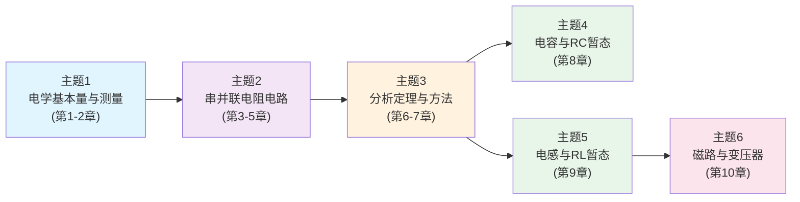

<!-- Post: 【DC电路分析系列】DC电路分析的6大核心主题：从基本量到磁路变压器的学习路线 | ID: 2026-026 | Created: 2026-09-02 | Tags: tech, books | Format: markdown -->

## 开篇：为什么不能按章节顺序死读？

你买了一本教材，翻开目录，10章整整齐齐。你决定从第1章开始，一章一章读，读到第10章。

听起来很合理，对不对？

但问题是：教材的章节顺序是**按知识的逻辑递进**排的，不是按**你学习的效率**排的。第1章讲有效数字，第2章讲基本量，第3章讲串联电路……每章之间都有依赖，但有些章节对你的目标来说根本不重要，有些章节可以合并起来学，有些章节可以放到最后再补。

这篇文章把全书10章重新组织成**6个核心主题**，每个主题告诉你：为什么重要、学什么、对应什么实践项目、学完能回答什么问题。主题之间有明确的依赖关系，你可以按顺序学，也可以根据你的目标跳着学。

---

## 6个核心主题总览

**依赖关系说明**：
- 主题1→主题2→主题3是**主线**，必须按顺序学，前后依赖
- 主题4（电容）和主题5（电感）是**两个并行分支**，都依赖主题3，可以先学电容再学电感，也可以反过来
- 主题6（磁路与变压器）依赖主题5（电感），因为变压器的原理建立在电感和电磁感应之上

**学习顺序建议**：
- **完整学习**：主题1→2→3→4→5→6（按依赖关系，最系统）
- **硬件/电源方向**：主题1→2→3→4→5→6（全部需要，磁路和变压器尤其重要）
- **嵌入式/MCU方向**：主题1→2→3→4（电容最重要，电感和磁路了解即可）
- **无线电/SDR方向**：主题1→2→3→4→5（电容和电感都需要，为AC谐振打基础，磁路了解即可）

---

## 主题1：电学基本量与测量

**对应章节**：第1章（基础）+ 第2章（基本量）

### 为什么重要

这是整个电路分析的"字母表"。电流、电压、电阻、功率这些概念，就像学英语的26个字母——不认识字母，后面的单词、句子、文章全是天书。

更重要的是，这个主题还教你**怎么测量**——万用表怎么用、量程怎么选、测量误差从哪来。理论学得再好，不会用仪器验证，就是纸上谈兵。

### 学什么

| 知识点 | 核心内容 | 生活类比 |
|---|---|---|
| 电荷与电流 | 电荷是什么、电流的定义、电流方向的约定 | 水管里的水流 |
| 能量与电压 | 电压的定义、电势差、电压是"动力" | 水压 |
| 功率与效率 | 功率的定义、P=VI、效率、电费计算 | 汽车的马力和油耗 |
| 电阻与电导 | 电阻的定义、电导、电阻的温度系数 | 水管的粗细和阻力 |
| 仪器测量 | 万用表的使用、量程选择、测量误差、负载效应 | 用尺子量长度，尺子有精度限制 |

### 实践项目

1. **用万用表测一节干电池的电压**：选对量程，记录读数，理解"开路电压"和"带载电压"的区别
2. **测一个LED的电流和电压**：串联电阻限流，用万用表测电流和电压，计算功率，验证P=VI
3. **算一个月的电费**：列出家里的电器功率和使用时间，计算总用电量，对照电费单验证

### 学完能回答什么问题

- 电流、电压、电阻、功率分别是什么？单位是什么？
- 为什么电流方向和电子流动方向相反？
- 万用表测电压和测电流时，接法有什么不同？为什么？
- 一个100W的灯泡和一个100W的电机，耗电量一样吗？为什么？

---

## 主题2：串并联电阻电路

**对应章节**：第3章（串联）+ 第4章（并联）+ 第5章（串并联）

### 为什么重要

实际电路几乎都是电阻的串联、并联或串并联混合。学会分析这三种结构，你就能看懂80%以上的简单电路——分压电路、限流电路、电桥、负载网络……

这个主题的核心是两个定律：**欧姆定律**（I=V/R）和**基尔霍夫定律**（KVL电压定律 + KCL电流定律）。这三个定律是电路分析的"牛顿三定律"，所有更复杂的分析方法都建立在它们之上。

### 学什么

| 知识点 | 核心内容 | 生活类比 |
|---|---|---|
| 串联电路 | 串联连接、电流处处相等、电压相加、电阻相加 | 水管串联，水流一样，水压相加 |
| 欧姆定律 | I=V/R、V=IR、R=V/I | 水流=水压/阻力 |
| KVL（基尔霍夫电压定律） | 闭合回路电压和为零 | 绕一圈回到原点，高度变化和为零 |
| 并联电路 | 并联连接、电压处处相等、电流相加、电阻倒数相加 | 水管并联，水压一样，水流相加 |
| KCL（基尔霍夫电流定律） | 节点电流和为零 | 水管分叉，流入=流出 |
| 串并联混合 | 逐步化简、从内到外、等效电阻 | 复杂水管网络，逐步合并 |
| 电位器与变阻器 | 分压电路、可调电阻、功率限制 | 可调水龙头 |
| 保险丝与断路器 | 电流限制、过流保护、额定电流选择 | 水管的减压阀 |

### 实践项目

1. **做一个LED分压电路**：用电阻和LED串联，计算限流电阻，用万用表验证电压和电流
2. **做一个电位器分压电路**：用电位器调节输出电压，用万用表测不同位置的电压，验证分压公式
3. **分析一个实际电路**：找一个简单的电子设备（如充电宝、LED灯），画出电路图，识别串联和并联部分，计算等效电阻

### 学完能回答什么问题

- 串联电路和并联电路，电流和电压分别有什么特点？
- 两个电阻并联，等效电阻为什么比最小的那个还小？
- 电位器为什么能调节电压？分压公式怎么推导？
- 保险丝的额定电流怎么选？为什么不能用铜丝代替保险丝？

---

## 主题3：分析定理与方法

**对应章节**：第6章（分析定理）+ 第7章（节点/网孔分析）

### 为什么重要

当电路里有多个电源、十几个电阻、还有受控源的时候，用欧姆定律和基尔霍夫定律一步步算，会算到崩溃。这个主题教你**系统化的分析方法**，让复杂电路变得可解。

更重要的是，这些方法是SPICE仿真软件的底层原理。理解了节点分析和网孔分析，你就知道SPICE在背后做了什么，就能判断仿真结果对不对、什么时候该信仿真、什么时候该怀疑。

### 学什么

| 知识点 | 核心内容 | 适用场景 |
|---|---|---|
| 电源转换 | 电压源↔电流源等效转换 | 化简电路 |
| 叠加定理 | 多个电源分别作用，结果相加 | 多电源线性电路 |
| 戴维南定理 | 任意线性网络等效为电压源+电阻 | 负载分析、阻抗匹配 |
| 诺顿定理 | 任意线性网络等效为电流源+电阻 | 戴维南的对偶形式 |
| 最大功率传输 | 负载电阻=源内阻时，功率最大 | 音频功放、射频匹配 |
| Δ-Y转换 | 三角形网络↔星形网络转换 | 电桥、三相电路 |
| 节点分析 | 选参考节点，列KCL方程，解方程组 | 多节点复杂电路 |
| 网孔分析 | 选网孔，列KVL方程，解方程组 | 多网孔复杂电路 |
| 受控源 | 电压控制电压源/电流源等 | 晶体管、运放模型 |

### 实践项目

1. **用戴维南定理分析一个分压电路的带载能力**：计算戴维南等效电压和电阻，分析不同负载下的输出电压
2. **用C语言实现高斯消元解节点方程组**：写一个简单的程序，输入节点数和电导矩阵，输出节点电压
3. **用SPICE仿真验证叠加定理**：建一个双电源电路，分别仿真每个电源单独作用，验证结果相加等于同时作用

### 学完能回答什么问题

- 戴维南等效和诺顿等效有什么关系？怎么互相转换？
- 为什么最大功率传输时效率只有50%？这合理吗？
- 节点分析和网孔分析，什么时候用哪个？
- 受控源为什么不能用叠加定理直接处理？

---

## 主题4：电容与RC暂态

**对应章节**：第8章（电容）

### 为什么重要

电容是电子电路中最常用的元件之一——电源滤波、去耦、定时、ADC采样保持、耦合、旁路……几乎每个电路板上都有几十个电容。理解了电容的充放电过程（暂态响应），你就能看懂这些电路为什么这么设计。

这个主题的核心概念是**时间常数τ=RC**。它决定了电容充电和放电的快慢，是所有RC电路设计的基础。

### 学什么

| 知识点 | 核心内容 | 生活类比 |
|---|---|---|
| 电容原理 | 两个极板+绝缘介质、储存电荷、C=Q/V | 水桶，装水的容量 |
| 电容的V-I关系 | i=C(dv/dt)、电压不能突变 | 水桶的水位不能突变 |
| 初始状态分析 | t=0+时电容相当于电压源 | 水桶初始水位 |
| 稳态分析 | 直流稳态下电容相当于开路 | 水桶装满水后不再进水 |
| RC充电暂态 | v(t)=V(1-e^(-t/RC))、时间常数τ | 水桶接水龙头，水位逐渐上升 |
| RC放电暂态 | v(t)=V(e^(-t/RC))、5τ后基本完成 | 水桶放水，水位逐渐下降 |
| 实际电容 | 漏电流、ESR、ESL、电压额定值 | 水桶有裂缝、有重量、有最大容量 |

### 实践项目

1. **做一个RC定时电路**：用555定时器或单片机，计算RC值实现特定的延时，用示波器验证波形
2. **设计一个电源滤波电容**：根据纹波要求计算滤波电容值，用SPICE仿真验证纹波大小
3. **分析一个去耦电容的作用**：在电源引脚旁加0.1μF去耦电容，用示波器测加与不加的噪声差异

### 学完能回答什么问题

- 为什么电容两端电压不能突变？
- 时间常数τ=RC是什么意思？为什么5τ后基本完成充放电？
- 电源滤波电容为什么越大越好？又不是越大越好？
- 去耦电容为什么要放在芯片电源引脚旁边？放远了会怎样？

---

## 主题5：电感与RL暂态

**对应章节**：第9章（电感）

### 为什么重要

电感在电源（开关电源、DC-DC）、电机驱动、继电器、EMI滤波、射频电路中无处不在。和电容对偶，电感储存磁场能量，电流不能突变。

理解了电感的暂态响应，你就能理解为什么断开继电器时会产生火花、为什么开关电源需要续流二极管、为什么电机驱动电路要加吸收电路。

### 学什么

| 知识点 | 核心内容 | 生活类比 |
|---|---|---|
| 电感原理 | 线圈+磁芯、储存磁场能量、v=L(di/dt) | 飞轮，储存转动能量 |
| 电感的V-I关系 | v=L(di/dt)、电流不能突变 | 飞轮的转速不能突变 |
| 初始状态分析 | t=0+时电感相当于电流源 | 飞轮初始转速 |
| 稳态分析 | 直流稳态下电感相当于短路 | 飞轮匀速转动时不需要额外力 |
| RL通电暂态 | i(t)=I(1-e^(-tR/L))、时间常数τ=L/R | 飞轮从静止加速到匀速 |
| RL断电暂态 | i(t)=I(e^(-tR/L))、感应电动势 | 飞轮减速，产生反向力 |
| RLC初始状态 | 电容和电感同时存在的初始条件 | 水桶+飞轮的组合系统 |
| 实际电感 | DCR、磁芯损耗、寄生电容、饱和电流 | 飞轮有摩擦、有重量限制 |

### 实践项目

1. **观察继电器断开时的火花**：用示波器测继电器线圈两端的电压，观察断开瞬间的尖峰，加续流二极管后再测
2. **设计一个简单的Buck降压电路**：用电感、二极管、电容和开关，实现DC-DC降压，用示波器测输出纹波
3. **分析一个电机驱动的吸收电路**：在电机两端加RC吸收电路，用示波器测加与不加的电压尖峰差异

### 学完能回答什么问题

- 为什么电感电流不能突变？
- 为什么断开电感时会产生高压尖峰？续流二极管怎么工作？
- RL电路的时间常数τ=L/R，和RC的τ=RC有什么对偶关系？
- 开关电源里的电感怎么选？饱和电流是什么意思？

---

## 主题6：磁路与变压器

**对应章节**：第10章（磁路与变压器）

### 为什么重要

变压器是电力系统和电子电源的核心元件——从电网的高压输电变压器，到手机充电器里的高频变压器，再到隔离电源里的脉冲变压器。理解了磁路和变压器原理，你就能看懂这些设备怎么工作、怎么设计。

这个主题的核心思路是**磁路-电路类比**：磁通对应电流，磁动势对应电压，磁阻对应电阻，磁路的KVL和KCL和电路完全一样。用你已经学会的电路分析方法，就能分析磁路。

### 学什么

| 知识点 | 核心内容 | 电路类比 |
|---|---|---|
| 电磁感应 | 法拉第定律、楞次定律、感应电动势 | — |
| 磁路基本量 | 磁通Φ、磁动势F、磁阻R、磁场强度H、磁感应强度B | 电流、电压、电阻 |
| 磁路KVL/KCL | 闭合磁路磁动势和为零、节点磁通和为零 | 电路KVL/KCL |
| 磁芯材料 | 铁磁材料、磁化曲线、磁滞、饱和 | — |
| 变压器原理 | 变压比、变流比、阻抗变换 | — |
| 实际变压器 | 铜损、铁损、漏感、效率、饱和 | — |

### 实践项目

1. **拆一个旧变压器**：观察铁芯结构、绕组匝数，测量初级和次级电阻，估算变压比
2. **做一个简单的阻抗匹配实验**：用变压器实现扬声器和功放的阻抗匹配，比较匹配与不匹配的音量差异
3. **用SPICE仿真一个反激电源**：建一个简单的反激变换器模型，观察变压器原边和副边的电压电流波形

### 学完能回答什么问题

- 磁路和电路的类比关系是什么？哪些量对应？
- 变压器为什么能改变电压？功率守恒吗？
- 变压器的阻抗变换是什么意思？怎么计算？
- 变压器饱和是什么意思？饱和后会发生什么？

---

## 6个主题的检查清单

学完每个主题后，用这个清单检查自己是否真的掌握了：

| 主题 | 核心检查项 | 通过标准 |
|---|---|---|
| 1. 基本量 | 能说出电流/电压/电阻/功率的定义和单位，会用万用表 | 不看书写出定义，正确测量 |
| 2. 串并联 | 能分析任意串并联电阻电路，计算等效电阻和各点电压电流 | 给一个电路图，5分钟内算出结果 |
| 3. 分析方法 | 能用戴维南/节点分析解复杂电路，理解SPICE底层原理 | 给一个多电源电路，用两种方法验证结果一致 |
| 4. 电容 | 能计算RC充放电曲线，理解时间常数，设计滤波/去耦电路 | 给一个RC电路，画出充放电曲线，算出特定时间的电压 |
| 5. 电感 | 能计算RL暂态，理解续流二极管，设计简单开关电源 | 给一个RL电路，分析通电和断电过程，解释尖峰产生原因 |
| 6. 磁路 | 能用磁路-电路类比分析磁路，理解变压器原理 | 给一个简单磁路，用电路方法算出磁通和磁感应强度 |

---

## 小结

这篇文章我们做了三件事：

1. **把10章重新组织成6个核心主题**：基本量与测量→串并联电阻电路→分析定理与方法→电容与RC暂态→电感与RL暂态→磁路与变压器，主题之间有明确的依赖关系。
2. **每个主题讲清楚四件事**：为什么重要、学什么（配生活类比）、实践项目、学完能回答什么问题。
3. **给了一个检查清单**：学完每个主题后，用具体的检查项验证自己是否真的掌握了。

最重要的一句话：**前3个主题是所有电路应用的基础，必须扎实掌握；后3个主题按你的方向选学，硬件/电源方向全学，嵌入式重点学电容，无线电重点学电容和电感。**

下一篇（第4篇），我们开始深入第一个核心主题——电流、电压、电阻到底是什么？从原子模型到万用表，逐层拆解电学基本量。

---

## 系列导航

**【DC电路分析系列】共11篇，基于 James M. Fiore《DC Electrical Circuit Analysis: A Practical Approach》(Version 1.0.14, 2025)**

| 序号 | 文章 | 状态 |
|---|---|---|
| 第1篇 | 电到底是什么？——从一个「傻问题」开始的电路分析之旅 | ✅ 已发布 |
| 第2篇 | 一图读懂DC电路分析：10章知识结构与学习路径 | ✅ 已发布 |
| 第3篇 | DC电路分析的6大核心主题：从基本量到磁路变压器的学习路线 | ✅ 本篇 |
| 第4篇 | 电流、电压、电阻到底是什么？——从原子到万用表的逐层拆解 | ⏳ 即将发布 |
| 第5篇 | 欧姆定律和基尔霍夫定律：串并联电路的三板斧 | ⏳ 即将发布 |
| 第6篇 | 复杂电路怎么解？叠加定理、戴维南、节点分析的系统方法 | ⏳ 即将发布 |
| 第7篇 | 电容充电到底需要多久？——RC时间常数与暂态响应详解 | ⏳ 即将发布 |
| 第8篇 | 电感为什么「讨厌」电流变化？——RL时间常数与暂态响应详解 | ⏳ 即将发布 |
| 第9篇 | 变压器为什么能改变电压？——磁路分析与电磁感应的本质 | ⏳ 即将发布 |
| 第10篇 | DC电路分析在电子学知识体系中的位置：与模电/嵌入式/无线电的横向对比 | ⏳ 即将发布 |
| 第11篇 | 读完DC电路分析之后：独立思考、实践路线图与进一步学习 | ⏳ 即将发布 |

> 本书为开源教育资源（Creative Commons BY-NC-SA），可免费下载：[www.mvcc.edu/jfiore](https://www.mvcc.edu/jfiore) 或 [www.dissidents.com](https://www.dissidents.com)
> 作者YouTube频道：Electronics with Professor Fiore
