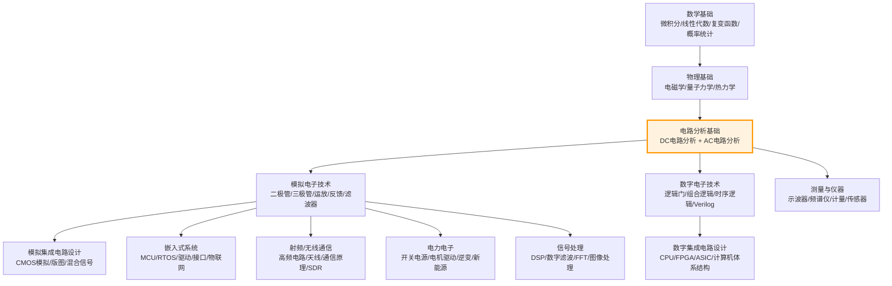

<!-- Post: 【DC电路分析系列】DC电路分析在电子学知识体系中的位置：与模电/嵌入式/无线电的横向对比 | ID: 2026-033 | Created: 2026-09-02 | Tags: tech, books | Format: markdown -->

## 开篇：学完DC电路分析，然后呢？

你花了几个月时间，把DC电路分析学完了——欧姆定律、基尔霍夫定律、戴维南定理、节点分析、电容、电感、变压器，都搞懂了。你合上书本，望着窗外，突然问自己：然后呢？

学完DC电路分析，不代表你就懂了电子学。DC电路分析只是电子学大厦的**地基**——上面还有AC电路分析、模拟电子技术、数字电子技术、嵌入式系统、射频/无线通信、电力电子、信号处理等一层层楼。

这篇文章我们就来做一个横向对比：DC电路分析在整个电子学知识体系中处于什么位置？它和其他学科有什么关系？学完DC之后该往哪个方向深入？不同方向需要哪些后续知识？

---

## 一、电子学知识体系全景图

电子学是一个庞大的知识体系，可以按从基础到应用的顺序排列：

**DC电路分析的位置**：在整个体系的最底层，是所有电子学分支的共同基础。不管你将来做模拟、数字、嵌入式、射频还是电力电子，DC电路分析的知识都是每天都要用的。

**生活类比**：这就像盖房子——DC电路分析是地基，AC电路分析是一楼，模电和数电是二楼，嵌入式、射频、电力电子是三楼及以上。地基不牢，上面的楼随时会塌。

---

## 二、DC → AC：电路分析的完整闭环

### DC和AC的关系

DC电路分析和AC电路分析是电路分析的两个半部分，合起来才是完整的电路分析：

| 对比维度 | DC电路分析 | AC电路分析 |
|---|---|---|
| 信号类型 | 直流（恒定不变） | 交流（随时间变化，通常是正弦波） |
| 元件模型 | 电阻、电容（稳态开路）、电感（稳态短路） | 电阻、电容（阻抗1/jωC）、电感（阻抗jωL） |
| 数学工具 | 代数、实数 | 复数、相量、微积分 |
| 核心概念 | 欧姆定律、KVL/KCL、戴维南、节点分析 | 阻抗、导纳、谐振、频率响应、伯德图 |
| 功率 | P=VI（恒定） | 有功/无功/视在功率、功率因数 |
| 暂态 | RC/RL充放电（指数曲线） | 全响应（暂态+稳态）、二阶电路 |

### 为什么要先学DC再学AC

- DC是AC的特例——当频率为0时，AC就变成了DC
- DC的数学简单（实数代数），容易建立直观理解
- AC的复数阻抗、相量等概念比较抽象，需要DC的基础才能理解
- 很多实际电路在DC偏置下工作（如三极管的静态工作点），需要先会DC分析

### Fiore的两本教材

作者James M. Fiore写了配套的两本教材：
- 《DC Electrical Circuit Analysis》——你正在读的这本
- 《AC Electrical Circuit Analysis》——配套的AC教材，结构和DC一致

两本书的章节结构是对应的：
- DC第3-5章（串并联）→ AC第2-4章（串联/并联/串并联RLC）
- DC第6-7章（分析定理/节点网孔）→ AC第5-6章（分析定理/节点网孔）
- DC第8-9章（电容/电感）→ AC第1章（复数/相量基础）
- DC第10章（磁路/变压器）→ AC第8章（多相系统）

> 作者在前言里说："The companion AC Electrical Circuit Analysis text picks up where this one leaves off."（第4页，Preface）
>
> 翻译：配套的《AC电路分析》教材从这本书结束的地方继续。

---

## 三、DC电路分析 → 各方向的进阶路径

### 方向一：模拟电子技术

**DC知识用在哪**：
- 二极管的直流偏置和负载线分析
- 三极管的静态工作点（Q点）计算
- 运放电路的直流偏置和失调分析
- 反馈电路的直流稳定性分析
- 电源电路的直流分析

**需要补充的知识**：
- 半导体物理（PN结、载流子、能带）
- 二极管/三极管/MOS管的特性曲线和模型
- 运放的内部结构和非理想特性
- 反馈理论（负反馈/正反馈、稳定性、相位裕度）
- 滤波器设计（有源滤波器、RC/LC滤波器）
- SPICE仿真（LTspice、PSpice）

**推荐教材**：
- 《Electronic Devices and Circuit Theory》（Boylestad）
- 《Operational Amplifiers and Linear Integrated Circuits》（Fiore，同作者，开源免费）
- 《Art of Electronics》（Horowitz & Hill，经典）

### 方向二：数字电子技术

**DC知识用在哪**：
- 逻辑门的直流电平（高电平/低电平阈值）
- 数字电路的直流功耗分析
- 接口电路的电平匹配（5V↔3.3V↔1.8V）
- 上拉/下拉电阻的计算
- 总线终端电阻的计算

**需要补充的知识**：
- 布尔代数和逻辑化简
- 组合逻辑电路（编码器、译码器、多路选择器、加法器）
- 时序逻辑电路（触发器、寄存器、计数器、状态机）
- Verilog/VHDL硬件描述语言
- FPGA/CPLD开发
- 计算机体系结构（CPU、内存、总线）

**推荐教材**：
- 《Digital Fundamentals》（Floyd）
- 《Digital Design》（Morris Mano）
- 《Verilog HDL数字设计与综合》（Samir Palnitkar）

### 方向三：嵌入式系统

**DC知识用在哪**：
- MCU外围电路的直流偏置（复位电路、晶振电路、电源去耦）
- 传感器接口电路（分压、电平转换、滤波）
- 电机驱动电路（H桥、续流二极管、电流采样）
- 电源管理（LDO、DC-DC、电池充放电）
- ADC/DAC的直流精度分析

**需要补充的知识**：
- MCU架构（ARM Cortex-M、RISC-V、8051）
- 嵌入式C语言（寄存器操作、中断、DMA）
- 通信接口（UART、SPI、I2C、CAN、USB）
- RTOS（FreeRTOS、RT-Thread、Zephyr）
- 驱动开发（GPIO、定时器、PWM、ADC、DAC）
- 低功耗设计
- 物联网（Wi-Fi、蓝牙、LoRa、NB-IoT）

**推荐教材**：
- 《Embedded Systems: Introduction to ARM Cortex-M Microcontrollers》（Yifeng Zhu）
- 《嵌入式C语言自我修养》
- 《FreeRTOS内核实现与应用开发实战》

### 方向四：射频/无线通信

**DC知识用在哪**：
- 射频电路的直流偏置（功放、低噪声放大器的静态工作点）
- 阻抗匹配的直流分析
- 射频开关的直流控制
- 天线的直流馈电
- 电源滤波和去耦（射频对电源噪声非常敏感）

**需要补充的知识**：
- AC电路分析（阻抗、谐振、频率响应）
- 传输线理论（特性阻抗、反射、驻波、史密斯圆图）
- 射频器件（混频器、放大器、振荡器、滤波器）
- 天线理论（偶极子、微带天线、天线增益、方向图）
- 通信原理（调制解调、编码、信道、信噪比）
- SDR（软件无线电，GNU Radio、HackRF、USRP）
- 电磁兼容（EMC/EMI）

**推荐教材**：
- 《RF Microelectronics》（Razavi）
- 《Fundamentals of Applied Electromagnetics》（Ulaby）
- 《Software Defined Radio for Engineers》（Travis Collins）

### 方向五：电力电子

**DC知识用在哪**：
- 开关电源的直流分析（输入输出电压电流、占空比）
- 电机驱动的直流分析（H桥、电流环）
- 逆变器的直流母线分析
- 功率器件的直流特性（MOSFET/IGBT的导通电阻、压降）
- 无源元件的直流参数（电感的DCR、电容的ESR）

**需要补充的知识**：
- AC电路分析（功率因数、三相电）
- 功率半导体器件（二极管、MOSFET、IGBT、SiC、GaN）
- 变换器拓扑（Buck、Boost、Buck-Boost、反激、正激、半桥、全桥）
- 控制理论（PID、状态空间、平均建模）
- 电机控制（直流电机、步进电机、无刷电机、伺服）
- 新能源（光伏、风电、储能、电动汽车）
- 磁性元件设计（变压器、电感设计）

**推荐教材**：
- 《Fundamentals of Power Electronics》（Erickson）
- 《电力电子技术》（王兆安）
- 《Switching Power Supplies A to Z》（Sanjaya Maniktala）

---

## 四、同类教材横向对比

| 教材 | 作者 | 特点 | 适合人群 | 缺点 |
|---|---|---|---|---|
| **DC Electrical Circuit Analysis**（本书） | James M. Fiore | 开源免费、实践导向、从零开始、有SPICE仿真、配套YouTube视频 | 自学者、零基础、预算有限 | 无中文译本、深度有限、部分内容偏简单 |
| 《Electric Circuits》 | Nilsson & Riedel | 经典教材、体系完整、例题丰富、深度适中 | 大学生、系统学习 | 价格贵、部分内容偏理论、无免费版 |
| 《Engineering Circuit Analysis》 | Hayt et al. | 严谨、深入、工程导向 | 工程专业学生 | 难度较高、价格贵 |
| 《电路》（邱关源） | 邱关源 | 国内经典、中文、体系完整、考研指定教材 | 国内学生、考研 | 部分内容偏理论、实践案例少 |
| 《电路分析基础》 | 李瀚荪 | 国内经典、中文、通俗易懂 | 国内初学者 | 深度有限、新版较少 |

### Fiore教材的独特优势

1. **完全开源免费**：CC BY-NC-SA协议，可以免费下载PDF，甚至可以自己修改和印刷
2. **实践导向**：每章都有大量实例和SPICE仿真，不是纯理论
3. **配套视频**：作者有YouTube频道"Electronics with Professor Fiore"，视频讲解和教材对应
4. **体系完整**：DC、AC、半导体、运放、嵌入式C（Arduino）一整套，都是同作者同风格
5. **从零开始**：假设没有任何前置知识，从原子模型讲起，适合零基础自学者
6. **持续更新**：版本号1.0.14（2025年12月），一直在更新修正

### Fiore教材的局限

1. **无中文译本**：全英文，对英语不好的读者有门槛
2. **深度有限**：作为入门教材足够，但深入的内容（如高级网络理论、分布参数电路）没有涉及
3. **部分内容偏简单**：对于有基础的读者，前几章可能觉得太浅
4. **习题答案不完整**：只有奇数题答案，偶数题需要自己算或找教师版

---

## 五、不同基础的学习建议

| 你的基础 | 学习建议 | 预计时间 |
|---|---|---|
| **完全零基础**（连欧姆定律都不知道） | 从第1章开始按顺序读，每章做例题和习题，配合YouTube视频 | 3-6个月（每天1小时） |
| **高中物理基础**（知道欧姆定律，但没系统学过） | 快速浏览第1-2章，从第3章开始认真学，重点做习题 | 2-4个月 |
| **学过电路分析但忘了** | 直接看第2篇（全书地图）和第3篇（6大主题），按需深入，重点做综合题 | 1-2个月复习 |
| **电子工程师（工作多年）** | 跳过基础，直接看分析定理（第6-7章）和暂态响应（第8-9章），查缺补漏 | 2-4周 |
| **嵌入式/软件转硬件** | 重点学第2章（基本量）、第3-5章（串并联）、第8章（电容去耦）、第9章（电感/续流） | 1-2个月 |
| **无线电/SDR爱好者** | 重点学第2章（基本量）、第6-7章（分析方法）、第8-9章（电容/电感，为AC谐振打基础）、第10章（变压器/磁路） | 2-3个月 |

---

## 六、DC电路分析的"知识迁移"价值

学DC电路分析不只是为了学电路本身，它培养的思维方式可以迁移到很多其他领域：

| 思维方式 | 电路分析中的体现 | 迁移到其他领域 |
|---|---|---|
| **等效变换** | 戴维南/诺顿等效、电源转换、Δ-Y转换 | 系统建模、抽象思维、复杂问题化简 |
| **叠加原理** | 多电源电路分开算再相加 | 线性系统分析、信号处理、经济学 |
| **因果关系** | 电压是因、电流是果 | 系统思维、问题排查、根因分析 |
| **能量守恒** | 功率守恒、能量守恒 | 热力学、经济学、资源管理 |
| **稳态vs暂态** | 直流稳态vs充放电暂态 | 系统动力学、控制理论、经济学 |
| **反馈与稳定** | （延伸到模电）负反馈稳定工作点 | 控制理论、管理学、经济学 |
| **边界条件** | 电容电压不能突变、电感电流不能突变 | 物理直觉、工程约束、极限分析 |

**生活类比**：这就像学下棋——学的不只是规则，更是思维方式。布局、计算、判断、取舍，这些能力可以迁移到生活的方方面面。

---

## 七、常见误区与坑

| 误区 | 正确理解 |
|---|---|
| "学完DC电路分析就懂电子学了" | DC只是地基，上面还有AC、模电、数电、嵌入式、射频等很多层 |
| "做嵌入式不需要懂电路分析" | 嵌入式开发每天都要和硬件电路打交道，不懂电路分析会踩很多坑 |
| "做软件的不需要懂硬件" | 软硬件协同是趋势，懂硬件的软件工程师更有竞争力 |
| "理论没用，会用万用表就行" | 理论指导实践，不懂理论只能知其然不知其所以然，遇到新问题就不会分析 |
| "教材越厚越好" | 适合自己的才是最好的，零基础选薄一点的入门教材，有基础再选厚的 |
| "只看视频不看书" | 视频适合建立直观理解，书籍适合深入学习和查阅，两者配合最好 |
| "只看书不做实验" | 电路分析是实践学科，不做实验等于纸上谈兵，用面包板和万用表验证每个结论 |
| "学完就忘，白学了" | 知识会遗忘，但思维方式会留下；需要时再复习，比从零学快得多 |

---

## 小结

这篇文章我们做了一个全面的横向对比：

1. **电子学知识体系全景图**：DC电路分析是整个电子学大厦的地基，上面有AC、模电、数电、嵌入式、射频、电力电子等很多层
2. **DC → AC的完整闭环**：DC是AC的特例（频率为0），先学DC再学AC符合认知规律；Fiore的两本教材是配套的
3. **五个方向的进阶路径**：模拟电子、数字电子、嵌入式系统、射频/无线通信、电力电子，每个方向都列出了需要补充的知识和推荐教材
4. **同类教材横向对比**：Fiore教材的优势是开源免费、实践导向、配套视频、体系完整；局限是无中文译本、深度有限
5. **不同基础的学习建议**：从完全零基础到资深工程师，不同基础有不同的学习路径和时间估计
6. **知识迁移价值**：电路分析培养的等效变换、叠加原理、因果关系、能量守恒等思维方式可以迁移到很多其他领域

最重要的三句话：
- **DC电路分析是电子学的地基**——不管做哪个方向，每天都要用
- **学完DC不是终点，是起点**——根据你的方向选择AC、模电、嵌入式、射频或电力电子继续深入
- **理论和实践结合**——看书+视频+实验+项目，四管齐下才能真正掌握

下一篇（第11篇，收官篇），我们做一个全面的总结和反思——这本书的时代局限是什么？哪些观点值得质疑？书中没有讲的东西有哪些？读完之后该怎么行动？进一步学习的资源有哪些？这些问题的答案都在收官篇。

---

## 系列导航

**【DC电路分析系列】共11篇，基于 James M. Fiore《DC Electrical Circuit Analysis: A Practical Approach》(Version 1.0.14, 2025)**

| 序号 | 文章 | 状态 |
|---|---|---|
| 第1篇 | 电到底是什么？——从一个「傻问题」开始的电路分析之旅 | ✅ 已发布 |
| 第2篇 | 一图读懂DC电路分析：10章知识结构与学习路径 | ✅ 已发布 |
| 第3篇 | DC电路分析的6大核心主题：从基本量到磁路变压器的学习路线 | ✅ 已发布 |
| 第4篇 | 电流、电压、电阻到底是什么？——从原子到万用表的逐层拆解 | ✅ 已发布 |
| 第5篇 | 欧姆定律和基尔霍夫定律：串并联电路的三板斧 | ✅ 已发布 |
| 第6篇 | 复杂电路怎么解？叠加定理、戴维南、节点分析的系统方法 | ✅ 已发布 |
| 第7篇 | 电容充电到底需要多久？——RC时间常数与暂态响应详解 | ✅ 已发布 |
| 第8篇 | 电感为什么「讨厌」电流变化？——RL时间常数与暂态响应详解 | ✅ 已发布 |
| 第9篇 | 变压器为什么能改变电压？——磁路分析与电磁感应的本质 | ✅ 已发布 |
| 第10篇 | DC电路分析在电子学知识体系中的位置：与模电/嵌入式/无线电的横向对比 | ✅ 本篇 |
| 第11篇 | 读完DC电路分析之后：独立思考、实践路线图与进一步学习 | ⏳ 即将发布 |

> 本书为开源教育资源（Creative Commons BY-NC-SA），可免费下载：[www.mvcc.edu/jfiore](https://www.mvcc.edu/jfiore) 或 [www.dissidents.com](https://www.dissidents.com)
> 作者YouTube频道：Electronics with Professor Fiore
