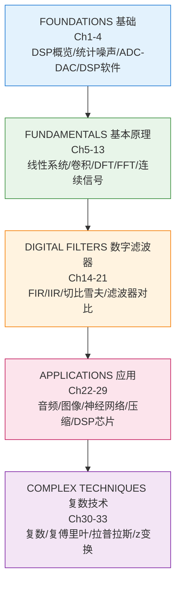
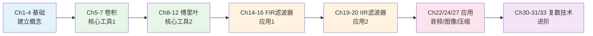

<!-- Post: 【DSP系列】一图读懂DSP Guide：33章知识结构与学习路径 | ID: 2026-037 | Created: 2026-09-02 | Tags: tech, books | Format: markdown -->

## 开篇：33章的DSP教材，怎么读才不迷路？

你翻开这本书，看到目录——33章，643页，从信号噪声一直讲到z变换。你倒吸一口凉气：这么多内容，从哪开始？哪些是重点？哪些可以跳过？

别慌。这篇文章就是你的"全书地图"——我们用一张图看清33章的知识结构，用一张表速查每章讲什么，再设计两条学习路径（精读和略读），让你在33章的内容中不迷路。

这本书的结构非常清晰，分为6大部分，从基础到应用，从简单到复杂，循序渐进。只要抓住主线，33章也能轻松驾驭。

---

## 一、全书结构总览

这本书的33章分为6大部分，每部分有明确的主题和目标：

| 部分 | 章节 | 核心内容 | 学习目标 |
|---|---|---|---|
| **FOUNDATIONS（基础）** | Ch1-4 | DSP概览、统计概率噪声、ADC/DAC、DSP软件 | 建立DSP的基本概念，理解信号从哪来、怎么变成数字 |
| **FUNDAMENTALS（基本原理）** | Ch5-13 | 线性系统、卷积、DFT、傅里叶变换性质、FFT、连续信号 | 掌握DSP的两大核心工具：卷积和傅里叶变换 |
| **DIGITAL FILTERS（数字滤波器）** | Ch14-21 | FIR滤波器、移动平均、窗函数sinc、自定义、FFT卷积、IIR、切比雪夫 | 学会设计和实现各种数字滤波器 |
| **APPLICATIONS（应用）** | Ch22-29 | 音频处理、图像处理、神经网络、数据压缩、DSP芯片 | 看到DSP在实际工程中的威力，动手实践 |
| **COMPLEX TECHNIQUES（复数技术）** | Ch30-33 | 复数、复傅里叶变换、拉普拉斯变换、z变换 | 掌握高级分析工具，为通信和控制系统打基础 |

**关键洞察**：前3部分（Ch1-21）是DSP的核心基础，必须掌握；第4部分（Ch22-29）是应用，可以按兴趣选学；第5部分（Ch30-33）是高级工具，需要时再深入。

---

## 二、章节速查表

### 第一部分：FOUNDATIONS（基础）Ch1-4

| 章 | 标题 | 一句话总结 | 重要度 |
|---|---|---|---|
| Ch1 | The Breadth and Depth of DSP | DSP是什么，在哪些领域改变了世界 | ⭐⭐⭐ 入门必读 |
| Ch2 | Statistics, Probability and Noise | 信号的统计特性、噪声的本质和生成 | ⭐⭐⭐ 核心基础 |
| Ch3 | ADC and DAC | 模数/数模转换、采样定理、量化噪声 | ⭐⭐⭐ 核心基础 |
| Ch4 | DSP Software | 定点/浮点运算、执行速度优化、编程技巧 | ⭐⭐ 实践参考 |

### 第二部分：FUNDAMENTALS（基本原理）Ch5-13

| 章 | 标题 | 一句话总结 | 重要度 |
|---|---|---|---|
| Ch5 | Linear Systems | 线性系统的定义、叠加原理、常见分解 | ⭐⭐⭐ 核心基础 |
| Ch6 | Convolution | 卷积的定义、输入侧/输出侧算法、冲激响应 | ⭐⭐⭐ 最核心 |
| Ch7 | Properties of Convolution | 常见冲激响应、卷积的性质、组合系统 | ⭐⭐⭐ 核心 |
| Ch8 | The Discrete Fourier Transform | DFT的定义、从时域到频域的变换 | ⭐⭐⭐ 最核心 |
| Ch9 | Applications of the DFT | DFT的实际应用：频谱分析、滤波、信号检测 | ⭐⭐⭐ 核心 |
| Ch10 | Fourier Transform Properties | 傅里叶变换的性质：线性、移位、卷积定理 | ⭐⭐⭐ 核心 |
| Ch11 | Fourier Transform Pairs | 常见信号的傅里叶变换对 | ⭐⭐ 参考手册 |
| Ch12 | The Fast Fourier Transform | FFT算法：Cooley-Tukey、复杂度分析 | ⭐⭐⭐ 核心 |
| Ch13 | Continuous Signal Processing | 连续信号的傅里叶变换、模拟滤波器基础 | ⭐⭐ 衔接参考 |

### 第三部分：DIGITAL FILTERS（数字滤波器）Ch14-21

| 章 | 标题 | 一句话总结 | 重要度 |
|---|---|---|---|
| Ch14 | Introduction to Digital Filters | 滤波器的基本概念、FIR vs IIR、技术指标 | ⭐⭐⭐ 入门必读 |
| Ch15 | Moving Average Filters | 移动平均滤波器：最简单的低通滤波器 | ⭐⭐ 入门 |
| Ch16 | Windowed-Sinc Filters | 窗函数sinc滤波器：标准FIR设计方法 | ⭐⭐⭐ 核心 |
| Ch17 | Custom Filters | 自定义滤波器：任意频率响应的设计 | ⭐⭐ 进阶 |
| Ch18 | FFT Convolution | 用FFT实现快速卷积：大块卷积、重叠相加 | ⭐⭐ 实践 |
| Ch19 | Recursive Filters | 递归滤波器（IIR）：差分方程、实现结构 | ⭐⭐⭐ 核心 |
| Ch20 | Chebyshev Filters | 切比雪夫滤波器：经典IIR设计方法 | ⭐⭐⭐ 核心 |
| Ch21 | Filter Comparison | 各种滤波器的对比：性能、复杂度、适用场景 | ⭐⭐ 参考 |

### 第四部分：APPLICATIONS（应用）Ch22-29

| 章 | 标题 | 一句话总结 | 重要度 |
|---|---|---|---|
| Ch22 | Audio Processing | 音频处理：均衡、压缩、降噪、特殊效果 | ⭐⭐ 应用选学 |
| Ch23 | Image Formation and Display | 图像的形成和显示：传感器、色彩、显示技术 | ⭐⭐ 应用选学 |
| Ch24 | Linear Image Processing | 线性图像处理：卷积滤波、边缘检测、增强 | ⭐⭐⭐ 应用核心 |
| Ch25 | Special Imaging Techniques | 特殊成像技术：CT、MRI、超声的DSP原理 | ⭐⭐ 进阶选学 |
| Ch26 | Neural Networks (and more!) | 神经网络：用DSP视角理解神经网络 | ⭐⭐ 拓展 |
| Ch27 | Data Compression | 数据压缩：JPEG、MP3的原理和实现 | ⭐⭐⭐ 应用核心 |
| Ch28 | Digital Signal Processors | DSP芯片：架构、指令集、选型 | ⭐⭐ 实践参考 |
| Ch29 | Getting Started with DSPs | DSP开发入门：工具链、开发流程、实例 | ⭐⭐ 实践参考 |

### 第五部分：COMPLEX TECHNIQUES（复数技术）Ch30-33

| 章 | 标题 | 一句话总结 | 重要度 |
|---|---|---|---|
| Ch30 | Complex Numbers | 复数基础：运算、几何意义、在DSP中的作用 | ⭐⭐⭐ 进阶基础 |
| Ch31 | The Complex Fourier Transform | 复傅里叶变换：正负频率、解析信号 | ⭐⭐⭐ 进阶核心 |
| Ch32 | The Laplace Transform | 拉普拉斯变换：连续系统分析、s域 | ⭐⭐ 进阶选学 |
| Ch33 | The z-Transform | z变换：离散系统分析、极点零点、稳定性 | ⭐⭐⭐ 进阶核心 |

---

## 三、两条学习路径

### 路径A：精读路径（系统学习，约3-6个月）

适合想全面掌握DSP的工程师、学生、研究者。按顺序读完所有核心章节，做习题和实验。

**精读章节清单**（共20章，约400页）：
- 基础：Ch1, Ch2, Ch3
- 基本原理：Ch5, Ch6, Ch7, Ch8, Ch9, Ch10, Ch12
- 滤波器：Ch14, Ch16, Ch19, Ch20
- 应用：Ch22, Ch24, Ch27
- 进阶：Ch30, Ch31, Ch33

**略读/跳过章节**（13章，约240页）：
- Ch4 DSP软件：需要时查阅
- Ch11 傅里叶变换对：参考手册，不用背
- Ch13 连续信号处理：有AC电路基础可跳过
- Ch15 移动平均：太简单，快速浏览
- Ch17 自定义滤波器：进阶，需要时再看
- Ch18 FFT卷积：实践时再看
- Ch21 滤波器对比：参考表
- Ch23 图像形成：应用背景，快速浏览
- Ch25 特殊成像：进阶选学
- Ch26 神经网络：拓展阅读
- Ch28-29 DSP芯片：做硬件时再看
- Ch32 拉普拉斯变换：做控制/通信时再看

### 路径B：略读路径（快速入门，约2-4周）

适合想快速了解DSP核心概念、不需要深入数学推导的爱好者、产品经理、软件工程师。

**核心7章**（约150页）：
1. **Ch1** DSP概览：建立全局认知
2. **Ch3** ADC/DAC：理解信号怎么变成数字
3. **Ch6** 卷积：DSP最核心的运算
4. **Ch8** DFT：从时域到频域
5. **Ch12** FFT：快速算法
6. **Ch14** 滤波器导论：FIR vs IIR
7. **Ch27** 数据压缩：看到DSP的实际威力

读完这7章，你就能理解DSP的核心思想和大部分应用场景。需要深入某个方向时，再回到对应的章节精读。

---

## 四、按方向的章节推荐

不同方向的读者，重点章节不同：

| 方向 | 重点章节 | 跳过章节 |
|---|---|---|
| **通信工程师** | Ch2, Ch3, Ch8-12, Ch19-20, Ch30-33 | Ch22-25, Ch28-29 |
| **音频工程师** | Ch2, Ch6-7, Ch14-16, Ch19-20, Ch22, Ch27 | Ch23-25, Ch28-33 |
| **图像处理** | Ch2, Ch6-7, Ch14-16, Ch23-25, Ch27 | Ch19-22, Ch28-33 |
| **嵌入式/硬件** | Ch3-4, Ch6, Ch8, Ch12, Ch14-16, Ch28-29 | Ch22-27, Ch30-33 |
| **软件/算法** | Ch2, Ch5-12, Ch14-18, Ch27 | Ch22-25, Ch28-29 |
| **控制工程师** | Ch5-7, Ch19-20, Ch30, Ch32-33 | Ch22-29 |
| **无线电/SDR** | Ch2-3, Ch6-12, Ch14-16, Ch30-31, Ch33 | Ch22-29 |

---

## 五、学习建议和避坑指南

### 常见误区

| 误区 | 正确理解 |
|---|---|
| "DSP需要很深的数学基础" | 这本书只需要高中数学+基本微积分，很多复杂推导用直觉解释替代了 |
| "先把数学学好再学DSP" | 边学边用，在应用中理解数学，比先学纯数学有效得多 |
| "卷积和傅里叶变换太难了" | 这两个是DSP的核心，多花时间，用例子和图形理解，不要死记公式 |
| "FIR比IIR好" | 各有优劣：FIR线性相位但阶数高，IIR阶数低但有非线性相位和稳定性问题 |
| "FFT是一种新的变换" | FFT不是新变换，只是DFT的快速算法，结果完全一样 |
| "复数DSP用不到" | 通信、雷达、高级滤波都需要复数，是进阶的必备工具 |
| "只看理论不做实验" | DSP是实践学科，用Python/MATLAB/C写代码验证每个算法，才能真正理解 |

### 学习工具推荐

| 工具 | 用途 | 特点 |
|---|---|---|
| **Python + NumPy/SciPy** | 算法验证、数据处理 | 免费、开源、生态丰富，推荐首选 |
| **MATLAB** | 专业仿真、算法开发 | 功能强大、工具箱齐全，但收费 |
| **GNU Octave** | MATLAB的免费替代 | 语法兼容MATLAB，免费开源 |
| **C语言** | 嵌入式实现、性能优化 | 接近硬件，理解底层实现 |
| **LTspice** | 模拟/混合信号仿真 | 免费，验证ADC/DAC和模拟前端 |
| **Audacity** | 音频处理实验 | 免费，直观看到音频的时域和频域 |
| **GIMP/Photoshop** | 图像处理实验 | 直观看到卷积滤波的效果 |

### 学习节奏建议

- **不要贪快**：卷积和傅里叶变换是核心，每个至少花一周时间，做实验、画图、写代码
- **边学边练**：每学完一个算法，就用Python写代码实现，用真实信号（音频、图像）测试
- **建立直觉**：不要只记公式，要理解每个算法"在做什么"、"为什么这样做"、"什么时候用"
- **循序渐进**：基础不牢不要急着学高级内容，卷积和傅里叶变换没搞懂，滤波器和应用都是空中楼阁

---

## 小结

这篇是【DSP系列】的全书地图，我们做了四件事：

1. **结构总览**：6大部分33章，从基础→基本原理→滤波器→应用→复数技术，循序渐进
2. **章节速查**：每章一句话总结，标注重要度（⭐⭐⭐核心 / ⭐⭐参考 / ⭐选学）
3. **两条路径**：精读路径（20章，3-6个月）和略读路径（7章，2-4周），按需选择
4. **方向推荐**：通信、音频、图像、嵌入式、软件、控制、无线电7个方向的重点章节

最重要的三句话：
- **卷积和傅里叶变换是DSP的两大核心**，花再多时间都值得
- **前21章是基础，必须掌握；后12章是应用和进阶，按方向选学**
- **理论和实践结合**，用Python/MATLAB写代码验证每个算法，才能真正理解

下一篇（第3篇），我们来深入拆解8大核心主题——每个主题学什么、为什么重要、解决什么问题、主题之间的依赖关系。有了这8个主题的框架，后面的深入学习就有了清晰的路线图。

---

## 系列导航

**【DSP系列】共13篇，基于 Steven W. Smith《The Scientist and Engineer's Guide to Digital Signal Processing》(Second Edition, 1999)**

| 序号 | 文章 | 状态 |
|---|---|---|
| 第1篇 | DSP是什么？从手机降噪到医学影像的数字信号处理之旅 | ✅ 已发布 |
| 第2篇 | 一图读懂DSP Guide：33章知识结构与学习路径 | ✅ 本篇 |
| 第3篇 | DSP的8大核心主题：从信号噪声到z变换的学习路线 | ⏳ 即将发布 |
| 第4篇 | 信号、噪声与统计：DSP的数学基础（Ch1-4） | ⏳ 即将发布 |
| 第5篇 | 线性系统与卷积：DSP的核心运算（Ch5-7） | ⏳ 即将发布 |
| 第6篇 | 傅里叶变换与DFT/FFT：从时域到频域的桥梁（Ch8-13） | ⏳ 即将发布 |
| 第7篇 | FIR数字滤波器设计：移动平均、窗函数sinc与自定义滤波器（Ch14-18） | ⏳ 即将发布 |
| 第8篇 | IIR递归滤波器与切比雪夫：从模拟到数字的滤波器设计（Ch19-21） | ⏳ 即将发布 |
| 第9篇 | 音频与图像处理应用：DSP在实际工程中的威力（Ch22-25） | ⏳ 即将发布 |
| 第10篇 | 数据压缩与神经网络：DSP的前沿应用（Ch26-27） | ⏳ 即将发布 |
| 第11篇 | DSP芯片实践与复数技术：从理论到硬件的落地（Ch28-33） | ⏳ 即将发布 |
| 第12篇 | DSP在电子工程知识体系中的位置：与模电/嵌入式/通信/AI的横向对比 | ⏳ 即将发布 |
| 第13篇 | 读完DSP Guide之后：独立思考、实践路线图与进一步学习（收官篇★） | ⏳ 即将发布 |

> 本书为免费开源教材（California Technical Publishing），可在 [www.DSPguide.com](https://www.dspguide.com) 免费下载PDF和配套C语言代码。
