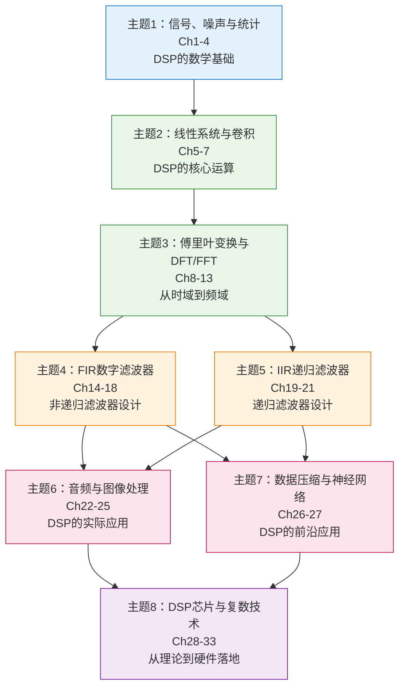

<!-- Post: 【DSP系列】DSP的8大核心主题：从信号噪声到z变换的学习路线 | ID: 2026-038 | Created: 2026-09-02 | Tags: tech, books | Format: markdown -->

## 开篇：33章太多？抓住8个主题就够了

上一篇我们画了全书地图——33章，6大部分。你可能还是觉得有点多：33章，每章平均20页，全部读完要几个月。有没有更高效的方法？

有。33章虽然多，但核心内容可以归纳为**8大主题**。每个主题包含3-5章，有明确的学习目标和应用场景。抓住这8个主题，就抓住了DSP的骨架；细节可以在需要时再填充。

这篇文章，我们就来逐一拆解这8大核心主题——每个主题学什么、为什么重要、解决什么问题、和其他主题的依赖关系。有了这8个主题的框架，后面的深入学习就有了清晰的路线图。

---

## 一、8大核心主题总览



| # | 主题 | 章节 | 核心问题 | 难度 |
|---|---|---|---|---|
| 1 | 信号、噪声与统计 | Ch1-4 | 信号从哪来？噪声是什么？怎么变成数字？ | ⭐⭐ 入门 |
| 2 | 线性系统与卷积 | Ch5-7 | 系统怎么处理信号？卷积是什么？ | ⭐⭐⭐ 核心 |
| 3 | 傅里叶变换与DFT/FFT | Ch8-13 | 怎么从时域看到频域？FFT为什么快？ | ⭐⭐⭐ 核心 |
| 4 | FIR数字滤波器 | Ch14-18 | 怎么设计非递归滤波器？窗函数法是什么？ | ⭐⭐⭐ 应用 |
| 5 | IIR递归滤波器 | Ch19-21 | 怎么设计递归滤波器？切比雪夫是什么？ | ⭐⭐⭐ 应用 |
| 6 | 音频与图像处理 | Ch22-25 | DSP在音频和图像中怎么用？ | ⭐⭐ 应用 |
| 7 | 数据压缩与神经网络 | Ch26-27 | MP3/JPEG的原理是什么？神经网络和DSP什么关系？ | ⭐⭐ 拓展 |
| 8 | DSP芯片与复数技术 | Ch28-33 | 怎么在硬件上实现DSP？复数有什么用？ | ⭐⭐⭐⭐ 进阶 |

**依赖关系**：主题1是基础，主题2和3是核心工具，主题4和5是滤波器设计（依赖2和3），主题6和7是应用（依赖4和5），主题8是进阶（依赖前面所有）。

---

## 二、每个主题详解

### 主题1：信号、噪声与统计（Ch1-4）

**为什么重要**：这是DSP的入门基础。不理解信号和噪声的本质，后面的所有算法都是空中楼阁。

**学什么**：
- **信号的本质**：什么是信号？模拟信号和数字信号的区别？信号的分类（连续/离散、周期/非周期、能量/功率）
- **统计与概率**：均值、方差、标准差、概率密度函数（PDF）、正态分布
- **噪声**：噪声的本质、白噪声、高斯噪声、噪声的生成
- **ADC/DAC**：模数转换、采样定理、量化噪声、抗混叠滤波器
- **DSP软件**：定点 vs 浮点、数值精度、执行速度优化

**解决什么问题**：
- 现实世界的信号怎么变成计算机能处理的数字？
- 噪声是什么？怎么衡量噪声大小？
- 采样多快才够？量化误差有多大？
- 定点和浮点运算有什么区别？什么时候用哪个？

**生活类比**：就像学烹饪前先认识食材——信号是食材，噪声是食材里的杂质，ADC/DAC是把食材切成丁的刀，统计是衡量食材质量的方法。不认识食材，再好的厨艺也做不出好菜。

**关键章节**：Ch2（统计概率噪声）和Ch3（ADC/DAC）是核心，Ch1（概览）快速浏览，Ch4（软件）需要时查阅。

---

### 主题2：线性系统与卷积（Ch5-7）

**为什么重要**：卷积是DSP最核心的运算，没有之一。几乎所有DSP算法（滤波、相关、特征提取）都建立在卷积之上。不理解卷积，就不可能真正理解DSP。

**学什么**：
- **线性系统**：线性的定义、叠加原理、时不变性、常见的线性和非线性系统
- **冲激响应**：什么是冲激函数？系统的冲激响应是什么？为什么冲激响应能完全描述线性系统？
- **卷积**：卷积的定义、输入侧算法、输出侧算法、卷积的几何意义
- **卷积的性质**：交换律、结合律、分配律、级联系统的卷积
- **常见冲激响应**：单位冲激、阶跃响应、移动平均、指数衰减

**解决什么问题**：
- 给定一个线性系统和输入信号，怎么求输出？
- 为什么卷积能描述线性系统的输入输出关系？
- 多个系统级联，总的冲激响应是什么？
- 怎么用卷积实现滤波？

**生活类比**：卷积就像调酒——输入信号是各种原料，冲激响应是调酒配方，卷积运算就是按配方把原料混合起来。不同的配方（冲激响应）能调出不同口味的酒（输出信号）。

**关键章节**：Ch6（卷积）是重中之重，至少花一周时间，用Python写代码、画图、做实验。Ch5（线性系统）是基础，Ch7（卷积性质）是延伸。

---

### 主题3：傅里叶变换与DFT/FFT（Ch8-13）

**为什么重要**：傅里叶变换是DSP的第二大核心工具。它让我们能从频域看信号，发现时域中看不到的规律。滤波、频谱分析、压缩、通信，几乎所有DSP应用都依赖傅里叶变换。

**学什么**：
- **DFT（离散傅里叶变换）**：DFT的定义、从时域到频域的变换、DFT的几何意义
- **DFT的应用**：频谱分析、信号检测、滤波、相关性
- **傅里叶变换的性质**：线性、时移、频移、卷积定理、Parseval定理
- **常见傅里叶变换对**：冲激、阶跃、正弦、方波、三角波、sinc函数
- **FFT（快速傅里叶变换）**：Cooley-Tukey算法、蝶形运算、复杂度分析、为什么FFT比DFT快
- **连续信号处理**：连续傅里叶变换、模拟滤波器、采样定理的频域解释

**解决什么问题**：
- 一个信号由哪些频率成分组成？
- 怎么从含噪信号中提取有用频率？
- 为什么时域卷积等于频域乘积？
- FFT为什么能把O(N²)降到O(N log N)？

**生活类比**：傅里叶变换就像光谱仪——白光通过三棱镜分解成彩虹，我们能看到每种颜色（频率）的强度。时域信号就像白光，傅里叶变换就像三棱镜，分解后我们能看清信号由哪些频率组成。

**关键章节**：Ch8（DFT）、Ch10（性质）、Ch12（FFT）是核心。Ch9（应用）和Ch11（变换对）是参考，Ch13（连续信号）是衔接。

---

### 主题4：FIR数字滤波器（Ch14-18）

**为什么重要**：滤波器是DSP最常见的应用。FIR（有限冲激响应）滤波器是最常用的滤波器类型，具有线性相位、绝对稳定、设计方法成熟等优点。

**学什么**：
- **滤波器基础**：滤波器的分类（低通/高通/带通/带阻）、技术指标（通带/阻带/过渡带/波纹）、FIR vs IIR
- **移动平均滤波器**：最简单的FIR滤波器、频率响应、优缺点
- **窗函数sinc滤波器**：理想滤波器的冲激响应（sinc函数）、窗函数法、常见窗函数（矩形/汉宁/汉明/布莱克曼）
- **自定义滤波器**：任意频率响应的设计、频率采样法、最优设计
- **FFT卷积**：用FFT实现快速卷积、大块卷积、重叠相加法/重叠保留法

**解决什么问题**：
- 怎么设计一个低通滤波器，去掉高频噪声？
- 窗函数是什么？为什么加窗能改善滤波器性能？
- FIR滤波器的阶数怎么选？
- 长信号的卷积怎么加速？

**生活类比**：FIR滤波器就像筛子——不同孔径的筛子能筛出不同大小的颗粒。低通滤波器是小孔筛子，只让小颗粒（低频）通过；高通滤波器是大孔筛子，只让大颗粒（高频）通过。窗函数法就是设计筛子孔径分布的方法。

**关键章节**：Ch14（导论）、Ch16（窗函数sinc）是核心。Ch15（移动平均）太简单，快速浏览。Ch17（自定义）和Ch18（FFT卷积）是进阶。

---

### 主题5：IIR递归滤波器（Ch19-21）

**为什么重要**：IIR（无限冲激响应）滤波器是另一种主要的滤波器类型。相比FIR，IIR能用更少的阶数达到相同的性能，在计算资源受限的嵌入式系统中非常重要。

**学什么**：
- **递归滤波器基础**：差分方程、递归结构、反馈的概念、IIR的优缺点
- **IIR的实现结构**：直接I型、直接II型、级联型、并联型
- **稳定性**：IIR为什么可能不稳定？怎么判断稳定性？
- **切比雪夫滤波器**：经典IIR设计方法、切比雪夫I型/II型、椭圆滤波器、巴特沃斯滤波器
- **滤波器对比**：FIR vs IIR、各种设计方法的对比、选型指南

**解决什么问题**：
- 递归和非递归有什么区别？
- IIR为什么可能不稳定？怎么保证稳定？
- 切比雪夫滤波器怎么设计？
- 什么时候用FIR，什么时候用IIR？

**生活类比**：IIR滤波器就像带反馈的调音台——输出的一部分又送回输入端，形成循环。这种反馈能让调音台用更少的旋钮达到更好的效果，但如果反馈太强，就会产生啸叫（不稳定）。

**关键章节**：Ch19（递归滤波器）和Ch20（切比雪夫）是核心。Ch21（对比）是参考。

---

### 主题6：音频与图像处理（Ch22-25）

**为什么重要**：这是DSP最直观的应用。学了这么多理论，终于能看到实际效果了——音频处理能听到，图像处理能看到。

**学什么**：
- **音频处理**：均衡器、压缩器、降噪、混响、特殊效果、心理声学
- **图像形成与显示**：图像传感器、色彩空间、显示技术、图像的数字化
- **线性图像处理**：图像卷积、平滑滤波、边缘检测、锐化、增强
- **特殊成像技术**：CT重建、MRI原理、超声成像、雷达成像

**解决什么问题**：
- 怎么给音频加混响/降噪/均衡？
- 图像的模糊和锐化怎么实现？
- CT是怎么从投影数据重建出人体图像的？
- 图像压缩的基本原理是什么？

**生活类比**：音频处理就像给声音"化妆"——均衡是调整肤色，压缩是修掉瑕疵，混响是加背景虚化。图像处理就像给照片"修图"——平滑是磨皮，锐化是增强细节，边缘检测是勾勒轮廓。

**关键章节**：Ch22（音频）和Ch24（线性图像处理）是核心。Ch23（图像形成）是背景，Ch25（特殊成像）是进阶选学。

---

### 主题7：数据压缩与神经网络（Ch26-27）

**为什么重要**：这是DSP最前沿的应用。数据压缩（MP3/JPEG）是我们每天都在用的技术，神经网络是当前AI热潮的核心。理解它们的DSP原理，能让你看到技术的本质。

**学什么**：
- **数据压缩基础**：无损压缩 vs 有损压缩、压缩比、信息熵
- **变换编码**：DCT（离散余弦变换）、量化、熵编码、JPEG原理
- **音频压缩**：心理声学模型、MP3/AAC原理、子带编码
- **神经网络基础**：神经元模型、激活函数、前向传播、反向传播
- **神经网络和DSP的关系**：神经网络本质上是大规模的矩阵运算（卷积/乘加），和DSP的核心运算高度一致

**解决什么问题**：
- JPEG是怎么把图像压缩到1/10还画质不错的？
- MP3是怎么把音频压缩到1/10还听不出区别的？
- 神经网络的本质是什么？和DSP什么关系？
- 怎么用DSP实现神经网络？

**生活类比**：数据压缩就像打包行李——把不需要的东西扔掉（有损压缩），把衣服卷起来节省空间（变换编码），把小物件塞进鞋子里（熵编码）。神经网络就像一个超级复杂的滤波器——输入是原始数据，经过层层"滤波"（矩阵运算），输出是分类或识别结果。

**关键章节**：Ch27（数据压缩）是核心，Ch26（神经网络）是拓展。

---

### 主题8：DSP芯片与复数技术（Ch28-33）

**为什么重要**：这是从理论到实践的最后一步。学了这么多算法，怎么在真实硬件上实现？复数技术是高级DSP（通信、雷达、高级滤波）的必备工具。

**学什么**：
- **DSP芯片架构**：哈佛结构、流水线、MAC（乘加）单元、环形缓冲、位反转寻址
- **DSP芯片选型**：TI TMS320系列、ADI SHARC系列、ARM NEON、RISC-V P扩展
- **DSP开发流程**：工具链、C语言优化、汇编优化、实时性分析
- **复数基础**：复数运算、几何意义、极坐标 vs 直角坐标
- **复傅里叶变换**：正负频率、解析信号、单边带、正交调制
- **拉普拉斯变换**：连续系统的s域分析、传递函数、极点零点
- **z变换**：离散系统的z域分析、极点零点、稳定性判断、频率响应

**解决什么问题**：
- DSP芯片和通用CPU有什么区别？为什么DSP芯片做信号处理更快？
- 怎么在DSP芯片上实现实时信号处理？
- 复数在DSP中有什么用？什么是解析信号？
- z变换和拉普拉斯变换有什么用？怎么用极点零点分析系统稳定性？

**生活类比**：DSP芯片就像专业厨房——通用CPU是家用厨房，什么都能做但效率一般；DSP芯片是专业餐厅厨房，有专门的切菜机（MAC单元）、流水线操作台（流水线）、调料架（环形缓冲），做菜（信号处理）效率高得多。复数技术就像用三维视角看二维问题——很多在二维（实数）中复杂的问题，在三维（复数）中变得简单直观。

**关键章节**：Ch30（复数）、Ch31（复傅里叶）、Ch33（z变换）是进阶核心。Ch28-29（DSP芯片）是实践参考。Ch32（拉普拉斯）是选学。

---

## 三、学习顺序建议

### 标准顺序（推荐）

```
主题1（信号噪声）→ 主题2（卷积）→ 主题3（傅里叶）→ 主题4（FIR）→ 主题5（IIR）→ 主题6/7（应用）→ 主题8（进阶）
```

这是教材的顺序，也是最符合认知规律的顺序——从基础到工具，从工具到应用，从应用到进阶。

### 快速入门顺序（2周）

如果你时间有限，只想快速了解DSP核心：

```
主题1（Ch1, Ch3）→ 主题2（Ch6）→ 主题3（Ch8, Ch12）→ 主题4（Ch14, Ch16）
```

读完这几章，你就能理解DSP的核心思想和最常用的算法。

### 按方向的顺序

| 方向 | 重点主题 | 顺序 |
|---|---|---|
| **通信** | 1→2→3→5→8 | 重点学傅里叶、IIR、复数、z变换 |
| **音频** | 1→2→3→4→5→6→7 | 重点学滤波器、音频处理、压缩 |
| **图像** | 1→2→3→4→6→7 | 重点学卷积、FIR、图像处理、压缩 |
| **嵌入式** | 1→2→3→4→5→8 | 重点学算法实现、DSP芯片、优化 |
| **控制** | 1→2→5→8 | 重点学IIR、z变换、拉普拉斯 |

---

## 四、每个主题的学习时间建议

| 主题 | 建议时间 | 重点投入 |
|---|---|---|
| 1. 信号噪声与统计 | 1周 | Ch2和Ch3，做噪声生成和ADC实验 |
| 2. 线性系统与卷积 | 1-2周 | Ch6，用Python实现卷积，画图理解几何意义 |
| 3. 傅里叶变换与DFT/FFT | 2周 | Ch8、Ch10、Ch12，用FFT分析真实音频/图像 |
| 4. FIR数字滤波器 | 1周 | Ch14、Ch16，设计低通/高通/带通滤波器，用真实信号测试 |
| 5. IIR递归滤波器 | 1周 | Ch19、Ch20，设计切比雪夫滤波器，对比FIR和IIR |
| 6. 音频与图像处理 | 1-2周 | Ch22、Ch24，做音频效果器和图像滤镜 |
| 7. 数据压缩与神经网络 | 1周 | Ch27，实现简单的DCT压缩，理解MP3/JPEG原理 |
| 8. DSP芯片与复数技术 | 2周 | Ch30、Ch31、Ch33，理解复数和z变换，在MCU上实现简单滤波 |

**总计**：约10-14周（每天1-2小时），可以系统掌握DSP的核心内容。

---

## 小结

这篇是【DSP系列】的深度阅读导引，我们提取了8大核心主题：

1. **信号、噪声与统计**（Ch1-4）：DSP的数学基础，理解信号从哪来、噪声是什么
2. **线性系统与卷积**（Ch5-7）：DSP最核心的运算，卷积是理解一切的基础
3. **傅里叶变换与DFT/FFT**（Ch8-13）：从时域到频域的桥梁，第二大核心工具
4. **FIR数字滤波器**（Ch14-18）：非递归滤波器设计，最常用的滤波器类型
5. **IIR递归滤波器**（Ch19-21）：递归滤波器设计，计算效率更高但有稳定性问题
6. **音频与图像处理**（Ch22-25）：DSP最直观的应用，能听到看到效果
7. **数据压缩与神经网络**（Ch26-27）：DSP的前沿应用，MP3/JPEG和AI的底层原理
8. **DSP芯片与复数技术**（Ch28-33）：从理论到硬件的落地，高级DSP的必备工具

**最重要的三句话**：
- **主题2（卷积）和主题3（傅里叶）是DSP的两大核心**，花再多时间都值得
- **主题4和5（滤波器）是DSP最常用的应用**，必须掌握设计方法
- **主题8（复数和z变换）是进阶的门槛**，想深入通信/雷达/控制必须跨过去

从下一篇开始，我们就逐个深入这8个主题。第4篇，我们从最基础的"信号、噪声与统计"开始——信号到底是什么？噪声从哪来？怎么用统计方法描述信号？

---

## 系列导航

**【DSP系列】共13篇，基于 Steven W. Smith《The Scientist and Engineer's Guide to Digital Signal Processing》(Second Edition, 1999)**

| 序号 | 文章 | 状态 |
|---|---|---|
| 第1篇 | DSP是什么？从手机降噪到医学影像的数字信号处理之旅 | ✅ 已发布 |
| 第2篇 | 一图读懂DSP Guide：33章知识结构与学习路径 | ✅ 已发布 |
| 第3篇 | DSP的8大核心主题：从信号噪声到z变换的学习路线 | ✅ 本篇 |
| 第4篇 | 信号、噪声与统计：DSP的数学基础（Ch1-4） | ⏳ 即将发布 |
| 第5篇 | 线性系统与卷积：DSP的核心运算（Ch5-7） | ⏳ 即将发布 |
| 第6篇 | 傅里叶变换与DFT/FFT：从时域到频域的桥梁（Ch8-13） | ⏳ 即将发布 |
| 第7篇 | FIR数字滤波器设计：移动平均、窗函数sinc与自定义滤波器（Ch14-18） | ⏳ 即将发布 |
| 第8篇 | IIR递归滤波器与切比雪夫：从模拟到数字的滤波器设计（Ch19-21） | ⏳ 即将发布 |
| 第9篇 | 音频与图像处理应用：DSP在实际工程中的威力（Ch22-25） | ⏳ 即将发布 |
| 第10篇 | 数据压缩与神经网络：DSP的前沿应用（Ch26-27） | ⏳ 即将发布 |
| 第11篇 | DSP芯片实践与复数技术：从理论到硬件的落地（Ch28-33） | ⏳ 即将发布 |
| 第12篇 | DSP在电子工程知识体系中的位置：与模电/嵌入式/通信/AI的横向对比 | ⏳ 即将发布 |
| 第13篇 | 读完DSP Guide之后：独立思考、实践路线图与进一步学习（收官篇★） | ⏳ 即将发布 |

> 本书为免费开源教材（California Technical Publishing），可在 [www.DSPguide.com](https://www.dspguide.com) 免费下载PDF和配套C语言代码。
