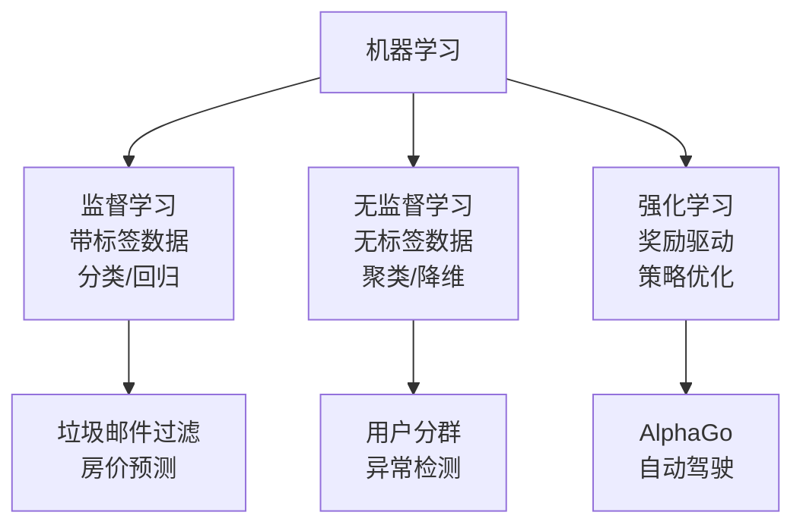

<!-- Post: 【机器学习阅读导论第1篇】《机器学习实战》入门：为什么这本书被称为"ML界的驾照教材"？ | ID: 2026-050 | Created: 2026-09-03 | Tags: books, tech, 机器学习 | Format: markdown -->

## 开篇：2006年，一篇论文点燃了一场海啸

2006年，多伦多大学的Geoffrey Hinton（杰弗里·辛顿）和他的学生发表了一篇论文，展示了如何训练一个深度神经网络来识别手写数字，准确率超过了98%。他们把这项技术命名为"Deep Learning"（深度学习）。

在当时，训练深度神经网络被广泛认为是"不可能的事"——大多数研究者从1990年代起就放弃了这个方向。但这篇论文重新点燃了科学界的热情。短短十年后，机器学习已经征服了整个工业界：它决定你在谷歌搜索什么结果，让你的手机能听懂"嘿Siri"，给你推荐下一个要看的视频，甚至在围棋棋盘上击败了世界冠军李世石。

> "Fast-forward 10 years and Machine Learning has conquered the industry: it is now at the heart of much of the magic in today's high-tech products, ranking your web search results, powering your smartphone's speech recognition, recommending videos, and beating the world champion at the game of Go."
> —— Preface，第xi页

你手里的这本书，就是这场海啸中最实用的一张"航海图"。

## 一、这本书到底在解决什么问题？

你可能有过这样的经历：看了一堆机器学习的理论书，公式推导都懂，但一到要写代码就懵了——数据怎么加载？特征怎么处理？模型怎么选？调参从哪下手？

这本书的作者Aurélien Géron（奥雷利安·热龙）是前Google工程师，他写这本书的核心理念就四个字：**hands-on（动手实战）**。

> "The book favors a hands-on approach, growing an intuitive understanding of Machine Learning through concrete working examples and just a little bit of theory."
> —— Preface，第xii页

打个比方：如果说《统计学习方法》（李航）是一本"汽车发动机原理"教材，给你讲内燃机的热力学循环；那这本书就是一本"驾驶培训手册"——先教你怎么打火、挂挡、看后视镜，把车开起来再说。等你能上路了，再回头理解发动机为什么这样设计。

这就是为什么我把它称为**"ML界的驾照教材"**：它不要求你先成为机械工程师，而是让你先学会开车，在驾驶中建立直觉。

### 它用什么工具教你开车？

全书基于三个Python框架：

| 框架 | 定位 | 类比 |
|------|------|------|
| **Scikit-Learn** | 传统ML算法库，简单高效 | 自动挡家用车——上手快，覆盖90%日常场景 |
| **TensorFlow** | Google的分布式数值计算框架 | 手动挡赛车——复杂但能驾驭极限场景 |
| **Keras** | 高层深度学习API，跑在TF之上 | 赛车的自动挡模式——保留性能的同时降低操作难度 |

> "Scikit-Learn is very easy to use, yet it implements many Machine Learning algorithms efficiently, so it makes for a great entry point to learn Machine Learning."
> —— Preface，第xii页

## 二、三个核心概念速览

在正式上路之前，你需要先理解三个最基础的概念。它们就像开车前的"油门、刹车、方向盘"——不搞清楚这三个，后面的一切都无从谈起。

### 概念1：监督学习 / 无监督学习 / 强化学习

这是机器学习最顶层的分类。用一个生活类比：

- **监督学习（Supervised Learning）**：像**老师批改作业**。你给机器看大量"题目+标准答案"（带标签的数据），它学会从题目推导出答案。比如给它1万张标注了"猫/狗"的图片，它学会识别新图片是猫还是狗。
- **无监督学习（Unsupervised Learning）**：像**自己整理书架**。你不给任何标签，只给一堆数据，让机器自己发现结构。比如给它100万用户的消费记录，它自动把用户分成"价格敏感型""品质追求型""冲动消费型"等群体。
- **强化学习（Reinforcement Learning）**：像**试错学骑车**。机器在环境中不断尝试，做对了给奖励，做错了给惩罚，慢慢学会最优策略。比如AlphaGo在下棋中，赢了给正反馈，输了给负反馈，几百万局后成为世界冠军。

本书Part I（第1-9章）主要讲监督学习和无监督学习，Part II（第10-14章）讲深度学习（属于监督学习的一种复杂形式）。强化学习在完整第二版的第18章，但本Early Release版本未收录。

### 概念2：过拟合与欠拟合

这是机器学习中最核心的矛盾，也是每个工程师每天都在面对的问题。

想象你在准备一场考试：

- **欠拟合（Underfitting）**：你**完全没学会**。连课本上的例题都做不对，考试当然也考不好。对应到模型：模型太简单，连训练数据都拟合不好。
- **过拟合（Overfitting）**：你**死记硬背**。把课本上的每道题答案都背下来了，模拟考满分，但一到考试遇到新题型就傻眼。对应到模型：模型太复杂，把训练数据的噪声和细节都记住了，但泛化到新数据时表现很差。

> "Overfitting happens when the model performs well on the training data but does not generalize well to new data."
> —— 第1章，第28页

**好的模型**是在两者之间找到平衡：既学会了 underlying pattern（底层规律），又没有记住噪声。这个平衡叫做**偏差-方差权衡（Bias-Variance Tradeoff）**，我们会在第4篇详细拆解。

### 概念3：训练集 / 验证集 / 测试集

这是机器学习项目的数据划分标准，就像学生的三种考试：

| 数据集 | 类比 | 用途 | 典型比例 |
|--------|------|------|---------|
| **训练集（Training Set）** | 平时练习题 | 模型学习参数 | 60-80% |
| **验证集（Validation Set）** | 模拟考 | 调超参数、选模型 | 10-20% |
| **测试集（Test Set）** | 高考 | 最终评估，只能用一次 | 10-20% |

关键原则：**测试集绝对不能参与训练和调参**。如果你用测试集来调模型，就等于提前知道了高考题，最后的分数没有任何参考价值。

> "The test set must be untouched until the very end of the project, when you are ready to launch your model."
> —— 第1章，第31页

## 三、谁应该读这本书？

### 适合的人

- 有Python基础，想系统入门机器学习的工程师
- 看过理论书但写不出代码的"理论派"
- 想从传统开发转AI方向的程序员
- 需要做数据分析/预测的产品经理、数据分析师

### 需要的前置知识

作者在Preface中明确说了 prerequisites（前置条件）：

> "This book assumes that you have some Python programming experience and that you are familiar with Python's main scientific libraries, in particular NumPy, Pandas, and Matplotlib. Also, if you care about what's under the hood you should have a reasonable understanding of college-level math as well (calculus, linear algebra, probabilities, and statistics)."
> —— Preface，第xiii页

翻译成人话：
- **必须**：Python基础 + NumPy/Pandas/Matplotlib基本用法
- **加分**：大学数学（微积分、线性代数、概率统计）——没有也能读，只是理解数学推导时会吃力

### 不适合的人

- 完全零编程基础的纯小白（建议先学Python）
- 只想研究数学理论、不写代码的人（建议读《统计学习方法》或《深度学习》花书）
- 想学生成式AI/大语言模型的人（本书2019年出版，不覆盖Transformer/LLM，我们会在第12篇讨论如何补充）

## 四、原书图表索引

本篇引用的原书关键图表：

| 图表编号 | 内容 | 所在位置 |
|---------|------|---------|
| Figure 1-1 | 传统编程方法 vs 机器学习方法 | 第1章，第5页 |
| Figure 1-2 | 机器学习方法自动学习规律 | 第1章，第5页 |
| Figure 1-3 | ML系统自动适应变化 | 第1章，第6页 |
| Figure 1-4 | ML帮助人类发现隐藏规律 | 第1章，第7页 |
| Figure 1-21 | 过拟合示意（高次多项式拟合噪声） | 第1章，第28页 |

## 五、小结

这一篇我们解决了三个问题：

1. **这本书是什么？** —— 一本"hands-on"的机器学习实战手册，教你从数据到上线的完整流程，而不是纯数学推导。
2. **三个核心概念** —— 学习类型三分法（监督/无/强化）、过拟合vs欠拟合、训练/验证/测试集划分。
3. **谁适合读？** —— 有Python基础、想动手做项目的工程师；需要补数学和编程基础的纯小白请先做准备。

记住一个核心比喻：**这本书是驾照教材，不是发动机原理**。先把车开起来，在实践中建立直觉，理论自然会慢慢理解。

## 下一篇预告

第2篇我们将展开**全书地图**：14章的知识图谱、章节依赖关系、两条学习路径（精读12周 vs 略读4周），以及哪些章必须死磕、哪些可以先跳过。

> 系列导航：第1篇入门导引 → **第2篇全书地图** → 第3篇深度阅读导引 → 第4-10篇核心主题 → 第11篇主题阅读 → 第12篇研究式阅读
