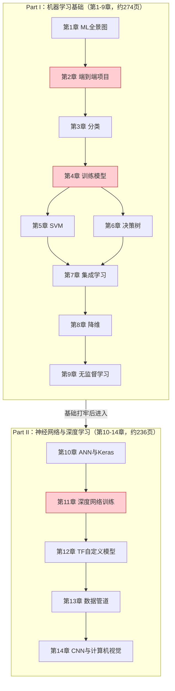
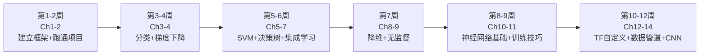

<!-- Post: 【机器学习阅读导论第2篇】一图读懂全书：14章知识图谱与两条学习路径 | ID: 2026-051 | Created: 2026-09-03 | Tags: books, tech, 机器学习 | Format: markdown -->

## 开篇：拿到一本510页的厚书，从哪翻起？

你买了一本厚厚的机器学习教材，满怀信心地翻开第1章。读了30页后，你开始犯困；读到第5章的数学推导时，你彻底放弃了。三个月后，这本书还停在第1章，书签都没动过。

这不是你的问题——这是大多数技术书的通病：**作者按知识体系的逻辑顺序写，但读者需要按学习效率的顺序读**。

这一篇的目标就是给你一张"全书导航图"：14章分别讲什么？哪些是必看的主干道？哪些是可以绕行的支路？你应该按什么顺序读？读完需要多久？

## 一、全书结构总览

这本书分为两大部分，就像一栋楼的**地基**和**上层建筑**：

**红色高亮**的三章（第2、4、11章）是全书的"承重墙"——跳过它们，后面的内容就会变成空中楼阁。

### Part I：传统机器学习的"十八般兵器"

第1-9章覆盖了从线性回归到随机森林的所有经典算法。这部分的核心工具是 **Scikit-Learn**——一个Python库，把几十种算法封装成了统一的`fit() / predict()`接口。

> "The first part is based mostly on Scikit-Learn while the second part uses TensorFlow and Keras."
> —— Preface，第xiv页

### Part II：深度学习的"造楼技术"

第10-14章从感知机讲到卷积神经网络。这部分的核心工具是 **TensorFlow 2 + Keras**——Google的深度学习框架，既能用高层API快速搭模型，也能用底层API自定义一切。

作者在Preface中特别警告：

> "Don't jump into deep waters too hastily: while Deep Learning is no doubt one of the most exciting areas in Machine Learning, you should master the fundamentals first."
> —— Preface，第xiv页

翻译：别急着学深度学习。大多数问题用随机森林和梯度提升树就能解决得很好，深度学习只适合图像、语音、NLP等复杂场景，而且需要大量数据和算力。

## 二、章节速查表

| 章 | 标题 | 一句话核心 | 页码 | 难度 | 重要性 |
|----|------|-----------|------|------|--------|
| 1 | ML全景图 | 概念地图：学习类型、主要挑战、评估方法 | 3-35 | ★☆☆ | ★★★ |
| 2 | 端到端项目 | 房价预测完整流水线：全书最重要的实战模板 | 37-85 | ★★☆ | ★★★★★ |
| 3 | 分类 | MNIST手写数字：混淆矩阵、Precision/Recall、ROC | 87-111 | ★★☆ | ★★★★ |
| 4 | 训练模型 | 线性回归、梯度下降三变体、正则化——一切的根 | 113-152 | ★★★ | ★★★★★ |
| 5 | SVM | 最大间隔分类器、核技巧、对偶问题——数学最美的算法 | 155-175 | ★★★★ | ★★★ |
| 6 | 决策树 | CART算法、不纯度、可解释性的代表 | 177-189 | ★★☆ | ★★★ |
| 7 | 集成学习 | Bagging/Boosting/Stacking——竞赛和工业界的常胜将军 | 191-213 | ★★☆ | ★★★★ |
| 8 | 降维 | PCA/Kernel PCA/LLE——对抗维度灾难 | 215-235 | ★★★ | ★★★ |
| 9 | 无监督学习 | K-Means/DBSCAN/高斯混合——没有标签怎么学 | 237-275 | ★★★ | ★★★ |
| 10 | ANN与Keras | 从感知机到MLP，Keras三种API上手 | 277-323 | ★★☆ | ★★★★ |
| 11 | 深度网络训练 | 初始化/BN/优化器/正则化——解决"训不动"的问题 | 325-364 | ★★★★ | ★★★★★ |
| 12 | TF自定义模型 | 自定义损失/层/训练循环、自动微分、TF Function | 367-401 | ★★★★ | ★★★ |
| 13 | 数据管道 | Data API、TFRecord、Features API——高效喂数据 | 403-429 | ★★★ | ★★★ |
| 14 | CNN与计算机视觉 | 卷积/池化、LeNet→ResNet、迁移学习、目标检测 | 431-482 | ★★★ | ★★★★ |

**难度说明**：★☆☆ = 入门友好，★★★★ = 需要数学基础且内容密集
**重要性说明**：★★★★★ = 必须死磕，★★ = 了解即可

## 三、两条学习路径

### 路径A：精读路径（12周，适合系统学习）

如果你想真正掌握机器学习，建议按以下顺序精读，每周1-2章：

**每周任务**：
- 读对应章节，跑通书中的Jupyter Notebook
- 完成章末习题（书后有答案，GitHub上有notebook解答）
- 用学到的算法在Kaggle上找一个小数据集练手

### 路径B：略读路径（4周，适合快速上手项目）

如果你时间紧张，只想快速获得"能做项目"的能力，可以走快车道：

| 周 | 重点章节 | 目标 |
|----|---------|------|
| 第1周 | Ch2（端到端项目） | 跑通房价预测，理解完整流水线 |
| 第2周 | Ch4（训练模型）+ Ch7（集成学习） | 掌握梯度下降和随机森林，能做表格数据预测 |
| 第3周 | Ch10（ANN与Keras） | 用Keras搭一个简单的图像分类器 |
| 第4周 | Ch14（CNN）+ 迁移学习部分 | 用预训练模型做自己的图像分类项目 |

这条路径跳过了SVM、决策树细节、降维、无监督学习、TF底层等内容，但能让你在一个月内具备"做ML项目"的基本能力。后续再按需补读。

## 四、哪些章必须死磕，哪些可以先跳过

### 必须死磕的三章（承重墙）

**第2章：端到端机器学习项目**
- 为什么重要：这是全书唯一一章完整展示"从原始数据到上线模型"全流程的章节。它的代码模板可以复用到几乎所有回归/分类项目。
- 重点掌握：数据探索、Pipeline、ColumnTransformer、交叉验证、网格搜索
- 跳过的后果：后面所有章节的代码你都会觉得"缺了前半段"

**第4章：训练模型**
- 为什么重要：梯度下降是神经网络的"发动机原理"。不理解梯度下降，第11章的优化器（Adam/RMSProp）就只是黑盒。
- 重点掌握：Batch/SGD/Mini-batch三种梯度下降、学习率、正则化（Ridge/Lasso/Elastic Net）
- 跳过的后果：第10-11章的神经网络训练部分会完全看不懂

**第11章：训练深度神经网络**
- 为什么重要：这一章解决"为什么我的神经网络训不动"这个核心问题。初始化、BatchNorm、Dropout、优化器选择——每一个都是实战中的救命技巧。
- 重点掌握：梯度消失/爆炸、He初始化、Batch Normalization、Adam优化器、Dropout
- 跳过的后果：你搭的神经网络准确率永远上不去，却不知道为什么

### 可以先跳过的部分

| 内容 | 所在章节 | 为什么可以跳过 | 什么时候需要补 |
|------|---------|--------------|--------------|
| SVM对偶问题与QP推导 | 第5章 | 数学密集，实际使用时sklearn已封装 | 做算法研究或面试时 |
| 决策树回归细节 | 第6章 | 理解分类树即可，回归树原理类似 | 需要做回归任务时 |
| LLE降维 | 第8章 | 实际中PCA和t-SNE更常用 | 做流形学习研究时 |
| 贝叶斯高斯混合 | 第9章 | 普通聚类用K-Means/DBSCAN足够 | 需要自动确定簇数时 |
| TF自定义训练循环 | 第12章 | Keras的`fit()`能覆盖90%场景 | 需要非标准训练流程时 |
| TFRecord与Protocol Buffers | 第13章 | 小数据集用numpy数组即可 | 处理超大数据集时 |
| YOLO目标检测细节 | 第14章 | 理解分类和迁移学习即可入门 | 做目标检测项目时 |

## 五、原书图表索引

本篇引用的原书关键图表：

| 图表编号 | 内容 | 所在位置 |
|---------|------|---------|
| Figure 2-1 | 完整ML项目流水线流程图 | 第2章，第38页 |
| Figure 2-16 | 数据预处理Pipeline示意 | 第2章，第72页 |
| Figure 4-1 | 线性回归模型示意 | 第4章，第114页 |
| Figure 10-1 | 生物神经元结构 | 第10章，第278页 |
| Figure 10-9 | MLP（多层感知机）架构图 | 第10章，第286页 |

## 六、小结

这一篇我们建立了全书的导航系统：

1. **结构**：两大部分——Part I传统ML（第1-9章）+ Part II深度学习（第10-14章）
2. **承重墙**：第2章（项目模板）、第4章（梯度下降）、第11章（训练技巧）——这三章必须死磕
3. **两条路径**：精读12周系统掌握，或略读4周快速上手
4. **跳过策略**：SVM数学推导、TF底层、YOLO细节等可以先放一放，按需补读

记住：**读书不是按页码顺序，而是按依赖关系**。先把承重墙立起来，再慢慢填补细节。

## 下一篇预告

第3篇我们将进入**深度阅读导引**：把14章提炼成7个核心主题，画出主题间的依赖关系图，告诉你每个主题"为什么重要、学什么、解决什么问题"，以及最佳的学习顺序。

> 系列导航：第1篇入门导引 → 第2篇全书地图 → **第3篇深度阅读导引** → 第4-10篇核心主题 → 第11篇主题阅读 → 第12篇研究式阅读
