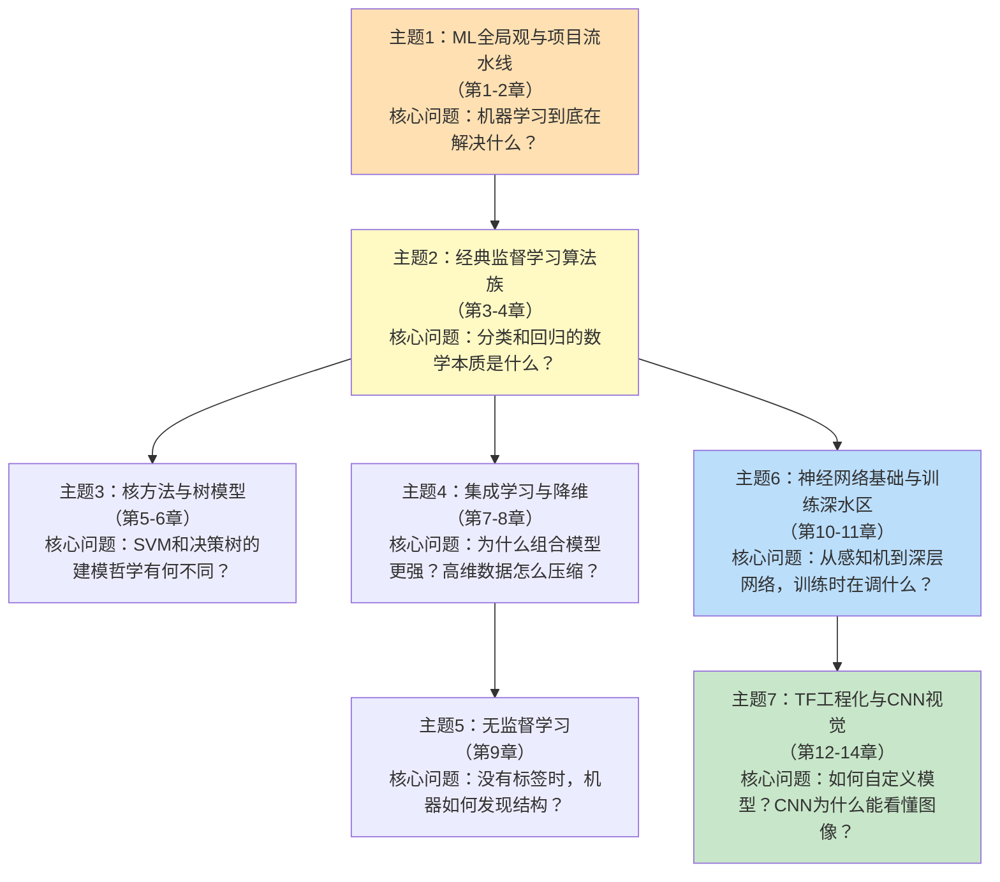

<!-- Post: 【机器学习阅读导论第3篇】深度阅读指南：7个主题、一张依赖图、先学哪个后学哪个 | ID: 2026-052 | Created: 2026-09-03 | Tags: books, tech, 机器学习 | Format: markdown -->

## 开篇：为什么"读了"不等于"读懂了"？

你可能有过这样的体验：一本书从头到尾翻完了，合上书却想不起每章讲了什么；或者看了一堆算法，却不知道它们之间有什么关系、什么时候该用哪个。

这就是**碎片化阅读**和**深度阅读**的区别。碎片化阅读让你"知道有这么个东西"，深度阅读让你"理解它为什么这样、和别的东西什么关系、什么时候用它"。

洋葱阅读法的第三层——深度阅读——就是要把14章的内容**提炼成几个核心主题**，理清主题之间的依赖关系，然后逐个击破。

## 一、为什么需要按主题阅读，而不是按章节？

书的章节是按"知识体系的逻辑"组织的，但人的学习是按"问题解决的流程"组织的。

比如第4章讲线性回归和梯度下降，第10章讲神经网络。按章节读，你会觉得它们是两个独立的话题。但按主题读，你会发现：**神经网络的训练本质上就是梯度下降的多层叠加**。第4章没搞懂的梯度下降，到第10章会变成更大的困惑。

所以我们把14章重新组织成**7个核心主题**，每个主题围绕一个核心问题展开，主题之间有明确的先后依赖。

## 二、7个核心主题与依赖关系



**依赖关系解读**：
- **主题1**是所有主题的起点——不理解ML的基本概念和项目流程，后面的算法都是空中楼阁
- **主题2**是核心枢纽——它同时是主题3、4、6的前置知识。梯度下降是神经网络的发动机，分类评估指标是所有监督学习的通用语言
- **主题3、4、5**是传统ML的三大分支，可以在主题2之后按任意顺序学习
- **主题6**必须在主题2之后——神经网络的训练就是梯度下降的多层应用
- **主题7**必须在主题6之后——CNN是神经网络的一种特殊架构，自定义模型需要理解TF的底层机制

## 三、每个主题详解

### 主题1：ML全局观与项目流水线（第1-2章）

**为什么重要**：这是全书的"地基"。第1章建立概念地图，第2章用加州房价预测跑通完整流水线。第2章的代码模板可以复用到几乎所有ML项目。

**学什么**：
- ML的定义、学习类型分类（监督/无/强化、批量/在线、实例/模型-based）
- ML的四大杀手：数据不足、数据不代表、特征无关、过拟合
- 端到端项目七步法：框架问题→获取数据→探索可视化→预处理→训练→调优→上线
- 数据预处理Pipeline、交叉验证、网格搜索

**解决什么问题**：拿到一个数据集，从哪下手？完整的项目流程是什么？

**对应第4篇**。

---

### 主题2：经典监督学习算法族（第3-4章）

**为什么重要**：这是全书的"发动机原理"。分类和回归是监督学习的两大任务，梯度下降是几乎所有ML算法（包括神经网络）的优化基础。

**学什么**：
- 分类评估体系：混淆矩阵、Precision/Recall、F1、PR曲线、ROC/AUC
- 线性回归与正态方程：$\hat{\theta} = (X^T X)^{-1} X^T y$
- 梯度下降三兄弟：Batch GD（稳但慢）、SGD（快但震荡）、Mini-batch（折中）
- 多项式回归与学习曲线：判断过拟合/欠拟合
- 正则化：Ridge（L2）、Lasso（L1）、Elastic Net
- 逻辑回归与Softmax回归

**解决什么问题**：如何评估分类器的好坏？模型训练时到底在优化什么？梯度下降为什么能找到最优解？

**对应第5篇**。

---

### 主题3：核方法与树模型（第5-6章）

**为什么重要**：SVM代表了"最大间隔"的优雅数学思想，决策树代表了"if-else规则"的可解释性。两者是传统ML中两种截然不同的建模哲学。

**学什么**：
- SVM：硬间隔/软间隔、核技巧（多项式核/RBF核）、对偶问题
- 决策树：CART训练算法、Gini不纯度 vs 熵、正则化、回归树
- 两种模型的对比：可解释性、计算复杂度、对特征缩放的需求

**解决什么问题**：数据线性不可分时怎么办？如何构建一个人类能理解的模型？

**对应第6篇**。

---

### 主题4：集成学习与降维（第7-8章）

**为什么重要**：集成学习是Kaggle竞赛和工业界的常胜将军——随机森林、XGBoost、LightGBM都属于这个家族。降维是处理高维数据的必备技能。

**学什么**：
- 集成学习四大流派：Voting（投票）、Bagging（随机森林）、Boosting（AdaBoost/GBDT）、Stacking
- 降维：维度灾难、PCA（主成分分析）、Kernel PCA、LLE
- 集成学习的偏差-方差分解：Bagging降方差，Boosting降偏差

**解决什么问题**：为什么"三个臭皮匠"能赢过"一个诸葛亮"？特征太多时如何压缩？

**对应第7篇**。

---

### 主题5：无监督学习（第9章）

**为什么重要**：现实中大部分数据是没有标签的。无监督学习能帮你发现数据中的隐藏结构，做用户分群、异常检测、图像分割等。

**学什么**：
- 聚类：K-Means（肘部法则/轮廓系数选K）、DBSCAN（密度可达）、层次聚类
- 高斯混合模型（GMM）：概率建模、EM算法、异常检测
- 聚类的应用：图像分割、半监督学习、预处理降维

**解决什么问题**：没有标签时，机器如何自动发现数据中的群组和异常？

**对应第8篇**。

---

### 主题6：神经网络基础与训练深水区（第10-11章）

**为什么重要**：这是从传统ML到深度学习的桥梁。第10章教你用Keras搭出第一个神经网络，第11章解决"为什么深层网络训不动"这个核心问题。

**学什么**：
- 从生物神经元到感知机：$y = \sigma(w^T x + b)$
- MLP与反向传播：链式法则的工程实现
- Keras三种API：Sequential、Functional、Subclassing
- 梯度消失/爆炸的根源与解决方案：Glorot/He初始化、BatchNorm、梯度裁剪
- 优化器进化：Momentum → Nesterov → AdaGrad → RMSProp → Adam → Nadam
- 正则化：L1/L2、Dropout、MC Dropout、Max-Norm
- 学习率调度策略

**解决什么问题**：神经网络是如何学习的？训练深层网络时，初始化、激活函数、优化器、正则化分别起什么作用？

**对应第9篇**。

---

### 主题7：TF工程化与CNN视觉（第12-14章）

**为什么重要**：第12章教你跳出Keras的"舒适区"，用TF底层API自定义一切；第13章构建高效数据管道；第14章讲CNN——计算机视觉的基石。

**学什么**：
- TensorFlow自定义：自定义损失/层/模型、自动微分（GradientTape）、自定义训练循环、TF Function
- 数据管道：Data API（shuffle/batch/prefetch）、TFRecord、Features API
- CNN：卷积运算、池化、架构进化史（LeNet→AlexNet→VGG→GoogLeNet→ResNet→Xception→SENet）
- 残差连接：$y = F(x) + x$ 为什么能训练超深网络
- 迁移学习：用预训练模型做特征提取
- 目标检测：YOLO、FCN、语义分割

**解决什么问题**：Keras内置层不够用时怎么办？CNN为什么能"看懂"图像？如何用别人训练好的模型解决自己的问题？

**对应第10篇**。

## 四、学习顺序建议

### 主线（必学）

```
主题1 → 主题2 → 主题6 → 主题7
```

这是最小学习路径。走完这条线，你就能：
- 理解ML的基本概念和项目流程
- 掌握梯度下降和分类/回归的核心原理
- 用Keras搭神经网络并解决训练问题
- 用CNN做图像分类和迁移学习

### 支线（按需补充）

```
主题2 → 主题3 → 主题4 → 主题5
```

这是传统ML的深化路径。如果你需要做表格数据预测、用户分群、异常检测等任务，这条线必须补。

### 推荐的穿插策略

不要学完主线再学支线，而是**穿插进行**：

1. 先学主题1（建立框架）
2. 学主题2（核心算法）
3. 学主题3+4（传统ML深化）
4. 学主题5（无监督）
5. 学主题6（神经网络）
6. 学主题7（工程化与CNN）

这样安排的好处是：在进入深度学习之前，先把传统ML的基础打牢，理解"为什么有些问题不需要神经网络"。

## 五、阅读装备清单

在开始深度阅读之前，请准备好以下装备：

| 装备 | 用途 | 安装/获取方式 |
|------|------|-------------|
| Python 3.7+ | 运行环境 | python.org 或 Anaconda |
| Jupyter Notebook | 交互式代码环境 | `pip install jupyter` |
| NumPy / Pandas / Matplotlib | 数据处理与可视化 | `pip install numpy pandas matplotlib` |
| Scikit-Learn | 传统ML算法库 | `pip install scikit-learn` |
| TensorFlow 2.x | 深度学习框架 | `pip install tensorflow` |
| 官方Notebook | 书中代码的完整版本 | https://github.com/ageron/handson-ml2 |

> 作者在Preface中强调："While you can read this book without picking up your laptop, we highly recommend you experiment with the code examples available online as Jupyter notebooks."
> —— Preface，第xii页

翻译：你可以只读不练，但强烈建议边读边跑代码。机器学习是一门手艺，光看不练等于没学。

## 六、原书图表索引

本篇引用的原书关键图表：

| 图表编号 | 内容 | 所在位置 |
|---------|------|---------|
| Figure 4-1 | 线性回归模型示意 | 第4章，第114页 |
| Figure 4-8 | 梯度下降路径对比 | 第4章，第123页 |
| Figure 10-9 | MLP架构图 | 第10章，第286页 |
| Figure 11-1 | 梯度消失问题示意 | 第11章，第326页 |
| Figure 14-3 | 卷积运算示意 | 第14章，第434页 |

## 七、小结

这一篇我们完成了深度阅读的准备工作：

1. **7个核心主题**：把14章重新组织成围绕问题的主题单元
2. **依赖关系图**：主题1是起点，主题2是枢纽，主题6/7是深度学习主线
3. **学习顺序**：主线（1→2→6→7）+ 支线（3→4→5），穿插进行
4. **阅读装备**：Python + Jupyter + sklearn + TF2 + 官方Notebook

从下一篇开始，我们将进入每个主题的**深度拆解**。每篇都会包含：原理讲解、生活类比、数学公式、代码示例、常见坑、原书图表索引。

## 下一篇预告

第4篇我们将深入**主题1：ML全局观与项目流水线**。用加州房价预测这个完整案例，拆解"从原始CSV到上线模型"的每一步——数据探索、特征工程、Pipeline、交叉验证、网格搜索，全部配可运行代码。

> 系列导航：第1篇入门导引 → 第2篇全书地图 → 第3篇深度阅读导引 → **第4篇ML全局观与项目流水线** → 第5-10篇核心主题 → 第11篇主题阅读 → 第12篇研究式阅读
