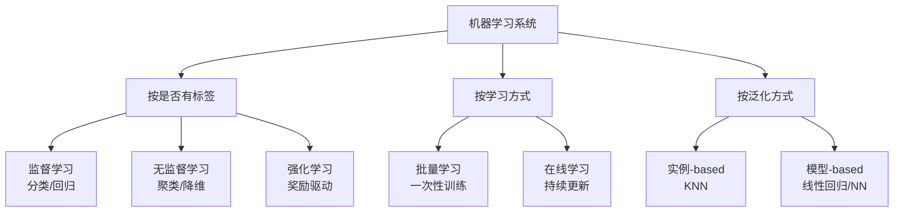
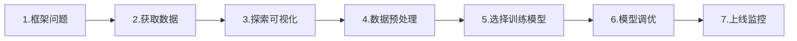

<!-- Post: 【机器学习阅读导论第4篇】从房价预测看机器学习的完整生命周期 | ID: 2026-053 | Created: 2026-09-03 | Tags: books, tech, 机器学习 | Format: markdown -->

## 开篇：老板给你一份加州房价数据，让你预测房价

想象一下：你刚入职一家房产科技公司，老板扔给你一份CSV文件——加州各个街区的人口、收入、地理位置等数据，然后说："帮我建一个模型，预测每个街区的房价中位数。"

你打开文件，2万多行数据，10个字段。从哪下手？数据要清洗吗？用什么模型？怎么评估好坏？上线后怎么维护？

这就是第2章要解决的问题。作者用**加州房价预测**这个完整案例，把机器学习项目的全流程跑了一遍。这一章是全书的"实战模板"——它的代码结构可以复用到几乎所有回归和分类项目。

> "The most important thing is to have a complete end-to-end pipeline that you can use as a template for future projects."
> —— 第2章，第37页（作者意图总结）

## 一、ML全景图：先建立概念地图（第1章）

在动手写代码之前，先搞清楚机器学习的"地形"。

### 1.1 机器学习的定义

作者给出了两个经典定义：

> "Machine Learning is the science (and art) of programming computers so they can learn from data."
> —— 第1章，第4页

> "A computer program is said to learn from experience E with respect to some task T and some performance measure P, if its performance on T, as measured by P, improves with experience E."
> —— Tom Mitchell, 1997，引自第1章，第4页

用房价预测来套这个定义：
- **任务T**：预测街区房价中位数
- **经验E**：2万条历史房价数据
- **性能指标P**：预测值与真实值的均方根误差（RMSE）

模型训练的过程，就是让RMSE随着训练数据的增加而不断降低的过程。

### 1.2 学习系统的分类



房价预测属于**监督学习 + 批量学习 + 模型-based**：有标签（真实房价）、一次性训练、学习一个参数化模型。

### 1.3 机器学习的四大杀手

作者在第1章总结了导致ML项目失败的四个主要原因：

| 杀手 | 通俗解释 | 房价预测中的例子 |
|------|---------|----------------|
| **训练数据不足** | 样本太少，学不到规律 | 只有100条数据，无法覆盖各种房型 |
| **数据不具代表性** | 样本不能反映真实分布 | 只收集了富人区数据，预测穷人区就不准 |
| **低质量数据** | 噪声大、缺失多、错误多 | 很多字段是空的，或者房价明显填错了 |
| **无关特征** | 输入了没用的信息 | 把"街区编号"当特征，模型学不到任何规律 |

还有两个更隐蔽的杀手：

- **过拟合（Overfitting）**：模型太复杂，记住了训练数据的噪声。就像学生死记硬背模拟题，一到高考就傻眼。
- **欠拟合（Underfitting）**：模型太简单，连基本规律都没学到。就像学生连课本例题都不会做。

> "Overfitting happens when the model performs well on the training data but does not generalize well to new data."
> —— 第1章，第28页

## 二、端到端项目七步法（第2章）

第2章把一个完整的ML项目拆成了七个步骤。这就是你以后做项目的"标准作业流程"。



### Step 1：框架问题，选性能指标

首先要明确：这是一个**监督学习**任务（有标签），具体是**回归**任务（预测连续值），还是**多变量回归**（每个街区预测一个值）。

性能指标选什么？作者推荐了两个：

- **RMSE（均方根误差）**：$\text{RMSE} = \sqrt{\frac{1}{m}\sum_{i=1}^{m}(h(x_i) - y_i)^2}$
  - 对大误差更敏感，适合"大错不能犯"的场景
- **MAE（平均绝对误差）**：$\text{MAE} = \frac{1}{m}\sum_{i=1}^{m}|h(x_i) - y_i|$
  - 对异常值更鲁棒，适合数据噪声大的场景

> "RMSE is generally the preferred performance measure for regression tasks, but it is sensitive to outliers."
> —— 第2章，第42页

### Step 2：获取数据，创建测试集

作者写了一个函数下载并解压加州房价数据：

```python
import os
import tarfile
import urllib.request

DOWNLOAD_ROOT = "https://raw.githubusercontent.com/ageron/handson-ml2/master/"
HOUSING_PATH = os.path.join("datasets", "housing")
HOUSING_URL = DOWNLOAD_ROOT + "datasets/housing/housing.tgz"

def fetch_housing_data(housing_url=HOUSING_URL, housing_path=HOUSING_PATH):
    if not os.path.isdir(housing_path):
        os.makedirs(housing_path)
    tgz_path = os.path.join(housing_path, "housing.tgz")
    urllib.request.urlretrieve(housing_url, tgz_path)
    with tarfile.open(tgz_path) as housing_tgz:
        housing_tgz.extractall(path=housing_path)
```

加载数据：

```python
import pandas as pd

def load_housing_data(housing_path=HOUSING_PATH):
    csv_path = os.path.join(housing_path, "housing.csv")
    return pd.read_csv(csv_path)

housing = load_housing_data()
```

**关键动作：立刻创建测试集，并且绝对不要偷看！**

普通的随机划分可能导致测试集分布不均。作者推荐**分层抽样**（Stratified Sampling）：按收入等级分层，保证测试集中各收入等级的比例和全集一致。

```python
from sklearn.model_selection import StratifiedShuffleSplit

# 先把收入分箱，创建分层依据
housing["income_cat"] = pd.cut(housing["median_income"],
                               bins=[0., 1.5, 3.0, 4.5, 6., np.inf],
                               labels=[1, 2, 3, 4, 5])

split = StratifiedShuffleSplit(n_splits=1, test_size=0.2, random_state=42)
for train_index, test_index in split.split(housing, housing["income_cat"]):
    strat_train_set = housing.loc[train_index]
    strat_test_set = housing.loc[test_index]
```

> "The test set must be untouched until the very end of the project."
> —— 第1章，第31页

### Step 3：探索与可视化数据

这一步的目标是**建立对数据的直觉**，而不是急着建模。

作者做了几件事：
1. 用 `housing.head()` 看前5行，了解字段含义
2. 用 `housing.info()` 看数据类型和缺失值
3. 用 `housing.describe()` 看数值分布
4. 画地理散点图（经纬度x房价），发现"靠海+高收入=高房价"
5. 算相关性矩阵，找出和房价最相关的特征
6. 尝试特征组合（如"房间数/户数"比单纯的房间数更有意义）

### Step 4：数据预处理Pipeline

这是最容易出错的一步。数据有数值特征和类别特征，需要分别处理。作者用 **Pipeline + ColumnTransformer** 构建了一个完整的预处理流水线：

```python
from sklearn.pipeline import Pipeline
from sklearn.preprocessing import StandardScaler, OneHotEncoder
from sklearn.impute import SimpleImputer
from sklearn.compose import ColumnTransformer

# 数值特征的处理流水线：缺失值填充 → 标准化
num_pipeline = Pipeline([
    ('imputer', SimpleImputer(strategy="median")),
    ('std_scaler', StandardScaler()),
])

# 自动区分数值特征和类别特征
num_attribs = list(housing_num)  # 数值特征列表
cat_attribs = ["ocean_proximity"]  # 类别特征

# 完整流水线：数值走num_pipeline，类别走OneHotEncoder
full_pipeline = ColumnTransformer([
    ("num", num_pipeline, num_attribs),
    ("cat", OneHotEncoder(), cat_attribs),
])

housing_prepared = full_pipeline.fit_transform(housing_train)
```

这个Pipeline的好处是：**训练集和测试集用同一个预处理流程**，避免了数据泄露。而且以后新数据来了，直接 `full_pipeline.transform(new_data)` 就行。

### Step 5：选择并训练模型

数据准备好了，就可以训练模型了。作者先试了两个简单模型：

```python
from sklearn.linear_model import LinearRegression
from sklearn.metrics import mean_squared_error

# 线性回归
lin_reg = LinearRegression()
lin_reg.fit(housing_prepared, housing_labels)

# 评估
housing_predictions = lin_reg.predict(housing_prepared)
lin_mse = mean_squared_error(housing_labels, housing_predictions)
lin_rmse = np.sqrt(lin_mse)
print(f"线性回归训练集RMSE: {lin_rmse:.2f}")
```

但训练集上的表现不能说明问题——模型可能过拟合了。这时候需要**交叉验证**：

```python
from sklearn.model_selection import cross_val_score

scores = cross_val_score(lin_reg, housing_prepared, housing_labels,
                         scoring="neg_mean_squared_error", cv=10)
lin_rmse_scores = np.sqrt(-scores)
print(f"交叉验证RMSE: {lin_rmse_scores.mean():.2f} (±{lin_rmse_scores.std():.2f})")
```

作者还试了决策树和随机森林，发现随机森林效果最好。

### Step 6：模型调优

选定模型后，需要调超参数。作者用了**网格搜索（Grid Search）**：

```python
from sklearn.model_selection import GridSearchCV
from sklearn.ensemble import RandomForestRegressor

param_grid = [
    {'n_estimators': [3, 10, 30], 'max_features': [2, 4, 6, 8]},
    {'bootstrap': [False], 'n_estimators': [3, 10], 'max_features': [2, 3, 4]},
]

forest_reg = RandomForestRegressor()
grid_search = GridSearchCV(forest_reg, param_grid, cv=5,
                           scoring='neg_mean_squared_error',
                           return_train_score=True)
grid_search.fit(housing_prepared, housing_labels)

print(f"最佳参数: {grid_search.best_params_}")
print(f"最佳交叉验证RMSE: {np.sqrt(-grid_search.best_score_):.2f}")
```

调优完成后，**最后一步才是用测试集评估**：

```python
final_model = grid_search.best_estimator_
X_test = strat_test_set.drop("median_house_value", axis=1)
y_test = strat_test_set["median_house_value"].copy()

X_test_prepared = full_pipeline.transform(X_test)
final_predictions = final_model.predict(X_test_prepared)
final_mse = mean_squared_error(y_test, final_predictions)
final_rmse = np.sqrt(final_mse)
print(f"测试集RMSE: {final_rmse:.2f}")
```

### Step 7：上线、监控与维护

模型上线不是结束，而是开始。你需要：
- 监控模型性能（数据分布会漂移，模型会老化）
- 定期用新数据重新训练
- 建立回滚机制（新模型出问题时能切回旧版本）

> "Launch, monitor, and maintain your system: this includes monitoring the model's performance over time and retraining it on fresh data regularly."
> —— 第2章，第84页

## 三、常见坑与避坑指南

| 坑 | 后果 | 避坑方法 |
|----|------|---------|
| **测试集参与训练** | 评估结果虚高，上线就崩 | 一开始就划分测试集，全程不碰 |
| **用测试集调参** | 模型过拟合测试集 | 用验证集/交叉验证调参，测试集只用一次 |
| **预处理时用了全量数据统计** | 数据泄露，评估不准 | Pipeline只在训练集上fit，测试集只transform |
| **忽略缺失值** | 训练报错或预测异常 | SimpleImputer填充中位数/众数 |
| **不做特征缩放** | 数值大的特征主导模型 | StandardScaler标准化 |
| **随机划分导致分布偏移** | 测试集不具代表性 | StratifiedShuffleSplit分层抽样 |

## 四、原书图表索引

| 图表编号 | 内容 | 所在位置 |
|---------|------|---------|
| Figure 1-1 | 传统编程 vs 机器学习方法 | 第1章，第5页 |
| Figure 1-21 | 过拟合示意（高次多项式拟合噪声） | 第1章，第28页 |
| Figure 2-1 | 完整ML项目流水线 | 第2章，第38页 |
| Figure 2-5 | 数据集前5行 | 第2章，第50页 |
| Figure 2-13 | 加州房价地理散点图 | 第2章，第59页 |
| Figure 2-16 | 数据预处理Pipeline示意 | 第2章，第72页 |
| Figure 2-17 | 预测值vs真实值散点图 | 第2章，第83页 |

## 五、小结

这一篇我们完成了主题1的深度拆解：

1. **ML全景图**：定义、分类、四大杀手、过拟合vs欠拟合
2. **端到端七步法**：框架问题→获取数据→探索→预处理→训练→调优→上线
3. **核心工具**：StratifiedShuffleSplit、Pipeline、ColumnTransformer、cross_val_score、GridSearchCV
4. **关键原则**：测试集只能用一次、预处理不能泄露测试集信息、交叉验证比单次评估更可靠

记住：**第2章的代码结构就是你以后做ML项目的模板**。把这个Pipeline吃透，后面的算法学习就只是"换模型"的事。

## 下一篇预告

第5篇我们将深入**主题2：经典监督学习算法族**。用MNIST手写数字讲透分类评估（混淆矩阵/Precision/Recall/ROC），然后从线性回归推导到梯度下降——Batch/SGD/Mini-batch三兄弟的区别，以及Ridge/Lasso/Elastic Net正则化的数学本质。

> 系列导航：第1篇入门导引 → 第2篇全书地图 → 第3篇深度阅读导引 → 第4篇ML全局观与项目流水线 → **第5篇经典监督学习算法族** → 第6-10篇核心主题 → 第11篇主题阅读 → 第12篇研究式阅读
