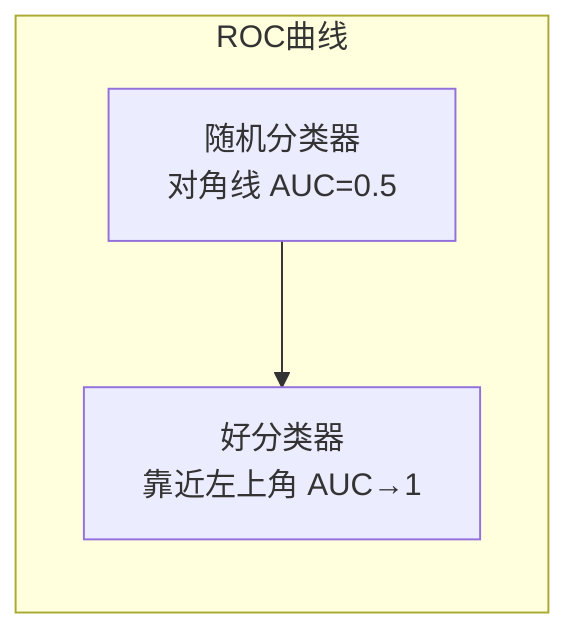
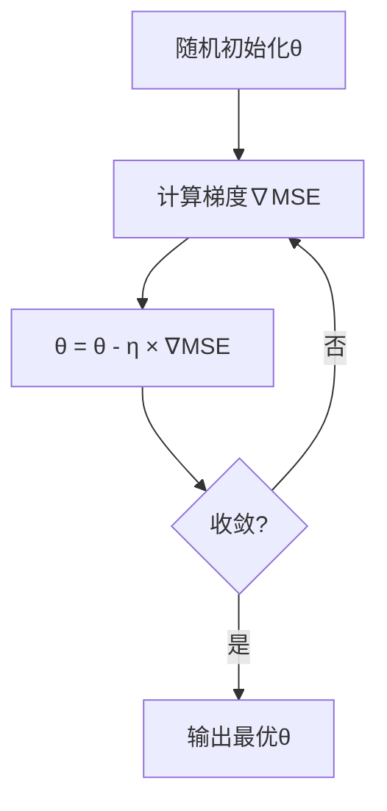

<!-- Post: 【机器学习阅读导论第5篇】分类与回归的数学本质：从逻辑回归到梯度下降 | ID: 2026-054 | Created: 2026-09-03 | Tags: books, tech, 机器学习 | Format: markdown -->

## 开篇：为什么"准确率99%"的分类器可能是废物？

假设你训练了一个癌症检测模型，准确率99%。你兴奋地向老板汇报，老板却问了一个问题："癌症在人群中的发病率是多少？"

你查了一下：0.5%。也就是说，1000个人里只有5个癌症患者。

这时候你突然意识到：如果模型**永远预测"没有癌症"**，准确率也能达到99.5%——比你的模型还高！

这就是**类别不平衡**带来的陷阱。在垃圾邮件检测、欺诈识别、疾病诊断等场景中，正负样本比例悬殊，"准确率"这个指标会彻底失效。

第3章用MNIST手写数字识别这个案例，系统地讲透了分类任务的评估体系。而第4章则从线性回归出发，推导到梯度下降——这是几乎所有机器学习算法（包括神经网络）的优化引擎。

## 一、分类评估体系（第3章）

### 1.1 混淆矩阵：分类器的"体检报告"

混淆矩阵（Confusion Matrix）是分类评估的基础。它把预测结果分成四类：

| | 预测为正 | 预测为负 |
|---|---------|---------|
| **实际为正** | TP（真正例） | FN（假负例） |
| **实际为负** | FP（假正例） | TN（真负例） |

用癌症检测来理解：
- **TP**：真的癌症患者，被正确识别出来
- **FN**：真的癌症患者，被漏诊了（最危险！）
- **FP**：健康人，被误诊为癌症（虚惊一场）
- **TN**：健康人，被正确判断为健康

> "A much better way to evaluate the performance of a classifier is to look at the confusion matrix. The general idea is to count the number of times instances of class A are classified as class B."
> —— 第3章，第92页

### 1.2 Precision与Recall：一对矛盾的指标

从混淆矩阵可以派生出两个关键指标：

**Precision（精确率）**：预测为正的样本中，真正为正的比例

$$
\text{Precision} = \frac{TP}{TP + FP}
$$

> "precision = TP / (TP + FP). TP is the number of true positives, and FP is the number of false positives."
> —— 第3章，第93页，Equation 3-1

通俗解释：**"你说有癌症的人里，真的有多少人得了癌症？"** Precision高意味着误诊少。

**Recall（召回率，又称灵敏度/TPR）**：实际为正的样本中，被正确识别的比例

$$
\text{Recall} = \frac{TP}{TP + FN}
$$

> "recall = TP / (TP + FN). FN is the number of false negatives."
> —— 第3章，第93页，Equation 3-2

通俗解释：**"真的得了癌症的人里，有多少被你查出来了？"** Recall高意味着漏诊少。

### 1.3 Precision/Recall权衡：鱼与熊掌不可兼得

Precision和Recall是一对矛盾体：

- 提高阈值（更谨慎地判断为正）→ Precision升高，Recall降低
- 降低阈值（更宽松地判断为正）→ Recall升高，Precision降低

> "Increasing precision reduces recall, and vice versa. This is called the precision/recall tradeoff."
> —— 第3章，第95页

**场景选择**：
- 癌症检测：优先高Recall（宁可误诊，不可漏诊）
- 垃圾邮件过滤：优先高Precision（宁可漏过垃圾邮件，不可误删正常邮件）

### 1.4 F1分数：调和平均

当需要一个综合指标时，用F1分数——Precision和Recall的**调和平均**：

$$
F_1 = \frac{2}{\frac{1}{\text{Precision}} + \frac{1}{\text{Recall}}} = 2 \times \frac{\text{Precision} \times \text{Recall}}{\text{Precision} + \text{Recall}}
$$

调和平均的特点：**只有Precision和Recall都高时，F1才高**。一个100%、一个0%，F1就是0。

### 1.5 ROC曲线与AUC

ROC曲线（Receiver Operating Characteristic）画的是**真正例率（TPR=Recall）vs 假正例率（FPR）**：

$$
\text{FPR} = \frac{FP}{FP + TN}
$$



AUC（Area Under Curve）是ROC曲线下的面积：
- 完美分类器：AUC = 1
- 随机分类器：AUC = 0.5
- AUC越接近1，分类器越好

> "A perfect classifier will have a ROC AUC equal to 1, whereas a purely random classifier will have a ROC AUC equal to 0.5."
> —— 第3章，第99页

**PR曲线 vs ROC曲线怎么选？**
- 正样本稀少（如癌症检测）→ 用PR曲线（更关注正类）
- 正负样本均衡 → 用ROC曲线

### 1.6 多分类与多标签

- **多分类（Multiclass）**：一个样本只属于一个类别，但有多个类别可选（如数字识别0-9）
- **多标签（Multilabel）**：一个样本可以同时属于多个类别（如一张照片里同时有猫和狗）
- **多输出（Multioutput）**：每个标签可以是多分类（如去噪：每个像素点预测一个值）

## 二、线性回归与正态方程（第4章）

### 2.1 线性模型的数学形式

线性回归假设目标值是特征的线性组合：

$$
\hat{y} = \theta_0 + \theta_1 x_1 + \theta_2 x_2 + \cdots + \theta_n x_n
$$

写成向量形式：$\hat{y} = \theta^T \cdot x$，其中$\theta_0$是截距（bias），$\theta_1$到$\theta_n$是特征权重。

### 2.2 成本函数：MSE

训练线性回归的目标是找到$\theta$，使预测值$\hat{y}$和真实值$y$之间的均方误差（MSE）最小：

$$
\text{MSE}(X, h_\theta) = \frac{1}{m} \sum_{i=1}^{m} (\theta^T x^{(i)} - y^{(i)})^2
$$

### 2.3 正态方程：闭式解

对于线性回归，有一个直接求出最优$\theta$的数学公式——正态方程（Normal Equation）：

$$
\hat{\theta} = (X^T X)^{-1} X^T y
$$

> "To find the value of θ that minimizes the cost function, there is a closed-form solution — in other words, a mathematical equation that gives the result directly. This is called the Normal Equation."
> —— 第4章，第116页，Equation 4-4

代码实现：

```python
import numpy as np

# 生成模拟数据
X = 2 * np.random.rand(100, 1)
y = 4 + 3 * X + np.random.randn(100, 1)

# 添加偏置项 x0 = 1
X_b = np.c_[np.ones((100, 1)), X]

# 正态方程求解
theta_best = np.linalg.inv(X_b.T.dot(X_b)).dot(X_b.T).dot(y)
print(f"theta = {theta_best.ravel()}")
# 输出接近 [4, 3]
```

**正态方程的局限**：计算复杂度是$O(n^{2.4})$到$O(n^3)$（$n$是特征数），特征数很大时（如10万+）计算极慢。这时候就需要梯度下降。

## 三、梯度下降三兄弟

梯度下降（Gradient Descent）是一种迭代优化算法：从随机参数出发，沿着成本函数下降最快的方向（负梯度方向）一步步走，直到到达谷底。

> "Gradient Descent tweaks the parameters iteratively in order to minimize a cost function. It measures the local gradient of the error function with regards to the parameter vector θ, and it goes in the direction of descending gradient."
> —— 第4章，第119页



其中$\eta$（eta）是**学习率（learning rate）**：
- 太小：收敛很慢，需要很多次迭代
- 太大：可能跳过最优点，甚至发散

### 3.1 Batch Gradient Descent（批量梯度下降）

每一步都用**全部训练数据**计算梯度。

```python
eta = 0.1  # 学习率
n_iterations = 1000
m = 100

theta = np.random.randn(2, 1)  # 随机初始化

for iteration in range(n_iterations):
    gradients = 2/m * X_b.T.dot(X_b.dot(theta) - y)
    theta = theta - eta * gradients
```

- **优点**：稳定，能收敛到全局最优（凸函数）
- **缺点**：每步都要遍历全量数据，大数据集时极慢

### 3.2 Stochastic Gradient Descent（随机梯度下降，SGD）

每一步**随机选一个样本**计算梯度。

```python
n_epochs = 50
t0, t1 = 5, 50  # 学习率调度参数

def learning_schedule(t):
    return t0 / (t + t1)

theta = np.random.randn(2, 1)

for epoch in range(n_epochs):
    for i in range(m):
        random_index = np.random.randint(m)
        xi = X_b[random_index:random_index+1]
        yi = y[random_index:random_index+1]
        gradients = 2 * xi.T.dot(xi.dot(theta) - yi)
        eta = learning_schedule(epoch * m + i)
        theta = theta - eta * gradients
```

- **优点**：快，能跳出局部最优
- **缺点**：不稳定，最终在最优点附近"震荡"，不会精确收敛
- **技巧**：逐渐降低学习率（模拟退火），让它慢慢稳定下来

### 3.3 Mini-batch Gradient Descent（小批量梯度下降）

每一步用**一小批样本**（如32/64/128个）计算梯度。

- **优点**：兼顾稳定性和速度，能利用矩阵运算的硬件加速（GPU）
- **缺点**：多了一个超参数（batch size）要调

| 对比维度 | Batch GD | SGD | Mini-batch GD |
|---------|----------|-----|---------------|
| 每步用多少数据 | 全部m个 | 1个 | 一小批（如32） |
| 速度 | 慢 | 快 | 中等 |
| 稳定性 | 稳定 | 震荡 | 较稳定 |
| 能否跳出局部最优 | 不能 | 能 | 偶尔能 |
| GPU友好 | 一般 | 差 | 最好 |
| 典型应用 | 小数据集 | 在线学习 | 深度学习标准 |

> 这三种梯度下降是第10-11章神经网络训练的基础。深度学习中用的几乎都是Mini-batch GD。

## 四、多项式回归与正则化

### 4.1 多项式回归

数据不是线性的怎么办？把特征的高次幂加进去，仍然用线性回归训练：

$$
\hat{y} = \theta_0 + \theta_1 x + \theta_2 x^2
$$

```python
from sklearn.preprocessing import PolynomialFeatures

poly_features = PolynomialFeatures(degree=2, include_bias=False)
X_poly = poly_features.fit_transform(X)  # 增加 x^2 特征

lin_reg = LinearRegression()
lin_reg.fit(X_poly, y)
```

### 4.2 学习曲线：判断过拟合/欠拟合

画训练集和验证集的误差随训练集大小变化的曲线：
- **欠拟合**：两条曲线都高，且很快收敛到一个高误差
- **过拟合**：训练集误差很低，验证集误差很高，中间有大 gap
- **合适**：两条曲线都低，且 gap 小

### 4.3 正则化三剑客

正则化的核心思想：**限制模型参数的大小，防止模型太复杂**。

**Ridge回归（L2正则化）**：在成本函数中加$\alpha \sum_{i=1}^{n} \theta_i^2$

$$
J(\theta) = \text{MSE}(\theta) + \alpha \frac{1}{2} \sum_{i=1}^{n} \theta_i^2
$$

特点：让所有参数都变小，但不会变成0。

**Lasso回归（L1正则化）**：在成本函数中加$\alpha \sum_{i=1}^{n} |\theta_i|$

$$
J(\theta) = \text{MSE}(\theta) + \alpha \sum_{i=1}^{n} |\theta_i|
$$

特点：会把不重要的特征权重直接变成0，相当于**自动特征选择**。

**Elastic Net**：Ridge和Lasso的混合，用$r$控制比例：

$$
J(\theta) = \text{MSE}(\theta) + r\alpha \sum|\theta_i| + \frac{1-r}{2}\alpha \sum\theta_i^2
$$

| 正则化 | 特点 | 适用场景 |
|--------|------|---------|
| Ridge | 参数缩小但不为0 | 大多数情况的默认选择 |
| Lasso | 自动特征选择，参数变0 | 特征多、怀疑只有少数重要时 |
| Elastic Net | 两者混合，$r$控制比例 | Lasso不稳定时（特征数>样本数） |

> "Ridge Regression is a regularized version of Linear Regression: a regularization term equal to αΣθᵢ² is added to the cost function."
> —— 第4章，第137页

## 五、逻辑回归与Softmax

### 5.1 逻辑回归

逻辑回归用于**二分类**。它先计算一个分数$z = \theta^T x$，然后通过Sigmoid函数转成概率：

$$
\hat{p} = \sigma(z) = \frac{1}{1 + e^{-z}}
$$

- $\hat{p} \geq 0.5$ → 预测为正类
- $\hat{p} < 0.5$ → 预测为负类

成本函数是对数损失（Log Loss）：

$$
J(\theta) = -\frac{1}{m} \sum_{i=1}^{m} [y^{(i)} \log(\hat{p}^{(i)}) + (1-y^{(i)}) \log(1-\hat{p}^{(i)})]
$$

### 5.2 Softmax回归

逻辑回归的多分类版本。对每个类别$k$计算一个分数$s_k(x)$，然后用Softmax函数转成概率：

$$
\hat{p}_k = \frac{\exp(s_k(x))}{\sum_{j=1}^{K} \exp(s_j(x))}
$$

预测时选概率最大的类别。

## 六、代码示例：MNIST分类完整流程

```python
from sklearn.datasets import fetch_openml
from sklearn.linear_model import SGDClassifier
from sklearn.model_selection import cross_val_score, cross_val_predict
from sklearn.metrics import confusion_matrix, precision_score, recall_score, f1_score

# 加载MNIST
mnist = fetch_openml('mnist_784', version=1)
X, y = mnist["data"], mnist["target"]
X_train, X_test, y_train, y_test = X[:60000], X[60000:], y[:60000], y[60000:]

# 二分类：识别数字5
y_train_5 = (y_train == '5')
y_test_5 = (y_test == '5')

sgd_clf = SGDClassifier(random_state=42)
sgd_clf.fit(X_train, y_train_5)

# 交叉验证评估
y_train_pred = cross_val_predict(sgd_clf, X_train, y_train_5, cv=3)
print("混淆矩阵:\n", confusion_matrix(y_train_5, y_train_pred))
print(f"Precision: {precision_score(y_train_5, y_train_pred):.3f}")
print(f"Recall: {recall_score(y_train_5, y_train_pred):.3f}")
print(f"F1: {f1_score(y_train_5, y_train_pred):.3f}")
```

## 七、原书图表索引

| 图表编号 | 内容 | 所在位置 |
|---------|------|---------|
| Figure 3-2 | 混淆矩阵示意 | 第3章，第92页 |
| Figure 3-6 | Precision/Recall曲线 | 第3章，第95页 |
| Figure 3-7 | ROC曲线 | 第3章，第99页 |
| Figure 4-1 | 线性回归模型 | 第4章，第114页 |
| Figure 4-4 | 学习率太小 | 第4章，第120页 |
| Figure 4-5 | 学习率太大（发散） | 第4章，第121页 |
| Figure 4-8 | 梯度下降路径对比 | 第4章，第123页 |
| Figure 4-20 | Ridge/Lasso/Elastic Net对比 | 第4章，第142页 |

## 八、小结

这一篇我们深入了主题2——经典监督学习的数学本质：

1. **分类评估**：准确率在不平衡数据上会骗人；混淆矩阵→Precision/Recall→F1→ROC/AUC是完整评估体系
2. **线性回归**：正态方程是闭式解，但特征多时计算慢；梯度下降是迭代解，更通用
3. **梯度下降三兄弟**：Batch稳但慢、SGD快但震荡、Mini-batch兼顾两者（深度学习标准）
4. **正则化**：Ridge（L2）缩参数、Lasso（L1）做特征选择、Elastic Net混合
5. **逻辑回归/Softmax**：Sigmoid做二分类，Softmax做多分类

记住一个核心洞察：**梯度下降是机器学习的"发动机"**。第4章理解了它，第10-11章的神经网络训练就只是"把这个发动机装到更大的车上"。

## 下一篇预告

第6篇我们将深入**主题3：核方法与树模型**。SVM如何用"核技巧"在高维空间中找到最大间隔超平面？决策树的CART算法如何自动选择分裂特征和阈值？两种截然不同的建模哲学，各有什么优劣？

> 系列导航：第1篇入门导引 → 第2篇全书地图 → 第3篇深度阅读导引 → 第4篇ML全局观与项目流水线 → 第5篇经典监督学习算法族 → **第6篇核方法与树模型** → 第7-10篇核心主题 → 第11篇主题阅读 → 第12篇研究式阅读
