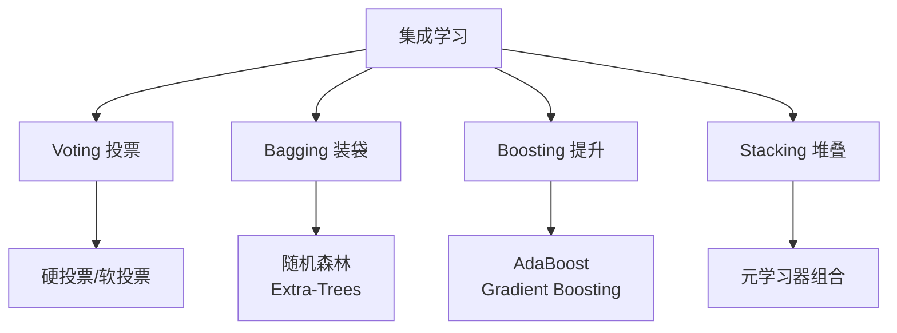
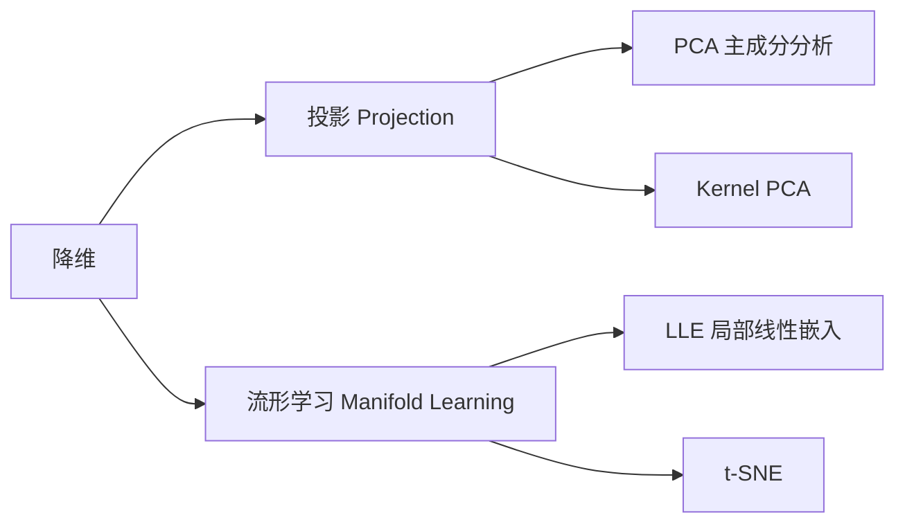

<!-- Post: 【机器学习阅读导论第7篇】三个臭皮匠赛过诸葛亮：集成学习为什么赢，以及高维诅咒怎么破 | ID: 2026-056 | Created: 2026-09-03 | Tags: books, tech, 机器学习 | Format: markdown -->

## 开篇：为什么随机森林几乎总是比单棵决策树好？

上一篇我们讲了决策树——它简单、可解释，但有一个致命弱点：**不稳定**。训练数据稍微变一点，树的结构就可能完全不同；预测结果方差很大。

怎么解决？答案是：**种一片森林**。

如果你有1000棵决策树，每棵都不太准，但它们犯的错各不相同。把它们的预测结果平均一下，错误会互相抵消，最终结果反而比任何一棵树都准。

这就是**集成学习（Ensemble Learning）**的核心思想："三个臭皮匠，赛过诸葛亮。"

这一篇我们讲两大主题：
1. **集成学习**（第7章）：把多个弱模型组合成强模型的四大流派
2. **降维**（第8章）：当特征多到爆炸时，如何压缩数据同时保留信息

## 一、集成学习四大流派（第7章）



### 1.1 Voting Classifier：投票

最简单的集成方式：训练多个不同的分类器，让它们投票。

- **硬投票（Hard Voting）**：少数服从多数，选预测最多的类别
- **软投票（Soft Voting）**：加权平均每个分类器的预测概率，选概率最高的类别（效果通常更好）

> "Suppose you have trained a few classifiers, each one achieving about 80% accuracy... A very simple way to create an even better classifier is to aggregate the predictions of each classifier and predict the class that gets the most votes."
> —— 第7章，第192页

```python
from sklearn.ensemble import VotingClassifier
from sklearn.linear_model import LogisticRegression
from sklearn.svm import SVC
from sklearn.ensemble import RandomForestClassifier

voting_clf = VotingClassifier(
    estimators=[
        ('lr', LogisticRegression()),
        ('rf', RandomForestClassifier()),
        ('svc', SVC(probability=True))  # 软投票需要probability=True
    ],
    voting='soft'  # 软投票
)
voting_clf.fit(X_train, y_train)
```

### 1.2 Bagging & Pasting：自助采样

Voting用不同算法，Bagging用**同一个算法**，但给每个模型看不同的数据子集。

- **Bagging（Bootstrap Aggregating）**：有放回采样（同一个样本可能被抽多次）
- **Pasting**：无放回采样

Bagging更常用。每个模型在不同的数据子集上训练，因此模型之间有差异，组合后能降低方差。

> "Bagging and Pasting both allow training instances to be sampled several times across multiple predictors, but only Bagging allows training instances to be sampled several times for the same predictor."
> —— 第7章，第195页

**Out-of-Bag（OOB）评估**：Bagging中，每个模型大约只看到63%的训练数据（有放回采样的数学性质），剩下37%没被抽中的样本叫"袋外样本"。可以直接用OOB样本做验证，不需要额外划分验证集！

```python
from sklearn.ensemble import BaggingClassifier
from sklearn.tree import DecisionTreeClassifier

bag_clf = BaggingClassifier(
    DecisionTreeClassifier(),
    n_estimators=500,       # 500棵树
    max_samples=100,        # 每个模型看100个样本
    bootstrap=True,         # Bagging：有放回
    oob_score=True          # 启用OOB评估
)
bag_clf.fit(X_train, y_train)
print(f"OOB score: {bag_clf.oob_score_:.3f}")
```

### 1.3 随机森林：Bagging + 决策树 + 特征随机

随机森林（Random Forest）是Bagging的特例：基模型是决策树，并且在每次分裂时**随机选择一部分特征**来考虑。

这双重随机性（数据随机 + 特征随机）让每棵树都不同，组合后效果极好。

```python
from sklearn.ensemble import RandomForestClassifier

rf_clf = RandomForestClassifier(
    n_estimators=500,
    max_leaf_nodes=16,
    n_jobs=-1  # 用所有CPU核心并行训练
)
rf_clf.fit(X_train, y_train)

# 随机森林还能输出特征重要性！
print("特征重要性:", rf_clf.feature_importances_)
```

**Extra-Trees（极端随机树）**：比随机森林更激进——分裂时不仅随机选特征，连阈值也随机选。训练更快，方差更低。

### 1.4 Boosting：串行纠错

和Bagging的并行训练不同，Boosting是**串行**的：每个新模型都专注于纠正前一个模型的错误。

**AdaBoost（自适应提升）**：
- 前一个模型分错的样本，权重提高
- 下一个模型更关注这些高权重样本
- 最终按每个模型的准确率加权投票

> "AdaBoost: a new predictor pays a bit more attention to the training instances that the predecessor underfitted."
> —— 第7章，第202页

**Gradient Boosting（梯度提升）**：
- 不调整样本权重，而是让新模型**拟合前一个模型的残差**（预测误差）
- 每加一棵树，预测就更接近真实值一步
- 这就是GBDT、XGBoost、LightGBM、CatBoost的基础

```python
from sklearn.ensemble import GradientBoostingRegressor

gbrt = GradientBoostingRegressor(
    max_depth=2,
    n_estimators=3,
    learning_rate=1.0
)
gbrt.fit(X_train, y_train)
```

**学习率（learning_rate）**：每棵树的贡献乘以这个系数。
- 小学习率 + 多棵树 → 更稳，但训练慢
- 大学习率 + 少棵树 → 快，但可能过拟合

### 1.5 Stacking：用模型来组合模型

Stacking不做简单的投票或平均，而是**训练一个"元学习器"（blender）**来组合各个基模型的预测。

流程：
1. 把训练集分成两部分
2. 用第一部分训练多个基模型
3. 用基模型在第二部分上的预测作为新特征，训练元学习器

> "Stacking is based on a simple idea: instead of using trivial functions (such as hard voting) to aggregate the predictions of all predictors in an ensemble, why don't we train a model to perform this aggregation?"
> —— 第7章，第210页

### 1.6 Bagging vs Boosting 对比

| 对比维度 | Bagging | Boosting |
|---------|---------|----------|
| 训练方式 | 并行 | 串行 |
| 目标 | 降方差（解决过拟合） | 降偏差（解决欠拟合） |
| 基模型 | 高方差、低偏差（如深决策树） | 高偏差、低方差（如浅决策树） |
| 对异常值 | 鲁棒 | 敏感（异常值会被反复加权） |
| 典型模型 | 随机森林 | AdaBoost, GBDT, XGBoost |
| 可并行 | 是 | 否 |

## 二、降维：对抗维度灾难（第8章）

### 2.1 维度灾难

我们生活在3D世界，很难想象高维空间。但高维空间有一个反直觉的性质：**维度越高，数据越稀疏**。

- 1D：单位线段上随机取两点，平均距离1/3
- 2D：单位正方形上随机取两点，平均距离约0.52
- 1000D：平均距离大到离谱，所有点之间都"很远"

后果：
- 距离度量失效（所有点距离都差不多）
- 训练数据需要指数级增长才能覆盖空间
- 模型容易过拟合

> "The Curse of Dimensionality: we are so used to living in three dimensions that our intuition fails us when we try to imagine a high-dimensional space."
> —— 第8章，第216页

### 2.2 降维的两种思路



**投影（Projection）**：把高维数据投影到低维子空间。就像把3D物体的影子投到2D墙上。

**流形学习（Manifold Learning）**：假设高维数据其实躺在一个低维的"流形"上（比如卷起来的2D纸在3D空间），要把它展开。

### 2.3 PCA：主成分分析

PCA是最常用的降维方法。核心思想：**找到方差最大的方向，把数据投影到这些方向上**。

步骤：
1. 计算数据的协方差矩阵
2. 求协方差矩阵的特征向量（主成分）和特征值（方差大小）
3. 选前d个特征向量作为投影方向
4. 把数据投影到这d个方向上

> "PCA identifies the axis that accounts for the largest amount of variance in the training set. It also finds a second axis, orthogonal to the first, that accounts for the largest amount of remaining variance."
> —— 第8章，第222页

**解释方差比（Explained Variance Ratio）**：每个主成分保留了多少比例的方差。选维度时，通常要求保留95%的方差。

```python
from sklearn.decomposition import PCA

# 自动选择保留95%方差的维度
pca = PCA(n_components=0.95)
X_reduced = pca.fit_transform(X_train)

print(f"降维后维度: {pca.n_components_}")
print(f"保留方差比例: {pca.explained_variance_ratio_.sum():.3f}")
```

**PCA的其他用途**：
- 数据压缩（减少存储和计算）
- 加速训练
- 可视化（降到2D/3D画图）
- 去噪（丢弃的成分可能主要是噪声）

### 2.4 Kernel PCA

和SVM的核技巧一样，Kernel PCA用核函数处理非线性降维。常用核：RBF、sigmoid、多项式。

```python
from sklearn.decomposition import KernelPCA

rbf_pca = KernelPCA(n_components=2, kernel="rbf", gamma=0.04)
X_reduced = rbf_pca.fit_transform(X)
```

### 2.5 LLE：局部线性嵌入

LLE是流形学习的代表。它假设每个点和它的邻居在一个局部平面上，先找每个点的线性重建权重，然后在低维空间中保持这些权重关系。

适合展开"瑞士卷"这类卷曲的流形，但计算复杂度高，不适合大数据集。

### 2.6 降维方法选择

| 方法 | 线性/非线性 | 计算复杂度 | 适用场景 |
|------|-----------|-----------|---------|
| PCA | 线性 | 低 | 默认选择，大多数场景 |
| Kernel PCA | 非线性 | 中 | 数据有非线性结构 |
| LLE | 非线性 | 高 | 流形展开，小数据集 |
| t-SNE | 非线性 | 高 | 可视化（2D/3D），不适合预处理 |

## 三、代码示例：随机森林 + PCA

```python
from sklearn.datasets import fetch_openml
from sklearn.ensemble import RandomForestClassifier
from sklearn.decomposition import PCA
from sklearn.pipeline import Pipeline
from sklearn.model_selection import cross_val_score

# 加载MNIST
mnist = fetch_openml('mnist_784', version=1)
X, y = mnist["data"], mnist["target"]

# Pipeline：先PCA降维，再随机森林分类
pipe = Pipeline([
    ("pca", PCA(n_components=0.95)),  # 保留95%方差
    ("rf", RandomForestClassifier(n_estimators=100, random_state=42))
])

# 交叉验证
scores = cross_val_score(pipe, X, y, cv=3, scoring="accuracy")
print(f"准确率: {scores.mean():.3f} (±{scores.std():.3f})")

# 查看降维后的维度
pca = PCA(n_components=0.95)
X_reduced = pca.fit_transform(X)
print(f"原始维度: {X.shape[1]}, 降维后: {X_reduced.shape[1]}")
```

## 四、原书图表索引

| 图表编号 | 内容 | 所在位置 |
|---------|------|---------|
| Figure 7-3 | 投票分类器 | 第7章，第193页 |
| Figure 7-5 | Bagging决策边界 | 第7章，第196页 |
| Figure 7-8 | AdaBoost | 第7章，第203页 |
| Figure 7-9 | Gradient Boosting | 第7章，第206页 |
| Figure 8-3 | 维度灾难示意 | 第8章，第217页 |
| Figure 8-7 | PCA主成分 | 第8章，第223页 |
| Figure 8-9 | 解释方差比 | 第8章，第225页 |
| Figure 8-10 | 瑞士卷与LLE展开 | 第8章，第232页 |

## 五、小结

这一篇我们覆盖了主题4的两大块：

1. **集成学习四大流派**：
   - Voting：不同算法投票
   - Bagging：同算法不同数据，随机森林是代表
   - Boosting：串行纠错，GBDT/XGBoost是工业界表格数据的王者
   - Stacking：用元学习器组合

2. **降维**：
   - 维度灾难：高维空间数据稀疏
   - PCA：找方差最大的方向投影，保留95%方差是经验法则
   - Kernel PCA / LLE：非线性降维

记住两个实战经验：
- **表格数据预测**：先试XGBoost/LightGBM（Gradient Boosting的工程优化版），通常比深度学习效果好
- **特征太多**：先试PCA降维，既能加速又能减少过拟合

## 下一篇预告

第8篇我们将深入**主题5：无监督学习**。没有标签的时候，机器怎么发现数据中的结构？K-Means如何迭代找到簇中心？DBSCAN如何用密度发现任意形状的簇？高斯混合模型如何做异常检测？

> 系列导航：第1篇入门导引 → 第2篇全书地图 → 第3篇深度阅读导引 → 第4篇ML全局观与项目流水线 → 第5篇经典监督学习算法族 → 第6篇核方法与树模型 → 第7篇集成学习与降维 → **第8篇无监督学习** → 第9-10篇核心主题 → 第11篇主题阅读 → 第12篇研究式阅读
