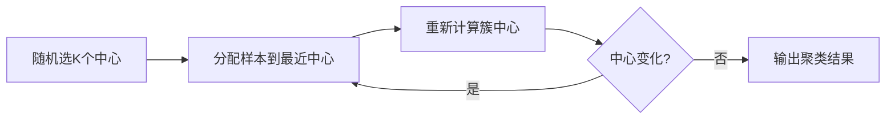

<!-- Post: 【机器学习阅读导论第8篇】没有标签怎么学？K-Means聚类与异常检测的艺术 | ID: 2026-057 | Created: 2026-09-03 | Tags: books, tech, 机器学习 | Format: markdown -->

## 开篇：给你100万用户的消费记录，没有任何标签，怎么分组？

你是一家电商公司的数据分析师。老板给了你一份数据：100万用户的浏览、购买、消费记录。然后说："帮我把用户分个群，看看有几类人，每类有什么特点。"

没有标签——没有"高价值用户""价格敏感用户"这样的标注。你不知道该分几类，也不知道每类的定义。

这就是**无监督学习（Unsupervised Learning）**的典型场景：只有数据，没有答案。机器要自己发现数据中的结构。

第9章覆盖了无监督学习的两大任务：
1. **聚类（Clustering）**：把相似的样本归为一组
2. **异常检测（Anomaly Detection）**：找出和大多数不一样的"异类"

## 一、聚类算法（第9章）

### 1.1 K-Means：最经典的聚类算法

K-Means的思路极其简单：

1. 随机选K个点作为初始"簇中心"（centroid）
2. 把每个样本分配给最近的簇中心
3. 重新计算每个簇的中心（簇内所有点的均值）
4. 重复步骤2-3，直到簇中心不再变化



**目标函数（惯性，inertia）**：每个样本到其簇中心的距离平方和。K-Means要最小化这个值。

> "The model's inertia: this is the mean squared distance between each instance and its closest centroid."
> —— 第9章，第242页

```python
from sklearn.cluster import KMeans

k = 5
kmeans = KMeans(n_clusters=k, random_state=42)
y_pred = kmeans.fit_predict(X)

print("簇中心:", kmeans.cluster_centers_)
print("惯性:", kmeans.inertia_)
```

### 1.2 K-Means的局限

K-Means简单高效，但有几个明显的局限：

| 局限 | 说明 | 解决方法 |
|------|------|---------|
| **需预设K** | 必须提前知道分几类 | 肘部法则、轮廓系数 |
| **对初始值敏感** | 不同初始化可能得到不同结果 | k-means++初始化、多次运行取最优 |
| **假设球形簇** | 认为簇是球形的、大小相近 | 用GMM或DBSCAN |
| **对异常值敏感** | 异常值会拉偏簇中心 | 先做异常检测，或用K-Medoids |

### 1.3 如何选择K？

**肘部法则（Elbow Rule）**：画惯性随K变化的曲线，找"肘部"——惯性下降突然变慢的点。

> "As you can see, the inertia drops very quickly as we increase k up to 4, but then it decreases much more slowly as we keep increasing k. This curve has roughly the shape of an arm, and the 'elbow' is around k=4."
> —— 第9章，第246页

**轮廓系数（Silhouette Score）**：更精确的指标。每个样本的轮廓系数 = $(b-a)/\max(a,b)$，其中：
- $a$：到同簇其他点的平均距离
- $b$：到最近其他簇的平均距离

轮廓系数范围[-1, 1]：
- 接近1：聚类好
- 接近0：在边界上
- 接近-1：分错了

```python
from sklearn.metrics import silhouette_score

silhouette_scores = []
for k in range(2, 10):
    kmeans = KMeans(n_clusters=k, random_state=42)
    kmeans.fit(X)
    score = silhouette_score(X, kmeans.labels_)
    silhouette_scores.append(score)
    print(f"K={k}, 轮廓系数={score:.3f}")
```

### 1.4 DBSCAN：基于密度的聚类

DBSCAN（Density-Based Spatial Clustering of Applications with Noise）的核心思想：**簇是高密度区域，被低密度区域分隔**。

定义：
- **核心点（Core）**：在半径$\epsilon$内至少有`min_samples`个邻居
- **边界点（Border）**：不是核心点，但在某个核心点的$\epsilon$范围内
- **噪声点（Noise）**：既不是核心点也不是边界点

算法：
1. 找所有核心点
2. 把密度可达的核心点连成一个簇
3. 边界点归到最近的核心点所在簇
4. 噪声点单独标记为-1

DBSCAN的优点：
- 不需要预设K
- 能发现任意形状的簇
- 自动识别异常点（噪声）

缺点：
- 对$\epsilon$和`min_samples`敏感
- 密度差异大时效果不好
- 高维数据中距离度量失效

```python
from sklearn.cluster import DBSCAN

dbscan = DBSCAN(eps=0.5, min_samples=5)
dbscan.fit(X)

print("簇标签:", set(dbscan.labels_))  # -1表示噪声
print("核心点数量:", len(dbscan.core_sample_indices_))
```

### 1.5 其他聚类算法速览

| 算法 | 特点 | 适用场景 |
|------|------|---------|
| **层次聚类** | 构建树状图（dendrogram），可看不同粒度的聚类 | 需要看聚类层次关系 |
| **谱聚类** | 基于图论，能发现非球形簇 | 小数据集、复杂形状 |
| **均值漂移（Mean Shift）** | 自动找簇数，基于密度梯度上升 | 小数据集 |
| **亲和传播（Affinity Propagation）** | 自动选簇数，每个簇选一个"代表" | 小数据集 |

## 二、聚类的应用

### 2.1 图像分割

用K-Means把图像中颜色相似的像素归为一类，实现颜色分割。

```python
from matplotlib.image import imread

image = imread("ladybug.png")
X = image.reshape(-1, 3)  # 每个像素是一个RGB向量

kmeans = KMeans(n_clusters=8).fit(X)  # 分成8种颜色
segmented_img = kmeans.cluster_centers_[kmeans.labels_]
segmented_img = segmented_img.reshape(image.shape)
```

### 2.2 半监督学习

有大量无标签数据 + 少量有标签数据时：
1. 先用K-Means聚类
2. 给每个簇找一个"代表点"，只标注代表点
3. 用代表点的标签传播到整个簇

这样用很少的标注就能达到不错的效果。

### 2.3 预处理降维

聚类结果可以作为新特征。比如把用户聚成K类，然后用"属于哪个簇"作为一个新特征，输入到监督学习模型中。

## 三、高斯混合模型与异常检测

### 3.1 高斯混合模型（GMM）

GMM假设数据来自**多个高斯分布的混合**。每个簇对应一个高斯分布，有自己的均值$\mu$、协方差$\Sigma$和混合权重$\phi$。

> "A Gaussian mixture model (GMM) is a probabilistic model that assumes that the instances were generated from a mixture of several Gaussian distributions whose parameters are unknown."
> —— 第9章，第260页

GMM用**EM算法（Expectation-Maximization）**训练：
1. **E步**：估算每个样本属于每个高斯分布的概率（软分配）
2. **M步**：更新每个高斯分布的参数

和K-Means的区别：
- K-Means是硬分配（一个点只属于一个簇）
- GMM是软分配（一个点属于每个簇的概率）
- GMM能建模椭圆形簇（协方差矩阵控制形状）

```python
from sklearn.mixture import GaussianMixture

gm = GaussianMixture(n_components=3, n_init=10)
gm.fit(X)

print("权重:", gm.weights_)
print("均值:", gm.means_)
print("协方差:", gm.covariances_)
```

### 3.2 用GMM做异常检测

异常检测的思路：**在低密度区域的样本很可能是异常**。

训练好GMM后，计算每个样本的密度（概率密度函数值）。密度低于阈值的就是异常。

> "Gaussian Mixtures is commonly used for anomaly detection: instances located in very low-density regions are likely to be anomalies."
> —— 第9章，第266页

```python
densities = gm.score_samples(X)  # 对数密度
density_threshold = np.percentile(densities, 4)  # 最低4%密度为异常
anomalies = X[densities < density_threshold]
```

### 3.3 贝叶斯高斯混合模型

普通GMM需要预设簇数。贝叶斯GMM（BayesianGaussianMixture）能自动确定簇数——给不需要的簇赋予接近0的权重。

```python
from sklearn.mixture import BayesianGaussianMixture

bgm = BayesianGaussianMixture(n_components=10, n_init=10)  # 设一个上限，自动选实际簇数
bgm.fit(X)
print("各簇权重:", bgm.weights_.round(3))  # 接近0的就是没用的簇
```

### 3.4 其他异常检测算法

| 算法 | 原理 | 适用场景 |
|------|------|---------|
| **Isolation Forest** | 随机切分空间，异常点更容易被"孤立" | 高维数据、大数据 |
| **One-Class SVM** | 找一个包围正常数据的超球面 | 小数据集、核方法 |
| **Elliptic Envelope** | 假设数据是高斯分布，找离群点 | 数据近似高斯 |

## 四、聚类算法对比表

| 维度 | K-Means | DBSCAN | GMM | 层次聚类 |
|------|---------|--------|-----|---------|
| 是否需预设K | 是 | 否 | 是（贝叶斯版否） | 否（可看树状图） |
| 簇形状 | 球形 | 任意 | 椭圆 | 任意 |
| 对异常值 | 敏感 | 自动识别 | 较敏感 | 敏感 |
| 计算复杂度 | $O(n)$ | $O(n\log n)$~$O(n^2)$ | $O(n)$ | $O(n^3)$ |
| 高维数据 | 可用 | 距离失效 | 可用 | 不推荐 |
| 可解释性 | 高 | 中 | 中 | 高（树状图） |
| 典型应用 | 用户分群、图像分割 | 异常检测、空间聚类 | 密度估计、异常检测 | 基因分类 |

## 五、代码示例：用户分群完整流程

```python
import numpy as np
from sklearn.cluster import KMeans
from sklearn.metrics import silhouette_score
from sklearn.preprocessing import StandardScaler

# 假设X是用户消费行为数据（已标准化）
scaler = StandardScaler()
X_scaled = scaler.fit_transform(X)

# 1. 用肘部法则和轮廓系数选K
inertias = []
sil_scores = []
for k in range(2, 11):
    kmeans = KMeans(n_clusters=k, random_state=42, n_init=10)
    kmeans.fit(X_scaled)
    inertias.append(kmeans.inertia_)
    sil_scores.append(silhouette_score(X_scaled, kmeans.labels_))

best_k = np.argmax(sil_scores) + 2
print(f"最佳K值: {best_k}")

# 2. 用最佳K训练
final_kmeans = KMeans(n_clusters=best_k, random_state=42, n_init=10)
clusters = final_kmeans.fit_predict(X_scaled)

# 3. 分析每个簇的特征
for i in range(best_k):
    cluster_data = X[clusters == i]
    print(f"\n簇 {i} ({len(cluster_data)}人):")
    print(cluster_data.mean().round(2))
```

## 六、原书图表索引

| 图表编号 | 内容 | 所在位置 |
|---------|------|---------|
| Figure 9-3 | K-Means决策边界 | 第9章，第242页 |
| Figure 9-5 | K-Means初始化对比 | 第9章，第244页 |
| Figure 9-7 | 肘部法则 | 第9章，第247页 |
| Figure 9-8 | 轮廓系数分析 | 第9章，第248页 |
| Figure 9-12 | DBSCAN聚类 | 第9章，第257页 |
| Figure 9-15 | 图像分割 | 第9章，第252页 |
| Figure 9-21 | GMM异常检测 | 第9章，第267页 |

## 七、小结

这一篇我们深入了主题5——无监督学习：

1. **K-Means**：最简单的聚类，需预设K，假设球形簇，用肘部法则/轮廓系数选K
2. **DBSCAN**：基于密度，自动发现任意形状簇和异常点，对参数敏感
3. **GMM**：概率模型，软分配，能建模椭圆簇，EM算法训练，适合异常检测
4. **聚类应用**：图像分割、半监督学习、预处理降维、用户分群
5. **异常检测**：GMM密度估计、Isolation Forest、One-Class SVM

记住一个关键洞察：**无监督学习的结果需要人工解读**。算法告诉你"这些点相似"，但"为什么相似、每类叫什么名字"需要领域知识来解释。

## 下一篇预告

第9篇我们将进入深度学习的世界——**主题6：神经网络基础与训练深水区**。从生物神经元到感知机，从MLP到反向传播，再到Keras三种API。然后深入训练深水区：梯度消失、初始化、BatchNorm、优化器进化、Dropout正则化——解决"为什么我的神经网络训不动"这个核心问题。

> 系列导航：第1篇入门导引 → 第2篇全书地图 → 第3篇深度阅读导引 → 第4篇ML全局观与项目流水线 → 第5篇经典监督学习算法族 → 第6篇核方法与树模型 → 第7篇集成学习与降维 → 第8篇无监督学习 → **第9篇神经网络基础与训练深水区** → 第10篇核心主题 → 第11篇主题阅读 → 第12篇研究式阅读
