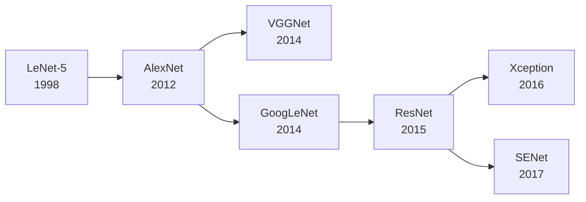

<!-- Post: 【机器学习阅读导论第10篇】自定义模型与卷积神经网络：从调包侠到造轮子 | ID: 2026-059 | Created: 2026-09-04 | Tags: books, tech, 机器学习 | Format: markdown -->

## 开篇：Keras内置层不够用了怎么办？

你用Keras的Sequential API搭了一个图像分类模型，效果不错。但有一天，老板说："我们需要一个自定义的损失函数，要同时考虑分类准确率和预测的置信度。"或者："这个网络结构需要一个特殊的跳跃连接，Functional API也不好实现。"

这时候，你需要跳出Keras的"舒适区"，用TensorFlow的底层API自己造轮子。

第12章教你用TF自定义一切——损失函数、层、模型、训练循环。第13章教你构建高效的数据管道。第14章则讲CNN——计算机视觉的基石，从LeNet到ResNet的架构进化史。

这一篇是核心主题的收官篇，学完它，你就从"调包侠"升级成了"能造轮子的工程师"。

## 一、TensorFlow自定义模型（第12章）

### 1.1 TensorFlow像NumPy一样用

TF的张量（Tensor）操作和NumPy很像，但TF能自动求导、在GPU上加速。

```python
import tensorflow as tf

# 张量操作
t = tf.constant([[1., 2., 3.], [4., 5., 6.]])
print(t.shape)  # (2, 3)
print(t.dtype)  # float32

# 像NumPy一样索引和运算
t2 = t + 10
t3 = tf.square(t)
t4 = t @ tf.transpose(t)  # 矩阵乘法
```

**变量（Variable）**：模型参数用Variable，因为它需要在训练中更新。

```python
w = tf.Variable(3.0)
w.assign(w + 1)  # 变量需要用assign更新
```

### 1.2 自动微分：GradientTape

TF的核心能力之一是**自动微分（Autodiff）**。用`tf.GradientTape`记录操作，然后自动求梯度。

```python
w1 = tf.Variable(2.0)
w2 = tf.Variable(5.0)

with tf.GradientTape() as tape:
    z = f(w1, w2)  # 任意可微函数

gradients = tape.gradient(z, [w1, w2])  # 自动求z对w1和w2的偏导
```

> "We first define two variables w1 and w2, then we create a tf.GradientTape context that will automatically record every operation that involves a variable."
> —— 第12章，第389页

这就是神经网络反向传播的底层实现——不需要手动推导梯度公式，TF自动帮你算。

### 1.3 自定义损失函数

```python
def huber_loss(y_true, y_pred):
    error = y_true - y_pred
    is_small_error = tf.abs(error) < 1.0
    squared_loss = tf.square(error) / 2
    linear_loss = tf.abs(error) - 0.5
    return tf.where(is_small_error, squared_loss, linear_loss)

model.compile(loss=huber_loss, optimizer="nadam")
```

Huber损失是MSE和MAE的混合：小误差用平方（平滑），大误差用绝对值（对异常值鲁棒）。

### 1.4 自定义层

```python
class MyDense(keras.layers.Layer):
    def __init__(self, units, activation=None, **kwargs):
        super().__init__(**kwargs)
        self.units = units
        self.activation = keras.activations.get(activation)
    
    def build(self, batch_input_shape):
        self.kernel = self.add_weight(
            name="kernel", shape=[batch_input_shape[-1], self.units],
            initializer="glorot_normal")
        self.bias = self.add_weight(
            name="bias", shape=[self.units], initializer="zeros")
        super().build(batch_input_shape)
    
    def call(self, X):
        return self.activation(X @ self.kernel + self.bias)
```

### 1.5 自定义训练循环

当`model.fit()`不够灵活时（如GAN、强化学习），可以手动写训练循环：

```python
n_epochs = 5
batch_size = 32
optimizer = keras.optimizers.Nadam()
loss_fn = keras.losses.sparse_categorical_crossentropy

for epoch in range(n_epochs):
    for X_batch, y_batch in train_dataset:
        with tf.GradientTape() as tape:
            y_pred = model(X_batch, training=True)
            loss = tf.reduce_mean(loss_fn(y_batch, y_pred))
        gradients = tape.gradient(loss, model.trainable_variables)
        optimizer.apply_gradients(zip(gradients, model.trainable_variables))
```

### 1.6 TF Function：图模式加速

默认TF是即时执行（Eager Execution），方便调试但慢。用`@tf.function`装饰器把Python函数转成TF计算图，执行更快。

```python
@tf.function
def train_step(model, optimizer, X_batch, y_batch):
    with tf.GradientTape() as tape:
        y_pred = model(X_batch, training=True)
        loss = tf.reduce_mean(loss_fn(y_batch, y_pred))
    gradients = tape.gradient(loss, model.trainable_variables)
    optimizer.apply_gradients(zip(gradients, model.trainable_variables))
    return loss
```

> "tf.function() converts a Python function to a TensorFlow Function, which can be optimized and run much faster."
> —— 第12章，第396页

**注意**：TF Function有一些规则（如不能在函数内用print调试，要用tf.print；Python列表等会被追踪），写复杂逻辑时要小心。

## 二、数据管道（第13章）

### 2.1 Data API：高效数据加载

`tf.data.Dataset`是TF的高效数据管道，支持链式变换、预取、并行处理。

```python
dataset = tf.data.Dataset.from_tensor_slices((X_train, y_train))
dataset = dataset.shuffle(buffer_size=10000)
dataset = dataset.batch(32)
dataset = dataset.prefetch(1)  # 预取，GPU训练时CPU准备下一批

model.fit(dataset, epochs=10)
```

**常用操作**：
- `shuffle`：打乱数据
- `batch`：分批
- `map`：并行预处理（如图像增强）
- `prefetch`：预取，重叠数据准备和模型训练
- `cache`：缓存到内存，加速重复访问

### 2.2 TFRecord：高效二进制格式

TFRecord是TF的二进制格式，适合存储大规模数据。基于Protocol Buffers。

```python
# 写入TFRecord
with tf.io.TFRecordWriter("data.tfrecord") as f:
    for feature, label in zip(features, labels):
        example = tf.train.Example(features=tf.train.Features(feature={
            "feature": tf.train.Feature(float_list=tf.train.FloatList(value=feature)),
            "label": tf.train.Feature(int64_list=tf.train.Int64List(value=[label]))
        }))
        f.write(example.SerializeToString())

# 读取TFRecord
dataset = tf.data.TFRecordDataset("data.tfrecord")
```

### 2.3 Features API：特征工程

TF的Features API能自动处理类别特征（One-Hot、Embedding）和数值特征（分桶、交叉）。

## 三、卷积神经网络与计算机视觉（第14章）

### 3.1 卷积运算：CNN的核心

全连接网络处理图像的问题：参数太多！一张224×224×3的图片，第一层1000个神经元，就有1.5亿个参数。

**卷积层**用小的滤波器（filter）在图像上滑动，共享参数，大大减少参数量。

> "The most important building block of a CNN is the convolutional layer: neurons in the first convolutional layer are not connected to every single pixel in the input image."
> —— 第14章，第434页

卷积的关键概念：
- **滤波器（Filter/Kernel）**：小的权重矩阵（如3×3），在图像上滑动
- **步长（Stride）**：每次滑动的距离
- **填充（Padding）**：SAME（保持尺寸）/ VALID（不填充）
- **特征图（Feature Map）**：一个滤波器输出的二维数组

```python
conv = keras.layers.Conv2D(filters=32, kernel_size=3, strides=1,
                           padding="same", activation="relu")
```

### 3.2 池化层：下采样

池化层缩小特征图尺寸，减少计算量和参数，增加感受野。

- **最大池化（Max Pooling）**：取窗口内最大值（最常用）
- **平均池化（Average Pooling）**：取窗口内平均值

> "Their goal is to subsample (i.e., shrink) the input image in order to reduce the computational load, the memory usage, and the number of parameters."
> —— 第14章，第442页

```python
pool = keras.layers.MaxPool2D(pool_size=2)
```

### 3.3 CNN架构进化史



| 架构 | 年份 | 核心创新 | 层数 | Top-5错误率 |
|------|------|---------|------|------------|
| LeNet-5 | 1998 | 卷积+池化的开山之作 | 7 | - |
| AlexNet | 2012 | 深度网络+GPU+ReLU+Dropout | 8 | 15.3% |
| VGGNet | 2014 | 统一用3×3小卷积核，结构规整 | 16/19 | 7.3% |
| GoogLeNet | 2014 | Inception模块，多尺度卷积并行 | 22 | 6.7% |
| ResNet | 2015 | 残差连接，能训练超深网络 | 152 | 3.6% |
| Xception | 2016 | 深度可分离卷积 | 71 | 5.5% |
| SENet | 2017 | 通道注意力机制 | - | 2.3% |

### 3.4 ResNet：残差连接为什么能训练超深网络？

ResNet的核心是**残差连接（Skip Connection）**：输入不仅经过卷积层，还直接加到输出上。

$$
y = F(x) + x
$$

> "The key idea is to use skip connections (also called shortcut connections): the signal feeding into a layer is also added to the output of a layer located a bit higher up the stack."
> —— 第14章，第457页

为什么这能训练超深网络？
- 梯度可以通过跳跃连接直接回传，不会消失
- 网络只需要学习"残差"$F(x) = y - x$，比学习完整映射更容易
- 即使某些层没学到东西，跳跃连接也能保证信息不丢失

```python
# 残差块
class ResidualBlock(keras.layers.Layer):
    def __init__(self, filters, **kwargs):
        super().__init__(**kwargs)
        self.conv1 = keras.layers.Conv2D(filters, 3, padding="same", activation="relu")
        self.bn1 = keras.layers.BatchNormalization()
        self.conv2 = keras.layers.Conv2D(filters, 3, padding="same")
        self.bn2 = keras.layers.BatchNormalization()
    
    def call(self, inputs):
        x = self.conv1(inputs)
        x = self.bn1(x)
        x = self.conv2(x)
        x = self.bn2(x)
        return keras.activations.relu(x + inputs)  # 残差连接
```

### 3.5 迁移学习：站在巨人的肩膀上

训练一个深层CNN需要大量数据和算力。**迁移学习**用别人预训练好的模型，只训练最后几层。

```python
# 加载预训练的Xception，去掉顶部全连接层
base_model = keras.applications.Xception(
    weights="imagenet", include_top=False, input_shape=(299, 299, 3))
base_model.trainable = False  # 冻结预训练层

# 在顶部加自己的分类头
model = keras.models.Sequential([
    base_model,
    keras.layers.GlobalAveragePooling2D(),
    keras.layers.Dense(256, activation="relu"),
    keras.layers.Dropout(0.5),
    keras.layers.Dense(10, activation="softmax")
])

# 先训练顶部层，再微调整个模型
model.compile(optimizer="adam", loss="sparse_categorical_crossentropy")
model.fit(train_data, epochs=10)

# 微调：解冻部分层，用小学习率
base_model.trainable = True
model.compile(optimizer=keras.optimizers.Adam(1e-5), loss="sparse_categorical_crossentropy")
model.fit(train_data, epochs=10)
```

迁移学习的步骤：
1. 加载预训练模型（在ImageNet上训练）
2. 冻结预训练层，只训练自己的分类头
3. 解冻部分顶层，用很小的学习率微调

### 3.6 目标检测与语义分割

**分类与定位**：不仅分类，还要用边界框标出物体位置。

**目标检测**：一张图中有多个物体，每个都要标出类别和边界框。代表算法：YOLO（You Only Look Once）、Faster R-CNN。

**语义分割**：每个像素分类到一个类别。代表方法：FCN（全卷积网络）、U-Net。

> "Fully Convolutional Networks (FCNs): the idea was first introduced in a 2015 paper for semantic segmentation."
> —— 第14章，第473页

## 四、代码示例：用Keras实现ResNet-34

```python
import tensorflow as tf
from tensorflow import keras

class ResidualUnit(keras.layers.Layer):
    def __init__(self, filters, strides=1, activation="relu", **kwargs):
        super().__init__(**kwargs)
        self.activation = keras.activations.get(activation)
        self.main_layers = [
            keras.layers.Conv2D(filters, 3, strides=strides, padding="same", use_bias=False),
            keras.layers.BatchNormalization(),
            self.activation,
            keras.layers.Conv2D(filters, 3, strides=1, padding="same", use_bias=False),
            keras.layers.BatchNormalization()
        ]
        self.skip_layers = []
        if strides > 1:
            self.skip_layers = [
                keras.layers.Conv2D(filters, 1, strides=strides, padding="same", use_bias=False),
                keras.layers.BatchNormalization()
            ]
    
    def call(self, inputs):
        Z = inputs
        for layer in self.main_layers:
            Z = layer(Z)
        skip_Z = inputs
        for layer in self.skip_layers:
            skip_Z = layer(skip_Z)
        return self.activation(Z + skip_Z)

# 构建ResNet-34
model = keras.models.Sequential()
model.add(keras.layers.Conv2D(64, 7, strides=2, input_shape=[224, 224, 3], padding="same", use_bias=False))
model.add(keras.layers.BatchNormalization())
model.add(keras.layers.Activation("relu"))
model.add(keras.layers.MaxPool2D(pool_size=3, strides=2, padding="same"))

prev_filters = 64
for filters in [64]*3 + [128]*4 + [256]*6 + [512]*3:
    strides = 1 if filters == prev_filters else 2
    model.add(ResidualUnit(filters, strides=strides))
    prev_filters = filters

model.add(keras.layers.GlobalAvgPool2D())
model.add(keras.layers.Dense(1000, activation="softmax"))
```

## 五、原书图表索引

| 图表编号 | 内容 | 所在位置 |
|---------|------|---------|
| Figure 12-1 | TensorFlow架构 | 第12章，第368页 |
| Figure 12-7 | 自动微分计算图 | 第12章，第390页 |
| Figure 13-1 | Data API流水线 | 第13章，第404页 |
| Figure 14-3 | 卷积运算 | 第14章，第434页 |
| Figure 14-5 | 填充与步长 | 第14章，第437页 |
| Figure 14-6 | 池化层 | 第14章，第442页 |
| Figure 14-15 | ResNet残差块 | 第14章，第458页 |
| Figure 14-23 | 迁移学习 | 第14章，第467页 |
| Figure 14-25 | FCN全卷积网络 | 第14章，第475页 |

## 六、小结

这一篇我们完成了最后一个核心主题——TF工程化与CNN视觉：

1. **TF自定义**：GradientTape自动微分、自定义损失/层/模型、自定义训练循环、TF Function图加速
2. **数据管道**：Data API（shuffle/batch/prefetch）、TFRecord二进制格式、Features API
3. **CNN**：
   - 卷积运算（滤波器/步长/填充/特征图）
   - 池化层（最大池化/平均池化）
   - 架构进化史：LeNet→AlexNet→VGG→GoogLeNet→ResNet→Xception→SENet
   - 残差连接：$y = F(x) + x$，让超深网络可训练
   - 迁移学习：冻结预训练层→训练分类头→微调
   - 目标检测与语义分割

至此，7个核心主题全部完成。你已经掌握了从传统ML到深度学习的完整知识体系。

## 下一篇预告

第11篇我们将进入**主题阅读**——把这本书和其他ML经典书横向对比：Géron实战派 vs 李航统计派 vs 周志华西瓜书 vs Goodfellow花书。每本书的定位、优势、局限是什么？怎么组合阅读效果最好？

> 系列导航：第1篇入门导引 → 第2篇全书地图 → 第3篇深度阅读导引 → 第4篇ML全局观与项目流水线 → 第5篇经典监督学习算法族 → 第6篇核方法与树模型 → 第7篇集成学习与降维 → 第8篇无监督学习 → 第9篇神经网络基础与训练深水区 → 第10篇TF工程化与CNN视觉 → **第11篇主题阅读横向对比** → 第12篇研究式阅读
