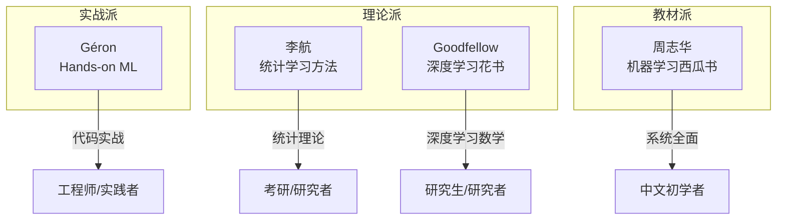

<!-- Post: 【机器学习阅读导论第11篇】ML四大经典书横向对比：Géron实战派 vs 李航统计派 vs 西瓜书 vs 花书 | ID: 2026-060 | Created: 2026-09-04 | Tags: books, tech, 机器学习 | Format: markdown -->

## 开篇：一本书是一个人的视角，多本书交叉才能看到全貌

你读完了Géron的《Hands-on Machine Learning》，会写代码了，能跑项目了。但有一天，面试官问你："SVM的对偶问题为什么和原问题等价？"你答不上来——因为这本书只讲了怎么用SVM，没讲数学证明。

这就是单本书的局限。每本书都有作者的视角和偏好：
- Géron是工程师，重实战轻理论
- 李航是学者，重统计学习理论
- 周志华是教授，重全面系统的中文教材
- Goodfellow是研究者，重深度学习的数学基础

这一篇我们做**主题阅读**——把四本ML经典书放在一起横向对比，搞清楚每本书的定位、优势、局限，以及怎么组合阅读效果最好。

> 洋葱阅读法第四层：主题阅读——围绕一个主题，读多本书，交叉验证，建立自己的知识体系。

## 一、四本书全景定位

### 1.1 《Hands-on Machine Learning》（Géron）

- **定位**：实战手册，从数据到上线的完整流程
- **核心优势**：代码丰富、项目驱动、工程视角
- **局限**：数学推导不深入，理论证明省略
- **适合人群**：工程师、想快速上手项目的人

> "The book favors a hands-on approach, growing an intuitive understanding of Machine Learning through concrete working examples and just a little bit of theory."
> —— Preface，第xii页

### 1.2 《统计学习方法》（李航）

- **定位**：统计学习理论教材，覆盖传统ML算法
- **核心优势**：数学推导严谨、定理证明完整、中文表达精准
- **局限**：无代码、不覆盖深度学习、偏理论
- **适合人群**：考研、面试、想深入理解算法原理的人

### 1.3 《机器学习》（周志华，西瓜书）

- **定位**：中文ML全面教材，覆盖传统ML和部分深度学习
- **核心优势**：内容全面、中文语境、例子丰富、习题多
- **局限**：无代码、部分章节偏简略、数学推导有时跳跃
- **适合人群**：中文初学者、系统学习ML的学生

### 1.4 《深度学习》（Goodfellow等，花书）

- **定位**：深度学习圣经，数学基础+深度学习全谱
- **核心优势**：数学基础扎实（线性代数、概率、数值计算）、覆盖DL全领域
- **局限**：难度高、无代码、2016年出版部分内容过时
- **适合人群**：研究生、深度学习研究者、想补数学基础的人

## 二、五维对比表

| 维度 | Géron实战派 | 李航统计派 | 西瓜书 | 花书 |
|------|------------|-----------|--------|------|
| **理论深度** | ★★☆（够用就好） | ★★★★★（定理证明） | ★★★★（系统全面） | ★★★★★（数学基础） |
| **实战代码** | ★★★★★（sklearn/TF） | ☆☆☆（无） | ☆☆☆（无） | ★☆☆（极少） |
| **数学推导** | ★★☆（关键公式） | ★★★★★（完整证明） | ★★★☆（部分推导） | ★★★★★（极其详细） |
| **覆盖范围** | ML+DL（14章） | 传统ML（10章） | ML全谱（16章） | DL为主+数学基础 |
| **入门友好度** | ★★★★（有Python基础即可） | ★★☆（需数学基础） | ★★★☆（中文友好） | ★☆☆（难度高） |
| **工程视角** | ★★★★★（上线/监控/调参） | ★☆☆（纯理论） | ★★☆（少量工程） | ★★☆（少量实践建议） |
| **出版年份** | 2019（第二版） | 2019（第二版） | 2016 | 2016 |
| **语言** | 英文（有中译本） | 中文 | 中文 | 英文（有中译本） |

## 三、各书核心优势章节互补

### 3.1 学SVM：先Géron建立直觉，再李航看推导

- **Géron第5章**：讲清楚SVM的直观思想（最大间隔）、核技巧的作用、怎么用sklearn。配图表，容易理解。
- **李航第7章**：完整推导SVM的对偶问题、KKT条件、SMO算法。数学严谨，但没有代码。

**组合阅读**：先读Géron建立"为什么"，再读李航理解"为什么是这样"。

### 3.2 学神经网络：先Géron上手，再花书补数学

- **Géron第10-11章**：用Keras搭模型、训练技巧、工程实践。能快速跑起来。
- **花书第6-8章**：深度网络的数学基础、反向传播的详细推导、正则化的理论分析。

**组合阅读**：先读Géron会用，再读花书理解底层原理。

### 3.3 学集成学习：先Géron实战，再西瓜书补理论

- **Géron第7章**：Bagging/Boosting/Stacking的代码实现、随机森林的特征重要性。
- **西瓜书第8章**：集成学习的理论基础、偏差-方差分解、Boosting的推导。

**组合阅读**：Géron教你用，西瓜书教你为什么有效。

### 3.4 学降维：西瓜书+Géron互补

- **西瓜书第10章**：PCA的数学推导、核PCA、流形学习。
- **Géron第8章**：PCA的代码实现、如何选维度、实际应用。

### 3.5 学无监督学习：Géron为主，西瓜书补充

- **Géron第9章**：K-Means、DBSCAN、GMM、异常检测，代码丰富。
- **西瓜书第9章**：聚类的理论分析、密度聚类的数学定义。

## 四、本书（Géron）的独特价值

在四本书中，Géron这本书有几个不可替代的优势：

### 4.1 端到端项目模板（第2章）

唯一一章完整展示"从原始CSV到上线模型"全流程的章节。数据探索、特征工程、Pipeline、交叉验证、网格搜索、测试集评估——这个模板可以复用到几乎所有ML项目。

其他三本书都没有这种工程视角的完整案例。

### 4.2 Keras/TF实战代码

唯一一本有完整深度学习代码的书。从最简单的Sequential API到自定义训练循环，都有可运行的代码。

花书讲数学但不给代码，李航和西瓜书完全没有深度学习代码。

### 4.3 工程实践建议

- 怎么划分训练/验证/测试集
- 怎么处理数据泄露
- 怎么调超参数
- 怎么上线和监控模型
- 学习率怎么选、BatchNorm怎么用

这些"工程经验"是其他理论书完全不涉及的。

### 4.4 与时俱进的工具链

第二版（2019）覆盖了TensorFlow 2、Keras、ColumnTransformer等当时最新的工具。虽然2026年看部分API已有变化，但整体思路仍然适用。

## 五、本书的局限

### 5.1 数学推导不深入

为了保持"hands-on"的风格，很多数学推导被省略或简化了。比如：
- SVM的对偶问题只提了概念，没有推导
- 神经网络的反向传播只讲了思路，没有详细的矩阵求导
- EM算法只提了名字，没有推导

想深入理解数学，必须配合李航或花书。

### 5.2 本版本不覆盖RNN/Transformer

这是Early Release版本，只包含到第14章（CNN）。完整第二版还有：
- 第15章：RNN与序列处理
- 第16章：NLP with RNN and Attention（含Transformer）
- 第17章：自编码器与GAN
- 第18章：强化学习
- 第19章：部署

这些内容在本版本中缺失，需要通过其他资源补充。

### 5.3 2019年的API部分过时

- TensorFlow 2.x的API有迭代，部分代码需微调
- Keras已成为TF的官方高级API，用法更统一
- 没有覆盖PyTorch（2026年研究界主流）
- 没有覆盖大语言模型、扩散模型等2020年后的新技术

### 5.4 不覆盖XGBoost/LightGBM

第7章提到了XGBoost但只有一小节。而在2026年的工业界，XGBoost/LightGBM/CatBoost是表格数据的首选，比随机森林更常用。

## 六、推荐阅读组合

### 组合A：工程师快速上手（3个月）

| 阶段 | 主读 | 辅读 | 目标 |
|------|------|------|------|
| 第1月 | Géron第1-9章 | - | 掌握传统ML和项目流程 |
| 第2月 | Géron第10-14章 | - | 掌握深度学习和CNN |
| 第3月 | Kaggle竞赛 + 补充XGBoost | 西瓜书第8章 | 实战提升 |

### 组合B：系统学习+考研/面试（6个月）

| 阶段 | 主读 | 辅读 | 目标 |
|------|------|------|------|
| 第1-2月 | 西瓜书第1-9章 | Géron对应章节代码 | 建立系统理论+代码能力 |
| 第3-4月 | 李航全书 | Géron第3-9章 | 深入统计学习理论 |
| 第5-6月 | 花书第1-8章 | Géron第10-14章 | 深度学习数学基础+实战 |

### 组合C：深度学习研究者（6个月+）

| 阶段 | 主读 | 辅读 | 目标 |
|------|------|------|------|
| 第1-2月 | 花书第1-4章（数学基础） | - | 补线性代数/概率/数值计算 |
| 第3-4月 | 花书第6-8章 + Géron第10-11章 | - | 深度学习理论+实战 |
| 第5月+ | 论文 + Géoeron第12-14章 | - | 前沿研究+工程能力 |

## 七、原书图表索引

本篇为主题阅读，主要引用本书Preface中推荐的其他资源：

| 引用位置 | 内容 |
|---------|------|
| Preface第xv页 | 作者推荐的其他ML书籍（Data Science from Scratch、Deep Learning with Python等） |
| Preface第xv页 | Andrew Ng的ML课程、Hinton的神经网络课程 |
| Preface第xv页 | Kaggle竞赛平台推荐 |

## 八、小结

这一篇我们完成了主题阅读——四本ML经典书的横向对比：

1. **Géron**：实战派，代码丰富，工程视角强，但数学推导浅
2. **李航**：统计派，理论严谨，但无代码、不覆盖DL
3. **西瓜书**：教材派，全面系统，中文友好，但无代码
4. **花书**：研究派，数学基础扎实，覆盖DL全谱，但难度高、无代码

**核心建议**：没有一本书能覆盖所有需求。根据你的目标选择主读+辅读组合——工程师以Géron为主，考研以李航+西瓜书为主，研究者以花书为主。

记住：**书是工具，不是目的**。读完一本书不是终点，而是建立自己知识体系的起点。

## 下一篇预告

第12篇是收官篇——**研究式阅读**。我们将质疑书中的观点、分析时代局限（2019→2026的技术变迁）、给出12周学习路线图和延伸资源。读完这一篇，你就完成了洋葱阅读法的五层闭环。

> 系列导航：第1篇入门导引 → 第2篇全书地图 → 第3篇深度阅读导引 → 第4-10篇核心主题 → 第11篇主题阅读横向对比 → **第12篇研究式阅读收官**
