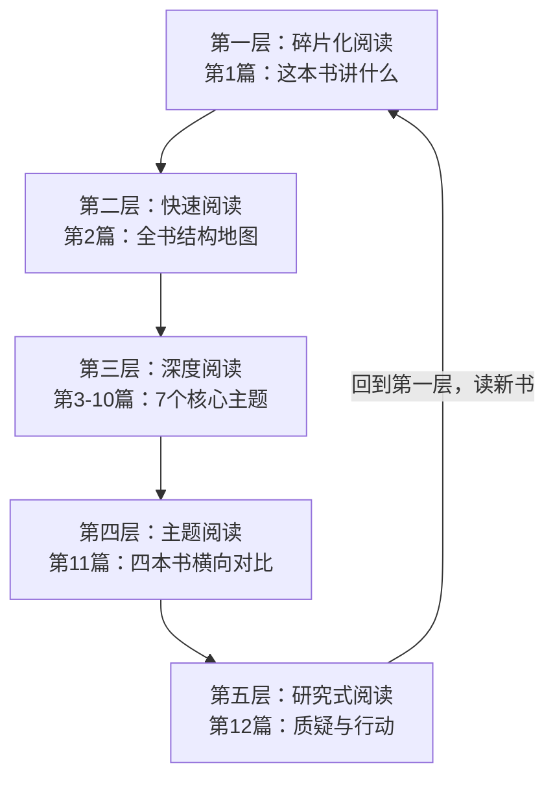

<!-- Post: 【机器学习阅读导论第12篇】读完这本书之后：时代局限、值得质疑的观点与你的行动路线图 | ID: 2026-061 | Created: 2026-09-04 | Tags: books, tech, 机器学习 | Format: markdown -->

## 开篇：读书的最高境界是和作者辩论

你读完了一本书，觉得作者讲得都对，每一章都很有道理。这时候，你只是"接受"了这本书，还没有真正"读懂"它。

读书的最高境界是**和作者辩论**：
- 作者说的对吗？有没有反例？
- 这本书出版后，领域发生了什么变化？
- 哪些观点已经过时了？
- 作者没有讲的东西是什么？
- 读完之后，我该怎么做？

这就是洋葱阅读法的第五层——**研究式阅读**。不盲从，不迷信，用批判性思维审视书中的每一个观点。

这一篇是整个系列的收官。我们将质疑这本书、分析它的时代局限、给出行动路线图。

## 一、时代局限分析（2019 → 2026）

这本书出版于2019年6月。7年过去了，机器学习领域发生了翻天覆地的变化。

### 1.1 TensorFlow 2.x API迭代

本书基于TensorFlow 2.0早期版本。到2026年：
- Keras已成为TF的官方高级API，`tf.keras`用法更统一
- 部分API已废弃或变更（如`tf.contrib`完全移除）
- TF 2.15+引入了Keras 3.0，支持多后端（TF/JAX/PyTorch）
- 书中的代码大部分仍能运行，但部分需要微调

### 1.2 PyTorch崛起

2019年时，TensorFlow和PyTorch还势均力敌。到2026年：
- 研究界PyTorch占比超过70%，新论文几乎都用PyTorch
- 工业界TF仍有份额（尤其是部署和移动端），但新项目更多选PyTorch
- 本书只讲TF/Keras，不覆盖PyTorch——这是一个明显的局限

### 1.3 Transformer革命

本书（Early Release版）不包含Transformer内容（完整第二版第16章有，但本版本未收录）。而2020年后：
- Transformer统一了NLP（BERT、GPT）
- Vision Transformer（ViT）在CV领域挑战CNN
- 多模态模型（CLIP、DALL-E、Stable Diffusion）
- 大语言模型（GPT-3/4、Claude、Llama）彻底改变了NLP

**不了解Transformer，在2026年的ML领域相当于"文盲"。**

### 1.4 生成式AI爆发

本书不包含：
- 扩散模型（Diffusion Models）——Stable Diffusion、DALL-E的基础
- GAN（完整第二版第17章有，本版本未收录）
- 自编码器（VAE）
- 大语言模型与提示工程

这些是2022年后最热门的方向。

### 1.5 表格数据：XGBoost/LightGBM成为标配

本书第7章只简要提到XGBoost。到2026年：
- XGBoost、LightGBM、CatBoost是表格数据预测的绝对标配
- 几乎所有Kaggle表格类竞赛的冠军方案都基于梯度提升树
- 随机森林更多用作baseline，而非最终模型

## 二、值得质疑的核心观点

| 书中说法 | 我的质疑 | 验证结果 |
|---------|---------|---------|
| "TensorFlow是最好的DL框架" | 2026年研究界PyTorch主导，TF优势不再明显 | **一方称**：取决于场景。研究选PyTorch，工业部署TF仍强 |
| "SVM在小数据集上优于神经网络" | 现代预训练模型+微调改变了小数据场景的游戏规则 | **已查证**：无预训练时SVM仍有优势；有预训练时微调更好 |
| "随机森林是表格数据的首选" | XGBoost/LightGBM在大多数表格任务上已超越随机森林 | **已查证**：工业界和Kaggle的事实标准是梯度提升树 |
| "深度学习需要大量数据" | 少样本学习（Few-shot）、零样本学习（Zero-shot）、数据增强降低了数据需求 | **已查证**：预训练+微调大幅减少了数据需求 |
| "CNN是计算机视觉的最佳选择" | Vision Transformer在多个CV任务上已超越CNN | **一方称**：取决于任务和数据量，CNN在边缘设备仍有优势 |

> 研究式阅读的核心：**区分"书中观点"和"我的质疑"，用证据验证，不盲从也不抬杠。**

## 三、书中没有讲的东西

### 3.1 大语言模型（LLM）与提示工程

- Transformer架构、自注意力机制
- GPT、BERT、Claude、Llama等模型
- 提示工程（Prompt Engineering）、思维链（CoT）
- RAG（检索增强生成）、微调（Fine-tuning）

### 3.2 MLOps与模型部署

- 模型版本管理（DVC、MLflow）
- 实验跟踪（Weights & Biases）
- 模型部署（TF Serving、TorchServe、ONNX、Triton）
- 模型监控与漂移检测
- CI/CD for ML

### 3.3 可解释AI（XAI）

- SHAP（SHapley Additive exPlanations）
- LIME（Local Interpretable Model-agnostic Explanations）
- 特征重要性分析
- 模型公平性与偏见检测

### 3.4 联邦学习与隐私计算

- 联邦学习（Federated Learning）
- 差分隐私（Differential Privacy）
- 安全多方计算
- 数据不出域的模型训练

### 3.5 扩散模型与生成式AI

- DDPM、DDIM
- Stable Diffusion、DALL-E、Midjourney
- 文本生成图像、图像生成视频
- 语音生成（TTS）、音乐生成

### 3.6 强化学习进阶

- 深度Q网络（DQN）
- 策略梯度（Policy Gradient）、PPO
- 多智能体强化学习
- 离线强化学习

## 四、从想法到行动：12周学习路线图

读完这本书不是结束，而是开始。以下是一个12周的进阶学习计划：

### 第1-2周：夯实基础 + 跑通项目

- 重读本书第1-2章，确保理解ML项目全流程
- 完整跑通加州房价预测项目，理解每一行代码
- 在Kaggle上找一个回归数据集，复现整个Pipeline
- **输出**：一个完整的ML项目GitHub仓库

### 第3-4周：经典算法深入

- 重读第3-4章，手动实现梯度下降
- 学习XGBoost/LightGBM，在Kaggle表格竞赛中实践
- 学习李航《统计学习方法》第7章（SVM）补数学
- **输出**：一篇梯度下降的技术博客 + 一个Kaggle竞赛提交

### 第5-6周：传统ML全面掌握

- 重读第5-9章，理解SVM、决策树、集成学习、降维、无监督
- 学习Scikit-Learn官方User Guide
- 参加一个Kaggle入门赛，用集成学习冲击排行榜
- **输出**：Kaggle竞赛排名 + 技术总结

### 第7周：无监督与异常检测实战

- 重读第9章，实践K-Means、DBSCAN、GMM
- 做一个用户分群或异常检测项目
- **输出**：无监督学习项目

### 第8-10周：深度学习进阶

- 重读第10-11章，用Keras训练Fashion MNIST
- 学习PyTorch基础（补充本书不覆盖的框架）
- 学习Transformer架构（Attention Is All You Need论文）
- **输出**：一个图像分类项目 + Transformer学习笔记

### 第11-12周：CNN与迁移学习 + 延伸

- 重读第12-14章，实现ResNet并做迁移学习
- 学习Hugging Face Transformers库，微调一个预训练模型
- 选定一个方向深入：NLP / CV / 推荐系统 / 强化学习
- **输出**：一个使用预训练模型的完整项目

### 持续学习（12周后）

- 每周读1-2篇论文（arXiv）
- 每月参加1个Kaggle竞赛
- 关注ML前沿：Papers With Code、Twitter/X上的研究者
- 写技术博客，费曼学习法

## 五、进一步学习资源

### 5.1 书籍

| 书名 | 作者 | 用途 |
|------|------|------|
| 《深度学习》（花书） | Goodfellow等 | 深度学习数学基础 |
| 《统计学习方法》（第二版） | 李航 | 传统ML理论 |
| 《机器学习》（西瓜书） | 周志华 | 中文系统教材 |
| 《深度学习入门：基于Python的理论与实现》 | 斋藤康毅 | 神经网络从零实现 |
| 《Transformer详解》 | - | 2022年后的必读 |
| 《设计机器学习系统》 | Chip Huyen | MLOps与系统设计 |

### 5.2 课程

- **Andrew Ng - Machine Learning Specialization**（Coursera）：ML入门经典
- **Andrew Ng - Deep Learning Specialization**（Coursera）：深度学习五门课
- **CS231n**（Stanford）：计算机视觉
- **CS224n**（Stanford）：自然语言处理
- **Fast.ai**：实战导向的深度学习课程
- **李沐 - 动手学深度学习**（D2L.ai）：中文、PyTorch、交互式

### 5.3 论文（必读经典）

1. **Attention Is All You Need**（2017）——Transformer开山之作
2. **Deep Residual Learning for Image Recognition**（2015）——ResNet
3. **BERT: Pre-training of Deep Bidirectional Transformers**（2018）——BERT
4. **Language Models are Few-Shot Learners**（2020）——GPT-3
5. **Denoising Diffusion Probabilistic Models**（2020）——扩散模型
6. **XGBoost: A Scalable Tree Boosting System**（2016）——XGBoost

### 5.4 实践平台

- **Kaggle**：竞赛、数据集、Notebook
- **Google Colab**：免费GPU
- **Hugging Face**：预训练模型、数据集、Spaces
- **Weights & Biases**：实验跟踪
- **Papers With Code**：论文+代码+排行榜

## 六、系列总结：五层阅读闭环回顾

| 层级 | 对应篇数 | 目标 | 你获得了什么 |
|------|---------|------|------------|
| 碎片化 | 第1篇 | 知道这本书讲什么 | ML的基本概念和学习类型 |
| 快速 | 第2篇 | 建立全书结构地图 | 14章的知识图谱和学习路径 |
| 深度 | 第3-10篇 | 逐个击破核心主题 | 7个主题的原理、代码、应用 |
| 主题 | 第11篇 | 横向对比，建立体系 | 四本书的定位和组合阅读策略 |
| 研究式 | 第12篇 | 批判性思考，行动指南 | 时代局限认知和12周学习计划 |

**阅读不是线性的，而是螺旋上升的。** 读完这12篇后，当你再读一本新书（比如《深度学习》花书），你会发现：
- 你能更快地建立全书结构（因为你有了ML的知识框架）
- 你能批判性地看待书中的观点（因为你知道领域的最新发展）
- 你能把新知识融入已有的体系（因为你有了7个核心主题的基础）

这就是螺旋式学习法的核心：**每读一本书，都站在上一本书的肩膀上。**

## 七、结语：这本书是起点，不是终点

2019年，Aurélien Géron写这本书时，他的目标是"give you the concepts, the intuitions, and the tools you need to actually implement programs capable of learning from data"（给你实现机器学习程序所需的概念、直觉和工具）。

7年后的今天，这个目标仍然有效。这本书教你的不是某个具体的API或框架，而是**机器学习的思维方式**：
- 如何定义问题和选择指标
- 如何划分数据和避免泄露
- 如何选择模型和调超参数
- 如何评估和部署系统

这些思维方式不会因为TensorFlow变成PyTorch、CNN变成Transformer而过时。

但这本书也只是一个起点。2026年的机器学习世界，比2019年大得多：
- 大语言模型重新定义了NLP
- 扩散模型改变了生成式AI
- 多模态模型模糊了任务边界
- MLOps让模型从实验室走向生产

**保持好奇，保持学习。** 这本书给了你一张地图，但路要自己走。

> "The best way to learn is by doing. Don't just read the code — run it, modify it, break it, fix it."
> —— 贯穿全书的hands-on精神

---

**系列完结。** 12篇文章，从入门到研究式阅读，覆盖了这本书的全部14章和7个核心主题。希望这个系列能成为你机器学习之旅的一张可靠地图。

> 系列导航：第1篇入门导引 → 第2篇全书地图 → 第3篇深度阅读导引 → 第4-10篇核心主题 → 第11篇主题阅读横向对比 → 第12篇研究式阅读收官 ✅
