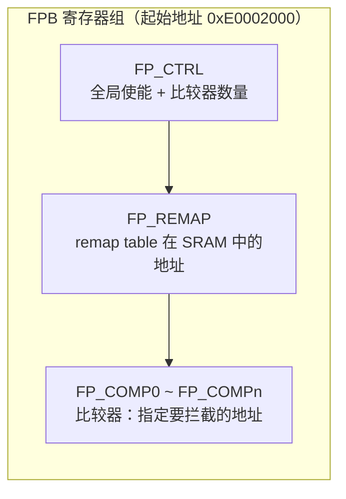
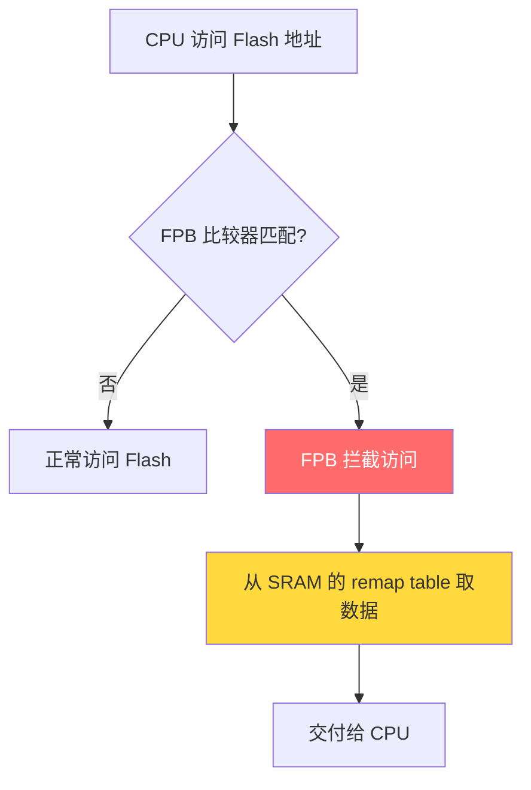
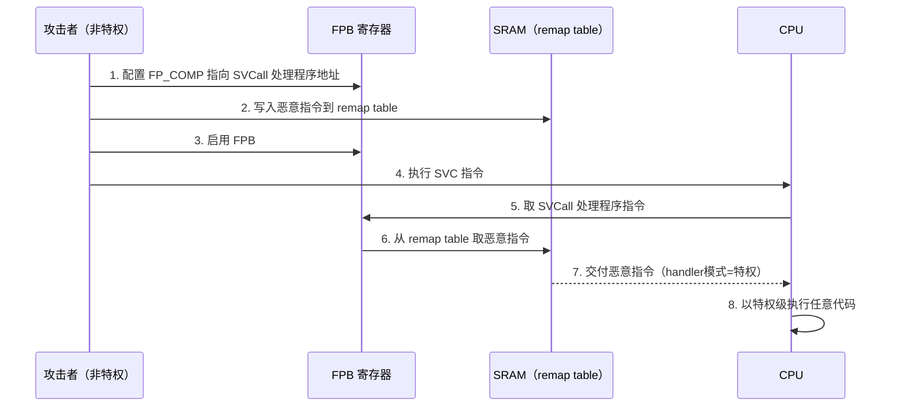

<!-- Post: 当调试单元变成攻击武器：ARM Cortex-M FPB 安全漏洞深度拆解 | ID: 2026-062 | Created: 2026-09-04 | Tags: tech, security, 嵌入式 | Format: markdown -->

## 开篇：你的智能门锁可能留了一把"万能钥匙"

想象一下这个场景：你花了三千块买了一把高端智能门锁，厂商宣传"银行级安全加密""硬件级内存保护"。你觉得很安心。

但有一个安全研究员，不需要物理接触你的锁，不需要拆开外壳，只需要利用门锁固件里一个普通的内存漏洞，就能**绕过所有安全防护，读取门锁里的所有密码和指纹数据**。

他用的不是什么0day漏洞，而是芯片厂商**故意留在芯片里的一个调试模块**——FPB（Flash Patch and Breakpoint，闪存补丁与断点单元）。

这个模块本来是给开发者调试用的，但出货后没有被关闭，变成了一把"万能钥匙"。

这篇论文《When Memory Mappings Attack》讲的就是这件事。三位作者来自 CertiK、新罕布什尔大学和马萨诸塞大学洛厄尔分校，2023年12月发布在 arXiv 上。

> **📝 英文小卡片（English Expression Card）**
>
> **技术句**：这个调试模块本来是给开发者用的，但出货后没有被关闭，变成了安全隐患。
>
> **学术英文**：Originally intended for developers, the debug module remains accessible after deployment, thereby posing a significant security risk.
>
> **词汇拆解**：
> - originally intended for (phr.) 原本旨在用于
> - remain accessible (phr.) 保持可访问状态
> - thereby posing a risk (phr.) 从而构成风险（高分因果结构）
>
> **可迁移句式**：Originally intended for X, Y remains Z after deployment, thereby posing [风险].

---

## 一、背景：Cortex-M 和它的"调试三件套"

在深入攻击之前，我们需要先搞清楚三个基础概念。

### 1.1 Cortex-M 的特权级

Cortex-M 处理器有两种运行模式：

| 模式 | 特权级 | 用途 |
|------|--------|------|
| Thread mode（线程模式） | 可特权/非特权 | 运行应用代码 |
| Handler mode（中断模式） | **永远特权** | 处理中断和异常 |

关键洞察：**中断处理程序永远运行在特权级**。这意味着，如果你能控制某个中断处理程序的执行流程，你就获得了特权级。

生活类比：这就像一栋大楼，普通住户（非特权线程）只能去自己的楼层，但消防员（中断处理程序）可以去任何地方。攻击者要做的，就是伪装成消防员。

### 1.2 MPU（Memory Protection Unit，内存保护单元）

MPU 是 Cortex-M 的硬件安全模块，可以给不同内存区域设置不同的读写执行权限。比如：
- Flash 区域：只读、可执行
- SRAM 区域：可读可写、不可执行（NX，No eXecute）
- 外设区域：仅特权级可访问

这是嵌入式系统最核心的安全防线。但论文证明，**FPB 可以完全绕过 MPU**。

### 1.3 FPB（Flash Patch and Breakpoint）

FPB 是 ARM 设计的硬件调试模块，核心功能有两个：

1. **硬件断点**：在指定地址触发 DebugMonitor 异常
2. **闪存补丁**：把 Flash 地址的指令/数据**重映射（remap）**到 RAM 中的一张表（remap table）

这个重映射功能本来是为了在不修改 Flash 的情况下在线修补 ROM bug。但问题是：

> FPB 的所有寄存器都是**内存映射**的（起始地址 `0xE0002000`），软件可以直接读写，**不需要调试探针**。



> **📝 英文小卡片**
>
> **技术句**：FPB 的所有寄存器都是内存映射的，软件可以直接配置，不需要物理调试探针。
>
> **学术英文**：All registers of the FPB are memory-mapped, allowing software to configure them directly without the need for a physical debug probe.
>
> **词汇拆解**：
> - memory-mapped (adj.) 内存映射的
> - configure (v.) 配置 ≈ set up / program
> - without the need for (phr.) 无需
>
> **可迁移句式**：All X are memory-mapped, allowing software to Y without the need for Z.

---

## 二、核心原理：FPB 的三个"危险特性"

论文的核心贡献是发现了 FPB 的三个特性，单独看都是正常功能，组合起来就是致命武器。



### 特性1：指令重映射（Instruction Remap）

FPB 可以把 Flash 中某条指令的取指操作，替换成从 remap table 中取指令。

生活类比：就像你去图书馆借《红楼梦》，但图书管理员偷偷把书换成了《西游记》，你以为在读红楼梦，其实在读西游记。

### 特性2：数据重映射（Data Remap）

FPB 也可以拦截数据读取，把 Flash 中的某个常量替换成 remap table 中的值。

这意味着：**函数指针、跳转表、常量数据都可以被篡改**。

### 特性3：绕过 MPU（最致命）

> 当 FPB 访问 remap table 时，**完全忽略 MPU 的权限配置**。

这意味着：
- 即使 remap table 放在"仅特权可读"的区域，非特权代码也能通过 FPB 读到
- 即使 remap table 放在"不可执行（NX）"的区域，FPB 也能从那里取指令执行
- MPU 对 FPB 来说形同虚设

生活类比：MPU 就像大楼的门禁系统，每个房间有刷卡权限。但 FPB 是一个**不需要刷卡的后勤通道**，可以直达任何房间。

| FPB 特性 | 正常用途 | 被滥用后的效果 |
|----------|---------|--------------|
| 指令重映射 | 修补 ROM bug | 替换中断向量，执行恶意代码 |
| 数据重映射 | 修补常量 | 篡改函数指针、跳转目标 |
| 绕过 MPU | 调试时不受限 | 非特权代码可读特权内存、可执行 NX 区域 |

> **📝 英文小卡片**
>
> **技术句**：FPB 访问重映射表时完全忽略 MPU 权限，这使得非特权代码能够读取特权内存。
>
> **学术英文**：The FPB completely disregards MPU permissions when accessing the remap table, which enables unprivileged code to read memory regions that are restricted to privileged software.
>
> **词汇拆解**：
> - disregard (v.) 忽视，无视 ≈ ignore
> - enable (v.) 使得能够 ≈ allow / permit
> - be restricted to (phr.) 仅限于
>
> **可迁移句式**：X completely disregards Y when Z, which enables [结果].

---

## 三、攻击原语1：MPU Bypass（绕过内存保护）

现在来看具体的攻击方法。论文展示了两种攻击原语，第一种是绕过 MPU。

### 3.1 攻击前提

攻击者需要获得**特权级写 FPB 寄存器**的能力。这可以通过：
- 内存破坏漏洞（如缓冲区溢出）
- 故障注入（Fault Injection）
- 有漏洞的驱动程序

注意：**不需要物理访问，不需要调试探针**。

### 3.2 攻击步骤



具体来说，攻击者做了以下操作：

1. **泄露向量表**：向量表永远可读（不管 MPU 怎么配），从中找到 SVCall 处理程序的地址
2. **配置 FPB**：设置 `FP_COMP0` 指向 SVCall 处理程序的第一条指令
3. **构造 remap table**：在 SRAM 中写入指令 `0x68004770`，解码为：
   ```arm
   ldr r0, [r0]    ; 从 r0 指向的地址加载数据
   bx  lr          ; 返回
   ```
4. **再配置一个比较器**：指向代码中任意位置，remap 为：
   ```arm
   ldr r0, [pc, #0]  ; 加载后面的常量（要泄露的地址）
   svc #0             ; 触发 SVC 中断
   ```
5. **触发 SVC**：CPU 进入 handler 模式（特权级），执行 remap table 中的 `ldr r0, [r0]`，从而读取任意特权内存地址

### 3.3 升级：禁用 MPU

同样的方法可以用来**完全禁用 MPU**。把 remap table 中的指令换成：

```arm
ldr r0, [pc, #4]    ; 加载 MPU_CTRL 寄存器地址（0xE000ED94）
eor r1, r1, r1      ; r1 = 0
str r1, [r0]        ; 向 MPU_CTRL 写0 → 禁用 MPU
bx  lr              ; 返回
.word 0xE000ED94    ; MPU_CTRL 寄存器地址
```

执行后，整个系统的 MPU 被禁用，攻击者获得完全的内存访问权限。

> **📝 英文小卡片**
>
> **技术句**：通过替换 SVCall 中断处理程序，攻击者能够在特权级下执行任意代码。
>
> **学术英文**：By substituting the SVCall interrupt handler, the attacker is able to execute arbitrary code at the privileged level.
>
> **词汇拆解**：
> - substitute (v.) 替换 ≈ replace
> - interrupt handler (n.) 中断处理程序
> - arbitrary (adj.) 任意的
> - privileged level (n.) 特权级
>
> **可迁移句式**：By substituting X, the attacker is able to Y at the Z level.

---

## 四、攻击原语2：Kill Protect（绕过 RTOS 隔离）

第二种攻击针对提供任务隔离的实时操作系统（RTOS），比如 ARM mbed uVisor 和 Minion。

### 4.1 目标系统的工作原理

这些 RTOS 通过**动态重配 MPU** 来实现任务隔离：
- 每次任务切换时，重新配置 MPU 区域
- 每个任务只能访问自己的内存空间
- 理论上，一个任务被攻破不会影响其他任务

### 4.2 攻击方法

攻击者的思路很巧妙：**不直接禁用 MPU，而是替换配置 MPU 的函数**。

具体步骤：
1. 在用户输入缓冲区中构造 remap table（包含禁用 MPU 的指令）
2. 利用 HAL（硬件抽象层）中的漏洞获得 FPB 配置权限
3. 设置 `FP_REMAP` 指向用户输入缓冲区
4. 设置 `FP_COMP` 指向 RTOS 中**配置 MPU 区域的函数**
5. 每次任务切换时，RTOS 调用"配置 MPU"函数 → FPB 替换成"禁用 MPU"
6. 结果：**每次任务切换后 MPU 都被禁用，攻击持久化**

生活类比：就像你每天出门前都要检查门锁，但攻击者把"检查门锁"这个动作替换成了"打开门锁"。你以为自己在锁门，其实在开门。

### 4.3 攻击中的一个坑

论文作者提到，在测试中发现：**如果 FPB 启用得太早，系统会出现奇怪的行为**——有时 HardFault，有时执行随机代码。

原因是：remap table 还没完全加载到内存时，FPB 就开始拦截指令，用未定义的数据替换了正常指令。

解决方案：确保 remap table 完全加载后，再触发启用 FPB 的系统调用。

这是一个典型的**竞态条件（Race Condition）**问题。

| 攻击原语 | 目标 | 方法 | 效果 |
|----------|------|------|------|
| MPU Bypass | 内存保护单元 | 替换 SVCall 处理程序 | 任意读 + 禁用 MPU |
| Kill Protect | RTOS 任务隔离 | 替换 MPU 配置函数 | 跨任务切换持久化 |

> **📝 英文小卡片**
>
> **技术句**：通过替换配置 MPU 的函数，攻击者在每次任务切换时都能禁用内存保护，实现持久化攻击。
>
> **学术英文**：By replacing the function that configures the MPU, the adversary can disable memory protection on every task switch, thereby achieving persistent exploitation.
>
> **词汇拆解**：
> - adversary (n.) 对手，攻击者（比 attacker 更正式）
> - persistent (adj.) 持久的 ≈ long-lasting / sustained
> - exploitation (n.) 利用，攻击
> - thereby achieving (phr.) 从而实现
>
> **可迁移句式**：By replacing X, the adversary can Y on every Z, thereby achieving [结果].

---

## 五、防御与反思：为什么软件防护不够？

### 5.1 现有的防御为什么失效？

论文讨论了几种常见的嵌入式安全防护，以及它们为什么无法抵御 FPB 攻击：

| 防御机制 | 原理 | 为什么失效 |
|----------|------|-----------|
| MPU | 内存区域权限控制 | FPB 直接绕过 MPU |
| CFI（控制流完整性） | 验证跳转目标合法 | FPB 篡改指令流，CFI 假设代码不可变 |
| ASLR（地址随机化） | 随机化函数地址 | FPB 可以直接拦截已知地址 |
| SafeStack | 分离控制栈和数据栈 | FPB 可以读任意内存，包括 SafeStack |
| Stack Canary | 栈溢出检测 | FPB 不需要栈溢出 |

核心问题：**所有这些防御都假设"代码是不可变的"，但 FPB 让代码在运行时可以被静默篡改**。

### 5.2 可能的防御方向

论文认为，纯软件的解决方案都不切实际，必须从**硬件层面**解决：

1. **TrustZone（ARMv8-M）**：把 FPB 配置放到 Secure World，Non-Secure World 无法访问
2. **写保护**：启动后锁定 FPB 寄存器，防止运行时修改
3. **厂商责任**：出货时禁用调试接口，或提供安全的调试认证机制

### 5.3 更深层的反思

这篇论文最有价值的地方，不是展示了一个酷炫的攻击，而是提出了一个架构层面的问题：

> **调试友好性和产品安全性，本质上是矛盾的。**

芯片厂商为了方便开发者，把调试单元做得功能强大、软件可访问。但产品出货后，这些接口没有被关闭，成为了攻击面。

这不是某个厂商的疏忽，而是整个行业的系统性问题。作者说："我们还没见过不带 FPB 的 Cortex-M 芯片。"

> **📝 英文小卡片**
>
> **技术句**：调试友好性和产品安全性本质上是矛盾的，需要在硬件层面取得平衡。
>
> **学术英文**：Debug-friendliness and product security are fundamentally at odds, requiring a balance to be struck at the hardware level.
>
> **词汇拆解**：
> - be at odds (phr.) 矛盾，不一致 ≈ conflict / contradict
> - fundamentally (adv.) 本质上 ≈ essentially
> - strike a balance (phr.) 取得平衡
>
> **可迁移句式**：X and Y are fundamentally at odds, requiring a balance to be struck at the Z level.

---

## 六、英文写作迁移：把技术论证用到 Task 2

这篇论文的论证结构，完美对应英文写作 Task 2 的**"问题解决型"（Problem-Solution）**作文。

### 6.1 结构映射

| 论文章节 | 学术写作 Task 2 对应 |
|----------|-----------------|
| 开篇场景 | Introduction：背景引入 + 问题陈述 |
| 背景知识 | Background：解释关键概念 |
| 核心原理 | Cause：分析问题根源 |
| 攻击演示 | Effect：展示问题的严重后果 |
| 防御反思 | Solution：提出解决方案 + 评估 |
| 结论 | Conclusion：总结 + 展望 |

### 6.2 可直接复用的高分句式

**1. 引入问题**
> The growing prevalence of X has raised concerns about Y.
> （X 的日益普及引发了对 Y 的担忧。）

**2. 分析原因**
> A primary contributing factor is that..., which stems from...
> （一个主要的促成因素是……，这源于……）

**3. 展示后果**
> This, in turn, enables..., thereby exacerbating the problem.
> （这反过来使得……成为可能，从而加剧了问题。）

**4. 提出方案**
> While software-based measures have proven inadequate, a more effective approach would be to...
> （虽然基于软件的措施已被证明不够，但更有效的方法是……）

**5. 总结升华**
> Ultimately, addressing this issue requires a fundamental shift in how we think about...
> （归根结底，解决这个问题需要我们在思考……的方式上发生根本转变。）

### 6.3 模拟写作题目

> **题目**：Some people believe that technology companies should be held legally responsible for security vulnerabilities in their products. To what extent do you agree or disagree?

用这篇论文的素材，可以这样写主体段：

> On the one hand, holding companies legally liable could incentivize more secure design practices. For instance, research has shown that microcontroller manufacturers often leave debug interfaces accessible after deployment, thereby creating significant attack surfaces. If these companies faced legal consequences, they would be more likely to implement hardware-level protections such as TrustZone isolation. However, opponents argue that excessive regulation could stifle innovation, particularly for resource-constrained embedded systems where debug functionality is essential during development. A balanced approach would therefore require...

注意这段话里用了论文中的核心论据（调试接口、TrustZone、资源受限），同时保持了英文写作的学术风格和论证结构。

---

## 七、总结：嵌入式工程师的行动清单

### 三个核心 Takeaway

1. **FPB 是一把双刃剑**：调试时是神器，出货后是后门。所有 Cortex-M 芯片都有，不能假设它不存在。
2. **MPU 不是万能的**：FPB 可以完全绕过 MPU，安全设计需要多层防护，不能只靠 MPU。
3. **硬件问题需要硬件解决**：纯软件防御（CFI、ASLR、SafeStack）都假设代码不可变，FPB 打破了这个假设。

### 嵌入式工程师行动清单

- [ ] 出货前检查：FPB、DWT、ITM 等调试单元是否已锁定或禁用
- [ ] 有条件用 TrustZone（ARMv8-M）：把安全关键操作放到 Secure World
- [ ] 不要把 remap table 放在敏感内存区域（FPB 能绕过 MPU 读它）
- [ ] 启动后写保护 FPB 配置寄存器（如果芯片支持）
- [ ] 审计所有可以写 `0xE0002000` 地址的代码路径

### 一句话记住这篇论文

> **当你在芯片里留了一个方便自己的调试接口，你也同时留了一个方便攻击者的后门。**

---

**参考来源**：
- Shan, H., Sullivan, D., & Arias, O. (2023). When Memory Mappings Attack: On the (Mis)use of the ARM Cortex-M FPB Unit. arXiv:2312.13189.
- ARM Limited. ARMv7-M Architecture Reference Manual (Issue E.d), 2018.
- ARM Limited. ARMv8-M Architecture Reference Manual (Issue B.f), 2019.

*本文基于论文原文进行技术拆解，所有攻击原语和寄存器配置均来自论文第 III-IV 节。英文表达部分为作者附加的学习辅助内容。*
