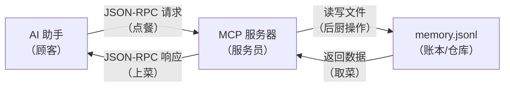
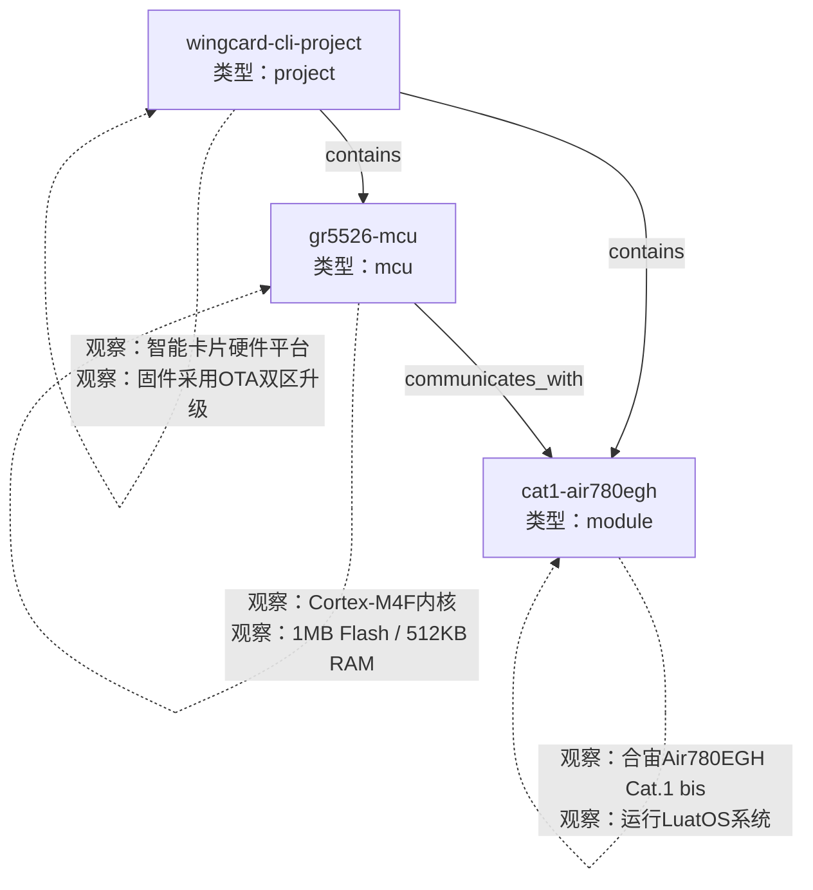
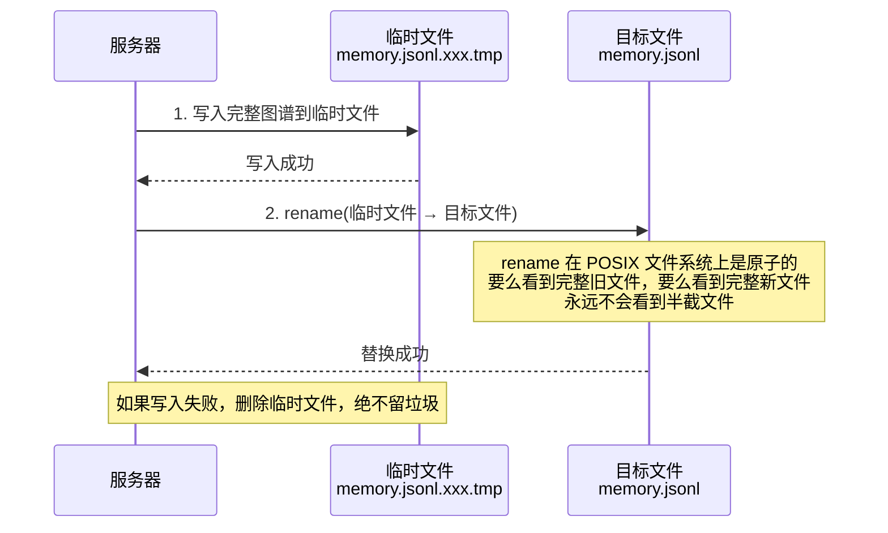
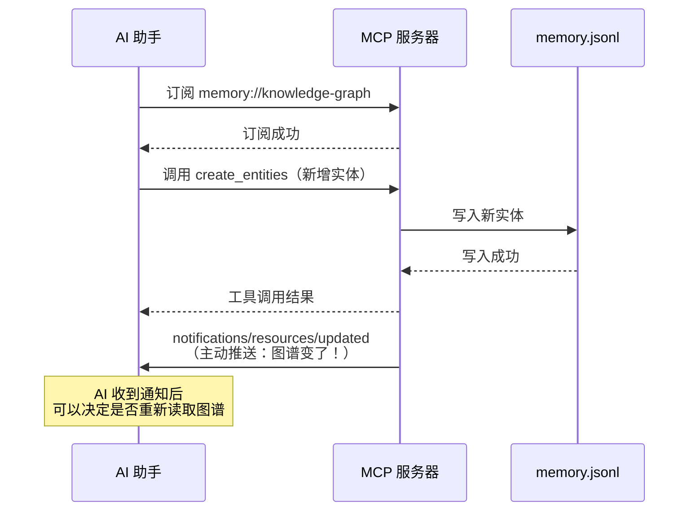

<!-- Post: Memory MCP 技术原理深度解析：从源码看 AI 如何记住你 | ID: 2026-065 | Created: 2026-09-08 | Tags: tech, works | Format: markdown -->

## 开篇：你有没有遇过"AI 健忘症"？

想象一下：你花了半个小时跟 AI 助手讲清楚你的项目结构——用的什么芯片、什么通信模组、目录怎么分工、OTA 升级怎么设计。聊得很顺畅，AI 完全理解了你的需求。

然后你关掉对话，第二天开一个新窗口，问它："我们的项目架构是什么？"

它一脸茫然："请问您的项目是指……？"

这就是大语言模型（Large Language Model，大语言模型）的天生缺陷——**无状态（stateless，无状态）**。每次新对话都是一张白纸，之前聊过的一切烟消云散。你不得不反复粘贴项目说明、重复解释编码偏好、重新描述团队分工。

Memory MCP 就是来解决这个问题的。它给 AI 装了一个"外置大脑"，让 AI 能在对话之间记住信息。这篇文章不教你怎么用它（网上教程已经很多），而是**从源码层面**拆解它到底是怎么实现的——为什么这样设计、有什么巧妙之处、又有哪些局限。

> 本文基于 `@modelcontextprotocol/server-memory` 版本 2026.8.31 的实际源码（共 507 行）分析，所有结论均可在源码中找到对应行号。

---

## 一、Memory MCP 是什么？

一句话：**Memory MCP 是 Anthropic 官方开发的一个本地知识图谱（knowledge graph，知识图谱）记忆服务器，让 AI 助手能通过读写本地文件来实现跨对话的持久化记忆。**

拆开来理解：

- **MCP**（Model Context Protocol，模型上下文协议）：一套让 AI 助手调用外部工具的标准协议。你可以把它想象成 AI 的"USB 接口"——任何符合 MCP 标准的工具都能插上来用。
- **Memory**：这个 MCP 工具的功能是"记忆"。
- **知识图谱**：记忆的存储方式不是纯文本，而是结构化的"实体—关系—观察"三元组模型（后面详细讲）。
- **本地**：所有数据存在你自己电脑的 JSONL 文件里，不发到任何云端服务器。

它解决的核心问题：**让无状态的 AI 获得有状态的记忆**。

---

## 二、整体架构：AI 与记忆服务器怎么对话？

### 2.1 三层结构

整个系统可以用一个"餐厅点餐"的类比来理解：



| 角色 | 对应组件 | 类比 | 说明 |
|------|---------|------|------|
| 顾客 | AI 助手（Claude / 连接器） | 点餐的人 | 发起"记住这个""查一下那个"的请求 |
| 服务员 | server-memory（Node.js 子进程） | 传菜员 | 接收请求，操作账本，返回结果 |
| 账本 | memory.jsonl（本地文件） | 后厨的存货清单 | 实际存储所有记忆数据 |

### 2.2 通信方式：STDIO

AI 和服务器之间怎么说话？答案是 **STDIO（standard input/output，标准输入/输出）**。

这是什么意思？服务器是一个独立运行的 Node.js 程序，AI 通过它的**标准输入（stdin）**发 JSON 格式的请求，服务器通过**标准输出（stdout）**返回 JSON 格式的响应。就像两个人用纸条传消息——AI 把写好的纸条塞进服务器的"收件口"（stdin），服务器把回复写在纸条上从"出件口"（stdout）递回来。

为什么用这种"原始"的方式？因为它**最简单、最通用、最安全**：
- 不需要开网络端口（没有被外部攻击的风险）
- 任何编程语言都支持 stdin/stdout
- 进程隔离——服务器崩了不影响 AI，AI 重启不丢数据

源码中的关键一行（第 499-500 行）：

```javascript
const transport = new StdioServerTransport();
await server.connect(transport);
```

就这两行，服务器就挂在 stdin/stdout 上开始工作了。

### 2.3 启动方式

你的本地部署用 `start.bat` 启动，核心命令是：

```bat
npx -y @modelcontextprotocol/server-memory
```

`npx` 会自动从 npm 下载这个包（首次运行需要网络，之后用缓存），然后启动它。启动前 `start.bat` 还做了 4 项预检：项目目录存在、Node.js 已安装、npx 可用、内存文件路径已配置。

---

## 三、知识图谱数据模型：记忆的三种基本零件

Memory MCP 的核心设计是**知识图谱**。不管多复杂的记忆，都拆成三种基本零件：

### 3.1 实体（Entity）——"谁/什么"

实体是图谱中的**节点**，代表一个人、一个项目、一个概念、一个工具……任何你想记住的"东西"。

每个实体有三个属性：

| 属性 | 类型 | 说明 | 类比 |
|------|------|------|------|
| `name` | 字符串 | 唯一标识，相当于身份证号 | 联系人姓名 |
| `entityType` | 字符串 | 分类标签 | 联系人分组（家人/同事/客户） |
| `observations` | 字符串数组 | 关于这个实体的具体信息 | 联系人的备注信息 |

实际数据示例（来自你的 memory.jsonl 第 1 行）：

```json
{
  "type": "entity",
  "name": "wingcard-cli-project",
  "entityType": "project",
  "observations": [
    "智能卡片硬件平台项目：GR5526 + Cat1(LuatOS) + DA221 加速度计",
    "固件采用 OTA 双区升级机制"
  ]
}
```

### 3.2 关系（Relation）——"和谁有什么关系"

关系是实体之间的**有向连线**，描述两个实体之间的联系。

| 属性 | 类型 | 说明 |
|------|------|------|
| `from` | 字符串 | 起点实体的 name |
| `to` | 字符串 | 终点实体的 name |
| `relationType` | 字符串 | 关系类型，要求**主动语态**（active voice，主动语态） |

为什么要求主动语态？比如用 `depends-on`（依赖于）而不是 `is-depended-by`（被依赖）。主动语态让关系的方向一目了然，遍历图谱时不会混淆。

类比：你的通讯录里，"张三"和"李四"的关系是"张三→同事→李四"，而不是"张三←同事←李四"。方向明确，查询时才不会乱。

### 3.3 观察（Observation）——"关于它的具体事实"

观察是挂在实体上的**一条条具体信息**。每条观察应该是**原子的（atomic，原子的）**——一条观察只说一件事。

好的观察：
- "偏好使用 const 而非 let"
- "GR5526 内部 Flash 1MB，地址范围 0x00200000-0x00300000"
- "OTA 升级于 2026-09-04 端到端成功"

不好的观察：
- "这个项目很好"（太模糊，没有可操作的信息）
- "用了微服务架构，有5个服务，分别是auth、api、database、cache、queue，数据库用PostgreSQL，缓存用Redis……"（一条观察塞了太多事实，应该拆开）

类比：联系人备注里，"电话：138xxxx，邮箱：xx@xx.com，地址：xx市xx区"——每条信息独立一行，而不是全写在一个长句子里。

### 3.4 三者合起来长什么样？



这就是知识图谱——节点是实体，连线是关系，节点上挂着观察。结构化、可遍历、可查询。

---

## 四、存储引擎：数据怎么存到硬盘上？

这是全文技术含量最高的部分。Memory MCP 没有用数据库（SQLite、MySQL 都没有），而是用了一个**纯文本文件**。

### 4.1 为什么是 JSONL 而不是 JSON？

JSONL（JSON Lines，JSON 行格式）的意思是：**文件的每一行都是一条独立的 JSON 对象**。

你的 memory.jsonl 打开后长这样：

```
{"type":"entity","name":"wingcard-cli-project","entityType":"project","observations":[...]}
{"type":"entity","name":"gr5526-mcu","entityType":"mcu","observations":[...]}
{"type":"relation","from":"wingcard-cli-project","to":"gr5526-mcu","relationType":"contains"}
```

每行一条记录，用 `type` 字段区分是实体还是关系。

为什么不用一个大 JSON 对象（比如 `{"entities":[...], "relations":[...]}`）？

| 对比维度 | 单个大 JSON | JSONL（每行一条） |
|---------|------------|-------------------|
| 写入方式 | 必须整体重写 | 理论上可追加（append） |
| 容错性 | 文件损坏则全部丢失 | 坏一行只丢一条记录 |
| 流式读取 | 必须读完全文才能解析 | 逐行解析，内存友好 |
| 人类可读性 | 嵌套深，难读 | 每行独立，清晰 |

类比：JSONL 像**账本**——每笔交易写一行，写错一行不影响其他行；单个大 JSON 像**把所有内容写在一张纸上的一个大表格里**——纸破了角，整张表的结构就坏了。

### 4.2 读取：loadGraph——从账本重建完整图谱

读取时（源码第 52-81 行），服务器做三件事：

1. 把整个文件读进内存（`fs.readFile`）
2. 按换行符 split 成一行行
3. 逐行 `JSON.parse`，根据 `type` 字段分别放进 `entities[]` 或 `relations[]` 数组

最终在内存中得到一个完整的图谱对象：`{entities: [...], relations: [...]}`。

如果文件不存在（首次使用），返回空图谱 `{entities: [], relations: []}`，不会报错。

### 4.3 写入：saveGraph——原子写入防数据损坏

这是**最精妙的设计决策**。源码第 82-116 行的注释写得非常清楚，我翻译一下核心意思：

> 直接用 `fs.writeFile` 写文件会先截断（truncate，清空）原文件再写入新内容。如果在写入过程中被打断——比如进程被强制杀死（SIGKILL）、容器停止、内存耗尽（OOM）、甚至断电——唯一的图谱副本就会变成半截文件，**不可恢复**。

所以 Memory MCP 用了**原子写入（atomic write，原子写入）**的方案：



具体步骤（源码第 105-115 行）：

1. **创建临时文件**：在目标文件**同一目录**下，文件名含 16 字节随机十六进制后缀（如 `memory.jsonl.a1b2c3d4e5f6.tmp`）。
2. **写入完整图谱**：把所有实体和关系序列化为 JSONL，写入临时文件。
3. **原子重命名**：`fs.rename(tempFilePath, memoryFilePath)`——在 POSIX（Portable Operating System Interface，可移植操作系统接口）文件系统上，rename 是原子操作，读者要么看到完整旧文件，要么看到完整新文件，**永远不会看到中间状态**。
4. **失败清理**：如果任何一步失败，删除临时文件（`fs.unlink`），绝不留下垃圾文件。

为什么临时文件必须在**同一目录**？因为 rename 跨文件系统（跨挂载点）会失败（错误码 EXDEV）。同一目录保证在同一个文件系统内，rename 一定是原子的。

类比：你要更新一本账本，不是直接擦掉旧账重写（擦到一半被打断就完了），而是**先在旁边的空白本子上写好新账本，确认写完整了，再一把把旧账本换掉**。换的动作是瞬间完成的——别人翻开看，要么是旧账本，要么是新账本，永远不会看到写了一半的账本。

### 4.4 向后兼容：旧格式自动迁移

早期版本用的是 `memory.json`（单个大 JSON），后来改成了 `memory.jsonl`。源码中的 `ensureMemoryFilePath()` 函数（第 13-43 行）会自动检测：

- 如果设置了 `MEMORY_FILE_PATH` 环境变量，用指定路径
- 否则检查旧的 `memory.json` 是否存在
- 如果旧文件存在且新的 `memory.jsonl` 不存在，自动 `rename` 迁移，并在 stderr 打印日志

这意味着用户升级版本时，旧数据不会丢失，自动无缝迁移。

---

## 五、九个工具全解：AI 能对记忆做什么操作？

> **注意**：网上很多教程（包括 claude-world 的指南和你本地的 list.txt）都只列了 8 个工具，但**实际源码注册了 9 个**——遗漏了 `delete_relations`。这是基于源码的一手发现。

每个工具通过 **Zod schema**（一个 TypeScript 的数据校验库）定义输入输出格式，并标注四个语义提示（annotation，注解）：
- `readOnlyHint`：是否只读（只读工具不会修改数据）
- `destructiveHint`：是否破坏性（删除操作是破坏性的）
- `idempotentHint`：是否幂等（idempotent，幂等——执行多次和执行一次效果相同）
- `openWorldHint`：是否开放世界（工具是否可能访问外部世界）

### 5.1 create_entities——创建实体

**功能**：批量创建新实体。

**核心逻辑**（源码第 117-123 行）：
1. 读取当前图谱
2. 过滤掉 name 已存在的实体（**去重**，不会覆盖已有实体）
3. 把新实体追加到数组
4. 存盘

**类比**：往通讯录里加联系人，但如果同名联系人已存在，就跳过不添加。

**注解**：非只读、非破坏性、非幂等（重复调用不会重复创建，但第一次和第二次的返回值不同）。

### 5.2 create_relations——创建关系

**功能**：批量创建实体间的有向关系。

**核心逻辑**（源码第 124-132 行）：
1. 读取当前图谱
2. 按三元组（from + to + relationType）去重——完全相同的关系不重复创建
3. 追加新关系
4. 存盘

**类比**：在通讯录的两个联系人之间建立"同事"关系，如果已经标记过了就不重复标记。

### 5.3 add_observations——添加观察

**功能**：给已存在的实体添加新的观察信息。

**核心逻辑**（源码第 133-146 行）：
1. 读取当前图谱
2. 按 entityName 查找实体
3. **如果实体不存在，抛出错误**（`Entity with name xxx not found`）——不会自动创建实体
4. 过滤掉已存在的观察内容（去重）
5. 追加新观察
6. 存盘

**类比**：给已有联系人添加备注信息。如果联系人不存在，会报错"查无此人"，而不是自动创建一个空联系人。

**注意**：这是九个工具中**唯一会抛错的写操作**。其他写操作都是"静默成功"（不存在就跳过），只有 add_observations 要求实体必须预先存在。

### 5.4 delete_entities——删除实体（级联删除）

**功能**：删除指定实体，同时**级联删除**（cascade delete，级联删除）所有涉及该实体的关系。

**核心逻辑**（源码第 147-152 行）：
1. 读取当前图谱
2. 从 entities 数组中过滤掉指定 name 的实体
3. **从 relations 数组中过滤掉起点或终点是被删实体的所有关系**
4. 存盘

**类比**：删除一个联系人，同时自动清除所有和这个人相关的关系标记（同事、朋友、客户等）。

**注解**：破坏性、幂等（删不存在的实体也不会报错，静默成功）。

### 5.5 delete_observations——删除观察

**功能**：从指定实体上删除特定的观察内容。

**核心逻辑**（源码第 153-162 行）：
1. 读取当前图谱
2. 找到目标实体
3. 从 observations 数组中过滤掉匹配的字符串
4. 存盘

**类比**：删掉联系人备注里的某一条信息（比如旧电话号码）。

**注意**：删除是**按字符串精确匹配**的。如果观察文本有细微差异（多了个空格、标点不同），就删不掉。

### 5.6 delete_relations——删除关系（网上教程普遍遗漏的第 9 个工具）

**功能**：按三元组精确匹配删除关系。

**核心逻辑**（源码第 163-169 行）：
1. 读取当前图谱
2. 过滤掉 from + to + relationType 完全匹配的关系
3. 存盘

**类比**：解除两个联系人之间的某种关系标记。

### 5.7 read_graph——读取整个图谱

**功能**：返回全部实体和关系，无参数。

**核心逻辑**（源码第 170-172 行）：直接调用 `loadGraph()` 返回完整图谱。

**类比**：把整本通讯录全部翻出来给你看。

**注解**：只读、幂等。

### 5.8 search_nodes——搜索节点

**功能**：按查询文本搜索匹配的实体和相关关系。

**核心逻辑**（源码第 174-190 行）——这是全文搜索的实现：

```javascript
e.name.toLowerCase().includes(query.toLowerCase()) ||
e.entityType.toLowerCase().includes(query.toLowerCase()) ||
e.observations.some(o => o.toLowerCase().includes(query.toLowerCase()))
```

三个搜索范围：
1. 实体名称（name）
2. 实体类型（entityType）
3. 所有观察文本（observations）

匹配方式：**大小写不敏感的子串包含匹配**（substring match，子串匹配）——只要查询词是目标文本的子串就算命中。

匹配到实体后，**自动包含至少一端命中的关系**（源码第 184 行）。这样即使关系另一端的实体没有直接匹配，也能被发现——有助于图谱遍历。

**类比**：在通讯录里搜索"张"，会返回所有姓名、分组、备注里含"张"的联系人，以及这些联系人的所有关系标记。

**局限**：没有语义理解。搜"升级"不会命中只写了"OTA"的记录，因为它不懂同义词。

### 5.9 open_nodes——打开指定节点

**功能**：按名称精确获取一个或多个实体的完整信息，以及它们的关联关系。

**核心逻辑**（源码第 191-207 行）：
1. 读取当前图谱
2. 过滤出 name 在请求列表中的实体
3. 过滤出**至少一端**在请求集合中的关系

**这里有一个历史 bug 修复**（源码第 197-200 行注释）：

> 旧版要求关系的**两端**都在请求集合中才返回。这导致从请求节点指向未请求节点的关系被静默丢弃——你无法通过打开一个节点来发现它连接了哪些外部节点。

修复后改为：只要关系的**至少一端**在请求集合中就返回。这使得 `open_nodes` 可以作为图谱遍历的入口——从一个节点出发，发现它的所有邻居。

**类比**：查看某个联系人的详细信息，同时显示他和谁有关系（即使那些人不在你当前查看的列表里）。

---

## 六、搜索机制：为什么搜"升级"找不到"OTA"？

上一节提到了 search_nodes 的实现，这里专门讲一下它的能力边界。

### 6.1 搜索是纯文本子串匹配

源码中的搜索逻辑非常简单——就是 `String.includes()`，没有任何高级功能：

| 能力 | 是否支持 | 说明 |
|------|---------|------|
| 大小写不敏感 | 是 | 统一转小写后比较 |
| 子串匹配 | 是 | 查询词是目标的子串即命中 |
| 分词 | 否 | 中文不会分词，"智能卡"搜不到"智能卡片" |
| 同义词 | 否 | "升级" ≠ "OTA" |
| 正则表达式 | 否 | 不支持 |
| 模糊匹配 | 否 | 拼写错误就搜不到 |
| 向量语义搜索 | 否 | 没有 embedding（向量嵌入） |
| 结果排序 | 否 | 按文件中的原始顺序返回 |
| 权重 | 否 | name 命中和 observation 命中权重相同 |

### 6.2 这意味着什么？

- 你的记忆里写了"OTA 升级闭环达成"，搜"OTA"能命中，搜"升级"也能命中（因为"升级"是"OTA 升级闭环达成"的子串）
- 但如果只写了"OTA 闭环达成"（没有"升级"两个字），搜"升级"就**命中不了**
- 中文搜索尤其受限——因为没有分词，"GR5526 的 Flash 是 1MB"搜"闪存"找不到（文中写的是 Flash 不是闪存）

### 6.3 和语义搜索的差距

真正的语义搜索（semantic search，语义搜索）会把文本转换成向量（vector，向量），然后计算查询和文档之间的**余弦相似度**（cosine similarity，余弦相似度），能理解"升级"和"OTA"是相关的、"Flash"和"闪存"是同一个东西。Memory MCP 目前完全没有这个能力。

这是它最大的功能短板之一，也是未来最可能改进的方向。

---

## 七、资源订阅与实时通知：AI 怎么知道记忆变了？

MCP 协议不只有"工具调用"（AI 主动请求），还有"资源"（Resource）和"订阅"（Subscription）机制。Memory MCP 完整实现了这一套。

### 7.1 什么是 MCP Resource？

Resource（资源）是 MCP 协议中一种**可被读取的命名数据对象**。你可以把它想象成一个"文件"——有一个 URI（Uniform Resource Identifier，统一资源标识符），客户端可以读取它的内容。

Memory MCP 注册了一个资源（源码第 463-480 行）：
- URI：`memory://knowledge-graph`
- MIME 类型：`application/json`
- 内容：完整的知识图谱（和 read_graph 工具返回相同的数据）

AI 可以像读文件一样读取这个资源，获取整个图谱。

### 7.2 什么是订阅通知？

如果 AI 每次想知道图谱有没有变化都要主动读一次，那就是**轮询**（polling，轮询）——效率低、有延迟。

MCP 协议支持**订阅-通知**模式：AI 订阅某个资源后，当资源变化时，服务器**主动推送**通知，AI 不需要反复询问。

Memory MCP 的实现（源码第 483-493 行）：

1. 声明 `resources.subscribe = true` 能力（告诉客户端"我支持订阅"）
2. 处理 `SubscribeRequest`——把订阅的 URI 加入一个 `Set`
3. 处理 `UnsubscribeRequest`——从 `Set` 中移除

### 7.3 通知链路

每个**写操作**工具（create_entities、create_relations、add_observations、delete_entities、delete_observations、delete_relations）执行完毕后，都会调用 `notifyGraphUpdated()`（源码第 232-236 行）：

```javascript
function notifyGraphUpdated() {
    if (resourceSubscribers.has(RESOURCE_URI)) {
        server.server.sendResourceUpdated({ uri: RESOURCE_URI });
    }
}
```

如果有客户端订阅了 `memory://knowledge-graph`，就发送 `notifications/resources/updated` 通知。



**类比**：你订阅了一本杂志的"更新提醒"。每当杂志出新版，出版社主动给你发消息"新一期来了"，你不用每天去书店问"出新的了吗"。

---

## 八、工程细节与设计决策

### 8.1 Zod Schema：输入输出的"安检员"

每个工具的输入和输出都用 **Zod**（一个 TypeScript 运行时类型校验库）定义 schema。比如实体的 schema（源码第 211-215 行）：

```javascript
const EntitySchema = z.object({
    name: z.string().describe("The name of the entity"),
    entityType: z.string().describe("The type of the entity"),
    observations: z.array(z.string()).describe("An array of observation contents")
});
```

Zod 会在运行时校验 AI 传来的参数是否符合格式。如果 AI 传了一个数字给 `name`（应该是字符串），Zod 会直接拒绝并返回清晰的错误信息，而不是让程序在后续逻辑中崩溃。

**类比**：机场安检——每个乘客（参数）过安检时，检查行李（字段）是否符合规定（类型），不符合就不让进（拒绝请求）。

### 8.2 工具注解：告诉 AI "这个工具是什么脾气"

每个工具注册时都标注了四个 hint（源码中每个 `server.registerTool` 都有 `annotations` 字段）：

| 注解 | 含义 | 为什么重要 |
|------|------|-----------|
| `readOnlyHint` | 是否只读 | AI 知道调用这个工具不会改变任何东西，可以放心调用 |
| `destructiveHint` | 是否破坏性 | AI 知道删除操作不可逆，调用前会更谨慎 |
| `idempotentHint` | 是否幂等 | AI 知道重复调用安全，网络超时后可以重试 |
| `openWorldHint` | 是否开放世界 | AI 知道这个工具会不会访问外部网络/系统 |

这些注解帮助 AI 理解工具的语义，做出更合理的调用决策。比如删除工具标注了 `destructiveHint: true`，AI 在调用前可能会先确认。

### 8.3 全量读写的性能特征

每次操作都是：**读全文件 → 修改内存 → 写全文件**。

这意味着：
- 图谱小的时候（几十、几百个实体），速度极快（毫秒级）
- 图谱大了之后（几千、上万个实体），每次操作都要读写整个文件，性能线性下降
- 没有增量写入——即使只加一条观察，也要重写整个文件

**类比**：每次修改通讯录，都要把整本通讯录重新抄一遍——通讯录小的时候无所谓，厚了之后每次修改都很累。

### 8.4 无并发控制

整个服务器没有任何文件锁（file lock，文件锁）机制。如果两个 MCP 客户端同时连接并写入，可能出现**丢失更新**（lost update，丢失更新）：

1. 客户端 A 读取图谱（版本 1）
2. 客户端 B 读取图谱（版本 1）
3. 客户端 A 添加实体，写入（版本 2）
4. 客户端 B 添加实体，基于版本 1 写入（版本 2'）——A 的修改被覆盖

不过在实际使用中，通常只有一个 AI 客户端连接一个 MCP 服务器，所以这个问题很少触发。

---

## 九、局限性：Memory MCP 不是万能的

基于源码分析，总结以下局限：

| 局限 | 具体表现 | 影响 |
|------|---------|------|
| **全量读写** | 每次操作读全文件+写全文件 | 图谱大了性能下降 |
| **无并发锁** | 多客户端同时写会丢数据 | 不适合多用户共享 |
| **无加密** | JSONL 明文存储 | 不能存密码/密钥等敏感信息 |
| **搜索弱** | 纯子串匹配，无语义理解 | 中文搜索、同义词搜索效果差 |
| **无事务** | 多操作之间无隔离 | 批量操作中途失败会留下部分结果 |
| **observation 删除靠文本匹配** | 字符串不完全一致就删不掉 | 修改过的观察难以精确删除 |
| **无版本历史** | 覆盖写入，旧版本不可恢复 | 误删无法回滚 |
| **单文件** | 所有数据在一个文件里 | 文件损坏则全部丢失（虽然原子写入降低了风险） |

---

## 十、改进方向：如果让我来升级它

基于以上局限，以下是合理的改进方向：

### 10.1 存储层升级：JSONL → SQLite

把 JSONL 文件换成 SQLite 数据库：
- 支持增量写入（不需要每次重写全文件）
- 内置事务（ACID，原子性/一致性/隔离性/持久性）
- 支持并发访问（文件锁由数据库管理）
- SQL 查询比子串匹配强大得多

### 10.2 搜索升级：子串匹配 → 向量语义搜索

集成本地向量数据库（如 SQLite 的 sqlite-vec 扩展，或独立的 LanceDB）：
- 文本自动生成 embedding（向量嵌入）
- 支持同义词、语义相似度搜索
- 中文搜索体验大幅提升

### 10.3 安全升级：明文 → 加密存储

对 memory.jsonl 进行 AES 加密，密钥从环境变量或系统密钥链获取：
- 可以安全存储敏感信息
- 即使文件泄露也无法读取

### 10.4 功能升级：版本历史与软删除

- 每次修改保留历史版本（类似 Git）
- 删除改为软删除（标记 deleted 而非真正移除）
- 支持回滚到任意历史版本

### 10.5 观察删除升级：文本匹配 → ID 匹配

给每条 observation 分配唯一 ID，删除时按 ID 而非文本匹配：
- 避免文本细微差异导致删不掉
- 支持修改单条观察（目前只能删了再加）

---

## 十一、总结：Memory MCP 的设计哲学

回顾整个源码（507 行），Memory MCP 的设计哲学可以概括为三句话：

**1. 极简主义——能用文件解决的绝不用数据库。**
整个存储层就是一个 JSONL 文件，没有数据库依赖，没有服务端进程，没有网络端口。507 行代码实现了完整的知识图谱记忆系统，这本身就是一种工程美学。

**2. 安全第一——原子写入防止数据丢失。**
在所有设计决策中，防数据损坏的原子写入机制是最用心的部分。temp 文件 + rename 的方案虽然多写了几行代码，但确保了在任何异常情况下（断电、杀进程、OOM）都不会损坏唯一的数据副本。

**3. 协议原生——充分利用 MCP 的高级特性。**
不只是实现了工具调用，还完整实现了 Resource 注册、订阅通知、能力声明、Zod 校验、工具注解等 MCP 协议的高级特性。这让它不只是一个"能跑"的工具，而是一个"符合规范"的 MCP 服务器。

**它适合谁？**
- 个人开发者，想要 AI 记住项目结构和编码偏好
- 长期项目，需要跨会话保持上下文
- 注重隐私，不想把数据发到云端

**它不适合谁？**
- 多用户共享记忆的场景（无并发控制）
- 需要存储敏感信息的场景（无加密）
- 大规模知识图谱（全量读写性能不足）
- 需要语义搜索的场景（纯子串匹配）

Memory MCP 是一个"小而美"的工具——它不追求功能全面，而是把"本地持久化记忆"这件事用最简单、最可靠的方式做好了。理解了它的源码，你也就理解了 MCP 服务器的基本开发范式：STDIO 传输 + JSON-RPC 协议 + Zod 校验 + 工具注册 + 资源订阅。

下次你想给 AI 开发一个自定义工具时，Memory MCP 的 507 行源码就是最好的参考模板。

---

## 参考来源

- 源码：`@modelcontextprotocol/server-memory` 版本 2026.8.31，`dist/index.js`（共 507 行）
- 官方文档：npm 包 `@modelcontextprotocol/server-memory` 的 README.md
- 指南文章：[Memory MCP：AI 的持久化知識圖譜](https://claude-world.com/zh-tw/articles/memory-mcp-guide/)
- MCP 规范：[modelcontextprotocol.io](https://modelcontextprotocol.io)
- 源码仓库：[github.com/modelcontextprotocol/servers](https://github.com/modelcontextprotocol/servers)
