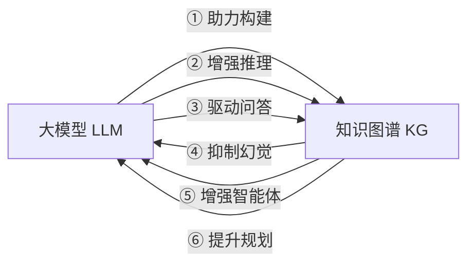

<!-- Post: 大模型和知识图谱，谁在帮谁？ | ID: 2026-066 | Created: 2026-09-08 | Tags: tech, books | Format: markdown -->

## 开篇：一个调查员的困惑

假设你是一名开源情报（OSINT，Open Source Intelligence，开源情报）调查员，接到一个任务：调查"大模型和知识图谱的关系"。

你打开搜索引擎，输入关键词，结果铺天盖地——有人说大模型会取代知识图谱，有人说知识图谱是大模型的"解药"，还有人说两者正在融合成"神经符号系统"。你越看越糊涂：到底谁在帮谁？

2025 年 1 月，同济大学王昊奋研究员在 OpenKG 年会上做了一场分享，系统梳理了 2024 年大模型与知识图谱协同发展的全部重要成果。这篇文章就是那场分享的"调查笔记"——我们用 OSINT 的方法论，把报告里的每一个结论都溯源到原始论文、开源仓库和基准测试，看看哪些是已验证的事实，哪些是一方之词。

> 本系列基于王昊奋《大模型时代的知识图谱年度进展报告》（2025-01-29，OpenKG TOC专家谈），原文见 [安全内参转载](https://www.secrss.com/articles/75214)。所有技术结论均交叉验证原始论文和开源仓库。

---

## 一、先搞清楚：什么是知识图谱？

如果你用过维基百科，就已经接触过知识图谱的雏形了。

**知识图谱（Knowledge Graph，知识图谱）** 就是把世界上的知识组织成"实体—关系—实体"的三元组结构。比如：

- 实体："爱因斯坦"
- 关系："出生于"
- 实体："德国乌尔姆"

连起来就是：**爱因斯坦 → 出生于 → 德国乌尔姆**。

成千上万条这样的三元组连在一起，就形成了一张巨大的"知识网"。你可以在这张网上沿着关系走，从一个实体跳到另一个实体，发现隐藏的联系。

类比：如果大模型是一个"读过全世界书的人"，那知识图谱就是一张"画满了人和人关系的家谱图"。前者靠记忆和联想回答问题，后者靠结构化的连线精确查询。

### OSINT 视角：怎么验证一个知识图谱的质量？

作为调查员，你可以用以下方法快速判断一个知识图谱靠不靠谱：

1. **查规模**：实体数量、关系数量、三元组总数——规模大不一定好，但太小肯定覆盖不足
2. **查来源**：数据从哪来？是人工标注还是自动抽取？来源是否权威？
3. **查更新**：最后更新时间是什么时候？知识图谱如果不更新，就像一本 2010 年的电话号码簿
4. **查开放度**：是否开源？能否下载完整数据？还是只能通过 API 有限访问？

用 Google Dork 可以快速定位开源知识图谱：
```
site:github.com "knowledge graph" dataset stars:>1000
filetype:ttl OR filetype:nt "knowledge graph"
```

---

## 二、大模型和知识图谱，到底谁帮谁？

报告的核心论点是：**双向赋能**。不是单向的"大模型帮知识图谱"或"知识图谱帮大模型"，而是互相帮助。



### 方向一：大模型 → 知识图谱（大模型帮 KG 变得更好）

大模型有强大的语言理解和生成能力，可以帮知识图谱解决两个长期痛点：

1. **知识抽取**：从非结构化文本（新闻、论文、网页）中自动提取实体和关系。以前靠规则和人工，现在大模型能理解复杂句式，抽取准确率大幅提升。
2. **知识推理**：在已有的知识图谱上做逻辑推理，补全缺失的三元组（比如已知"A 的父亲是 B，B 的父亲是 C"，推理出"A 的祖父是 C"）。

### 方向二：知识图谱 → 大模型（KG 帮大模型变得更可靠）

大模型最大的问题是**幻觉（hallucination，幻觉）**——一本正经地胡说八道。知识图谱可以：

1. **事实校验**：大模型生成的回答，拿去知识图谱里验证对不对
2. **增强推理**：复杂问题需要多步推理时，知识图谱提供结构化的"推理路径"
3. **提升可解释性**：大模型给出答案后，知识图谱能告诉你"这个答案来自哪条知识链"

类比：大模型像一个口才极好但偶尔吹牛的顾问，知识图谱像一个严谨的事实核查员。顾问负责说，核查员负责验证。

---

## 三、三个必须先懂的核心概念

在深入报告之前，有三个概念是理解全文的钥匙。

### 概念 1：知识抽取（Information Extraction，信息抽取）

从非结构化文本中提取结构化知识的过程。输入是一段自然语言文本，输出是实体、关系、属性的结构化数据。

类比：你读一篇新闻报道，然后用表格列出文中提到的人物、他们的关系、发生的事件——这就是手动版的知识抽取。大模型做的是自动化这件事。

### 概念 2：知识图谱补全（Knowledge Graph Completion，知识图谱补全）

现实中的知识图谱永远是不完整的——很多关系缺失。补全就是根据已有的三元组，预测缺失的部分。比如已知（爱因斯坦，出生于，德国）和（爱因斯坦，职业，物理学家），预测（爱因斯坦，国籍，？）= 德国/美国。

类比：填字游戏——根据已有的字母和交叉线索，猜出缺失的单词。

### 概念 3：神经符号系统（Neuro-Symbolic System，神经符号系统）

把神经网络（大模型）和符号系统（知识图谱、逻辑推理）结合起来的系统。神经网络负责感知和语言理解，符号系统负责精确推理和可解释性。

类比：一个团队里，"直觉型天才"负责出主意，"逻辑型分析师"负责验证和推导。两者结合比单独任何一个都强。

---

## 四、这份报告覆盖了什么？

报告共六大板块，20+ 代表工作，涉及 10+ 高校和研究机构：

| 板块 | 核心问题 | 代表工作数量 |
|------|---------|-------------|
| 大模型助力 KG 构建 | 怎么从文本中自动抽取知识？ | 2 项 |
| 大模型增强 KG 推理 | 怎么让大模型在图谱上做推理？ | 4 项 |
| 大模型驱动 KG 问答 | 怎么用自然语言查知识图谱？ | 3 项 |
| KG 赋能大模型 | 怎么用 KG 减少大模型幻觉、增强智能体？ | 7 项 |
| 神经符号协同 | 神经网络和符号系统怎么深度融合？ | 4 项 |
| OpenKG 生态与趋势 | 国内开源生态和未来方向 | 4 项 + 趋势 |

下一篇我们会用"全书地图"的方式，把这 20+ 项工作逐一速览，标注每一项的论文出处、开源仓库和验证状态。

---

## 五、OSINT 方法论：怎么读这份报告才不被"带节奏"？

作为调查员，读技术报告时我遵循以下原则：

### 原则 1：每个结论都要溯源

报告中提到的每一个模型、每一个实验结果，都应该能追溯到原始论文。我会在后续文章中为每个代表工作标注：
- 论文标题和发表会议/期刊
- arXiv 预印本链接（如有）
- GitHub 开源仓库（如有）
- 基准数据集和评测指标

### 原则 2：区分"已验证"和"一方称"

| 证据等级 | 含义 | 判定标准 |
|---------|------|---------|
| 已验证 | 多个独立来源确认 | 论文 + 开源代码 + 第三方复现 |
| 一方称 | 仅作者团队声称 | 只有论文，无开源代码或第三方复现 |
| 存疑 | 存在争议或矛盾 | 不同论文结果不一致 |

### 原则 3：用 Dork 查询快速定位原始资源

调查一个模型时，我常用的搜索策略：

```
# 找论文
"<模型名>" site:arxiv.org
"<模型名>" filetype:pdf

# 找代码
"<模型名>" site:github.com
"<模型名>" "knowledge graph" stars:>100

# 找评测
"<模型名>" benchmark OR "leaderboard" OR "evaluation"

# 找争议
"<模型名>" critique OR "limitation" OR "fail"
```

### 原则 4：查 GitHub 仓库的"健康度"

一个开源项目是否活跃、是否可信，可以从这些指标判断：
- Star 数和 Fork 数（关注度）
- 最近一次 commit 时间（是否还在维护）
- Issue 响应速度（社区活跃度）
- 是否有测试和 CI（代码质量）
- Contributor 数量（是单人项目还是团队项目）

---

## 小结

- 大模型和知识图谱是**双向赋能**关系，不是谁取代谁
- 三个核心概念：知识抽取、知识图谱补全、神经符号系统
- 报告覆盖六大板块、20+ 代表工作
- 用 OSINT 方法论读技术报告：溯源、验证、查仓库、辨争议

**下一篇预告**：我们将用一张"全书地图"把 20+ 项代表工作全部速览，每项标注论文出处、开源仓库和验证状态，让你一眼看清 2024 年知识图谱领域的全景。

---

## 系列导航

| 序号 | 状态 | 标题 |
|------|------|------|
| 第1篇 | ✅ 本文 | 大模型和知识图谱，谁在帮谁？ |
| 第2篇 | ⏳ 即将发布 | 一图看懂 2024 知识图谱全景 |
| 第3篇 | ⏳ 即将发布 | 六个核心主题，先学哪个？ |
| 第4篇 | ⏳ 即将发布 | 知识图谱构建：大模型如何帮 KG"长出来" |
| 第5篇 | ⏳ 即将发布 | 知识图谱推理：从静态补全到动态泛化 |
| 第6篇 | ⏳ 即将发布 | 知识图谱问答：让大模型"读懂"图谱 |
| 第7篇 | ⏳ 即将发布 | 知识图谱反哺大模型：幻觉、智能体与科学发现 |
| 第8篇 | ⏳ 即将发布 | 神经符号协同：当逻辑遇见概率 |
| 第9篇 | ⏳ 即将发布 | OpenKG 生态与未来：从规模红利到表示红利 |
| 第10篇 | ⏳ 即将发布 | 知识图谱在 AI 技术栈中的位置 |
| 第11篇 | ⏳ 即将发布 | 读完这份报告之后：质疑、局限与行动指南 |
