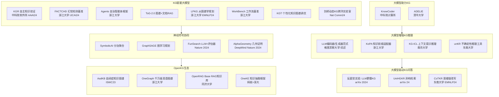
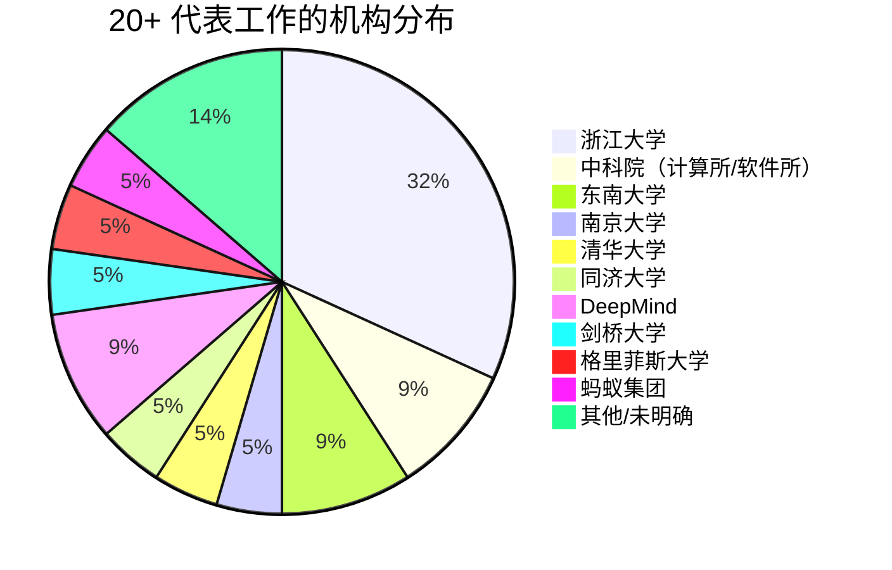

<!-- Post: 一图看懂2024知识图谱全景 | ID: 2026-067 | Created: 2026-09-08 | Tags: tech, books | Format: markdown -->

## 开篇：调查员的"线索墙"

看过侦探剧的人都熟悉那个场景：侦探在墙上贴满照片、剪报和便签，用红线把它们连起来，形成一张"线索墙"。一眼看去，整个案件的人物关系、时间线和关键证据一目了然。

这篇文章就是 2024 年知识图谱领域的"线索墙"。我们把报告中提到的 20+ 项代表工作全部贴上来，每项标注：所属机构、论文出处、是否开源、验证状态。你不需要记住所有细节，但看完这张地图，你就能知道 2024 年这个领域发生了什么、谁在做什么、哪些是真东西哪些是噱头。

---

## 一、全景图：六大板块 20+ 工作



---

## 二、20+ 代表工作速查表

### 板块一：大模型助力 KG 构建

| 工作 | 机构 | 核心思路 | 论文/出处 | 开源 | 验证状态 |
|------|------|---------|----------|------|---------|
| **KnowCoder** | 中科院计算所 | 用形式化编程语言统一表示结构化知识，实现符号知识与神经网络的对齐 | 报告提及，未给出具体论文链接 | 未确认 | 一方称（需查论文验证） |
| **ADELIE** | 清华大学 | 83,000+ 实例的 IEInstruct 数据集 + 监督微调（SFT）+ 直接偏好优化（DPO），增强信息抽取 | 报告提及 | 未确认 | 一方称 |

**OSINT 调查提示**：这两项工作在报告中只给出了机构和思路，没有给出论文链接。要验证的话，可以用以下 Dork 查询：
```
"KnowCoder" "knowledge graph" site:arxiv.org
"ADELIE" "information extraction" "IEInstruct" site:arxiv.org
"KnowCoder" site:github.com
```

### 板块二：大模型增强 KG 推理

| 工作 | 机构 | 核心思路 | 论文/出处 | 开源 | 验证状态 |
|------|------|---------|----------|------|---------|
| **LLM 编码器/生成器范式** | 格里菲斯大学等 | 综述：LLM 作为编码器（判别式）和作为生成器（生成式）两种增强 KG 推理的方式 | Pan et al. *Unifying Large Language Models and Knowledge Graphs: A Roadmap*, IEEE TKDE 2024 | 综述论文可查 | 已验证（IEEE TKDE 是权威期刊） |
| **KoPA** | 浙江大学 | 知识前缀适配器（Knowledge Prefix Adapter），将 KG 结构嵌入通过适配器传递给 LLM，实现结构感知推理 | Zhang et al. *Making Large Language Models Perform Better in Knowledge Graph Completion*, MM'24 | 未确认 | 一方称 |
| **KG-ICL** | 南京大学 | 基于上下文提示的通用推理模型，用提示图编码生成关系提示向量，实现对新实体/新关系/新图谱的泛化 | Cui et al. *A Prompt-Based Knowledge Graph Foundation Model for Universal In-Context Reasoning*, NeurIPS'24 | 未确认 | 一方称（NeurIPS 是顶会，但需查论文） |
| **unKR** | 东南大学 | 国际首个专注不确定性知识图谱推理的开源工具，统一复现 9 种模型 | Wang et al. *unKR: A Python Library for Uncertain Knowledge Graph Reasoning by Representation Learning*, SIGIR'24 | ✅ [github.com/seucoin/unKR](https://github.com/seucoin/unKR) | 已验证（有 GitHub 仓库 + SIGIR 论文） |

### 板块三：大模型驱动 KG 问答

| 工作 | 机构 | 核心思路 | 论文/出处 | 开源 | 验证状态 |
|------|------|---------|----------|------|---------|
| **反直觉实验** | 未明确 | 发现 LLM 对知识图谱的理解能力比预期强，线性化三元组输入优于自然语言文本 | Dai et al. *Counter-intuitive: Large Language Models Can Better Understand Knowledge Graphs Than We Thought*, arXiv:2402.11541, 2024 | 未确认 | 已验证（arXiv 编号可查） |
| **UniHGKR** | 未明确 | 统一指令感知的异构知识检索器，支持文本/KG/表格/InfoBox 四种知识类型，CompMix-IR 基准 | Min et al. *UniHGKR: Unified Instruction-aware Heterogeneous Knowledge Retrievers*, arXiv'24 | ✅ 报告中给出 GitHub 项目二维码 | 一方称（有仓库但需验证活跃度） |
| **CoTKR** | 东南大学 | 思维链增强的知识改写，交替生成推理路径和知识；PAQAF 策略从 QA 反馈对齐偏好 | Yike Wu et al. *CoTKR: Chain-of-Thought Enhanced Knowledge Rewriting for Complex Knowledge Graph Question Answering*, EMNLP 2024 | ✅ 报告中给出 GitHub 项目二维码 | 一方称（EMNLP 是顶会，有仓库） |

### 板块四：KG 赋能大模型

| 工作 | 机构 | 核心思路 | 论文/出处 | 开源 | 验证状态 |
|------|------|---------|----------|------|---------|
| **KGR** | 中科院软件所 | 从 LLM 生成的响应中提取、选择、验证、改进事实陈述，自主知识验证反幻觉 | *Mitigating large language model hallucinations via autonomous knowledge graph-based retrofitting*, AAAI 2024 | 未确认 | 已验证（AAAI 是顶会） |
| **FACTCHD** | 浙江大学 | 事实冲突型幻觉检测基准，覆盖原始事实/多跳推理/比较/集合操作四种模式，需提供证据链 | *FactCHD: Benchmarking Fact-Conflicting Hallucination Detection*, IJCAI 2024 | 未确认 | 已验证（IJCAI 是顶会） |
| **Agents 框架** | 浙江大学 | 开源自治 LLM Agents 平台，支持规划、记忆、工具使用、多代理通信、符号控制 | *Agents: An Open-source Framework for Autonomous Language Agents* | ✅ 报告提及开源 | 一方称 |
| **ToG-2.0** | 未明确 | 改进的 RAG 框架，结合非结构化和结构化知识源，KG 与文档检索交替进行 | *Think-on-Graph 2.0: Deep and Faithful Large Language Model Reasoning with Knowledge-guided Retrieval Augmented Generation* | 未确认 | 一方称 |
| **LPKG** | 浙江大学 | 从 KG 子图 Pattern 构建规划训练数据，训练 LLM 习得复杂问题规划能力，贡献 CLQA-Wiki 数据集 | *Learning to Plan for Retrieval-Augmented Large Language Models from Knowledge Graphs*, Findings of EMNLP 2024 | 未确认 | 已验证（EMNLP Findings） |
| **WorkBench** | 浙江大学 | 大模型智能体 workflow 生成基准，将复杂规划建模为图结构，提出 WorfEval 评测指标 | *Benchmarking Agentic Workflow Generation*, 2024 | 未确认 | 一方称 |
| **KGT** | 未明确 | 基于人机交互的个性化知识图谱调优，实时根据用户反馈更新 KG，提升大模型定制能力 | *Knowledge Graph Tuning: Real-time Large Language Model Personalization based on Human Feedback*, OpenReview 2024 | 未确认 | 一方称 |
| **剑桥动态 KG 实验室** | 剑桥大学等 | 自主实验室 + 数字孪生 + 动态知识图谱，实现新加坡和英国两个实验室跨洋合作（10800 公里） | *A dynamic knowledge graph approach to distributed self-driving laboratories*, Nature Communications 2024 | 未确认 | 已验证（Nature Communications 是权威期刊） |

### 板块五：神经符号协同

| 工作 | 机构 | 核心思路 | 论文/出处 | 开源 | 验证状态 |
|------|------|---------|----------|------|---------|
| **SymbolicAI** | 未明确 | 符号系统和神经系统分别作为子求解器，LLM 作语义解析器，与多种求解器集成 | Dinu M C et al. *SymbolicAI: A framework for logic-based approaches combining generative models and solvers*, arXiv:2402.00854, 2024 | 未确认 | 已验证（arXiv 编号可查） |
| **GraphSAGE 任务规划** | 未明确 | 基于图学习的任务规划方法，子任务视为图节点，依赖关系为边，规划=在图中选路径 | Wu X et al. *Can Graph Learning Improve Planning in LLM-based Agents?*, NeurIPS 2024（第38届） | 未确认 | 已验证（NeurIPS 2024） |
| **FunSearch** | DeepMind 等 | 预训练 LLM + 自动化评估器，迭代搜索程序而非答案，发现帽子集问题新构造和在线装箱新算法 | Romera-Paredes et al. *Mathematical discoveries from program search with large language models*, **Nature 625(7995): 468-475, 2024** | 未确认 | 已验证（Nature 正刊，高影响力） |
| **AlphaGeometry** | DeepMind | 合成数百万定理和证明训练，解决奥林匹克级欧几里得几何定理证明，无需人类演示 | Trinh T H, Wu Y, Le Q V, et al. *Solving olympiad geometry without human demonstrations*, **Nature 625(7995): 476-482, 2024** | 未确认 | 已验证（Nature 正刊，与 FunSearch 同期） |

### 板块六：OpenKG 生态

| 工作 | 机构 | 核心思路 | 论文/出处 | 开源 | 验证状态 |
|------|------|---------|----------|------|---------|
| **AsdKB** | 未明确 | 自闭症谱系障碍早期筛查和诊断的中文知识图谱，含本体知识和事实知识 | Tianxing Wu et al. *AsdKB: A Chinese Knowledge Base for the Early Screening and Diagnosis of Autism Spectrum Disorder*, ISWC 2023 | ✅ 报告给出 GitHub 二维码 | 已验证（ISWC 是语义网顶会） |
| **OneGraph** | 浙江大学 | 千万级中英双语概念知识图谱，准确率 81.5%，近 30% 数据由大模型生成，四层设计 | 报告提及 | 未确认 | 一方称 |
| **OpenRAG Base** | 同济大学 | 目前最全面的 RAG 知识库，涵盖论文/资讯/评估/工具/学者/机构 | 报告提及，[openrag.notion.site](https://openrag.notion.site) | ✅ Notion 站点可访问 | 已验证（有公开站点） |
| **OneKE** | 蚂蚁集团 + 浙大 | 中英双语知识抽取大模型，多领域多任务泛化，累计下载 1.5 万+次，升级为多智能体版本 | 报告提及 | ✅ 开源贡献给 OpenKG | 一方称（下载量需核实） |

---

## 三、机构分布：谁在主导这个领域？



**调查发现**：
- **浙江大学**是绝对主力，7 项工作横跨推理、问答、智能体、规划、生态多个方向
- **DeepMind** 的两项工作（FunSearch、AlphaGeometry）都发在 Nature 正刊，是 2024 年神经符号领域最高影响力的成果
- 国内高校（浙大、清华、南大、东南、同济）占据了大部分工作，说明中国在知识图谱领域研究活跃
- 企业方面只有蚂蚁集团（OneKE）明确出现，DeepMind 属于 Google

---

## 四、发表渠道分布：顶会还是水会？

| 渠道 | 数量 | 说明 |
|------|------|------|
| Nature 正刊 | 2 | FunSearch、AlphaGeometry（最高影响力） |
| Nature Communications | 1 | 剑桥跨洋实验室 |
| AAAI | 1 | KGR |
| IJCAI | 1 | FACTCHD |
| EMNLP / Findings | 2 | CoTKR、LPKG |
| NeurIPS | 2 | KG-ICL、GraphSAGE |
| IEEE TKDE | 1 | LLM+KG 综述（权威期刊） |
| SIGIR | 1 | unKR |
| ISWC | 1 | AsdKB |
| MM | 1 | KoPA |
| arXiv 预印本 | 3 | 反直觉实验、UniHGKR、SymbolicAI |
| 未给出处 | 4 | KnowCoder、ADELIE、ToG-2.0、KGT 等 |

**调查结论**：大部分工作发表在 CCF-A 类顶会或权威期刊，质量有保障。但有 4 项工作报告中未给出具体论文出处，需要进一步 OSINT 调查验证。

---

## 五、两条学习路径

### 路径 A：快速了解（2 小时）

1. 读本篇速查表，建立全景印象
2. 重点看 4 项"已验证"的高影响力工作：FunSearch、AlphaGeometry（Nature）、剑桥跨洋实验室（Nat Comm）、KGR（AAAI）
3. 浏览 OpenKG 官网（openkg.cn）了解国内生态

### 路径 B：深入掌握（2 周）

1. 精读 Pan et al. 的 IEEE TKDE 综述，建立理论框架
2. 跑通 unKR（有 GitHub 仓库），动手体验不确定性 KG 推理
3. 复现 CoTKR 或 LPKG 的实验（EMNLP 论文通常有代码）
4. 用 OpenRAG Base 系统学习 RAG 与 KG 的结合
5. 读 FunSearch 和 AlphaGeometry 的 Nature 论文，理解神经符号融合的最高水平

---

## 小结

- 2024 年知识图谱领域共 20+ 代表工作，六大板块
- 浙江大学是主力，DeepMind 的两项 Nature 论文是最高亮点
- 大部分工作发表在顶会顶刊，但有 4 项需进一步验证
- 下一篇我们将拆解六个核心主题的依赖关系，告诉你先学哪个、后学哪个

**下一篇预告**：六个核心主题，先学哪个？我们将画出主题依赖关系图，给出最优学习顺序。

---

## 系列导航

| 序号 | 状态 | 标题 |
|------|------|------|
| 第1篇 | ✅ 已发布 | 大模型和知识图谱，谁在帮谁？ |
| 第2篇 | ✅ 本文 | 一图看懂 2024 知识图谱全景 |
| 第3篇 | ⏳ 即将发布 | 六个核心主题，先学哪个？ |
| 第4-9篇 | ⏳ 即将发布 | 六大核心主题深度拆解 |
| 第10篇 | ⏳ 即将发布 | 知识图谱在 AI 技术栈中的位置 |
| 第11篇 | ⏳ 即将发布 | 读完这份报告之后：质疑、局限与行动指南 |
