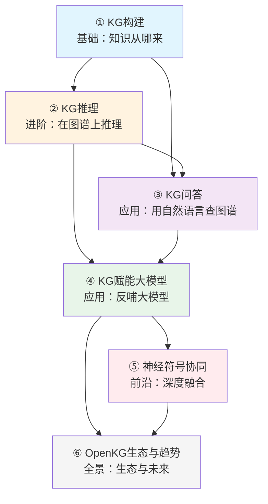
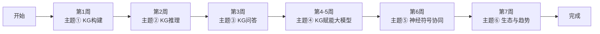

<!-- Post: 六个核心主题，先学哪个？ | ID: 2026-068 | Created: 2026-09-08 | Tags: tech, books | Format: markdown -->

## 开篇：调查员的"作战计划"

上一篇我们贴满了一整面"线索墙"——20+ 项工作、6 大板块、10+ 机构。但线索墙只是原材料，要真正理解这个领域，你需要一份"作战计划"：先调查哪个方向？后调查哪个方向？哪些是基础必须先懂？哪些是前沿可以后看？

这篇文章就是这份作战计划。我们把报告的六大板块提炼为六个核心主题，画出它们之间的依赖关系，给出最优学习顺序，并告诉你每个主题要解决什么问题、学什么、用什么 OSINT 工具去深入调查。

---

## 一、六个核心主题总览

| 主题 | 对应板块 | 核心问题 | 难度 | 重要性 |
|------|---------|---------|------|--------|
| ① KG 构建 | 大模型助力 KG 构建 | 怎么从文本中自动"长"出知识图谱？ | ★★☆ | ★★★★ |
| ② KG 推理 | 大模型增强 KG 推理 | 怎么让大模型在图谱上做逻辑推理？ | ★★★★ | ★★★★★ |
| ③ KG 问答 | 大模型驱动 KG 问答 | 怎么用自然语言查询知识图谱？ | ★★★ | ★★★★ |
| ④ KG 赋能大模型 | KG 赋能大模型 | 怎么用 KG 减少幻觉、增强智能体？ | ★★★ | ★★★★★ |
| ⑤ 神经符号协同 | 神经符号协同 | 神经网络和符号系统怎么深度融合？ | ★★★★★ | ★★★★★ |
| ⑥ OpenKG 生态与趋势 | OpenKG 生态与趋势 | 国内开源生态什么样？未来往哪走？ | ★★ | ★★★ |

---

## 二、主题依赖关系图

不是所有主题都能并行学——有些主题是另一些的基础。



**依赖关系解读**：

1. **① KG 构建是一切的基础**——没有知识图谱，推理、问答、赋能都无从谈起
2. **② KG 推理是核心技术**——推理能力决定了知识图谱的价值上限
3. **③ KG 问答和 ④ KG 赋能大模型是两大应用方向**——前者让人能查图谱，后者让图谱能增强 AI
4. **⑤ 神经符号协同是最前沿**——需要理解前面所有主题才能深入
5. **⑥ 生态与趋势是全景收尾**——了解了技术细节再看生态，才能看懂趋势

---

## 三、每个主题学什么

### 主题 ①：KG 构建——知识从哪来？

**要解决的问题**：现实世界的知识大多在非结构化文本里（新闻、论文、网页），怎么自动把它们变成结构化的知识图谱？

**核心内容**：
- 传统方法：基于规则、基于统计、基于深度学习的抽取
- 大模型方法：用 LLM 的语言理解能力做抽取
- KnowCoder：用代码结构对齐知识表示
- ADELIE：用大规模指令微调和偏好优化提升抽取效果

**OSINT 调查工具**：
```
# 找知识抽取相关论文
"information extraction" "large language model" site:arxiv.org after:2024-01-01

# 找开源抽取工具
"knowledge extraction" "LLM" site:github.com stars:>500

# 找抽取基准
"information extraction" benchmark dataset "knowledge graph"
```

**学完你能回答**：给你一篇论文，你能说出用什么方法把里面的知识抽成图谱。

---

### 主题 ②：KG 推理——在图谱上推理

**要解决的问题**：知识图谱永远不完整，怎么根据已有的知识推理出缺失的知识？

**核心内容**：
- 两种范式：LLM 作编码器（判别式）vs LLM 作生成器（生成式）
- KoPA：用结构嵌入增强 LLM 的事实推理
- KG-ICL：用上下文提示实现图谱级泛化（新实体/新关系/新图谱都能用）
- unKR：不确定性知识图谱推理（知识不总是 100% 确定的）

**OSINT 调查工具**：
```
# 找知识图谱补全论文
"knowledge graph completion" "large language model" site:arxiv.org

# 找推理基准
"knowledge graph" benchmark link prediction FB15k WN18

# unKR 仓库调查
site:github.com seucoin/unKR
```

**学完你能回答**：给你一个不完整的知识图谱，你能说出用什么方法补全缺失的三元组。

---

### 主题 ③：KG 问答——用自然语言查图谱

**要解决的问题**：普通用户不会写 SPARQL 查询语言，怎么用自然语言提问，让系统去知识图谱里找答案？

**核心内容**：
- 反直觉发现：LLM 对线性化三元组的理解优于自然语言文本
- UniHGKR：异构知识统一检索（文本+KG+表格+InfoBox）
- CoTKR：用思维链增强知识改写，提升复杂问答效果

**OSINT 调查工具**：
```
# 找 KGQA 论文
"knowledge graph question answering" "large language model" site:arxiv.org

# 找问答基准
"knowledge graph" QA dataset WebQuestions ComplexQuestions MetaQA

# 查 CoTKR 仓库
"CoTKR" "knowledge graph" site:github.com
```

**学完你能回答**：给你一个自然语言问题和一个知识图谱，你能设计出一套问答流程。

---

### 主题 ④：KG 赋能大模型——反哺与增强

**要解决的问题**：大模型爱"幻觉"，怎么用知识图谱让它更可靠、更聪明？

**核心内容**：
- 反幻觉：KGR（自主知识验证）、FACTCHD（幻觉检测基准）
- 智能体增强：Agents 框架、ToG-2.0（图谱+文档交替检索）
- 规划增强：LPKG（从图谱学规划）、WorkBench（工作流基准）
- 个性化：KGT（基于人机反馈的知识图谱调优）
- 科学发现：剑桥动态 KG 驱动跨洋自主实验室

**OSINT 调查工具**：
```
# 找反幻觉论文
"hallucination" "knowledge graph" "large language model" site:arxiv.org after:2024-01-01

# 找 RAG+KG 工作
"retrieval augmented generation" "knowledge graph" site:arxiv.org

# 查 KGR 论文
"knowledge graph-based retrofitting" "hallucination" AAAI 2024
```

**学完你能回答**：给你一个爱胡说的大模型，你能设计一套用知识图谱约束它的方案。

---

### 主题 ⑤：神经符号协同——深度融合

**要解决的问题**：神经网络（大模型）和符号系统（逻辑推理）各有优劣，怎么让它们真正融合而不是简单拼接？

**核心内容**：
- 四种范式：符号作架构 → 符号训练 LLM → LLM 转符号输入 → 神经符号迭代交互
- SymbolicAI：分治聚合，符号和神经分别作子求解器
- GraphSAGE：用图学习做任务规划（替代纯 prompt 设计）
- FunSearch：LLM + 自动化评估器，发现数学新构造（Nature 2024）
- AlphaGeometry：符号系统演绎 + LLM 构造辅助线，奥林匹克级几何证明（Nature 2024）

**OSINT 调查工具**：
```
# 找神经符号论文
"neuro-symbolic" "large language model" site:arxiv.org after:2024-01-01

# 查 FunSearch 原文
"FunSearch" "mathematical discoveries" site:nature.com

# 查 AlphaGeometry
"AlphaGeometry" "olympiad geometry" site:nature.com
```

**学完你能回答**：你能说清神经符号融合的四种范式，以及每种范式的代表工作和优缺点。

---

### 主题 ⑥：OpenKG 生态与趋势——全景与未来

**要解决的问题**：国内知识图谱开源生态什么样？未来技术往哪个方向走？

**核心内容**：
- 四大开源工作：AsdKB（医疗）、OneGraph（千万级双语图谱）、OpenRAG Base（RAG 知识库）、OneKE（知识抽取）
- 趋势一：从规模红利到表示红利（堆参数 → 提升知识表示质量）
- 趋势二：知识解耦（把知识从模型参数中分离出来，RAG 是体现）
- 趋势三：神经符号迭代演化

**OSINT 调查工具**：
```
# 查 OpenKG 官网
site:openkg.cn

# 查 OpenKG GitHub 组织
site:github.com openkg

# 找知识解耦相关讨论
"knowledge decoupling" "large language model" RAG site:arxiv.org
```

**学完你能回答**：你能说出国内知识图谱生态的主要玩家，以及未来 1-2 年的技术趋势。

---

## 四、最优学习顺序



**为什么这个顺序？**

1. **先学 ① 构建**——理解知识从哪来，是一切的基础
2. **再学 ② 推理**——有了图谱，下一步就是在上面推理，这是核心技术
3. **然后 ③ 问答**——推理能力的直接应用，让人能自然语言查询
4. **重点学 ④ 赋能**——这是当前最热门的应用方向（反幻觉、RAG、智能体），内容最多，给两周
5. **挑战 ⑤ 神经符号**——最前沿、最难，需要前面所有基础
6. **收尾 ⑥ 生态**——了解了技术再看生态和趋势，才有判断力

---

## 五、每个主题的 OSINT 深入调查清单

作为调查员，每个主题我都会做以下调查：

| 调查项 | 方法 | 目的 |
|--------|------|------|
| 论文原文 | arXiv / 会议官网 / Google Scholar | 验证报告中的描述是否准确 |
| 开源代码 | GitHub 搜索 + 仓库健康度检查 | 判断是否可复现、是否活跃 |
| 基准数据集 | 查找数据集主页和下载链接 | 评估实验是否可复现 |
| 第三方复现 | 搜索其他团队的复现结果 | 交叉验证论文结论 |
| 作者背景 | 搜索作者主页和过往工作 | 判断研究团队的可信度 |
| 争议与局限 | 搜索 critique / limitation / fail | 发现论文没说的问题 |

---

## 小结

- 六个核心主题有明确的依赖关系，不能乱序学
- 最优顺序：构建 → 推理 → 问答 → 赋能 → 神经符号 → 生态
- 每个主题都有对应的 OSINT 调查工具和深入清单
- 从下一篇开始，我们将逐个主题深度拆解

**下一篇预告**：主题①——知识图谱构建：大模型如何帮 KG"长出来"？我们将深入 KnowCoder 和 ADELIE 的技术细节，用 OSINT 方法验证它们的真实效果。

---

## 系列导航

| 序号 | 状态 | 标题 |
|------|------|------|
| 第1篇 | ✅ 已发布 | 大模型和知识图谱，谁在帮谁？ |
| 第2篇 | ✅ 已发布 | 一图看懂 2024 知识图谱全景 |
| 第3篇 | ✅ 本文 | 六个核心主题，先学哪个？ |
| 第4篇 | ⏳ 即将发布 | 知识图谱构建：大模型如何帮 KG"长出来" |
| 第5篇 | ⏳ 即将发布 | 知识图谱推理：从静态补全到动态泛化 |
| 第6篇 | ⏳ 即将发布 | 知识图谱问答：让大模型"读懂"图谱 |
| 第7篇 | ⏳ 即将发布 | 知识图谱反哺大模型：幻觉、智能体与科学发现 |
| 第8篇 | ⏳ 即将发布 | 神经符号协同：当逻辑遇见概率 |
| 第9篇 | ⏳ 即将发布 | OpenKG 生态与未来：从规模红利到表示红利 |
| 第10篇 | ⏳ 即将发布 | 知识图谱在 AI 技术栈中的位置 |
| 第11篇 | ⏳ 即将发布 | 读完这份报告之后：质疑、局限与行动指南 |
