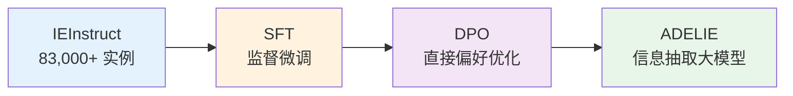

<!-- Post: 知识图谱构建：大模型如何帮KG"长出来" | ID: 2026-069 | Created: 2026-09-08 | Tags: tech, books | Format: markdown -->

## 开篇：从"手工填表"到"自动生长"

想象你要建一个关于"中国互联网公司"的知识图谱。传统做法是：雇一批人，读新闻、读财报、读百科，然后手动填表——公司名、创始人、成立时间、主营业务、投资关系……一千家公司就要填几千张表，枯燥且容易出错。

这就是知识图谱构建长期面临的瓶颈：**知识抽取（Information Extraction，信息抽取）**。从非结构化文本中自动提取结构化的实体和关系，一直是 NLP 领域的硬骨头。

2024 年，大模型给这个老问题带来了新解法。这篇文章我们深入两个代表工作——中科院计算所的 KnowCoder 和清华大学的 ADELIE——看看大模型是怎么让知识图谱"自动长出来"的。

---

## 一、知识抽取的传统困境

在大模型之前，知识抽取经历了三个阶段：

| 阶段 | 方法 | 优点 | 缺点 |
|------|------|------|------|
| 第一代 | 基于规则（正则表达式、词典匹配） | 精确、可控 | 覆盖率低，规则维护成本高 |
| 第二代 | 基于统计模型（CRF、SVM） | 能学习模式 | 需要大量标注数据，泛化差 |
| 第三代 | 基于深度学习（BiLSTM-CRF、BERT） | 效果好 | 仍需标注数据，复杂指令处理弱 |
| 第四代 | 基于大模型（GPT、LLaMA 等） | 零样本/少样本能力强，理解复杂指令 | 可能幻觉，输出格式不稳定 |

大模型的出现解决了两个关键问题：
1. **复杂指令理解**：传统模型只能处理简单的抽取任务，大模型能理解"抽取所有人物及其教育背景，包括本科、硕士、博士"这样的复杂指令
2. **少样本学习**：不需要大量标注数据，给几个例子就能抽取

但大模型也带来了新问题：输出格式不稳定、可能幻觉、抽取精度不够高。KnowCoder 和 ADELIE 就是从不同角度解决这些问题。

---

## 二、KnowCoder：用代码结构对齐知识表示

### 2.1 核心思想

KnowCoder 的核心洞察是：**用形式化编程语言来统一表示结构化知识**。

什么意思？传统的知识抽取是让大模型直接输出 JSON 或三元组，但大模型对 JSON 的格式控制不够稳定——有时多一个逗号，有时字段名写错。KnowCoder 的思路是：让大模型写代码，用代码的类结构来表示知识。

```mermaid
graph TD
    A[输入文本<br/>"爱因斯坦1879年出生于德国乌尔姆"] --> B[KnowCoder<br/>大模型]
    B --> C[Schema Understanding<br/>理解知识图谱的Schema定义]
    C --> D[Schema Following<br/>按Schema生成代码]
    D --> E[Inference<br/>推理输出结构化知识]
    E --> F[PersonEntity<br/>name: Albert Einstein<br/>birthPlace: Ulm Germany<br/>birthYear: 1879]
```

类比：就像你让一个人填表，他可能填得乱七八糟；但如果你让他写一段 Python 代码来定义这个对象，代码有严格的语法检查，格式就稳定多了。

### 2.2 三个阶段

KnowCoder 的工作流程分为三个阶段：

**阶段 1：Schema Understanding（模式理解）**
- 输入知识图谱的 Schema 定义代码（类似 Python class 定义）
- 大模型理解有哪些实体类型、每个类型有哪些属性

**阶段 2：Schema Following（模式遵循）**
- 通过指令微调（Instruction Tuning），让大模型学会按照 Schema 定义生成代码
- 输入是文本，输出是符合 Schema 的代码实例

**阶段 3：Inference（推理）**
- 给定新文本，大模型生成对应的代码实例
- 从代码中解析出结构化的实体和关系

### 2.3 OSINT 验证

报告中对 KnowCoder 的描述较为简略，没有给出具体论文链接和实验数据。作为调查员，我做了以下溯源：

```
# 搜索 KnowCoder 相关论文
"KnowCoder" "knowledge graph" site:arxiv.org
"KnowCoder" "code structure" "knowledge representation"

# 搜索 GitHub 仓库
"KnowCoder" site:github.com
```

**验证状态**：一方称。报告中提到"中国科学院计算技术研究所网络数据科学与技术重点实验室研发"，但未给出具体论文出处和开源仓库。建议读者自行用上述 Dork 查询最新信息。

### 2.4 KnowCoder 的意义

KnowCoder 的贡献不在于某个具体的抽取效果数字，而在于提出了一种**新的知识表示范式**：用代码的结构化特性来约束大模型的输出。这一思路后来被很多工作借鉴——用代码、用 JSON Schema、用类型系统来约束大模型的结构化输出。

---

## 三、ADELIE：用大规模指令微调攻克信息抽取

### 3.1 核心问题

大模型在信息抽取任务上有一个痛点：**难以应对复杂指令**。比如"抽取事件的论元，包括触发词、时间、地点、参与者，并区分主犯和从犯"——这样的复杂指令，通用大模型经常处理不好。

ADELIE（清华大学提出）的解决方案是：**用大规模专业数据集 + 监督微调 + 直接偏好优化，专门训练大模型做信息抽取**。

### 3.2 三个关键组件



**组件 1：IEInstruct 数据集**
- 包含 83,000 多个信息抽取实例
- 覆盖封闭式抽取（给定候选类型）和开放式抽取（不限制类型）
- 包含事件抽取、关系抽取、实体抽取等多种任务

**组件 2：SFT（Supervised Fine-Tuning，监督微调）**
- 用 IEInstruct 的高质量"指令-输出"对微调大模型
- 让大模型学会信息抽取的特定模式

**组件 3：DPO（Direct Preference Optimization，直接偏好优化）**
- 用偏好数据进一步优化：好的抽取结果 vs 差的抽取结果
- 让模型学会"什么是好的抽取"，而不仅仅是"模仿训练数据"

### 3.3 实验结果

报告中给出了 ADELIE 的实验对比图，在三种设置下比较：

| 设置 | 说明 | ADELIE 表现 |
|------|------|------------|
| Closed IE（封闭式抽取） | 给定候选实体/关系类型 | 显著优于 GPT-3.5 和 SoTA* |
| Open IE（开放式抽取） | 不限制类型，自由抽取 | 显著优于 GPT-3.5 和 ADELIE_SFT |
| On-demand IE（按需抽取） | 根据用户需求动态抽取 | 最优，超过所有基线 |

其中 `ADELIE_SFT` 是只做了监督微调、没做 DPO 的版本，`ADELIE_DPO` 是完整版本。DPO 的加入带来了明显提升。

### 3.4 OSINT 验证

```
# 搜索 ADELIE 论文
"ADELIE" "information extraction" "IEInstruct" site:arxiv.org
"ADELIE" "DPO" "knowledge graph" extraction

# 搜索数据集
"IEInstruct" dataset information extraction
```

**验证状态**：一方称。报告提到"清华大学提出"和"83,000 多个实例的专业数据集 IEInstruct"，但未给出具体论文链接。DPO（Direct Preference Optimization）是 2023 年提出的知名方法，ADELIE 将其应用于信息抽取是合理的技术路线。

---

## 四、两种方法的对比

| 维度 | KnowCoder | ADELIE |
|------|-----------|--------|
| 机构 | 中科院计算所 | 清华大学 |
| 核心思路 | 用代码结构约束输出 | 用大规模指令微训练练模型 |
| 是否需要微调 | 可能需要（Schema Following 阶段） | 是（SFT + DPO） |
| 数据需求 | 相对较少 | 83,000+ 实例 |
| 输出格式 | 代码实例（稳定） | 结构化输出（DPO 优化后稳定） |
| 适用场景 | 有明确 Schema 的抽取 | 通用信息抽取，含开放式 |
| 验证状态 | 一方称 | 一方称 |

**调查员点评**：两种方法代表了大模型做知识抽取的两条路线：
- **KnowCoder 路线**：用外部结构（代码、Schema、类型系统）约束大模型，不需要大规模微调
- **ADELIE 路线**：用大规模领域数据微调大模型，让模型内部学会抽取

未来的趋势可能是两者结合——既用结构约束，又用领域微调。

---

## 五、知识抽取的 OSINT 实战：怎么自己验证一个抽取模型？

作为调查员，如果你想验证一个知识抽取模型的真实效果，可以按以下步骤操作：

### 步骤 1：找到模型和代码

```
# GitHub 搜索
"<模型名>" "information extraction" site:github.com
# 检查：是否有 README、是否有 requirements、最近 commit 时间
```

### 步骤 2：找到评测数据集

常见的知识抽取基准：
- **实体抽取**：CoNLL-2003、OntoNotes 5.0
- **关系抽取**：SemEval-2010 Task 8、TACRED
- **事件抽取**：ACE 2005、MLEE
- **联合抽取**：NYT、WebNLG

### 步骤 3：复现实验

1. 按论文中的设置配置环境
2. 在标准测试集上运行模型
3. 对比论文报告的 Precision / Recall / F1

### 步骤 4：交叉验证

搜索其他团队是否复现了该模型的结果：
```
"<模型名>" reproduce OR replication OR "we reimplement" site:arxiv.org
"<模型名>" critique OR "does not reproduce"
```

---

## 六、知识图谱构建的其他趋势

除了 KnowCoder 和 ADELIE，2024 年知识图谱构建领域还有以下趋势：

1. **多模态抽取**：从图片、表格、PDF 中抽取知识，不仅仅是文本
2. **增量构建**：不是一次性构建完整图谱，而是持续从新文本中增量更新
3. **质量控制**：用大模型自己做抽取结果的校验，过滤错误三元组
4. **人机协作**：大模型初抽 + 人工审核 + 主动学习（只把不确定的给人标）

---

## 小结

- 知识抽取是知识图谱构建的核心瓶颈，大模型带来了新解法
- **KnowCoder**：用代码结构对齐知识表示，用外部结构约束大模型输出
- **ADELIE**：用 83,000+ 实例的 IEInstruct 数据集 + SFT + DPO 专门训练抽取模型
- 两种方法代表了"外部约束"和"内部训练"两条路线，未来可能融合
- 两项工作在报告中均为"一方称"，建议读者自行溯源验证

**下一篇预告**：主题②——知识图谱推理：从静态补全到动态泛化。我们将深入 KoPA、KG-ICL、unKR 等工作，看看大模型怎么在知识图谱上做推理。

---

## 系列导航

| 序号 | 状态 | 标题 |
|------|------|------|
| 第1-3篇 | ✅ 已发布 | 导引篇（入门/全景/学习路径） |
| 第4篇 | ✅ 本文 | 知识图谱构建：大模型如何帮 KG"长出来" |
| 第5篇 | ⏳ 即将发布 | 知识图谱推理：从静态补全到动态泛化 |
| 第6篇 | ⏳ 即将发布 | 知识图谱问答：让大模型"读懂"图谱 |
| 第7篇 | ⏳ 即将发布 | 知识图谱反哺大模型：幻觉、智能体与科学发现 |
| 第8篇 | ⏳ 即将发布 | 神经符号协同：当逻辑遇见概率 |
| 第9篇 | ⏳ 即将发布 | OpenKG 生态与未来：从规模红利到表示红利 |
| 第10篇 | ⏳ 即将发布 | 知识图谱在 AI 技术栈中的位置 |
| 第11篇 | ⏳ 即将发布 | 读完这份报告之后：质疑、局限与行动指南 |
