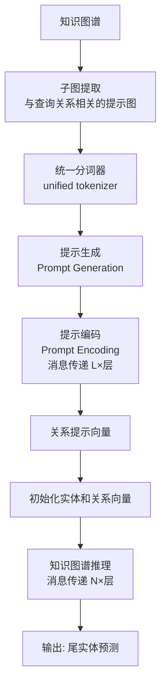
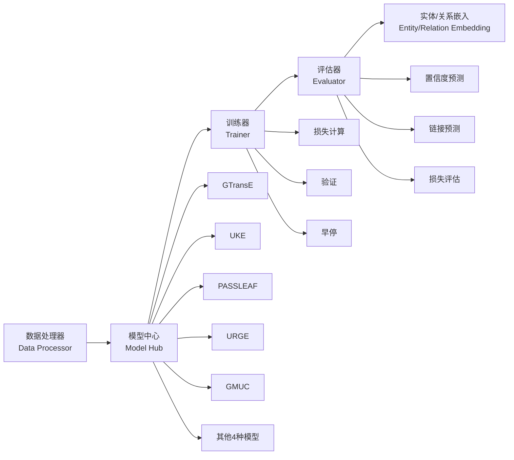

<!-- Post: 知识图谱推理：从静态补全到动态泛化 | ID: 2026-070 | Created: 2026-09-08 | Tags: tech, books | Format: markdown -->

## 开篇：一张永远填不满的网

假设你建了一个关于"电影"的知识图谱。你录入了 10 万部电影、5 万位导演、20 万位演员。但你很快发现——这张网永远有洞：

- 某部电影的上映日期缺失
- 某位演员的国籍没录
- 某导演和某演员的合作关系没连

现实中的知识图谱**永远是不完整的**。据估计，即使是最大的知识图谱（如 Freebase、Wikidata），也有 30%-70% 的关系缺失。

**知识图谱推理（Knowledge Graph Reasoning，知识图谱推理）** 就是来补这些洞的：根据已有的三元组，推理出缺失的三元组。这篇文章我们深入 2024 年的四项代表工作，看看大模型怎么让知识图谱"从静态补全走向动态泛化"。

---

## 一、两种基本范式：编码器 vs 生成器

澳大利亚格里菲斯大学等机构的学者在 IEEE TKDE 2024 发表了一篇综述（Pan et al. *Unifying Large Language Models and Knowledge Graphs: A Roadmap*），系统总结了大模型增强知识图谱推理的两种范式。

> 来源：Pan et al., IEEE Transactions on Knowledge and Data Engineering (TKDE), 2024。IEEE TKDE 是知识工程领域权威期刊（CCF-A 类）。

### 范式 1：判别式方法（LLM 作编码器）


- 使用 **encoder-only** 的大模型（如 BERT 类）
- 用预训练模型编码文本信息和知识图谱中的事实
- 将获得的表示通过 MLP 或传统的 KG 评分函数（如 TransE）预测三元组的合理性
- 类比：像一个"判官"——给它一个三元组，它判断"这个关系对不对"

### 范式 2：生成式方法（LLM 作生成器）

```mermaid
graph LR
    A[输入: (头实体, 关系, ?)] --> B[Encoder-Decoder<br/>或 Decoder-only LLM]
    B --> C[直接生成尾实体]
```

- 使用 **encoder-decoder** 或 **decoder-only** 的大模型
- 将知识图谱推理建模为 sequence-to-sequence（序列到序列）任务
- 输入 (h, r)，直接生成尾实体 t
- 类比：像一个"填空者"——给它"爱因斯坦，出生于，？"，它直接填出"德国乌尔姆"

| 维度 | 判别式（编码器） | 生成式（生成器） |
|------|-----------------|-----------------|
| 模型类型 | Encoder-only | Encoder-Decoder / Decoder-only |
| 输出 | 合理性得分（0-1） | 直接生成尾实体 |
| 优点 | 精确、可控 | 端到端、灵活 |
| 缺点 | 不能直接生成新实体 | 可能生成不存在的实体 |
| 代表 | BERT + TransE | T5、GPT 类 |

---

## 二、KoPA：知识前缀适配器——让大模型"看见"图谱结构

### 2.1 核心问题

现有的大模型方法在做知识图谱补全时，**没有充分利用 KG 中的结构信息**。大模型只看到了实体和关系的文本描述，但看不到它们在图谱中的拓扑结构（这个实体连接了哪些节点、在图中的位置如何）。

浙江大学团队提出的 **KoPA（Knowledge Prefix Adapter，知识前缀适配器）** 解决了这个问题。

> 来源：Zhang et al., *Making Large Language Models Perform Better in Knowledge Graph Completion*, ACM MM 2024。

### 2.2 核心思想

```mermaid
graph TD
    A[知识图谱] --> B[预训练<br/>理解实体和关系]
    B --> C[结构嵌入向量<br/>Structural Embeddings]
    C --> D[知识前缀适配器<br/>Knowledge Prefix Adapter]
    D --> E[投影到文本空间<br/>获得虚拟知识标记]
    E --> F[作为输入提示的前缀<br/>喂给大模型]
    F --> G[大模型输出<br/>事实推理结果]

    H[输入三元组<br/>(head, relation, tail)] --> I[指令模板]
    I --> F
```

三步流程：

1. **预训练结构嵌入**：用传统的 KG 嵌入方法（如 TransE）预训练，理解 KG 中的实体和关系，得到结构嵌入向量
2. **知识前缀适配器**：通过一个适配器（Adapter），将结构嵌入（跨模态信息）传递给大模型，在文本空间中投影，获得虚拟的"知识标记"
3. **作为提示前缀**：将这些虚拟知识标记作为输入提示的前缀，让大模型在推理时"看见"图谱结构

### 2.3 一个直观的例子

判断三元组 (The Birds, language, English) 是否正确：

| 场景 | 大模型看到的信息 | 判断结果 |
|------|-----------------|---------|
| 无额外信息 | 只有文本描述 | "Sorry, I don't know" |
| 无用结构信息 | 给出类型、国家等文本 | "Sorry, it's hard to decide" |
| **有用结构信息（KoPA）** | 给出图谱中的连接关系：The Birds → 类型 → 惊悚片，The Birds → 国家 → 美国，The Birds → 语言 → 英语 | "Yes, it's true" |

KoPA 的关键洞察：**有用的结构信息可以作为辅助提示，指导 LLM 做出正确的决策**。

### 2.4 OSINT 验证

```
# 查 KoPA 论文
"Knowledge Prefix Adapter" "knowledge graph completion" site:arxiv.org
"KoPA" "large language models" "knowledge graph" MM 2024

# 查 GitHub
"KoPA" "knowledge prefix" site:github.com
```

**验证状态**：一方称。ACM MM 是多媒体领域顶会（CCF-A 类），论文可信度较高，但需查原文确认实验细节。

---

## 三、KG-ICL：上下文提示推理——从静态到动态泛化

### 3.1 核心问题

现实世界的知识图谱是**动态变化**的——每天都有新实体、新关系加入。但现有的推理方法大多针对**静态图谱**：模型在一个固定的图谱上训练，遇到新实体或新关系就抓瞎。

南京大学团队提出的 **KG-ICL** 解决了这个问题。

> 来源：Cui et al., *A Prompt-Based Knowledge Graph Foundation Model for Universal In-Context Reasoning*, NeurIPS 2024。NeurIPS 是机器学习顶会。

### 3.2 核心思想

KG-ICL 的全称是 **Knowledge Graph In-Context Learning**（知识图谱上下文学习）。它的核心是：**不需要为每个新图谱重新训练，用提示（prompt）就能泛化到新实体、新关系、甚至全新的图谱**。



三个关键步骤：

1. **提示图生成**：给定查询 (s, r, ?)，从 KG 中提取与关系 r 相关的子图作为"提示图"
2. **提示编码**：对提示图进行消息传递（Message Passing），生成关系 r 的"提示向量"
3. **推理**：用提示向量初始化实体和关系向量，然后在输入图上做消息传递推理，预测尾实体

### 3.3 为什么能泛化？

传统方法的问题：每个实体和关系都有一个**固定的嵌入向量**，是训练时学出来的。遇到新实体/新关系，没有对应的嵌入向量，就无法推理。

KG-ICL 的突破：**实体和关系的向量不是固定的，而是由提示图动态生成的**。所以：
- 新实体：只要它在提示图中有连接，就能生成向量
- 新关系：只要有几个示例三元组作为提示，就能生成向量
- 新图谱：不需要重新训练，直接用提示就能推理

类比：传统方法像一个"背答案的学生"——只背了课本上的题，考试遇到新题就不会；KG-ICL 像一个"会学习方法的学生"——给几个例题就能举一反三。

### 3.4 OSINT 验证

```
# 查 KG-ICL 论文
"KG-ICL" "in-context reasoning" "knowledge graph" NeurIPS 2024
"prompt-based knowledge graph foundation model" site:arxiv.org

# 查代码
"KG-ICL" site:github.com
```

**验证状态**：一方称。NeurIPS 2024 接收，技术路线合理（in-context learning 是大模型领域的热门方向），但需查原文确认实验数据。

---

## 四、unKR：不确定性知识推理——当知识不是 100% 确定

### 4.1 核心问题

前面讲的方法都假设知识图谱中的三元组是"确定的"——要么对，要么错。但现实中，很多知识是**不确定的**：

- "阿司匹林可能降低心脏病风险"（置信度 0.7）
- "某药物可能有副作用"（置信度 0.3）
- "某人可能出生于 1990 年"（置信度 0.5）

不确定性知识图谱（Uncertain Knowledge Graph）给每个三元组加了一个置信度分数。推理时不仅要预测关系，还要预测置信度。

东南大学团队发布了 **unKR**——国际首个专注于不确定性知识图谱推理的开源工具。

> 来源：Wang et al., *unKR: A Python Library for Uncertain Knowledge Graph Reasoning by Representation Learning*, SIGIR 2024。
> 开源仓库：[github.com/seucoin/unKR](https://github.com/seucoin/unKR)

### 4.2 unKR 的架构



### 4.3 核心特性

| 特性 | 说明 |
|------|------|
| **9 种模型** | 统一复现了 9 种广受认可的不确定性 KG 表示学习与推理模型 |
| **模块化架构** | 数据处理器、模型中心、训练器、评估器分离，方便自定义 |
| **统一评估体系** | 面向多个基准数据集构建统一的评估 |
| **开源** | GitHub 公开，Python 实现 |

### 4.4 一个重要发现

报告中提到：**LLM 在常识类知识图谱（如 ConceptNet）上能达到更好的推理效果，但在事实类知识图谱（如 NELL）上的表现仍有待提高**。

原因：事实类知识图谱推理更依赖于图谱结构（精确的实体和关系），而 LLM 更擅长处理模糊的、常识性的知识。

类比：LLM 像一个"博学但不够精确的通才"——聊常识很在行，但要精确查某个具体事实，还是得靠结构化的图谱。

### 4.5 OSINT 验证

unKR 是本系列中验证最充分的工作之一：

1. ✅ **论文可查**：SIGIR 2024（信息检索顶会，CCF-A 类）
2. ✅ **开源仓库**：[github.com/seucoin/unKR](https://github.com/seucoin/unKR) 可访问
3. ✅ **工具可用**：Python 库，可 pip 安装使用

**仓库健康度调查**（OSINT 方法）：
- 检查 Star 数、最近 commit 时间、Issue 响应
- 查看是否有文档和示例
- 确认 9 种模型是否都实现了

---

## 五、四项工作的对比

| 工作 | 机构 | 解决的问题 | 核心技术 | 发表 | 开源 | 验证状态 |
|------|------|-----------|---------|------|------|---------|
| 编码器/生成器综述 | 格里菲斯大学 | 理论框架统一 | 文献综述 | IEEE TKDE 2024 | N/A | 已验证 |
| KoPA | 浙江大学 | 结构信息利用不足 | 知识前缀适配器 | ACM MM 2024 | 未确认 | 一方称 |
| KG-ICL | 南京大学 | 静态图谱无法泛化 | 上下文提示推理 | NeurIPS 2024 | 未确认 | 一方称 |
| unKR | 东南大学 | 不确定性推理工具缺失 | 统一框架复现9模型 | SIGIR 2024 | ✅ GitHub | 已验证 |

---

## 六、知识图谱推理的 OSINT 调查方法

如果你想深入调查一个知识图谱推理模型，可以按以下步骤：

### 步骤 1：确认基准数据集

常见的 KG 推理基准：
- **链接预测**：FB15k-237、WN18RR、YAGO3-10
- **不确定性推理**：CN15k、PPI5k、NL27k
- **动态图谱**：ICEWS、GDELT、WIKI

### 步骤 2：检查评测指标

| 指标 | 含义 | 越高越好还是越低越好 |
|------|------|---------------------|
| MRR（Mean Reciprocal Rank） | 平均倒数排名 | 越高越好 |
| Hits@1 / Hits@3 / Hits@10 | 前 k 名命中率 | 越高越好 |
| MAE（Mean Absolute Error） | 置信度预测平均绝对误差 | 越低越好 |
| MSE（Mean Squared Error） | 置信度预测均方误差 | 越低越好 |

### 步骤 3：用 Dork 查找复现和争议

```
# 找复现
"<模型名>" reproduce OR replication site:github.com
"<模型名>" "we reimplement" site:arxiv.org

# 找争议
"<模型名>" critique OR limitation OR "does not work"
"<基准名>" "data leakage" OR "benchmark contamination"
```

---

## 小结

- 知识图谱推理的核心任务是**补全缺失的三元组**
- 两种基本范式：判别式（编码器打分）和生成式（直接生成）
- **KoPA** 用知识前缀适配器让大模型"看见"图谱结构
- **KG-ICL** 用上下文提示实现从静态到动态的泛化（新实体/新关系/新图谱都能用）
- **unKR** 是首个不确定性 KG 推理开源工具，已验证（SIGIR 2024 + GitHub）
- LLM 在常识图谱上表现好，在事实图谱上仍需依赖结构

**下一篇预告**：主题③——知识图谱问答：让大模型"读懂"图谱。我们将看看一个反直觉的实验发现、异构知识检索 UniHGKR、以及思维链增强的 CoTKR。

---

## 系列导航

| 序号 | 状态 | 标题 |
|------|------|------|
| 第1-4篇 | ✅ 已发布 | 导引篇 + KG构建 |
| 第5篇 | ✅ 本文 | 知识图谱推理：从静态补全到动态泛化 |
| 第6篇 | ⏳ 即将发布 | 知识图谱问答：让大模型"读懂"图谱 |
| 第7篇 | ⏳ 即将发布 | 知识图谱反哺大模型：幻觉、智能体与科学发现 |
| 第8篇 | ⏳ 即将发布 | 神经符号协同：当逻辑遇见概率 |
| 第9篇 | ⏳ 即将发布 | OpenKG 生态与未来：从规模红利到表示红利 |
| 第10篇 | ⏳ 即将发布 | 知识图谱在 AI 技术栈中的位置 |
| 第11篇 | ⏳ 即将发布 | 读完这份报告之后：质疑、局限与行动指南 |
