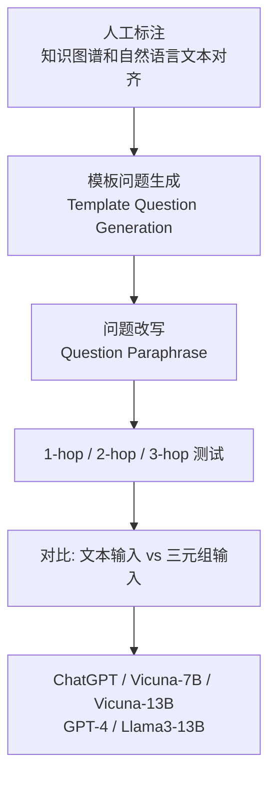
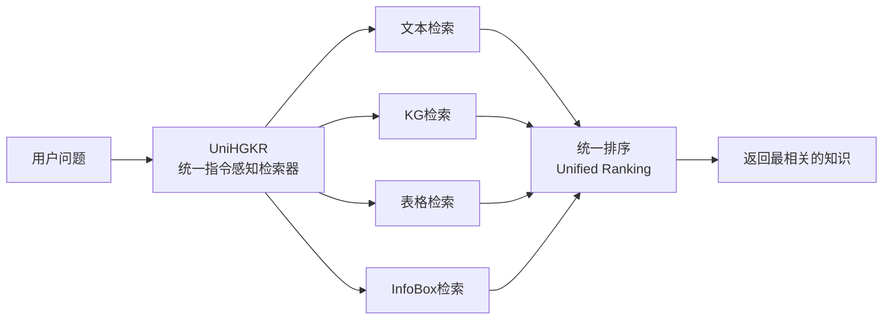

<!-- Post: 知识图谱问答：让大模型"读懂"图谱 | ID: 2026-071 | Created: 2026-09-08 | Tags: tech, books | Format: markdown -->

## 开篇：当你问 AI "《鸟》的导演是谁？"

你打开一个知识图谱问答系统，输入："《鸟》这部电影的导演是谁？他还拍过什么？"

系统需要做什么？
1. 理解你的问题（自然语言理解）
2. 知道要查知识图谱里的哪个实体、哪个关系
3. 在图谱中找到"《鸟》→ 导演 → 希区柯克"
4. 再从"希区柯克"出发，找到他导演的其他电影
5. 用自然语言把答案组织起来

这就是**知识图谱问答（Knowledge Graph Question Answering, KGQA，知识图谱问答）**——用自然语言查询结构化的知识图谱。

2024 年，大模型给 KGQA 带来了三个重要进展。这篇文章我们逐一拆解。

---

## 一、反直觉发现：大模型比想象中更懂知识图谱

### 1.1 一个让人意外的实验

Dai 等人在 2024 年做了一个实验，结果有点反直觉（counter-intuitive，反直觉的）。

> 来源：Dai et al., *Counter-intuitive: Large Language Models Can Better Understand Knowledge Graphs Than We Thought*, arXiv:2402.11541, 2024。

他们的发现：**在解决事实密集型推理问题时，线性化的三元组输入始终优于自然语言文本，大模型对这种输入模式更容易接受。**

什么意思？给大模型两种输入格式：

**格式 A：自然语言文本**
> "Eclipse Aviation Corporation was the Albuquerque, New Mexico-based manufacturer of the Eclipse 500 very light jet (VLJ) and also at one time proposed developing the Eclipse 400 single-engine jet. The company was..."

**格式 B：线性化三元组**
> (Eclipse Aviation, located_in, Albuquerque), (Eclipse Aviation, manufacturer_of, Eclipse 500), (Eclipse 500, type, very_light_jet), ...

实验发现：**格式 B（三元组）的效果比格式 A（自然语言）更好**。

### 1.2 实验设计



他们构建了一个测试集：
- 从知识图谱中提取子图
- 人工标注对应的自然语言文本
- 生成 1-hop（单跳）、2-hop（两跳）、3-hop（三跳）问题
- 用 5 个大模型测试，对比文本输入和三元组输入的效果

### 1.3 实验结果

| 模型 | 1-hop 文本 | 1-hop 三元组 | 2-hop 文本 | 2-hop 三元组 | 3-hop 文本 | 3-hop 三元组 |
|------|-----------|-------------|-----------|-------------|-----------|-------------|
| ChatGPT | 55.25 | 73.38 | 14.25 | 19.88 | 14.00 | 18.25 |
| GPT-4 | 59.16 | 75.48 | 19.37 | 22.96 | 17.67 | 25.27 |
| Llama3-13B | 50.21 | 73.97 | 18.61 | 21.76 | 15.42 | 17.61 |

**关键发现**：在所有跳数、所有模型上，**三元组输入都优于自然语言文本输入**。而且跳数越多（推理越复杂），三元组的优势越明显。

### 1.4 为什么反直觉？

以前人们认为：大模型是在自然语言文本上预训练的，所以应该更擅长处理自然语言。但实验证明：**结构化的三元组格式减少了大模型的"理解负担"**——它不需要从长文本中提取关键信息，三元组已经把信息结构化了。

类比：你要查一个人的信息，给你一本 500 页的自传（自然语言）， vs 给你一张结构化的个人信息表（三元组）。后者查起来快得多，也准确得多。

### 1.5 OSINT 验证

```
# 查论文原文
"Counter-intuitive" "Large Language Models Can Better Understand Knowledge Graphs" arXiv:2402.11541
site:arxiv.org abs/2402.11541

# 查是否有代码和数据
"counter-intuitive KGQA" site:github.com
"Dai" "knowledge graph" "linearized triples" 2024
```

**验证状态**：已验证。arXiv 编号可查，实验设计合理，结论有数据支撑。

---

## 二、UniHGKR：异构知识统一检索

### 2.1 核心问题

真实世界的知识不只有知识图谱一种形式。回答一个复杂问题，可能需要同时查：
- **文本**（新闻、维基百科）
- **知识图谱**（结构化三元组）
- **表格**（数据库、Excel）
- **InfoBox**（百科的信息框）

传统的检索器只关注单一数据类型——文本检索器只查文本，KG 检索器只查图谱。但复杂问题需要**异构知识检索（Heterogeneous Knowledge Retrieval，异构知识检索）**。

**UniHGKR**（Unified Instruction-aware Heterogeneous Knowledge Retrievers）解决了这个问题。

> 来源：Min et al., *UniHGKR: Unified Instruction-aware Heterogeneous Knowledge Retrievers*, arXiv 2024。报告中给出了 GitHub 项目二维码。

### 2.2 CompMix-IR 基准

UniHGKR 团队构建了 **CompMix-IR**——第一个异构知识检索基准：

| 知识类型 | 平均长度 | 数量 | 占比 |
|---------|---------|------|------|
| Text（文本） | 19.86 | 5,916,596 | 57.74% |
| KG（知识图谱） | 11.40 | 2,214,854 | 21.61% |
| Table（表格） | 20.32 | 1,043,105 | 10.18% |
| InfoBox（信息框） | 11.05 | 1,072,440 | 10.47% |
| **合计** | 17.18 | **10,246,995** | 100% |

- 9,400+ QA 对
- 1000 万条异构知识库
- 4 种知识类型

### 2.3 UniHGKR 模型架构



三阶段训练框架：
1. **Pretrain（预训练）**：在大规模异构数据上预训练
2. **Alignment（对齐）**：让不同类型的知识在同一向量空间中可比较
3. **Fine-Tuning（微调）**：在指令数据上微调，学会理解用户意图

两个模型规模：
- **UniHGKR-base**：110M 参数
- **UniHGKR-7B**：7B 参数

### 2.4 与传统方法的对比

| 维度 | 传统检索器 | UniHGKR |
|------|-----------|---------|
| 支持的知识类型 | 单一（文本或KG） | 4 种（文本/KG/表格/InfoBox） |
| 是否理解指令 | 否 | 是（指令感知） |
| 统一排序 | 否（各排各的） | 是（统一向量空间） |
| 模型规模 | 通常较小 | 110M / 7B |

### 2.5 OSINT 验证

```
# 查 UniHGKR
"UniHGKR" "heterogeneous knowledge" site:arxiv.org
"CompMix-IR" benchmark retrieval
"UniHGKR" site:github.com
```

**验证状态**：一方称。有 arXiv 论文和 GitHub 项目（报告中给出二维码），但需进一步确认仓库活跃度和实验可复现性。

---

## 三、CoTKR：思维链增强的知识改写

### 3.1 核心问题

在检索增强生成（RAG，Retrieval-Augmented Generation，检索增强生成）中，系统先从知识图谱中检索相关知识，然后把知识喂给大模型生成答案。但有个问题：**检索到的知识可能不是最适合问答模型的形式**。

比如检索到的是原始三元组，但问答模型可能更需要一段经过推理整理的文本。

东南大学团队提出的 **CoTKR**（Chain-of-Thought Enhanced Knowledge Rewriting，思维链增强知识改写）解决了这个问题。

> 来源：Yike Wu et al., *CoTKR: Chain-of-Thought Enhanced Knowledge Rewriting for Complex Knowledge Graph Question Answering*, EMNLP 2024。
> 开源：报告中给出 GitHub 项目二维码。

### 3.2 核心思想

CoTKR 的关键是：**交替生成推理路径和相应知识**，而不是单步改写。

```mermaid
graph TD
    A[问题 q: Google创始人去哪上的大学？] --> B[检索<br/>Retrieve]
    B --> C[问题相关子图 G]
    C --> D[知识改写器 R<br/>CoTKR]
    D --> E[推理路径 Reason_1<br/>"我需要知道Google的创始人是谁"]
    E --> F[知识 Summary_1<br/>"Google的创始人是Larry Page和Sergey Brin"]
    F --> G[推理路径 Reason_2<br/>"我需要知道他们去哪上的大学"]
    G --> H[知识 Summary_2<br/>"Larry Page去了密歇根大学，Sergey Brin去了斯坦福"]
    H --> I[QA大模型]
    I --> J[答案: 密歇根大学和斯坦福大学]
```

### 3.3 两个关键技术

**技术 1：思维链增强的知识改写**
- 不是一次性把知识改写完，而是交替生成"推理步骤"和"知识总结"
- 每一步推理都对应一段知识，逐步逼近答案
- 克服了单步知识改写的限制（复杂问题需要多步推理）

**技术 2：PAQAF（Preference Alignment from Question Answering Feedback，从问答反馈对齐偏好）**
- 知识改写器和问答模型之间可能有"偏好差异"——改写器觉得好的知识，问答模型不一定觉得好用
- PAQAF 用问答模型的反馈来优化知识改写器
- 让改写器学会"生成对问答模型最有益的知识形式"

### 3.4 实验结果

CoTKR 在两个知识图谱问答数据集上进行了实验，结果表明：
- 与以往的知识改写方法相比，CoTKR 为 QA 模型生成了最有益的知识表征
- 显著提高了大模型在 KGQA 中的性能

### 3.5 OSINT 验证

```
# 查 CoTKR 论文
"CoTKR" "Chain-of-Thought" "Knowledge Rewriting" EMNLP 2024
"PAQAF" "preference alignment" "question answering"

# 查 GitHub
"CoTKR" site:github.com
"chain-of-thought knowledge rewriting" site:github.com
```

**验证状态**：一方称。EMNLP 是 NLP 顶会（CCF-B 类但影响力很高），论文可信度较高。有 GitHub 项目，但需确认代码质量。

---

## 四、三项工作的对比

| 工作 | 核心贡献 | 关键发现/技术 | 发表 | 开源 | 验证状态 |
|------|---------|-------------|------|------|---------|
| 反直觉实验 | 证明三元组输入优于文本 | 线性化三元组在所有跳数上优于自然语言 | arXiv 2024 | 未确认 | 已验证 |
| UniHGKR | 异构知识统一检索 | 4 种知识类型统一检索，CompMix-IR 基准 | arXiv 2024 | ✅ GitHub | 一方称 |
| CoTKR | 思维链增强知识改写 | 交替生成推理路径+知识，PAQAF 偏好对齐 | EMNLP 2024 | ✅ GitHub | 一方称 |

---

## 五、KGQA 的 OSINT 实战：怎么评测一个问答系统？

### 5.1 常见基准数据集

| 数据集 | 特点 | 规模 |
|--------|------|------|
| WebQuestions | 简单事实问答 | ~6K 问题 |
| ComplexQuestions | 复杂多跳问答 | ~2K 问题 |
| MetaQA | 1-hop/2-hop/3-hop | ~400K 问题 |
| CompMix-IR | 异构知识检索 | 9.4K QA + 10M 知识 |
| GrailQA | 可泛化 KGQA | ~6K 问题 |

### 5.2 评测指标

| 指标 | 含义 |
|------|------|
| Accuracy（准确率） | 答案完全正确的比例 |
| F1 | 精确率和召回率的调和平均 |
| Hit@1 | 排名第一的答案正确的比例 |
| EM（Exact Match） | 答案与标准答案完全匹配 |

### 5.3 调查一个 KGQA 系统的清单

```
1. 支持哪些知识类型？（纯KG / 文本 / 异构）
2. 支持几跳推理？（1-hop / multi-hop）
3. 用的什么大模型？（开源 / GPT类）
4. 是否有公开的 benchmark 结果？
5. 代码是否开源？能否复现？
6. 响应延迟如何？（实时性）
7. 中文支持如何？（很多基准是英文的）
```

---

## 六、知识图谱问答的未来方向

基于这三项工作，可以看出 KGQA 的未来趋势：

1. **结构化输入优先**：与其把知识转成自然语言再喂给大模型，不如直接用结构化的三元组——大模型其实更懂结构化输入
2. **异构知识融合**：未来的问答系统不会只查知识图谱，而是同时查文本、表格、图谱等多种来源
3. **思维链改写**：检索到的知识需要经过"推理式改写"才能最好地服务问答模型，而不是直接塞原始数据
4. **端到端优化**：检索器、改写器、问答模型需要联合优化（如 PAQAF 的偏好对齐），而不是各自为政

---

## 小结

- **反直觉实验**证明：大模型对线性化三元组的理解优于自然语言文本，跳数越多差距越大
- **UniHGKR** 实现了文本/KG/表格/InfoBox 四种异构知识的统一检索，构建了 CompMix-IR 基准
- **CoTKR** 用思维链交替生成推理路径和知识，配合 PAQAF 偏好对齐，提升复杂 KGQA 效果
- 未来趋势：结构化输入优先、异构知识融合、推理式改写、端到端优化

**下一篇预告**：主题④——知识图谱反哺大模型：幻觉、智能体与科学发现。这是报告中内容最丰富的板块，7 项工作涵盖反幻觉、智能体推理、规划增强、个性化、甚至跨洋科学实验。

---

## 系列导航

| 序号 | 状态 | 标题 |
|------|------|------|
| 第1-5篇 | ✅ 已发布 | 导引篇 + KG构建 + KG推理 |
| 第6篇 | ✅ 本文 | 知识图谱问答：让大模型"读懂"图谱 |
| 第7篇 | ⏳ 即将发布 | 知识图谱反哺大模型：幻觉、智能体与科学发现 |
| 第8篇 | ⏳ 即将发布 | 神经符号协同：当逻辑遇见概率 |
| 第9篇 | ⏳ 即将发布 | OpenKG 生态与未来：从规模红利到表示红利 |
| 第10篇 | ⏳ 即将发布 | 知识图谱在 AI 技术栈中的位置 |
| 第11篇 | ⏳ 即将发布 | 读完这份报告之后：质疑、局限与行动指南 |
