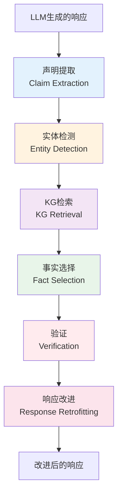
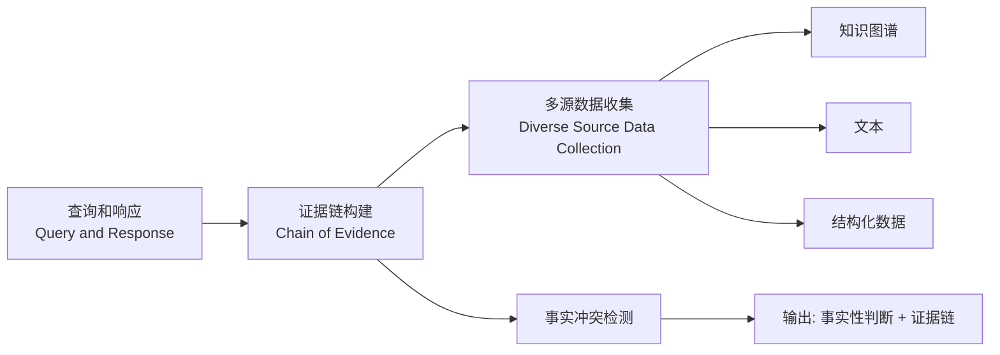
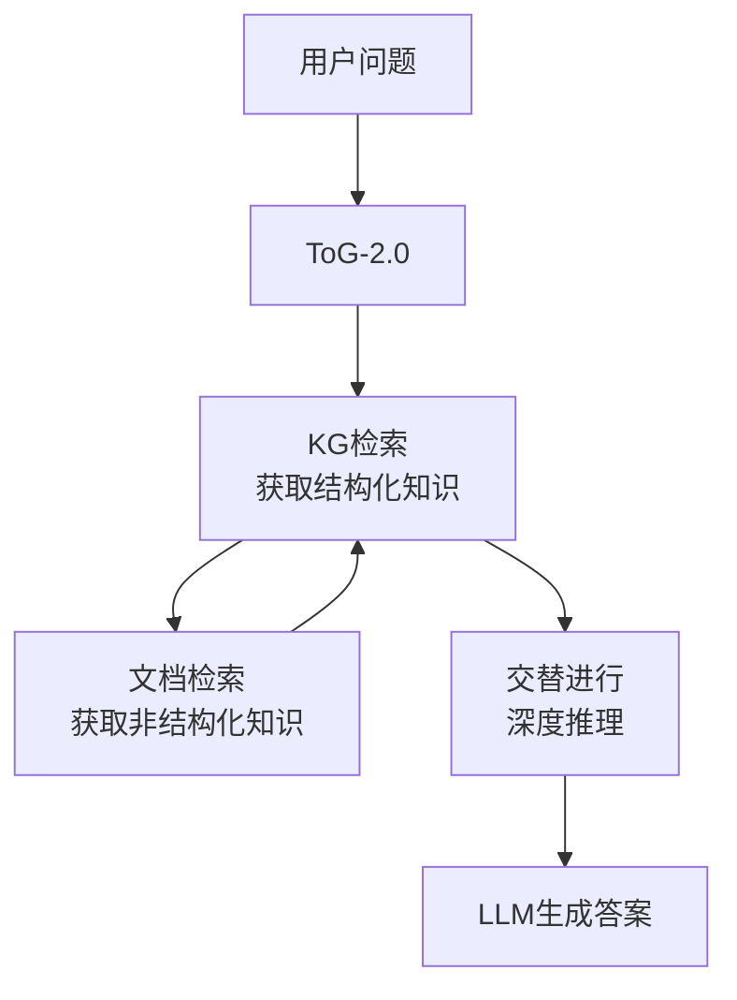
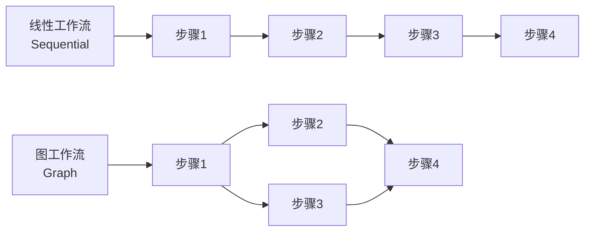
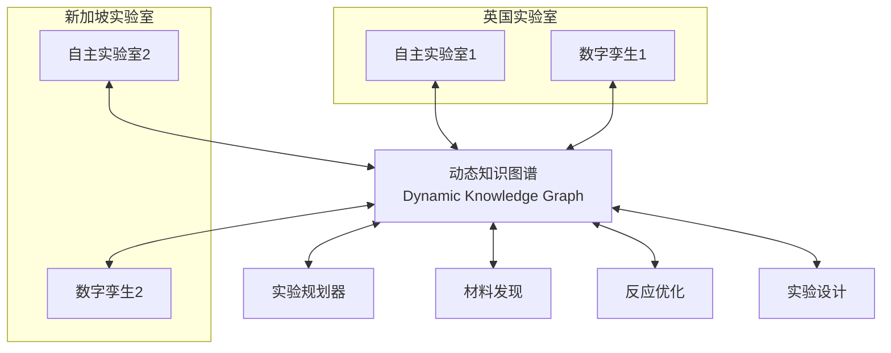

<!-- Post: 知识图谱反哺大模型：幻觉、智能体与科学发现 | ID: 2026-072 | Created: 2026-09-08 | Tags: tech, books | Format: markdown -->

## 开篇：当 AI 开始"一本正经地胡说八道"

你问大模型："弗雷德里克·肖邦的父亲是谁？"

它回答："肖邦的父亲是尼古拉·肖邦，出生于 1771 年。"

听起来很合理对不对？但如果你去查知识图谱，会发现：肖邦的父亲确实叫尼古拉·肖邦，但出生年份是 1771 年——这个信息可能是对的，也可能是大模型"编"的。

这就是大模型的**幻觉（hallucination，幻觉）**问题：它能生成流畅、可信的回答，但其中可能夹杂着虚假信息。在金融、医疗、法律等关键领域，一个幻觉就可能造成严重后果。

知识图谱怎么帮大模型解决这个问题？这篇文章我们深入报告中内容最丰富的板块——7 项工作，涵盖反幻觉、智能体增强、规划提升、个性化、甚至跨洋科学实验。

---

## 一、KGR：自主知识验证——让大模型自己"查资料"

### 1.1 核心问题

现有的反幻觉方法通常只使用用户的输入来查询知识图谱。但问题是：**大模型的幻觉往往是在推理过程中产生的**——它可能在回答的中间步骤编造了一个事实，而这个事实不在用户输入中。

中科院软件所团队提出的 **KGR**（Knowledge Graph-based Retrofitting，基于知识图谱的改进）解决了这个问题。

> 来源：*Mitigating large language model hallucinations via autonomous knowledge graph-based retrofitting*, AAAI 2024。AAAI 是人工智能顶会（CCF-A 类）。

### 1.2 核心思想：四步自主验证



四步流程：

1. **声明提取（Claim Extraction）**：从 LLM 生成的响应中提取出一个个"事实声明"（claim）
2. **实体检测 + KG 检索**：识别声明中的实体，去知识图谱中检索相关事实
3. **事实选择 + 验证**：选择最相关的事实，验证声明是否正确
4. **响应改进（Retrofitting）**：用验证后的事实替换或修正响应中的错误

关键：**整个过程是自主的**——不需要人工干预，LLM 自己提取声明、自己查 KG、自己修正。

类比：就像一个写稿的记者，写完稿子后自己去查资料核实，把错误的地方改掉，而不是等编辑来挑错。

### 1.3 实验结果

KGR 在事实 QA 基准上显著提高了 LLM 的表现，尤其是在涉及**复杂推理过程**时效果更明显。这证明了：在推理过程中产生的幻觉，必须在推理过程中检测和修正——只看用户输入是不够的。

### 1.4 OSINT 验证

```
# 查 KGR 论文
"autonomous knowledge graph-based retrofitting" hallucination AAAI 2024
"KGR" "knowledge graph" "hallucination mitigation" site:arxiv.org
```

**验证状态**：已验证。AAAI 2024 接收，技术路线清晰。

---

## 二、FACTCHD：事实冲突幻觉检测基准

### 1.1 核心问题

要检测幻觉，首先得有好的测试基准。但现有的幻觉检测基准有个问题：**只标记"有没有幻觉"，不提供"为什么"**。

浙江大学团队提出的 **FACTCHD**（Fact-Conflicting Hallucination Detection，事实冲突幻觉检测）解决了这个问题。

> 来源：*FactCHD: Benchmarking Fact-Conflicting Hallucination Detection*, IJCAI 2024。IJCAI 是人工智能顶会（CCF-A 类）。

### 1.2 核心特点

FACTCHD 不仅仅是对幻觉进行标记，还结合了**基于事实的证据链（Chain of Evidence）**：

- 当预测一个声明是事实性还是非事实性时，**必须提供有说服力的理由**
- 覆盖多种事实性模式：
  - **原始事实**（Original Fact）：简单的事实声明
  - **多跳推理**（Multi-hop Reasoning）：需要多步推理的事实
  - **比较**（Comparison）：比较两个实体的属性
  - **集合操作**（Set Operation）：涉及集合的交并补



### 1.3 为什么需要证据链？

只说"这个回答有幻觉"是不够的。你需要告诉用户：
- 哪句话是错的？
- 正确的事实是什么？
- 你怎么知道是错的？（证据来源）

FACTCHD 要求检测器提供完整的证据链，这使得检测结果**可解释、可验证**。

类比：法官判案不能只说"被告有罪"，还得列出证据——证人证言、物证、法律条文。证据链就是这个。

### 1.4 OSINT 验证

```
"FactCHD" "fact-conflicting hallucination" IJCAI 2024
"FACTCHD" benchmark hallucination detection site:github.com
```

**验证状态**：已验证。IJCAI 2024 接收，基准设计合理。

---

## 三、智能体增强：从推理到规划到工作流

知识图谱不仅能反幻觉，还能增强大模型智能体（Agent，智能体）的推理、规划和协作能力。

### 3.1 Agents 框架：开源自治智能体平台

浙江大学团队提出了一个基于 LLM 的自治 Agents 定制平台，是一个开源库，让非专业人士也能构建、定制、测试、调整和部署自主语言代理。

> 来源：*Agents: An Open-source Framework for Autonomous Language Agents*。

支持的功能：
- 规划（Planning）
- 记忆（Memory）
- 工具使用（Tool Use）
- 多代理通信（Multi-Agent Communication）
- 细粒度符号控制（Fine-grained Symbolic Control）

知识图谱在其中的作用：为智能体之间的知识交换提供更精确的知识描述，辅助大模型生成复杂的 SOP（标准操作流程），帮助人群和 Agent 之间形成知识社区。

### 3.2 Think-on-Graph 2.0：图谱+文档交替检索

**ToG-2.0** 是一种改进的 RAG 框架，核心是**结合非结构化和结构化知识源，采用紧密耦合的检索策略**。

> 来源：*Think-on-Graph 2.0: Deep and Faithful Large Language Model Reasoning with Knowledge-guided Retrieval Augmented Generation*。



与传统 RAG 的对比：

| 维度 | 传统 RAG | ToG-2.0 |
|------|---------|---------|
| 知识源 | 仅文本 | 文本 + 知识图谱 |
| 检索策略 | 一次性检索 | 交替检索（KG→文档→KG→...） |
| 推理深度 | 浅 | 深（多轮检索支撑多步推理） |
| 是否需要训练 | 否 | 否（无需额外训练） |
| LLM 兼容性 | 特定 | 可与不同 LLM 兼容 |

关键洞察：**知识图谱和文档检索交替进行**，每一步检索都基于上一步的推理结果，实现更深入、更准确的推理。

### 3.3 LPKG：从知识图谱中学习规划

浙江大学团队的 **LPKG**（Learning to Plan from Knowledge Graphs）探索了如何让语言模型从知识图谱中习得复杂问题的规划能力。

> 来源：*Learning to Plan for Retrieval-Augmented Large Language Models from Knowledge Graphs*, Findings of EMNLP 2024。

核心方法：
1. 利用知识图谱中丰富的子图 Pattern（模式）构建规划训练数据
2. 训练大模型使其能在下游问题上推理得到准确的规划过程
3. 将规划过程解析并执行，得到最终答案
4. 贡献了 **CLQA-Wiki** 全新复杂问答数据集

知识图谱中的复杂问答模式（如交集逻辑、并集逻辑、比较逻辑）被转化为训练数据，让大模型学会"怎么规划"。

### 3.4 WorkBench：智能体工作流生成基准

浙江大学团队的 **WorkBench** 面向多个大模型推理和规划场景，**将复杂智能体规划建模为图结构**。

> 来源：*Benchmarking Agentic Workflow Generation*, 2024。

同时提出了 **WorfEval** 评测指标，用于复杂图结构 workflow 的评估。

核心洞察：复杂任务的规划不是线性的步骤列表，而是一个**图结构**——有些步骤可以并行执行，有些有依赖关系。用图来建模 workflow 比线性列表更准确。



---

## 四、KGT：个性化知识图谱调优

### 4.1 核心问题

大模型是"千人一面"的——不管谁来问，回答都差不多。但用户希望 AI 能记住自己的偏好，提供个性化服务。

**KGT**（Knowledge Graph Tuning，知识图谱调优）解决了这个问题。

> 来源：*Knowledge Graph Tuning: Real-time Large Language Model Personalization based on Human Feedback*, OpenReview 2024。

### 4.2 核心思想

基于人机交互构建个性化知识图谱，实时根据用户反馈更新图谱，从而提升大模型的定制能力。

```mermaid
graph TD
    A[用户: 帮我买狗粮] --> B[LLM回答: 推荐鸡肉味]
    B --> C[用户反馈: 我的狗只吃蔬菜]
    C --> D[KG调优 Q(z,g,a)]
    D --> E[更新知识图谱]
    E --> E1[移除: dog.enjoy.meat]
    E --> E2[移除: dog.is.carnivore]
    E --> E3[添加: dog.enjoy.vegetable]
    E --> E4[添加: dog.has_diet.vegetable]
    E --> F[下次回答: 推荐蔬菜味狗粮]
```

关键：**知识图谱是可实时更新的**。用户的每一次反馈都转化为知识图谱的增删改，大模型下次回答时就能用到更新后的知识。

类比：就像一个记住你口味的餐厅服务员——你说"我不吃辣"，他就在你的客户档案里记下"不吃辣"，下次推荐菜时自动避开辣的。

---

## 五、剑桥跨洋实验室：知识图谱驱动的科学发现

这是本板块最令人兴奋的工作。

### 5.1 核心成就

剑桥大学研究团队及其合作者，利用**自主实验室 + 数字孪生 + 知识图谱**的方法，实现了两个分别位于**新加坡和英国**的自主实验室的远程合作——相隔 **10,800 公里**！

> 来源：*A dynamic knowledge graph approach to distributed self-driving laboratories*, **Nature Communications** 2024。Nature Communications 是 Nature 子刊，影响力很高。

### 5.2 系统架构



### 5.3 知识图谱的作用

动态知识图谱在其中扮演了核心角色：
- **统一表示**：两个实验室的设备、材料、实验结果都表示为知识图谱中的实体和关系
- **数据共享**：一个实验室的实验结果实时更新到图谱，另一个实验室立即可用
- **实验规划**：基于图谱中的知识自动规划下一步实验
- **数字孪生同步**：图谱连接两个实验室的数字孪生，实现远程协作

### 5.4 意义

这项工作打破了传统实验室的**地理和合作限制**。研究团队表示，这一方法或许有助于通过增加世界不同地区实验室之间数据和材料的流动，提高某些类型研究的效率。

类比：就像两个相隔万里的科学家，通过一块共享的"白板"实时交流实验结果、共同规划下一步——只不过这块白板是结构化的知识图谱，科学家是自主运行的实验室机器人。

### 5.5 OSINT 验证

```
# 查 Nature Communications 论文
"dynamic knowledge graph" "distributed self-driving laboratories" "Nature Communications" 2024
site:nature.com "self-driving laboratories" "knowledge graph"

# 查相关项目
"self-driving laboratory" "knowledge graph" site:github.com
```

**验证状态**：已验证。Nature Communications 2024 发表，跨学科合作（化学+AI+机器人），是知识图谱应用的高光案例。

---

## 六、七项工作总览

| 工作 | 方向 | 核心贡献 | 发表 | 验证状态 |
|------|------|---------|------|---------|
| KGR | 反幻觉 | 自主知识验证，四步流程 | AAAI 2024 | 已验证 |
| FACTCHD | 反幻觉 | 事实冲突检测基准+证据链 | IJCAI 2024 | 已验证 |
| Agents 框架 | 智能体 | 开源自治智能体平台 | 未明确 | 一方称 |
| ToG-2.0 | 智能体推理 | KG+文档交替检索 RAG | 未明确 | 一方称 |
| LPKG | 智能体规划 | 从图谱子图学规划，CLQA-Wiki数据集 | EMNLP 2024 Findings | 已验证 |
| WorkBench | 工作流 | 图结构 workflow 基准+WorfEval | 2024 | 一方称 |
| KGT | 个性化 | 人机反馈实时更新 KG | OpenReview 2024 | 一方称 |
| 剑桥跨洋实验室 | 科学发现 | 动态 KG 驱动 10800 公里实验室协作 | Nat Comm 2024 | 已验证 |

---

## 七、OSINT 视角：怎么调查一个"反幻觉"系统？

如果你想评估一个声称"能减少幻觉"的系统，可以按以下步骤调查：

### 步骤 1：查评测基准

```
# 常用的幻觉检测基准
"hallucination" benchmark "fact checking" LLM
TruthfulQA, HalluQA, FACTCHD, HaluEval
```

### 步骤 2：查评测指标

| 指标 | 含义 |
|------|------|
| 事实准确率 | 回答中事实正确的比例 |
| 幻觉率 | 回答中包含幻觉的比例 |
| 证据支持率 | 回答中有证据支持的比例 |
| 引用准确率 | 引用的来源是否真实支持结论 |

### 步骤 3：交叉验证

```
# 找第三方评测
"<系统名>" "hallucination" evaluation OR benchmark site:arxiv.org
"<系统名>" critique OR "does not reduce" hallucination
```

### 步骤 4：实际测试

自己构造一些容易产生幻觉的问题（如冷门人物的生平、不存在的概念），看系统是否能正确拒绝或给出准确答案。

---

## 小结

- **KGR** 让大模型自主提取声明、查 KG、修正错误，在复杂推理中效果显著
- **FACTCHD** 提供了带证据链的幻觉检测基准，覆盖 4 种事实模式
- **智能体增强**涵盖 Agents 框架、ToG-2.0 交替检索 RAG、LPKG 规划学习、WorkBench 图工作流
- **KGT** 用用户反馈实时更新知识图谱，实现个性化
- **剑桥跨洋实验室**用动态 KG 连接 10800 公里外的两个自主实验室，发在 Nature Communications
- 知识图谱反哺大模型的方向：反幻觉 → 增强推理 → 提升规划 → 个性化 → 科学发现

**下一篇预告**：主题⑤——神经符号协同：当逻辑遇见概率。我们将深入 SymbolicAI、GraphSAGE、以及两篇 Nature 正刊论文 FunSearch 和 AlphaGeometry，看看神经网络和符号系统怎么真正融合。

---

## 系列导航

| 序号 | 状态 | 标题 |
|------|------|------|
| 第1-6篇 | ✅ 已发布 | 导引篇 + KG构建/推理/问答 |
| 第7篇 | ✅ 本文 | 知识图谱反哺大模型：幻觉、智能体与科学发现 |
| 第8篇 | ⏳ 即将发布 | 神经符号协同：当逻辑遇见概率 |
| 第9篇 | ⏳ 即将发布 | OpenKG 生态与未来：从规模红利到表示红利 |
| 第10篇 | ⏳ 即将发布 | 知识图谱在 AI 技术栈中的位置 |
| 第11篇 | ⏳ 即将发布 | 读完这份报告之后：质疑、局限与行动指南 |
