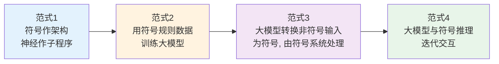
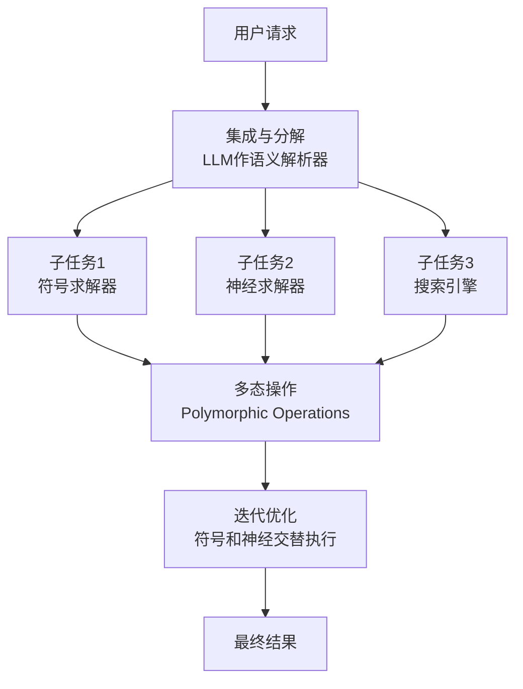
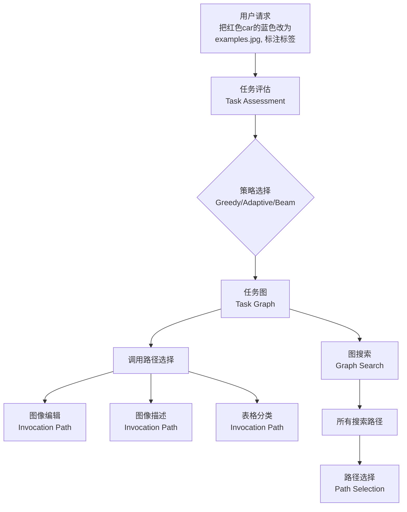
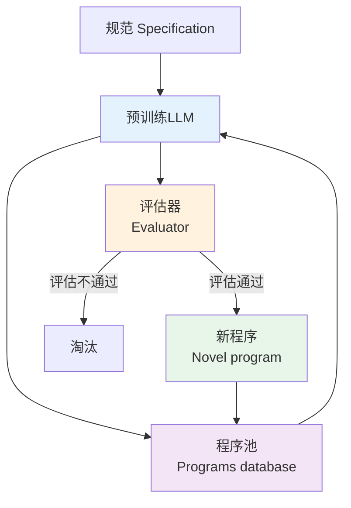
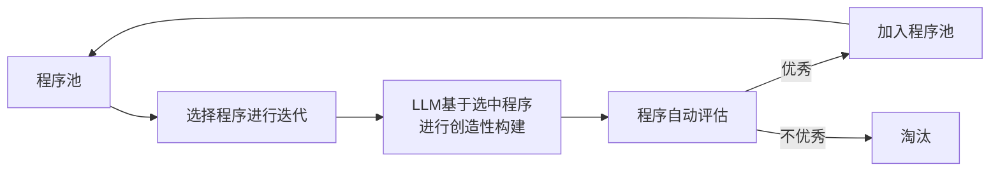
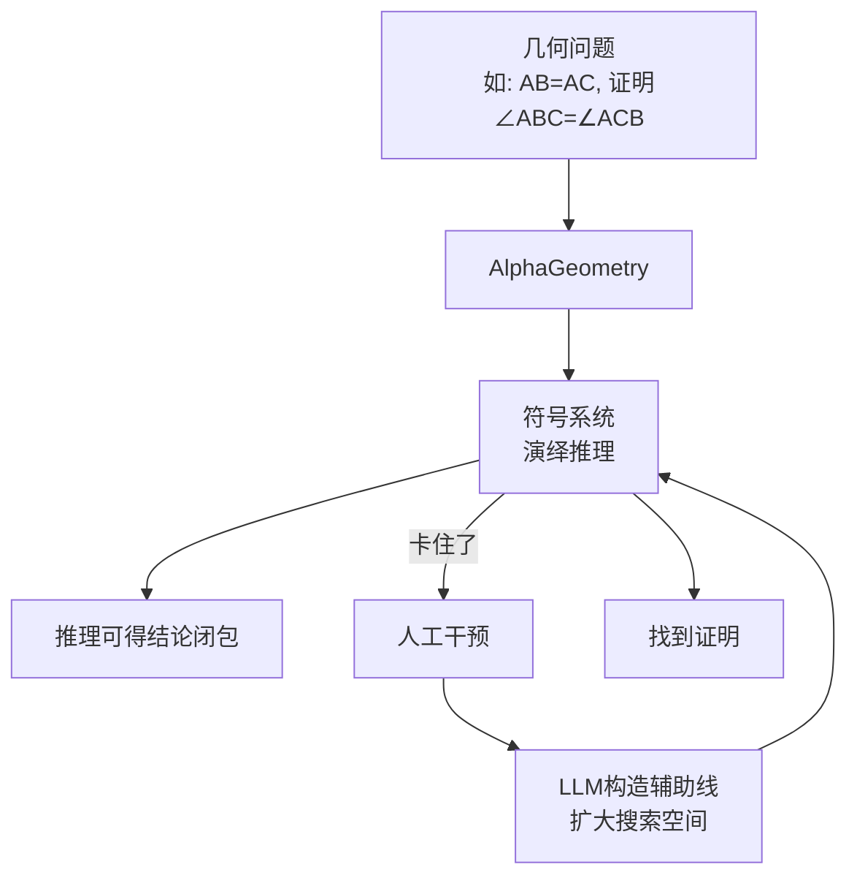

<!-- Post: 神经符号协同：当逻辑遇见概率 | ID: 2026-073 | Created: 2026-09-08 | Tags: tech, books | Format: markdown -->

## 开篇：两种"智能"的世纪之争

人工智能领域有一场持续了几十年的争论：

- **符号主义（Symbolism，符号主义）** 说：智能就是逻辑推理。把知识表示成符号和规则，然后用推理引擎推导答案。精确、可解释，但太死板——遇到没见过的情况就抓瞎。
- **连接主义（Connectionism，连接主义）** 说：智能就是神经网络。从数据中学习模式，不需要显式规则。灵活、泛化强，但不可解释——你不知道它为什么这么回答，而且偶尔会"幻觉"。

2024 年，这场争论有了新的答案：**不是谁取代谁，而是怎么融合**。神经符号协同（Neuro-Symbolic，神经符号）成为 AI 领域最热门的方向之一。

这篇文章我们深入四项代表工作，其中两项发在 **Nature 正刊**——这是 AI 领域的最高荣誉。

---

## 一、神经符号融合的四种范式

报告总结了神经符号协同的四种已有范式，从"简单拼接"到"深度迭代"逐步演进：



| 范式 | 做法 | 优点 | 缺点 |
|------|------|------|------|
| ① 符号[神经] | 符号系统作整体架构，神经网络作子程序 | 先验知识丰富，泛化性强 | 推理能力弱，可解释性差，存在幻觉 |
| ② 符号→LLM | 利用符号规则数据训练大模型，实现符号规则功能 | 可组合，可解释，高阶推理 | 组合爆炸，噪声敏感，泛化性差 |
| ③ LLM→符号 | 大模型转换非符号输入为符号，由符号系统处理 | 结合两者优势 | 转换可能出错，依赖 LLM 能力 |
| ④ 神经;符号 | 大模型与符号推理迭代交互 | 最灵活，最强能力 | 最复杂，工程难度大 |

**关键洞察**：大模型的优点是先验知识丰富、泛化性强、灵活性高；缺点是推理能力弱、可解释性差、存在幻觉。符号系统正好相反：可组合、可解释、高阶推理强；但组合爆炸、噪声敏感、泛化性差。**两者正好互补**。

---

## 二、SymbolicAI：分治聚合——符号和神经分别作子求解器

### 2.1 核心思想

**SymbolicAI** 的核心是**分治聚合（Divide and Conquer，分治）**：符号系统和神经系统分别作为子求解器，通过将 LLM 与逻辑操作结合，提供更可靠的生成结果。

> 来源：Dinu M C et al., *SymbolicAI: A framework for logic-based approaches combining generative models and solvers*, arXiv:2402.00854, 2024。

### 2.2 三个关键机制



**机制 1：集成与分解**
- LLM 作为语义解析器，将复杂任务分解成适合不同类型处理器的子任务
- 与多种求解器集成：数学表达式评估器、定理证明器、知识库、搜索引擎

**机制 2：多态操作**
- 运用多态、组合和自引用操作
- 实现符号系统和神经网络之间的细粒度交互和协同工作

**机制 3：迭代优化**
- 通过迭代过程，在符号系统和神经系统之间交替执行子任务
- 优化整体性能

### 2.3 SymbolicAI 的组件

系统包含：
- 各种现有的求解器
- 用于数学表达式评估的形式语言引擎
- 定理证明器
- 知识库
- 用于信息检索的搜索引擎

这些求解器作为构建计算图的基本单元，桥接了传统编程和可微分编程的范式。

### 2.4 OSINT 验证

```
"SymbolicAI" "logic-based" "generative models" solvers arXiv:2402.00854
"SymbolicAI" framework site:github.com
```

**验证状态**：已验证。arXiv 编号可查，框架设计合理。

---

## 三、GraphSAGE：用图学习做任务规划

### 3.1 核心问题

基于大语言模型的任务规划（Task Planning），主流方法是**提示设计（Prompt Design）**——精心设计提示词，让大模型输出规划。但这种方法有局限：依赖提示词质量，不稳定，不可控。

**GraphSAGE** 提出了一种完全不同的思路：**基于图学习的任务规划**。

> 来源：Wu X, Shen Y, Shan C, et al. *Can Graph Learning Improve Planning in LLM-based Agents?*, NeurIPS 2024（第38届神经信息处理系统大会）。

### 3.2 核心思想

子任务可以自然地被视为一个**图**：
- **节点** = 子任务
- **边** = 子任务之间的依赖关系

任务规划实际上是一个**决策问题**：在图中选择一条连接的路径或子图，并调用其内容。



### 3.3 与提示设计的区别

| 维度 | 提示设计（Prompt Design） | 图学习（Graph Learning） |
|------|-------------------------|------------------------|
| 规划表示 | 文本序列 | 图结构（节点+边） |
| 依赖关系 | 隐式（文本中） | 显式（图的边） |
| 并行任务 | 难以表示 | 天然支持（图的分支） |
| 可解释性 | 弱 | 强（图可视化） |
| 搜索空间 | 受提示长度限制 | 可扩展 |

### 3.4 OSINT 验证

```
"Can Graph Learning Improve Planning in LLM-based Agents" NeurIPS 2024
"GraphSAGE" "task planning" "LLM agents" site:arxiv.org
```

**验证状态**：已验证。NeurIPS 2024 接收，将图学习引入任务规划是新颖的思路。

---

## 四、FunSearch：LLM + 评估器，发现数学新构造（Nature 2024）

这是 2024 年神经符号领域最重磅的成果之一，发在 **Nature 正刊**。

### 4.1 核心问题

数学中有很多"开放性问题"——没有已知的最优解，需要创造性地构造新答案。比如**帽子集问题（Cap Set Problem，帽子集问题）**：在高维空间中，最多能放多少个点，使得任意三个点不共线？

传统的计算机搜索方法是搜索"具体答案"，但 FunSearch 的思路完全不同：**搜索描述如何解决问题的程序，而不是问题的具体解答**。

> 来源：Romera-Paredes et al., *Mathematical discoveries from program search with large language models*, **Nature 625(7995): 468-475, 2024**。

### 4.2 核心架构



两个核心组件：

1. **预训练 LLM**：提供创造性的计算机代码解决方案——它负责"出主意"
2. **自动化评估器**：评估程序的正确性和性能——它负责"验证"，防止幻觉和错误想法

### 4.3 迭代交互过程



1. 系统从程序池中选择程序进行迭代
2. LLM 基于选中的程序进行创造性构建（生成新程序）
3. 程序自动评估，优秀者加入程序池
4. 形成一个自我提升的循环

### 4.4 成果

FunSearch 的两个重大发现：

1. **帽子集问题**：发现了大帽子集的新构造，超越了已知的最佳结果，包括有限维和渐进情况下的构造
2. **在线装箱问题**：发现了改进广泛使用基线的全新启发式算法

### 4.5 为什么重要？

- 证明了**大模型可以在已有的开放性数学问题上取得新发现**
- 搜索的是**程序**而非答案，程序比原始解答更易解释
- 支持领域专家与 FunSearch 之间的反馈循环
- 程序可以直接部署到实际应用中

类比：FunSearch 像一个"数学家+审稿人"的组合——LLM 是数学家，负责提出新证明思路；评估器是审稿人，负责验证思路是否正确。两者迭代交互，最终发现新的数学构造。

### 4.6 OSINT 验证

```
# Nature 原文
site:nature.com "Mathematical discoveries from program search"
"FunSearch" "cap set" Nature 2024

# 查是否有代码
"FunSearch" "program search" site:github.com
"FunSearch" DeepMind site:deepmind.google
```

**验证状态**：已验证。Nature 正刊 625(7995): 468-475，2024。Google DeepMind 团队工作，高影响力。

---

## 五、AlphaGeometry：奥林匹克级几何定理证明（Nature 2024）

与 FunSearch 同期发表在 Nature 正刊的另一项重磅成果。

### 5.1 核心问题

欧几里得平面几何定理证明是 AI 的经典挑战。国际数学奥林匹克（IMO，International Mathematical Olympiad，国际数学奥林匹克）的几何题难倒了几代 AI 系统——因为几何证明需要**构造辅助线**，这需要创造性和直觉。

DeepMind 团队提出的 **AlphaGeometry** 解决了这个问题。

> 来源：Trinh T H, Wu Y, Le Q V, et al. *Solving olympiad geometry without human demonstrations*, **Nature 625(7995): 476-482, 2024**。

### 5.2 核心架构：符号系统 + LLM 分工



**分工**：
- **符号系统（演绎数据库）**：负责严谨的逻辑推理——从已知条件出发，一步步推导结论。它的推理是可靠的，但可能会"卡住"（需要辅助线才能继续）
- **大语言模型**：负责构造辅助线——当符号系统卡住时，LLM 预测应该在哪里加辅助线，扩大搜索空间

类比：符号系统像一个严谨的"逻辑推导机器"，一步一步推理，但遇到需要"灵感"的地方就卡住了；LLM 像一个有几何直觉的"助手"，在卡住时建议"试试在这里画一条辅助线"。两者配合，就能解决奥林匹克级别的几何题。

### 5.3 训练方法：合成数据

AlphaGeometry 的一个关键创新是：**不需要人类演示**。它通过合成数百万个定理和证明来训练，跨越不同复杂度的层次。

这避免了翻译人类提供的证明示例的需求——以前的方法需要人类专家写证明，然后翻译成机器可处理的形式，成本高且数量有限。

### 5.4 成果与局限

| 维度 | 内容 |
|------|------|
| **成果** | 可解决奥林匹克级别的欧几里得平面几何问题，无需人类演示 |
| **优点** | 推理空间得到扩展，推理性能强 |
| **局限** | 推理代价高，效率有限；只覆盖欧几里得平面几何，不包括几何不等式和组合几何 |

### 5.5 OSINT 验证

```
site:nature.com "Solving olympiad geometry without human demonstrations"
"AlphaGeometry" DeepMind Nature 2024
"AlphaGeometry" site:github.com
```

**验证状态**：已验证。Nature 正刊 625(7995): 476-482，2024。DeepMind 团队工作，与 FunSearch 同期发表。

---

## 六、四项工作的对比

| 工作 | 范式 | 核心贡献 | 发表 | 影响力 |
|------|------|---------|------|--------|
| SymbolicAI | 分治聚合 | LLM+多种求解器的模块化框架 | arXiv 2024 | 中 |
| GraphSAGE | 图学习规划 | 用图替代提示设计做任务规划 | NeurIPS 2024 | 中高 |
| FunSearch | 迭代交互（范式4） | LLM+评估器发现数学新构造 | **Nature 2024** | 极高 |
| AlphaGeometry | 迭代交互（范式4） | 符号演绎+LLM辅助线，IMO级几何证明 | **Nature 2024** | 极高 |

**调查发现**：两项最高影响力的工作（FunSearch、AlphaGeometry）都采用了**范式④（神经符号迭代交互）**——这说明深度融合比简单拼接更有威力。

---

## 七、神经符号的 OSINT 调查指南

如果你想深入调查神经符号系统，可以按以下维度：

### 7.1 关键问题清单

```
1. 符号系统和神经系统是怎么交互的？（简单调用 vs 深度迭代）
2. 符号系统的知识从哪来？（人工规则 vs 自动提取 vs 学习得到）
3. 神经网络的输出怎么被符号系统验证？
4. 两者的错误怎么传播？（神经网络的错误会不会污染符号推理？）
5. 系统的可解释性如何？（能给出完整的推理链吗？）
6. 效率如何？（符号推理通常慢，怎么优化？）
```

### 7.2 搜索策略

```
# 找神经符号综述
"neuro-symbolic" survey OR roadmap site:arxiv.org after:2024-01-01

# 找基准测试
"neuro-symbolic" benchmark OR evaluation "reasoning"

# 找争议
"neuro-symbolic" critique OR "hype" OR limitation
```

---

## 小结

- 神经符号融合有四种范式，从"简单拼接"到"迭代交互"逐步深入
- **SymbolicAI** 用分治聚合框架，LLM 作语义解析器，多种求解器协同
- **GraphSAGE** 用图学习替代提示设计做任务规划
- **FunSearch**（Nature 2024）用 LLM+评估器迭代搜索程序，发现帽子集和装箱问题的新构造
- **AlphaGeometry**（Nature 2024）用符号演绎+LLM 辅助线，解决奥林匹克级几何证明
- 两项 Nature 工作都采用迭代交互范式，证明深度融合是最有威力的方向

**下一篇预告**：主题⑥——OpenKG 生态与未来：从规模红利到表示红利。我们将盘点国内四大开源工作，并分析报告提出的三大未来趋势。

---

## 系列导航

| 序号 | 状态 | 标题 |
|------|------|------|
| 第1-7篇 | ✅ 已发布 | 导引篇 + 五大核心主题 |
| 第8篇 | ✅ 本文 | 神经符号协同：当逻辑遇见概率 |
| 第9篇 | ⏳ 即将发布 | OpenKG 生态与未来：从规模红利到表示红利 |
| 第10篇 | ⏳ 即将发布 | 知识图谱在 AI 技术栈中的位置 |
| 第11篇 | ⏳ 即将发布 | 读完这份报告之后：质疑、局限与行动指南 |
