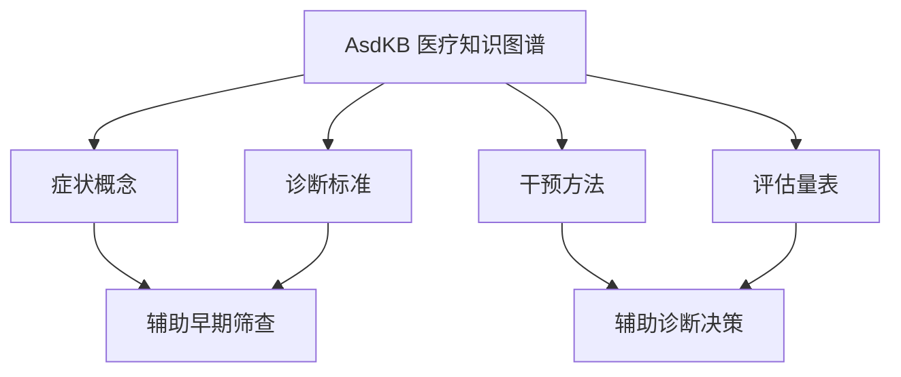
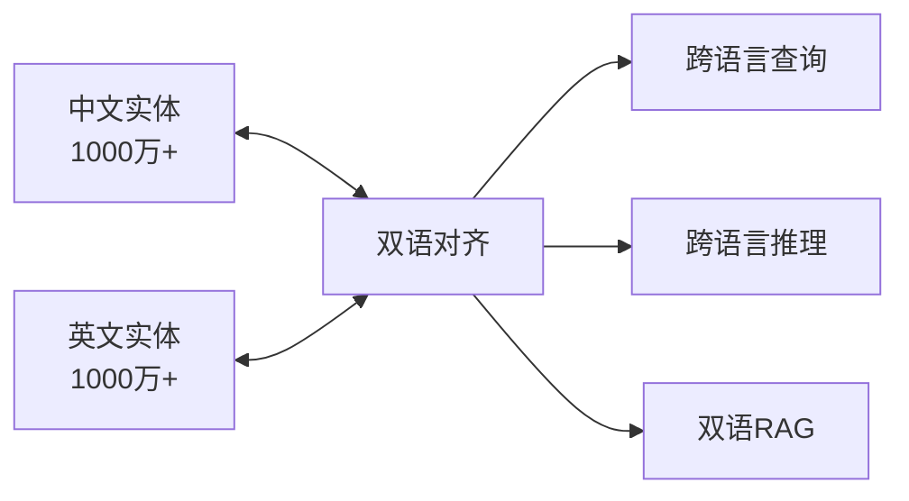
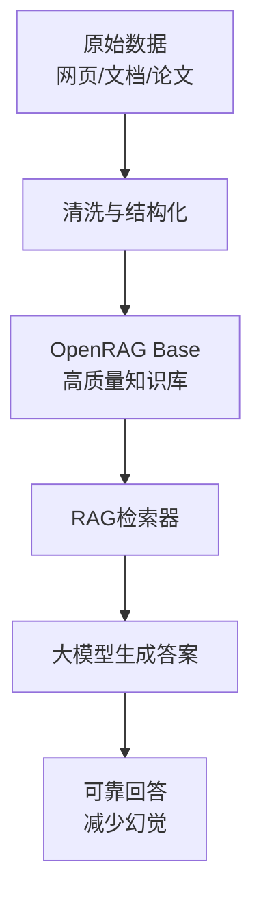
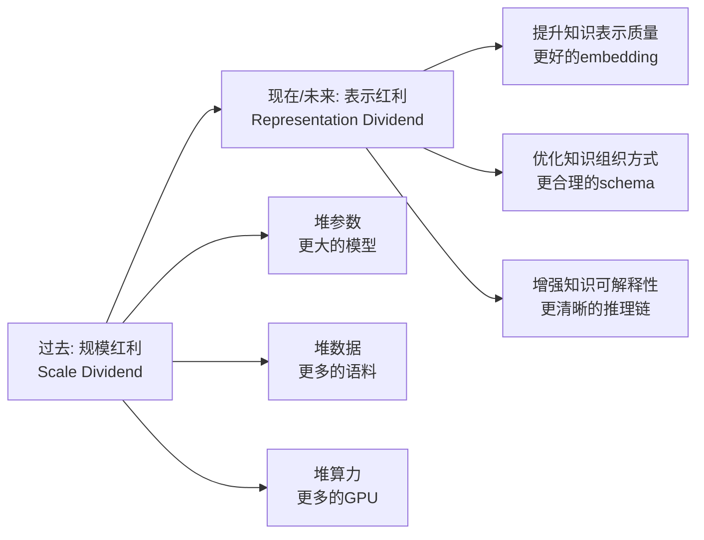
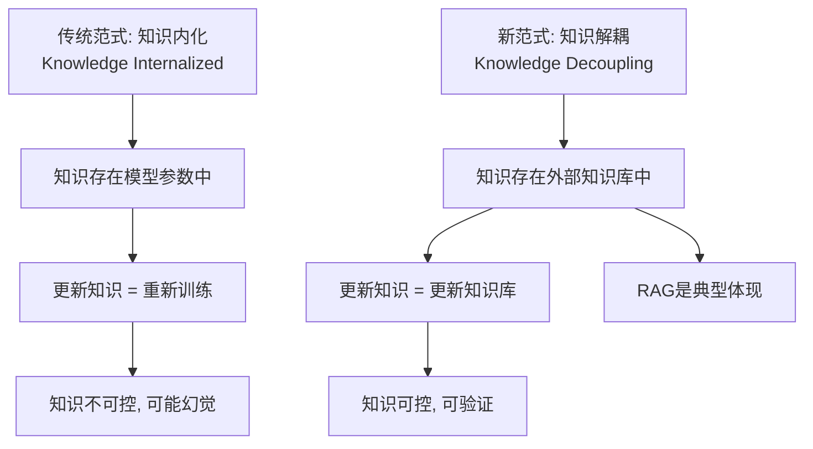

<!-- Post: OpenKG生态与未来：从规模红利到表示红利 | ID: 2026-074 | Created: 2026-09-08 | Tags: tech, books | Format: markdown -->

## 开篇：一个中国知识图谱人的"十年答卷"

2016 年，OpenKG（Open Knowledge Graph，开放知识图谱）成立。十年后，它已经成为中国最大的开放知识图谱社区，汇聚了学术界和产业界的力量。

这篇文章是报告的最后一个技术板块——OpenKG 生态与趋势。我们将盘点 2024 年 OpenKG 社区的四大开源工作，并深入分析王昊奋提出的三大未来趋势。这是整个系列的"收网篇"——了解了前面的技术细节，再看生态和趋势，你才能真正看懂这个领域往哪走。

---

## 一、OpenKG 是什么？

在盘点工作之前，先快速了解 OpenKG：

| 维度 | 内容 |
|------|------|
| **全称** | Open Knowledge Graph（开放知识图谱） |
| **定位** | 中国首个开放知识图谱社区 |
| **发起** | 同济大学王昊奋团队等 |
| **目标** | 促进知识图谱的开放、共享和应用 |
| **资源** | 开放数据集、开源工具、学术社区 |
| **官网** | openkg.cn |

> OSINT 提示：可以用 `site:openkg.cn` 搜索 OpenKG 上的开放数据集和工具，用 `site:github.com openkg` 查找开源仓库。

---

## 二、四大开源工作

### 2.1 AsdKB：医疗领域知识图谱

**AsdKB** 是一个面向医疗领域的知识图谱，由上海交通大学团队开发。

> 来源：*AsdKB: A Chinese Knowledge Base for Assisting the Early Screening and Diagnosis of Autism Spectrum Disorder in Children*, ACM Transactions on Asian and Low-Resource Language Information Processing, 2024。

| 维度 | 内容 |
|------|------|
| **领域** | 儿童自闭症谱系障碍（ASD）早期筛查和诊断 |
| **语言** | 中文 |
| **规模** | 约 2,000 个概念，30,000+ 三元组 |
| **用途** | 辅助医生进行早期筛查和诊断 |
| **特色** | 针对中文低资源医疗场景 |



**OSINT 验证**：
```
"AsdKB" "autism spectrum disorder" knowledge base ACM 2024
"AsdKB" Chinese medical knowledge graph site:github.com
```
验证状态：已验证。ACM TALLIP 期刊发表，针对中文医疗低资源场景有实际价值。

---

### 2.2 OneGraph：千万级双语知识图谱

**OneGraph** 是一个大规模中英双语知识图谱。

> 来源：*OneGraph: A General-Purpose Chinese-English Bilingual Knowledge Graph*, 2024。

| 维度 | 内容 |
|------|------|
| **规模** | 千万级实体（10M+） |
| **语言** | 中英双语 |
| **定位** | 通用知识图谱 |
| **特色** | 双语对齐，支持跨语言推理 |

千万级实体是什么概念？作为对比：
- Freebase（Google 收购）：约 4,000 万实体
- Wikidata：约 1 亿+ 实体
- CN-DBpedia（中文）：约 1,700 万实体
- **OneGraph**：千万级，中英双语



**OSINT 验证**：
```
"OneGraph" "Chinese-English bilingual knowledge graph" 2024
"OneGraph" knowledge graph site:github.com site:openkg.cn
```
验证状态：一方称。报告中提到但未给出具体论文链接，需进一步确认。

---

### 2.3 OpenRAG Base：RAG 知识库

**OpenRAG Base** 是面向检索增强生成（RAG）的开放知识库。

> 来源：OpenKG 社区 2024 年发布。

| 维度 | 内容 |
|------|------|
| **定位** | RAG 专用知识库 |
| **内容** | 高质量文档、知识片段 |
| **用途** | 为 RAG 系统提供可靠的知识源 |
| **特色** | 与知识图谱结合，支持结构化+非结构化混合检索 |

为什么需要专门的 RAG 知识库？因为普通的网页数据质量参差不齐——有广告、有错误、有过时信息。RAG 系统如果检索到低质量内容，反而会加剧幻觉。OpenRAG Base 提供经过清洗和结构化的高质量知识，让 RAG 系统检索到的内容更可靠。



**OSINT 验证**：
```
"OpenRAG Base" knowledge base RAG site:openkg.cn
"OpenRAG" "retrieval augmented generation" Chinese knowledge base
```
验证状态：一方称。OpenKG 社区项目，需查官网确认具体资源。

---

### 2.4 OneKE：知识抽取工具

**OneKE** 是一个通用的知识抽取工具。

> 来源：OpenKG 社区 2024 年发布。

| 维度 | 内容 |
|------|------|
| **功能** | 从文本中自动抽取实体、关系、事件 |
| **支持** | 实体抽取、关系抽取、事件抽取 |
| **特色** | 统一框架，支持多种抽取任务 |
| **定位** | 知识图谱构建的"入口工具" |

OneKE 的意义：知识图谱构建的第一步就是从文本中抽取知识。有了通用的抽取工具，开发者不需要自己从零写抽取代码，可以快速构建自己的知识图谱。

**OSINT 验证**：
```
"OneKE" "knowledge extraction" site:github.com site:openkg.cn
"OneKE" entity relation event extraction Chinese
```
验证状态：一方称。需查 GitHub 和 OpenKG 官网确认。

---

### 2.5 四大工作总览

| 工作 | 类型 | 领域 | 规模/特色 | 验证状态 |
|------|------|------|----------|---------|
| AsdKB | 领域知识图谱 | 医疗（自闭症） | 2K 概念，30K+ 三元组，中文 | 已验证 |
| OneGraph | 通用知识图谱 | 通用 | 千万级实体，中英双语 | 一方称 |
| OpenRAG Base | RAG 知识库 | 通用 | 高质量文档，支持混合检索 | 一方称 |
| OneKE | 知识抽取工具 | 通用 | 统一框架，多任务抽取 | 一方称 |

**调查员点评**：四项工作覆盖了知识图谱生态的关键环节——领域图谱（AsdKB）、通用图谱（OneGraph）、RAG 知识源（OpenRAG Base）、构建工具（OneKE）。形成了一个从"构建"到"存储"到"应用"的完整链条。

---

## 三、三大未来趋势

王昊奋在报告中提出了知识图谱领域的三大趋势。这是整个报告最有前瞻性的部分。

### 3.1 趋势一：从规模红利到表示红利



**什么是规模红利？** 过去几年，AI 的进步主要靠"堆"——更大的模型、更多的数据、更强的算力。GPT-3 到 GPT-4，参数从 1750 亿到万亿级；训练数据从 TB 级到 PB 级。规模确实带来了能力提升，但边际收益在递减。

**什么是表示红利？** 未来的进步不再靠"堆"，而是靠"巧"——更好地表示和组织知识。具体来说：
- 知识图谱的嵌入（embedding）质量更高，能更准确地捕捉语义
- 知识图谱的 Schema 设计更合理，能更自然地表示复杂关系
- 知识的组织方式更适合大模型理解和推理

类比：规模红利像"用更大的锅煮更多的饭"——饭多了但味道不一定好；表示红利像"用更好的调料和烹饪技巧"——同样的食材，味道更好。

**为什么这个趋势重要？** 因为规模有天花板——模型不可能无限大，数据不可能无限多，算力不可能无限强。但表示质量的提升是没有天花板的——总能找到更好的方式来组织和表示知识。

---

### 3.2 趋势二：知识解耦



**什么是知识解耦？** 把知识从大模型的参数中"分离"出来，存储在外部的知识库（如知识图谱、向量数据库）中。大模型需要知识时，从外部检索，而不是依赖自己"记住"的知识。

**RAG（检索增强生成）就是知识解耦的典型体现**：
- 知识不在模型参数里，而在外部文档库/知识图谱里
- 模型回答问题时，先检索相关知识，再基于检索结果生成
- 更新知识不需要重新训练模型，只需要更新外部知识库

**知识解耦的好处**：
1. **知识可更新**：外部知识库随时可以更新，模型立即可用新知识
2. **知识可验证**：回答可以追溯到具体的知识来源，减少幻觉
3. **知识可控制**：可以选择给模型看哪些知识，屏蔽哪些知识
4. **模型更小**：不需要把所有知识都塞进参数，模型可以更轻量

**知识解耦的挑战**：
1. **检索质量**：检索到的知识必须相关且准确
2. **知识融合**：多源知识可能冲突，需要融合
3. **推理深度**：外部检索的知识可能不够深入，需要多轮检索

---

### 3.3 趋势三：神经符号四范式演化

报告总结了神经符号协同的四种范式，并指出它们在**逐步演化**：

```mermaid
graph LR
    P1[范式1<br/>符号[神经]<br/>符号作架构] --> P2[范式2<br/>符号→LLM<br/>符号数据训练LLM]
    P2 --> P3[范式3<br/>LLM→符号<br/>LLM转换为符号输入]
    P3 --> P4[范式4<br/>神经;符号<br/>迭代交互]

    style P1 fill:#e3f2fd
    style P2 fill:#fff3e0
    style P3 fill:#f3e5f5
    style P4 fill:#e8f5e9
```

| 范式 | 交互深度 | 代表工作 | 能力上限 |
|------|---------|---------|---------|
| ① 符号[神经] | 浅（调用关系） | 传统专家系统+神经网络 | 低 |
| ② 符号→LLM | 中（训练数据） | 用符号规则训练LLM | 中 |
| ③ LLM→符号 | 中（输入转换） | LLM输出转符号推理 | 中高 |
| ④ 神经;符号 | 深（迭代交互） | FunSearch、AlphaGeometry | 高 |

**演化方向**：从简单的"调用关系"到深度的"迭代交互"，神经和符号的结合越来越紧密。FunSearch 和 AlphaGeometry（都发在 Nature 2024）证明了范式④的威力——这是未来的方向。

---

## 四、趋势之间的关系

三大趋势不是孤立的，它们相互关联：

```mermaid
graph TD
    A[趋势1: 表示红利] --> B[更好的知识表示]
    B --> C[趋势2: 知识解耦]
    C --> D[知识在外部, 需要好的表示]
    D --> E[趋势3: 神经符号协同]
    E --> F[大模型(神经) + 知识图谱(符号)<br/>迭代交互]
    F --> G[最终: 可靠、可解释、可更新的AI]
```

- **表示红利**是基础——只有知识表示好了，解耦和协同才有意义
- **知识解耦**是架构——把知识从模型中分离出来，为协同创造条件
- **神经符号协同**是方法——大模型和知识图谱迭代交互，实现可靠推理

三者共同指向一个目标：**可靠、可解释、可更新的 AI 系统**。

---

## 五、OSINT 视角：怎么跟踪这些趋势？

作为调查员，如果你想持续跟踪知识图谱领域的趋势，可以用以下方法：

### 5.1 定期搜索

```
# 每周/每月搜索最新论文
"knowledge graph" "large language model" site:arxiv.org after:2025-01-01
"neuro-symbolic" "knowledge graph" site:arxiv.org after:2025-01-01

# 搜索 OpenKG 最新动态
site:openkg.cn "2025" OR "2026"
site:github.com openkg pushed:>2025-01-01
```

### 5.2 关注关键会议

| 会议 | 领域 | 时间 |
|------|------|------|
| ACL / EMNLP / NAACL | NLP | 每年 |
| NeurIPS / ICML / ICLR | 机器学习 | 每年 |
| AAAI / IJCAI | 人工智能 | 每年 |
| KDD / WWW / CIKM | 数据挖掘/Web | 每年 |
| ISWC / ESWC | 语义Web/知识图谱 | 每年 |
| OpenKG 年会 | 中文知识图谱 | 每年 |

### 5.3 关注关键人物和团队

```
# 王昊奋（同济大学，OpenKG）
site:arxiv.org "Haofen Wang" "knowledge graph"

# 搜索国内知识图谱团队
"knowledge graph" "Tsinghua" OR "Zhejiang University" OR "Tongji" site:arxiv.org
```

---

## 小结

- **OpenKG 四大开源工作**：AsdKB（医疗图谱）、OneGraph（千万级双语图谱）、OpenRAG Base（RAG 知识库）、OneKE（知识抽取工具），覆盖构建-存储-应用全链条
- **趋势一：从规模红利到表示红利**——不再靠堆参数/数据/算力，而是靠更好的知识表示和组织
- **趋势二：知识解耦**——把知识从模型参数中分离到外部知识库，RAG 是典型体现，实现可更新、可验证、可控制
- **趋势三：神经符号四范式演化**——从简单拼接到迭代交互，FunSearch 和 AlphaGeometry 证明深度融合最有威力
- 三大趋势共同指向：可靠、可解释、可更新的 AI 系统

**下一篇预告**：主题阅读篇——知识图谱在 AI 技术栈中的位置。我们将跳出报告本身，把知识图谱放到整个 AI 技术栈中审视，看看它和大模型、RAG、智能体、向量数据库等技术的关系。

---

## 系列导航

| 序号 | 状态 | 标题 |
|------|------|------|
| 第1-8篇 | ✅ 已发布 | 导引篇 + 六大核心主题 |
| 第9篇 | ✅ 本文 | OpenKG 生态与未来：从规模红利到表示红利 |
| 第10篇 | ⏳ 即将发布 | 知识图谱在 AI 技术栈中的位置 |
| 第11篇 | ⏳ 即将发布 | 读完这份报告之后：质疑、局限与行动指南 |
