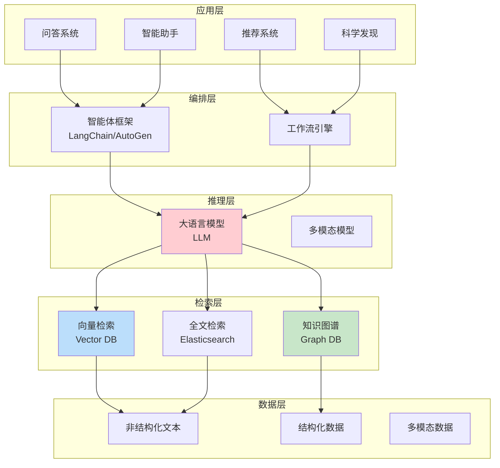
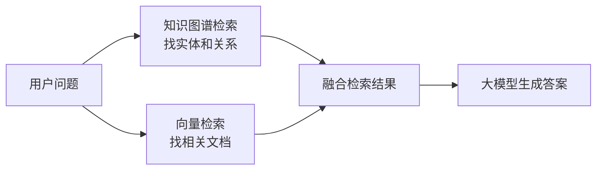
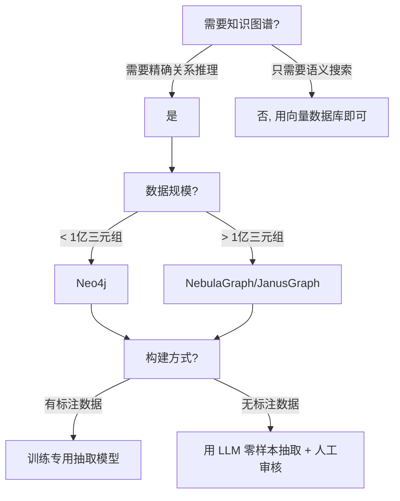

<!-- Post: 知识图谱在AI技术栈中的位置 | ID: 2026-075 | Created: 2026-09-08 | Tags: tech, books | Format: markdown -->

## 开篇：一张 AI 技术栈的"地图"

如果你在 2024 年搭建一个 AI 应用，你的技术栈可能长这样：

- 大模型（GPT-4 / LLaMA / Qwen）做理解和生成
- RAG（检索增强生成）做知识检索
- 向量数据库（Pinecone / Milvus / Chroma）存 embedding
- 智能体框架（LangChain / AutoGen / CrewAI）做任务编排
- 知识图谱（Neo4j / NebulaGraph / OpenKG）存结构化知识

问题来了：**知识图谱在这堆技术中到底处于什么位置？它和向量数据库是什么关系？和 RAG 是什么关系？和大模型又是什么关系？**

这篇"主题阅读"文章，我们跳出报告本身，把知识图谱放到整个 AI 技术栈中审视。这是洋葱阅读法的第四层——主题阅读：围绕一个主题，整合多本书/多篇文章的观点，形成自己的理解。

---

## 一、AI 技术栈全景图



知识图谱位于**检索层**，和向量数据库、全文检索并列。但它的角色是独特的——它是唯一能处理**结构化关系**的检索方式。

---

## 二、知识图谱 vs 向量数据库：不是替代，是互补

这是最常被问到的问题。很多人以为知识图谱和向量数据库是"二选一"的关系，其实不是。

### 2.1 两者的本质区别

| 维度 | 向量数据库 | 知识图谱 |
|------|-----------|---------|
| **存储内容** | 文本的向量表示（embedding） | 实体和关系的结构化三元组 |
| **检索方式** | 语义相似度搜索 | 结构化查询（图遍历、路径查找） |
| **擅长** | 模糊匹配、语义理解 | 精确查询、关系推理、多跳推理 |
| **不擅长** | 精确事实查询、可解释性 | 模糊语义匹配、自然语言理解 |
| **可解释性** | 弱（为什么相似？说不清） | 强（路径就是解释） |
| **更新成本** | 低（加一条向量就行） | 高（需要维护 Schema 和关系） |
| **构建成本** | 低（自动 embedding） | 高（需要抽取实体和关系） |

### 2.2 一个直观的例子

问题："爱因斯坦和奥本海默有什么关系？"

**向量数据库的回答**：
- 检索到关于爱因斯坦和奥本海默的文档片段
- 大模型基于片段生成回答
- 可能回答："他们都是物理学家"
- 但说不清具体关系——是同事？师生？朋友？

**知识图谱的回答**：
- 图遍历：爱因斯坦 → 同事 → 玻尔 → 学生 → 奥本海默？
- 或者：爱因斯坦 → 推荐 → 奥本海默 → 职位 → 普林斯顿高等研究院
- 给出精确的关系路径
- 可解释：因为 A→B→C，所以他们有关系

**两者结合（GraphRAG）的回答**：
- 先用知识图谱找到关系路径
- 再用向量检索找到相关文档
- 大模型结合两者生成精确且丰富的回答

### 2.3 GraphRAG：融合的趋势

2024 年，**GraphRAG**（Graph + RAG）成为热门方向。核心思想：



知识图谱提供**结构化的关系和精确事实**，向量数据库提供**丰富的语义上下文**，两者结合，答案既精确又丰富。

> OSINT 提示：搜索 `"GraphRAG" "knowledge graph" "vector" site:arxiv.org after:2024-01-01` 可以找到最新的 GraphRAG 相关论文。微软的 GraphRAG 是代表性工作。

---

## 三、知识图谱 vs RAG：知识解耦的两种实现

RAG（检索增强生成）和知识图谱都是"知识解耦"的实现方式——把知识从模型参数中分离出来。

| 维度 | 纯 RAG（文本检索） | KG-RAG（图谱检索） |
|------|-------------------|-------------------|
| **知识源** | 非结构化文本 | 结构化三元组 |
| **检索** | 向量相似度 | 图查询/路径查找 |
| **精确性** | 中（可能检索到不相关内容） | 高（精确匹配实体和关系） |
| **多跳推理** | 弱（需要多轮检索） | 强（图遍历天然支持多跳） |
| **可解释性** | 弱 | 强（查询路径可解释） |
| **覆盖范围** | 广（任何文本都能索引） | 窄（只有已抽取的知识） |
| **构建成本** | 低 | 高 |

**结论**：纯 RAG 适合"广覆盖"的场景（如通用问答），KG-RAG 适合"高精度"的场景（如医疗、金融、法律）。未来的趋势是**混合 RAG**——同时检索文本和图谱，取长补短。

---

## 四、知识图谱 vs 大模型：谁是"大脑"，谁是"记忆"？

这是一个深刻的问题。

### 4.1 两种观点

**观点 A：大模型是大脑，知识图谱是外挂记忆**
- 大模型负责理解、推理、生成
- 知识图谱负责存储精确知识，需要时检索
- 类比：大模型是聪明的大脑，知识图谱是笔记本

**观点 B：知识图谱是骨架，大模型是血肉**
- 知识图谱提供结构化的知识框架（骨架）
- 大模型提供灵活的理解和生成能力（血肉）
- 类比：知识图谱是建筑的钢筋结构，大模型是混凝土和装修

### 4.2 报告的立场

从报告的内容来看，王昊奋的立场更接近**观点 B**——知识图谱不是大模型的"附属品"，而是有独立价值的"基础设施"。证据：

1. 报告用大量篇幅讲 KG 构建、推理、问答——这些是知识图谱自身的能力，不依赖大模型
2. "KG 赋能大模型"板块证明知识图谱能主动增强大模型（反幻觉、智能体、科学发现）
3. "神经符号协同"板块证明两者是平等的合作伙伴，不是主从关系
4. 趋势部分强调"知识解耦"——知识应该独立于模型存在

### 4.3 我的判断

作为调查员，综合报告和外部信息，我的判断是：

**短期（1-2 年）**：大模型主导，知识图谱作为增强组件（RAG、反幻觉）
**中期（3-5 年）**：两者平等融合，神经符号协同成为主流架构
**长期（5 年+）**：知识图谱可能成为 AI 系统的"基础设施层"，大模型在其上运行

类比：就像数据库之于软件系统——早期软件把数据存在文件里（类似大模型把知识存在参数里），后来数据库独立出来成为基础设施（类似知识图谱独立出来）。今天没有哪个严肃的软件系统不用数据库，未来可能没有哪个严肃的 AI 系统不用知识图谱。

---

## 五、知识图谱在不同应用场景中的角色

| 应用场景 | 知识图谱的角色 | 关键技术 |
|---------|--------------|---------|
| **智能客服** | 产品知识图谱，精确回答产品参数 | KGQA + RAG |
| **医疗诊断** | 医学知识图谱，辅助诊断和用药 | 不确定性推理 + 反幻觉 |
| **金融风控** | 企业关系图谱，发现关联风险 | 图算法 + 多跳推理 |
| **推荐系统** | 用户-物品图谱，提升推荐可解释性 | 图神经网络 + 知识图谱嵌入 |
| **科学发现** | 领域知识图谱，辅助假设生成 | 神经符号 + 自主实验室 |
| **教育** | 学科知识图谱，个性化学习路径 | 知识追踪 + 自适应推荐 |
| **搜索引擎** | 实体图谱，理解查询意图 | 实体链接 + 关系推理 |

---

## 六、知识图谱技术栈的"选型指南"

如果你要在项目中引入知识图谱，怎么选？

### 6.1 图数据库选型

| 数据库 | 类型 | 特点 | 适用场景 |
|--------|------|------|---------|
| Neo4j | 原生图 | 最成熟，生态好，Cypher 查询语言 | 中小规模，通用场景 |
| NebulaGraph | 原生图 | 分布式，高性能，国产 | 大规模，生产环境 |
| JanusGraph | 分布式图 | 基于 HBase/Cassandra，开源 | 超大规模，Hadoop 生态 |
| Amazon Neptune | 云原生图 | AWS 托管，支持 Gremlin/SPARQL | 云上部署 |
| OpenKG | 开放图谱 | 中文开放知识，社区维护 | 研究和原型 |

### 6.2 知识图谱构建工具选型

| 工具 | 功能 | 特点 |
|------|------|------|
| OneKE（OpenKG） | 知识抽取 | 中文，开源，统一框架 |
| KnowCoder | 代码结构抽取 | 中科院，Schema 约束 |
| ADELIE | 指令微调抽取 | 清华，SFT+DPO |
| LLM 直接抽取 | 通用抽取 | 灵活，但格式不稳定 |

### 6.3 决策树



---

## 七、OSINT 视角：知识图谱领域的"情报地图"

作为调查员，如果你想持续跟踪知识图谱领域，可以建立以下"情报源"：

### 7.1 学术情报源

| 来源 | 类型 | 关注重点 |
|------|------|---------|
| arXiv cs.AI / cs.CL | 预印本 | 最新论文 |
| ACL / EMNLP / NAACL | 会议 | NLP+KG |
| NeurIPS / ICML / ICLR | 会议 | 图学习+神经符号 |
| ISWC / ESWC | 会议 | 语义Web+KG |
| KDD / WWW / CIKM | 会议 | 数据挖掘+KG |
| OpenKG 年会 | 社区 | 中文 KG 动态 |

### 7.2 产业情报源

| 来源 | 关注重点 |
|------|---------|
| Neo4j 博客 | 图数据库最佳实践 |
| 微软 GraphRAG 仓库 | GraphRAG 最新进展 |
| LangChain 文档 | KG+Agent 集成 |
| OpenKG 官网 | 中文开放资源 |
| GitHub Trending | 新兴 KG 工具 |

### 7.3 关键人物追踪

```
# 用 Google Scholar 或 arXiv 搜索
"Haofen Wang" "knowledge graph"  # 王昊奋, 同济大学/OpenKG
"Lei Zou" "knowledge graph"       # 邹磊, 北京大学
"Yixin Cao" "knowledge graph"     # 操懿欣, 上海交大
"Xiang Ren" "knowledge graph"     # 任翔, USC
```

---

## 小结

- 知识图谱位于 AI 技术栈的**检索层**，是唯一能处理结构化关系的检索方式
- **知识图谱 vs 向量数据库**：不是替代，是互补——GraphRAG 是融合趋势
- **知识图谱 vs RAG**：都是知识解耦的实现，纯 RAG 广覆盖，KG-RAG 高精度，未来是混合 RAG
- **知识图谱 vs 大模型**：短期大模型主导，中期平等融合，长期 KG 可能成为基础设施
- 知识图谱在客服、医疗、金融、推荐、科学发现等场景都有独特价值
- 选型时根据规模、需求、数据情况选择图数据库和构建工具

**下一篇预告**：研究式阅读收官篇——读完这份报告之后：质疑、局限与行动指南。我们将用批判性思维审视报告的不足，给出可操作的行动建议，并完成整个系列的总结。

---

## 系列导航

| 序号 | 状态 | 标题 |
|------|------|------|
| 第1-9篇 | ✅ 已发布 | 导引篇 + 六大核心主题 |
| 第10篇 | ✅ 本文 | 知识图谱在 AI 技术栈中的位置 |
| 第11篇 | ⏳ 即将发布 | 读完这份报告之后：质疑、局限与行动指南 |
