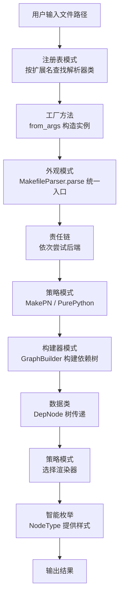

<!-- Post: 一个2000行Python项目里藏着多少种设计模式？ | ID: 2026-077 | Created: 2026-09-10 | Tags: tech, works | Format: markdown -->

## 开篇：一家餐厅的厨房

想象你走进一家餐厅的后厨。主厨不会自己切菜、炒菜、摆盘、洗碗一个人全包——那样效率太低。真实的厨房是这样运转的：

- **切菜工**只负责把食材切成统一规格，不管后面怎么炒
- **炒锅师傅**有好几位，川菜师傅、粤菜师傅各管各的菜系，客人点什么就上谁的灶
- **传菜员**拿着单子，看一眼菜名就知道该送到哪个窗口，不用主厨挨个喊
- **摆盘师**有好几种风格，正餐摆盘点、快餐用纸盒装，同一道菜换个盘子就是不同体验

这就是**设计模式**——不是什么高深的黑科技，而是前辈程序员在无数次踩坑后总结出来的"分工套路"。好的代码就像好的厨房，每个人只干一件事，换人不用改菜单，加菜不用重建厨房。

`dep_tree.py` 是一个用来分析 Makefile 和 Python 项目依赖关系的命令行工具。它只有 2000 行，但里面藏着 **10 种设计模式**。下面我们一个个拆开看。


*图：10 种设计模式按创建型、结构型、行为型、数据与枚举四大类组织。*

---

## 一、策略模式（Strategy）——"换个师傅炒同一道菜"

### 生活类比

你去面馆吃面，"煮面"这个动作有两种做法：用全自动煮面机，或者老师傅手工下面。两种做法最终都端出一碗面，但过程完全不同。客人不需要知道是机器煮的还是人手煮的——只要面好吃就行。

### 代码里怎么用

dep_tree.py 要解析 Makefile，有两种方案：

1. 调用系统的 `make -pn` 命令导出完整数据库（业界标准，又快又准）
2. 用纯 Python 手写一个解析器（不依赖外部工具，但功能有限）

代码作者把这两种方案封装成了两个"策略类"，它们都继承同一个抽象基类：

```python
# 第 238-239 行：抽象基类，注释里直接写了"Strategy 模式"
class MakefileDBBackend(ABC):
    """产生 MakefileDB 的后端接口（Strategy 模式）。"""

    @abstractmethod
    def parse(self, path: str) -> Optional[MakefileDB]:
        ...

# 第 257 行：策略 A —— 调用 make 命令
class MakePNBackend(MakefileDBBackend):
    """通过 `make -pn` 获取 GNU Make 完整数据库。"""

# 第 428 行：策略 B —— 纯 Python 解析
class PurePythonBackend(MakefileDBBackend):
    """手写 Makefile 解析器，仅在无 make 时使用。"""
```

调用的时候，主程序根本不关心用的是哪个策略，只管调用 `backend.parse()`：

```python
# 第 910-916 行：按顺序尝试，第一个成功的就用
for backend in self.backends:
    db = backend.parse(abs_path)
    if db is not None:
        break
```

**为什么这么设计？** 如果明天出现了第三种解析方案（比如用 Rust 写的超快解析器），只需要新增一个类继承 `MakefileDBBackend`，主程序一行都不用改。这就是策略模式的威力——**算法可替换，调用方无感知**。

同样的模式还用在了另外两个地方：
- **调用图后端**（第 1513 行）：`Code2flowBackend` / `Pyan3Backend` / `AstCallGraphBackend` 三种方案
- **渲染器**（第 1890 行）：`TextRenderer` / `JsonRenderer` / `DotRenderer` / `MermaidRenderer` 四种输出格式，第 2063 行注释直接写了"选择渲染器（Strategy）"

---

## 二、外观模式（Facade）——"前台一个人对接所有后台"

### 生活类比

你去医院看病，不需要自己跑挂号室、检验科、药房、收费处。有一个**导诊台**，你把需求告诉它，它帮你协调所有后台部门。你不需要知道每个部门在哪、怎么运作。

### 代码里怎么用

`MakefileParser` 就是这样一个"导诊台"。它的类注释里直接写了：

```python
# 第 886-890 行
class MakefileParser(Parser):
    """Makefile 依赖解析器。

    Facade：按顺序尝试 backends 列表，第一个成功的使用。
    """
```

它对外只暴露一个 `parse()` 方法，但内部做了一大堆事：
1. 遍历后端策略列表，尝试解析 Makefile
2. 如果开启了 dirty 检查，调用特定后端查哪些文件被修改过
3. 创建 `SubmakeResolver` 处理嵌套的子 Makefile
4. 调用 `GraphBuilder` 把数据库构建成依赖树
5. 最后包装成统一的 `DepNode` 返回

使用者（main 函数）只需要写：

```python
# 第 2060-2061 行
parser = parser_cls.from_args(args)
tree = parser.parse(path, root=args.root)
```

完全不需要知道背后有多少个后端、多少个构建器在协同工作。**外观模式的核心就是：用一个简单的接口，封装一个复杂的子系统。**

---

## 三、责任链模式（Chain of Responsibility）——"击鼓传花，谁能接住谁处理"

### 生活类比

你在公司提交一份报销单。它先到直属领导那里，领导说"金额太大我批不了"，传给部门经理；部门经理说"还是超了"，传给财务总监；财务总监一看在权限内，签字批准。报销单沿着链条传递，直到有一个人能处理它。

### 代码里怎么用

在 `MakefileParser.parse()` 中，后端列表就是一条责任链：

```python
# 第 910-916 行：策略链——按顺序尝试后端
db: Optional[MakefileDB] = None
for backend in self.backends:
    db = backend.parse(abs_path)
    if db is not None:
        logger.debug("Using backend: %s", type(backend).__name__)
        break
```

`MakePNBackend` 先尝试，如果系统里没有 `make` 命令，它返回 `None`（"我处理不了"），然后传给 `PurePythonBackend`。后者不依赖外部工具，通常能接住。如果全都失败了，最后兜底用一个空数据库。

这和策略模式的区别在于：策略模式是"选一个用"，责任链是"挨个试，谁行谁上"。dep_tree.py 把两者结合在了一起——每个后端是一个策略，而按顺序尝试的机制构成了责任链。

---

## 四、注册表模式（Registry）——"把所有选手登记在册，比赛时按名字叫人"

### 生活类比

学校运动会开始前，所有参赛选手都要到检录处登记姓名和项目。比赛时，广播喊"男子 100 米运动员请到起点"，检录处一查登记表就知道该叫谁。不需要校长挨个去教室找人。

### 代码里怎么用

dep_tree.py 支持 4 种解析器（Makefile / Python源码 / Python包 / 调用图），每种对应不同的文件扩展名。怎么根据文件扩展名自动找到对应的解析器？答案是注册表：

```python
# 第 166-178 行
class ParserRegistry:
    """持有扩展名 → Parser 类的映射，支持注入和测试。"""

    def __init__(self) -> None:
        self._parsers: Dict[str, Type[Parser]] = {}

    def register(self, cls: Type[Parser]) -> Type[Parser]:
        for key in cls.extensions:
            self._parsers[key] = cls
        return cls

    def find(self, path: str) -> Optional[Type[Parser]]:
        """O(1) 扩展名查找，O(n) 文件名回退遍历。"""
        ext = os.path.splitext(path)[1].lstrip(".").lower()
        if ext in self._parsers:
            return self._parsers[ext]
        ...
```

查找的时候是 O(1) 的字典查询（第 183 行），非常快。新增解析器时，只需要用装饰器注册一下，main 函数完全不用改：

```python
# 第 200-202 行：模块级装饰器，注册到全局注册表
def register_parser(cls: Type[Parser]) -> Type[Parser]:
    """模块级装饰器，注册到 DEFAULT_REGISTRY。"""
    return DEFAULT_REGISTRY.register(cls)
```

main 函数里的使用方式：

```python
# 第 2053 行：根据文件路径自动查找解析器
parser_cls = registry.find(path)
```

**注册表模式的好处**：新增功能不需要修改核心逻辑，符合"对扩展开放，对修改关闭"的设计原则（代码第 2059 行注释里也提到了 OCP——开闭原则）。

---

## 五、装饰器模式（Decorator）——"给选手别上号码布，不改变选手本身"

### 生活类比

运动员上场前，工作人员给他别上号码布。号码布不改变运动员的跑步能力，但让裁判能识别他是谁、属于哪个项目。这就是装饰——**给对象附加额外的职责，而不修改对象本身**。

### 代码里怎么用

上面提到的 `@register_parser` 就是一个装饰器。它把"注册到全局表"这个附加动作，包装成一个优雅的语法：

```python
# 使用方式（假设在某个解析器类定义上方）
@register_parser
class MakefileParser(Parser):
    extensions = ["makefile", "mk", "mak"]
    ...
```

Python 解释器读到 `@register_parser` 时，会自动执行 `register_parser(MakefileParser)`，把类注册进去。类的定义本身没有任何变化，但多了一个"已注册"的副作用。

这比在每个类定义后手动写 `DEFAULT_REGISTRY.register(MakefileParser)` 要干净得多，也不容易遗漏。

---

## 六、工厂方法模式（Factory Method）——"告诉工厂你要什么，工厂帮你组装好"

### 生活类比

你去咖啡店说"我要一杯拿铁"，咖啡师不会把咖啡豆、牛奶、奶泡分别递给你让你自己拼，而是用一套标准流程帮你组装好一杯完整的拿铁。你只需要说要什么，不需要知道怎么做。

### 代码里怎么用

每个解析器都需要从命令行参数构造实例，但不同解析器需要的参数不一样。`Parser` 抽象基类定义了一个工厂方法：

```python
# 第 218-222 行
@classmethod
@abstractmethod
def from_args(cls, args: argparse.Namespace) -> "Parser":
    """从 CLI 参数构造解析器实例（OCP：新增解析器不改 main()）。"""
    ...
```

每个子类自己决定怎么从参数组装自己：

```python
# 第 898-904 行：MakefileParser 的工厂方法
@classmethod
def from_args(cls, args: argparse.Namespace) -> "MakefileParser":
    backends: List[MakefileDBBackend] = []
    if not args.no_make:
        backends.append(MakePNBackend())
    backends.append(PurePythonBackend())
    return cls(backends=backends, check_dirty=args.dirty)
```

main 函数里只需要统一调用：

```python
# 第 2060 行：OCP——每个解析器自己处理参数映射
parser = parser_cls.from_args(args)
```

main 函数不需要知道 `MakefileParser` 需要 `backends` 参数、`PythonSourceParser` 需要 `python_exe` 参数。**把对象创建的逻辑封装在类方法里，调用方只管用，不管怎么造。**

---

## 七、构建器模式（Builder）——"搭积木，一步一步建出复杂对象"

### 生活类比

你买宜家家具，不会收到一个已经拼好的柜子（那样运输成本太高），而是收到一堆零件和说明书。你按照步骤一步步组装：先装侧板，再装底板，再装抽屉……最后得到一个完整的柜子。构建器模式就是这样——**把复杂对象的构建过程拆成多个步骤，逐步组装**。

### 代码里怎么用

dep_tree.py 里有两个构建器：

- `GraphBuilder`（第 791 行）：把 Makefile 数据库构建成依赖树
- `CallGraphBuilder`（第 1779 行）：把调用图数据库构建成函数调用树

以 `GraphBuilder` 为例：

```python
# 第 797-805 行
class GraphBuilder:
    def __init__(self, base_dir: str, dirty: Optional[Set[str]] = None,
                 submake_resolver: Optional[SubmakeResolver] = None) -> None:
        self.base_dir = base_dir
        self.dirty = dirty or set()
        self.submake_resolver = submake_resolver

    def build(self, target: str, db: MakefileDB, ...) -> DepNode:
        """从目标开始递归构建依赖树。"""
        ...
```

使用方式（第 931 行）：

```python
tree = GraphBuilder(base_dir, dirty=dirty, submake_resolver=resolver).build(goal, db)
```

先创建构建器（传入各种配置），再调用 `build()` 逐步递归构建出完整的依赖树。如果直接在构造函数里做所有事情，构造函数会变得又长又难测试；拆成 `__init__`（配置）+ `build()`（执行），职责更清晰。

---

## 八、模板方法模式（Template Method）——"骨架固定，细节可填"

### 生活类比

所有考试的流程都一样：发卷子 → 写名字 → 答题 → 交卷。这是固定的"模板"。但每门考试的题目不同（数学考公式，语文考作文），这是可以替换的"细节"。模板方法模式就是：**父类定义流程骨架，子类填充具体步骤**。

### 代码里怎么用

`MakefileDBBackend` 定义了一个有默认实现的方法，子类可以选择覆盖：

```python
# 第 245-250 行：默认实现，子类可覆盖
def parse_in_dir(self, cwd: str, makefile_args: List[str]) -> Optional[MakefileDB]:
    """在指定目录解析（支持 -f 参数和变量覆盖）。默认实现委托给 parse()。"""
    for arg in makefile_args:
        if arg.endswith(("Makefile", ".mk", ".mak")):
            return self.parse(os.path.join(cwd, arg))
    return self.parse(os.path.join(cwd, "Makefile"))
```

`MakePNBackend` 覆盖了这个方法（第 264 行），因为它需要把所有参数都传给 `make` 命令；而 `PurePythonBackend` 直接用默认实现就够了。

同样，`Parser` 基类的 `mode_label` 属性（第 224-227 行）也有默认返回空字符串，子类可以覆盖来显示自己的模式标签。

**模板方法的核心**：把不变的行为提升到父类，去除子类中的重复代码；可变的行为留给子类实现。

---

## 九、智能枚举（Smart Enum）——"枚举不只是常量，还能携带行为"

### 生活类比

普通的交通信号灯枚举是 {红, 黄, 绿}，只表示颜色。但智能枚举可以让每个颜色自带行为：红灯知道自己该显示"停"、持续 30 秒、用圆形灯罩；绿灯知道自己该显示"行"、持续 25 秒、用箭头灯罩。**数据和行为封装在一起。**

### 代码里怎么用

`NodeType` 是一个依赖树节点类型的枚举，但它不只是列了 13 种类型，还自带了 4 个属性方法：

```python
# 第 48-49 行：继承 str 以便 JSON 序列化
class NodeType(str, Enum):
    """依赖树节点类型（继承 str 以便 JSON 序列化时为字符串）。"""
    TARGET = "target"
    FILE = "file"
    SCRIPT = "script"
    # ... 共 13 种

    @property
    def tag(self) -> str:        # 第 65 行：文本渲染标签
        """文本渲染时的类型标签，集中定义消除重复映射。"""

    @property
    def dot_shape(self) -> str:  # 第 85 行：Graphviz 形状

    @property
    def dot_color(self) -> str:  # 第 91 行：Graphviz 颜色

    @property
    def mermaid_shape(self) -> Tuple[str, str]:  # 第 104 行：Mermaid 形状
```

如果不用智能枚举，这些"类型→标签/颜色/形状"的映射散落在各个渲染器里，加一种新类型就要改 4 个地方。现在集中在枚举类里，**新增类型只改一处，符合单一职责原则**。

---

## 十、数据类（Dataclass / Value Object）——"纯数据的搬运工，不带行为"

### 生活类比

快递包裹上的面单就是一个"值对象"——它只记录寄件人、收件人、地址、重量这些数据，不会自己"送货"。它的存在就是为了在各个环节之间传递结构化信息。

### 代码里怎么用

dep_tree.py 里有 6 个纯数据类，使用 Python 的 `@dataclass` 装饰器：

- `DepNode`（第 127 行）：依赖树节点，含 name/type/detail/children
- `MakefileDB`（第 144 行）：Makefile 解析结果，含 rules/variables/phony/default_goal
- `CallGraphDB`（第 154 行）：调用图数据库
- `SubmakeCall`（第 616 行）：子 Makefile 调用记录
- `ScriptRef`（第 623 行）：脚本引用

```python
# 第 127-134 行示例
@dataclass
class DepNode:
    name: str
    type: NodeType
    detail: str = ""
    children: List["DepNode"] = field(default_factory=list)

    def to_dict(self) -> dict:
        """序列化为字典（供 JsonRenderer 使用）。"""
```

数据类的好处：自动生成 `__init__`、`__repr__`、`__eq__` 等样板代码，让类只关注数据本身。它们在各层之间传递，不携带业务逻辑——业务逻辑在 Parser、Builder、Renderer 里。

---

## 总结：10 种模式如何协同工作

在看协同流程之前，先看看这 2047 行代码在各模块间的分布：


*图：Makefile 解析（34.6%）和 Python 依赖解析（27.7%）占了近三分之二的代码量，是核心复杂度所在；解析器框架仅 72 行（3.5%）却支撑了 4 种解析器的插件化扩展。*

把这些模式串起来看，dep_tree.py 的运行流程是这样的：



**一个 2000 行的项目，用 10 种设计模式，实现了：**
- 新增一种解析器？加一个类 + 一个装饰器，main 函数零修改
- 新增一种输出格式？加一个 Renderer 子类，解析逻辑零修改
- 新增一种解析后端？加一个 Backend 子类，加到列表里就行
- 想换解析方案？运行时自动回退，用户无感知

这就是设计模式的价值——**不是为了炫技，而是为了让代码在变化来临时，能从容应对**。

---

> **信息来源说明**：本文所有代码引用均来自 dep_tree.py 源码静态分析，行号基于当前版本。设计模式名称和定义参考《设计模式：可复用面向对象软件的基础》（GoF，1994）及 Python 社区通用实践。
