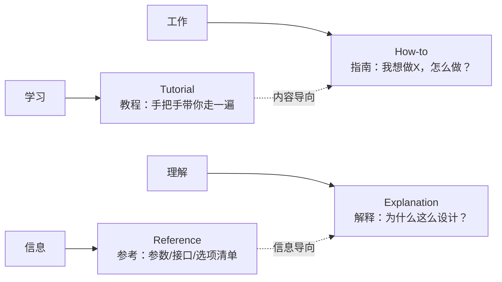

<!-- Post: 代码项目怎么组织才不乱？聊聊文件夹与文档的元规则 | ID: 2026-001 | Created: 2026-09-12 | Tags: tech,works | Format: markdown -->

## 开篇：为什么代码"能跑"还不够

很多人写完代码、能跑通，就以为事情结束了。但很快就会遇到这些时刻：

- 三个月后再打开项目，找不到入口在哪里。
- 想把某个模块拆出去给同事用，发现它和别的文件耦合得太深。
- 写了 README，但只写了"怎么跑"，新人看完依然不理解"为什么要这么写"。
- 接手别人代码，发现文件夹是 `src/`、`lib/`、`utils/`、`temp/`、`old/`、`new2/` 的一锅炖。

这些问题的本质不是"代码烂"，而是**项目缺少一层组织意识**。本文想聊的，正是这种意识——它不属于某门语言、某个框架，而是"组织代码"这件事本身的元规则。

> 注：本文只谈**元层面**（meta-level）——即"组织项目的原则"与"文档的分类框架"，不深入任何具体技术栈。

---

## 第一部分：文件夹的十条原则

### 原则 1：每个独立项目，独立文件夹

最容易犯的错误是把多个项目塞进同一个根目录。

```
~/projects/
├── 项目A的代码
├── 项目B的代码
├── 项目A的测试脚本
├── 项目B的配置文件
└── 一些临时实验
```

这种"扁平堆放"看起来简洁，三周后就会变成考古现场。**每个独立项目都应该有自己的文件夹边界**，模块之间的依赖靠引用解决，不靠物理位置。

### 原则 2：结构反映项目本质

很多人喜欢套用"标准模板"——`src/`、`test/`、`docs/`、`config/` 一定要齐。这是错的。

不同的项目有不同的生命周期：

| 项目类型 | 典型结构 | 说明 |
|---------|---------|------|
| 数据流水线 | `scripts/` `data/` `output/` | 脚本、中间产物、最终输出，三段分离 |
| 静态博客 | `posts/` `assets/` `themes/` | 内容、资源、样式 |
| 工具脚本集 | 平铺即可，无文件夹 | 单文件工具没必要分目录 |
| Web 后端 | `cmd/` `internal/` `pkg/` `api/` | 入口、私有逻辑、公开包、契约定义 |

**没有万能模板**。去看项目的本质是"输入→处理→输出"还是"内容→渲染→发布"还是"请求→路由→业务→持久化"，结构自然不同。

### 原则 3：复杂度匹配真实需求（YAGNI）

`You Ain't Gonna Need It`——不要为"未来可能用到"的设计买单。

> 一个写一次就丢的小脚本，搞 6 层抽象？  
> 一个 1000 行的单体服务，硬拆成微服务？

判断标准很简单：**当前的需求撑不起这个复杂度，就别加**。等需求真的来了，再重构——那时候你才知道"真正需要的是什么"，而不是"想象中的需要是什么"。

### 原则 4：分离"使用者"和"被使用者"

代码有三类受众：

1. **开发者本人**（最熟悉）
2. **协作者**（需要快速理解）
3. **最终用户**（只关心结果）

这三类人关注的东西不同：

| 受众 | 关注 | 应该放在 |
|------|------|---------|
| 开发者 | 源码、测试、调试工具 | 项目根目录 |
| 协作者 | 文档、示例、最佳实践 | 显眼位置（README、docs/） |
| 用户 | 二进制产物、安装包、发布版 | `output/` `dist/` `build/` |

**不要让用户去翻源码**，反过来，**也不要把构建产物混进源码目录**。

### 原则 5：命名即文档

最好的文件夹名字是**自解释**的：

- ✅ `authentication/`（一看就知道是认证模块）
- ❌ `auth_v2_final_new/`（版本号、私货暗示、含糊名词）
- ❌ `misc/` `temp/` `stuff/`（杂项——本质是"我不知道该放哪"）

**如果出现"杂项"文件夹，通常意味着分类还没想清楚**——这是重构的信号，不是兜底的垃圾桶。

### 原则 6：少即是多

> 能用一个层级说清楚的事，就别用三个。

```
// 推荐
posts/
├── 2026-001/
└── 2026-002/

// 不推荐
posts/
└── 2026/
    └── january/
        └── 001/
```

层级越多，路径越长，认知成本越高。**深度优先于广度**——一个深文件夹比 5 个浅文件夹更容易理解。

### 原则 7：结构允许演进

好的结构不是"一次性设计完美"，而是**预留演进空间**。

```
v1: 单文件脚本
   ↓ 需求增长
v2: 拆成 3 个模块
   ↓ 多人协作
v3: 加 tests/ docs/ 
   ↓ 发布版本
v4: 加 examples/ migrations/
```

**关键不是"从一开始就想对"，而是"每次变化都有迹可循"**。Git 历史就是项目的进化树。

### 原则 8：结构和受众匹配

- **库（library）** → 入口突出（`README.md` 在根目录、API 文档独立目录）
- **应用（application）** → 部署配置显眼（`Dockerfile`、`docker-compose.yml` 一眼可见）
- **工具（tool）** → 入口脚本即文档（用户只要知道运行哪条命令）

**结构要让目标用户 5 秒内知道"这项目是干嘛的、怎么用"**。

### 原则 9：例外需要理由

如果你违反了以上任何一条原则，**请写下来为什么**。

比如：

```markdown
# 项目结构说明

本项目看起来有点奇怪：tests/ 分散在每个模块目录，而不是集中在顶层 tests/。
原因：每个模块的测试需要 mock 不同环境，集中放置会让 mock 配置变得复杂。
```

**没有解释的"奇怪结构"是技术债，有解释的是设计选择**。

### 原则 10：给建议而非直接动手

这条不是关于结构的，而是关于**协作姿态**的：

- ❌ 别人问你"项目该怎么组织"，你直接上手改
- ✅ 给出建议、列出选项、说明各自优劣，让对方决定

**你是顾问，不是执行者**。代码归属权在作者手里，组织建议只是辅助。

---

## 第二部分：文档反黑箱——Diátaxis 四象限

解决了"代码怎么放"的问题，还有一个常见盲区：**README 让人看不懂**。

很多 README 长这样：

```markdown
# 项目名

这是一个很棒的项目，能做 X、Y、Z。

## 安装
pip install xxx

## 使用
python main.py

## 介绍
我们采用了 ABC 模式，通过 DEF 方法实现 GHI...
```

新人看完：`嗯……能跑了。但它为什么这么写？内部怎么跑的？有没有坑？`

这就是"**黑箱感**"——能操作，但不知道为什么。

### Diátaxis：四类文档各司其职

[Diátaxis](https://diataxis.fr/)（作者 Daniele Procida，2017）是一个文档分类框架，把文档分成四个象限：



| 象限 | 回答的问题 | 典型语气 | 例子 |
|------|----------|---------|------|
| **Tutorial（教程）** | "我想入门，怎么开始？" | "让我们一步步……" | "三步上手：用 5 分钟跑通第一个示例" |
| **How-to（操作指南）** | "我想达成 X 目标？" | "要做 X，按以下步骤……" | "如何部署到生产环境" |
| **Reference（参考）** | "这个 API/参数是什么？" | 客观、表格化 | "CLI 参数一览表" |
| **Explanation（解释）** | "为什么这么设计？" | 讨论、权衡 | "架构决策记录（ADR）" |

### 黑箱感的根源：缺少 Explanation

大多数 README 只覆盖前三象限：

- ✅ Tutorial（怎么用）
- ✅ How-to（想做什么怎么操作）
- ✅ Reference（参数清单）
- ❌ Explanation（为什么这么设计）

**没有 Explanation = 黑箱感**。

用户能跑通、能用、能查参数，但**理解不了项目的灵魂**。这种文档是"说明书"，不是"设计师手记"。

### 补全 Explanation 的几个做法

1. **架构总览图**（一张图胜过千言）
2. **关键决策记录（ADR）**：为什么选 A 而不是 B？当时权衡了什么？
3. **数据流/控制流说明**：从入口到输出，数据经历了什么？
4. **已知局限与权衡**：没有完美设计，把"不完美"摆出来反而显得诚实。

---

## 第三部分：业界元标准速览

如果你想深入了解代码组织与文档的"元规则"，以下几份资料是行业共识：

### Screaming Architecture（Robert C. Martin）

> "项目的目录结构应该'喊出'项目的用途，而不是'喊出'它用的框架。"

```bash
# 不好的结构（喊的是框架）
myapp/
├── controllers/
├── models/
├── views/
└── templates/

# 好的结构（喊的是业务）
myapp/
├── orders/          # 订单模块
├── payments/        # 支付模块
├── users/           # 用户模块
└── notifications/   # 通知模块
```

**结构应该反映业务领域，而不是技术分层**。

### C4 Model（Simon Brown）

四层架构图：

1. **Context**：系统和外部世界的关系
2. **Container**：系统由哪些"容器"组成（应用、数据库、消息队列……）
3. **Component**：每个容器内部的组件
4. **Code**：具体某个组件的代码细节

**优点**：从抽象到具体，分层叙述，避免一张巨图塞满一切。

### arc42

德国软件架构师常用的"架构文档模板"，约 12 个章节，覆盖：

- 架构目标与约束
- 系统上下文与外部接口
- 运行时/部署场景
- 跨领域概念（日志、错误处理、安全）
- 架构决策（ADR）
- 质量目标
- 风险与技术债

**优点**：模板化、结构化、便于审计。

### ADR（Architecture Decision Records，Michael Nygard）

记录"我们做了什么决策、为什么、有哪些替代方案"的轻量文档：

```markdown
# ADR-001: 选择 PostgreSQL 作为主数据库

## 状态
2026-01-15 决定，2026-03-02 复审通过

## 背景
需要 OLTP 数据库，支持 JSON、事务、全文检索。

## 决策
采用 PostgreSQL 15。

## 备选方案
- MySQL：成熟但 JSON 支持弱
- MongoDB：灵活但事务弱
- SQLite：单文件，不适合并发

## 后果
- 团队需要学习 PG 特有语法
- 后续可平滑迁移到 CockroachDB（分布式 PG）
```

**优点**：把"决策过程"沉淀下来，新人入职能快速理解历史背景。

---

## 第四部分：整体意识——比规则更重要的东西

读完上面这些，你可能想问：

> "所以标准答案是什么？"

答案是：**没有标准答案**。

任何规则都会遇到例外，任何模板都会失效。真正重要的是一种"**整体意识**"——

| 维度 | 该有的意识 |
|------|----------|
| **何时整理** | 项目拐点出现时（首次多人协作 / 跨季度复用 / 准备开源），而不是日常 |
| **怎么整理** | 看项目的本质（流水线？库？应用？工具？），再决定结构 |
| **如何演进** | 不要一次到位，每次重构解决一个具体问题 |
| **何时不该整理** | 一次性脚本、临时实验、个人草稿——结构是开销，不是收益 |
| **写文档时** | 区分 Tutorial / How-to / Reference / Explanation，别把所有内容塞进 README |
| **给同事建议时** | 建议而非执行，让对方决定 |

**这种意识比任何具体规则都重要**，因为它能在每个具体场景下，给你当下最合适的判断。

---

## 写在最后：给读者的三个问题

下次你打开一个新项目（或自己的旧项目）时，问自己三个问题：

1. **如果我三个月后回来看这个项目，能不能 5 分钟内找到入口？**
2. **如果一个新人接手，他能不能 30 分钟内跑起来，并理解"为什么这么写"？**
3. **如果我删掉所有解释性文档，这个项目还剩多少信息？**

如果前两个答案是"不能"，那结构或文档需要调整。如果第三个答案是"还剩很多"，说明项目过度依赖注释而非代码本身——这本身是一个信号。

**项目组织的本质，不是"做出一个完美的结构"，而是"建立一种可持续的判断力"**。

---

## 延伸阅读

- **Diátaxis**：[https://diataxis.fr/](https://diataxis.fr/)（文档四象限框架）
- **C4 Model**：[https://c4model.com/](https://c4model.com/)（架构分层图）
- **arc42**：[https://arc42.org/](https://arc42.org/)（架构文档模板）
- **Screaming Architecture**：Robert C. Martin《Clean Architecture》一书章节
- **ADR 模板**：Michael Nygard《Documenting Architecture Decisions》[https://cognitect.com/blog/2011/11/15/documenting-architecture-decisions](https://cognitect.com/blog/2011/11/15/documenting-architecture-decisions)
- **YAGNI**：极限编程原则之一

*图：本文 Mermaid 图为手绘示意，表达"四类文档各司其职"的概念。*